# STEP 3 プロダクトデザイン10案 v1（コンセプト① 完全組立不要ベッド） — GOKUMIN フラッグシップベッド
- 作成: product-designer ／ 2026-09-28 ／ 入力: research/research.md（結論6項目・追加A〜C）, product/02-planning-v1.md（0章・1章・4章）, research/00-input.md, brief.md, handoff.md, decisions.md, _studio/brand.md, preferences.md, scripts/render3d/README.md
- 凡例: 【推測】=調査の裏付けがない見積もり・仮定
- 画像: `product/designs/v1/c1/`（3Dレンダー。scene JSON と PNG、一覧 `contact-sheet.png`）／画像生成AI用プロンプト: `prompts/03-design-image-prompts-c1-v1.md`
- 共通の前提（全10案）: シングル基準、THE GOKUMIN ユーロトップマスターズ 28cm（S 約26.1kg）[S4] を載せた状態で描画。ユーザーが締めるネジ 0本・工具 0・1人。三つ折り（ヒンジは頭から約1/3・2/3＝腰の位置を外す）

## サマリー
- 「開くだけ・ネジゼロ・三つ折り」を全案の土台にし、王道（01）から、素材（03・06）、トレンド（04）、剛性（05）、体験（07）、構造（08）、たたんだ姿（09）、梱包（10）まで、10の異なる切り口で振った。全案で開梱〜就寝 4〜5動作・約2〜4分・工具0、梱包は 10 を除き3辺合計 192〜199cm（宅急便200サイズ内）・19〜24.5kg【推測】。
- 推奨上位3案: **C1-01 HIRAKU**（売れる確率が最も高い、加重平均 4.38）／**C1-08 KUMI**（差別化が最も強い、3.98）／**C1-03 KASANE**（ブランド価値を最も高める、3.90）。次点の C1-07 SUTTO（4.10）のグリップ・ロックの見える化・キャスターは、どの採用案にも足せる「UX パッケージ」として推す。
- research の勝ち筋「開くだけ・ネジゼロ・きしまない竹フレームで、完成品×プレミアム（S 4〜5万円台）の空白を取る」（結論6、§16 空白領域 A）に全案が乗る。01 はその中心、03・08・09 は上端、10 は将来のブランド発信。

## デザインの前提（research.md から引き継いだこと）
- **狙うターゲット**: 28〜42歳の共働き・一人暮らしの上質志向層。THE GOKUMIN（5〜7万円）の購入者・検討者、「週末を組立に使いたくない」人（research 結論3、企画 1-2）
- **価格**: ① S 39,800〜44,800円／SD 49,800〜54,800円（research 結論4）。範囲を外す案（02・03・06・09・10）は各案に理由を記載
- **デザイン方向**: ヘッドレスの低いプラットフォーム、天面高 20〜25cm、三つ折り、竹集成材＋スチール芯、ナチュラル／ウォールナット調＋差別化色（オフホワイト・チャコール）、金物は目立たせない（research 結論5、企画 1-6）
- **避けるべきデザイン**: ネジ締めの接合、部品点数の多い構造、桐・パインのすのこに見える外観、LED の色変え、床下入口のテーパー、25kg 超・宅急便に乗らない梱包、耐荷重の数字競争（research 結論2）
- **勝ち筋**: 購入理由1位「組立が簡単・不要」23.5%＋2位「頑丈・静か」20.6% を同時に満たし、デザイン（アンケート最重視 50.8% [S23]）で選ばせる。国内に「完成品×4〜6万円」がない空白 A を先に取る（research 結論6、§7、§16）
- **評価軸の重み（企画 1-7）**: Usability 22%／Manufacturability 18%／Market Fit 16%／Cost 14%／Design 12%／Brand Fit 10%／Originality 8%

## 10案の一覧
一覧画像（フレーム単体で比較）: 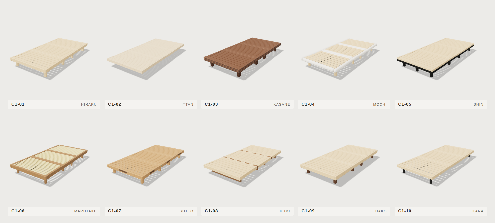

| No | タイプ | 名称 | 一言コンセプト | 想定価格 | 主素材 | ビジュアル |
|---|---|---|---|---|---|---|
| C1-01 | 王道・市場適合型 | HIRAKU | 開くだけで、THE GOKUMIN の寝床になる | 39,800円 | 竹集成材（ナチュラル） | 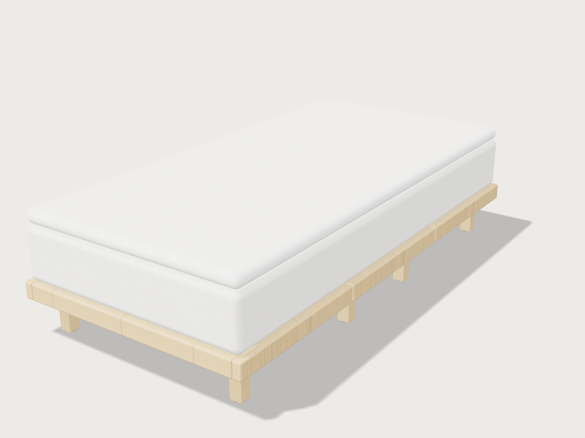 |
| C1-02 | ミニマル | ITTAN | 一枚の竹の板が、床の上に静かに浮かぶ | 36,800円 | 竹集成材（ライト・薄板＋板脚） | 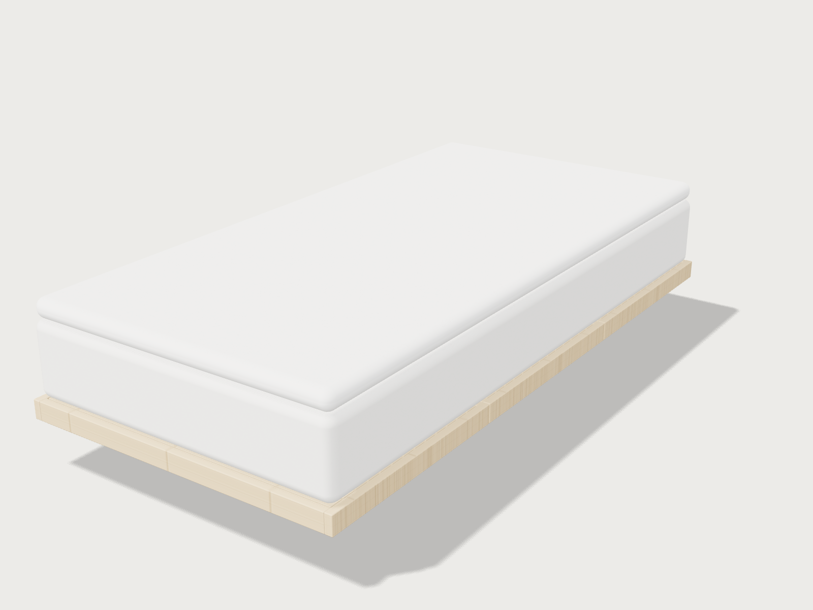 |
| C1-03 | プレミアム | KASANE | 竹を重ねた厚みが、そのまま格になる | 49,800円 | 炭化竹の積層材 | 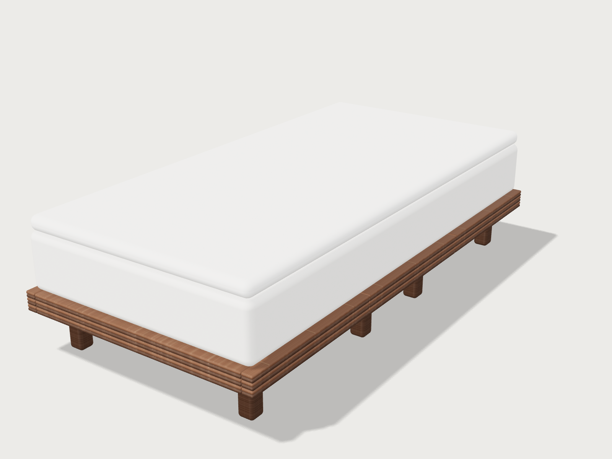 |
| C1-04 | トレンド | MOCHI | 白くて、まるい。触りたくなるベッド | 42,800円 | 竹集成材＋オフホワイト塗装 | 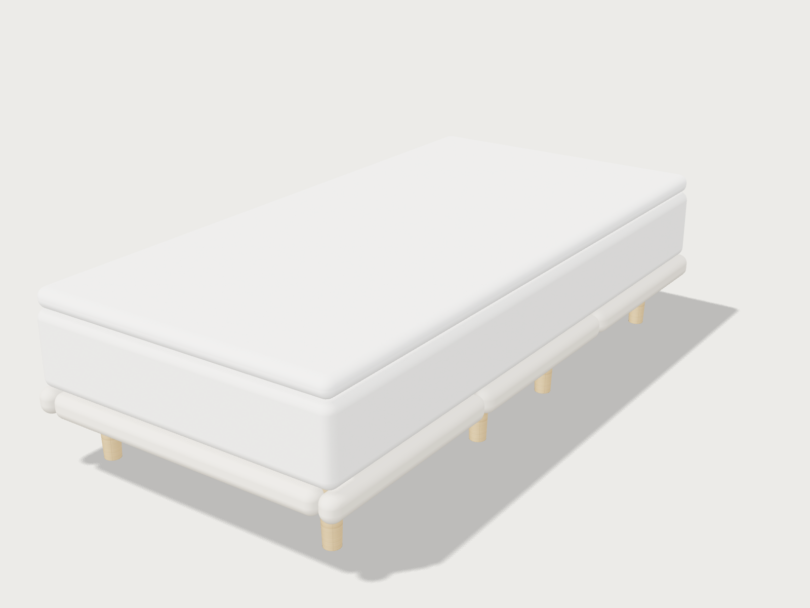 |
| C1-05 | 機能特化 | SHIN | 26kg のマットレスを、音もなく支える | 44,800円 | 竹＋スチール（露出した芯） | 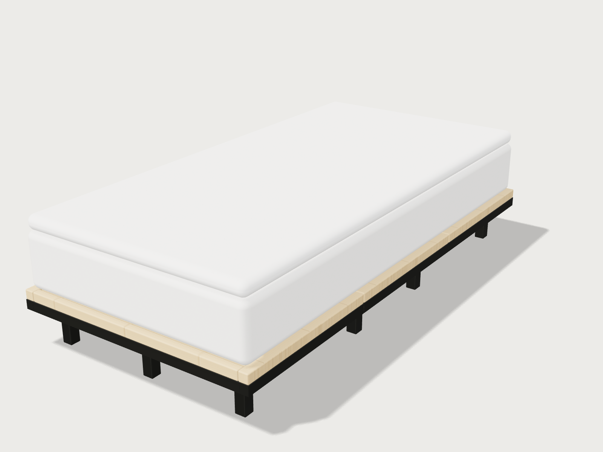 |
| C1-06 | 素材特化 | MARUTAKE | 竹を、竹のまま使う | 46,800円 | 丸竹＋圧縮竹 | 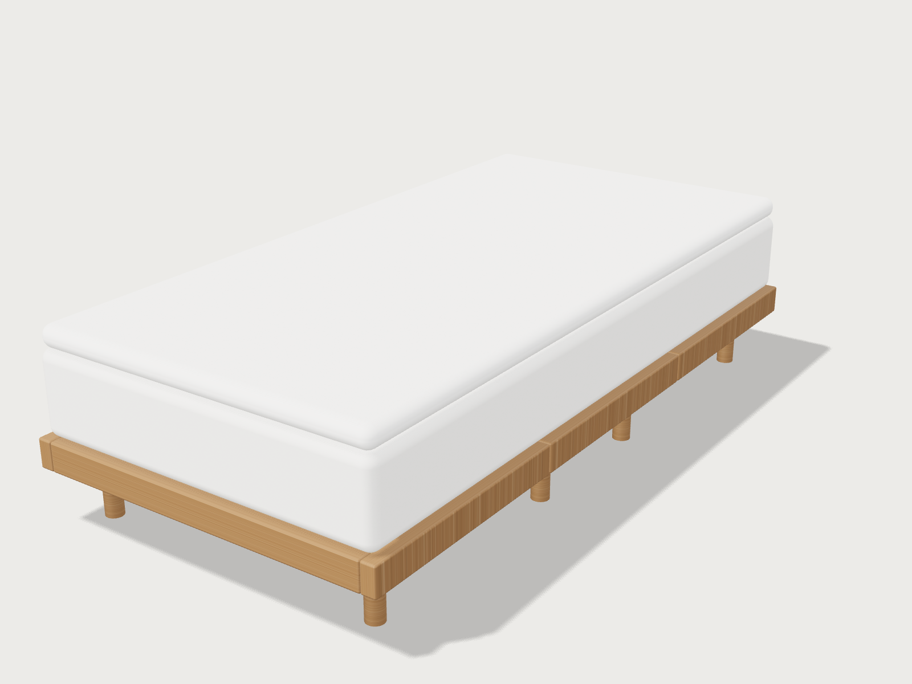 |
| C1-07 | UX改善 | SUTTO | 箱から出す、運ぶ、開く、しまう。全部、すっと | 41,800円 | 熱処理竹集成材（ハニーブラウン） | 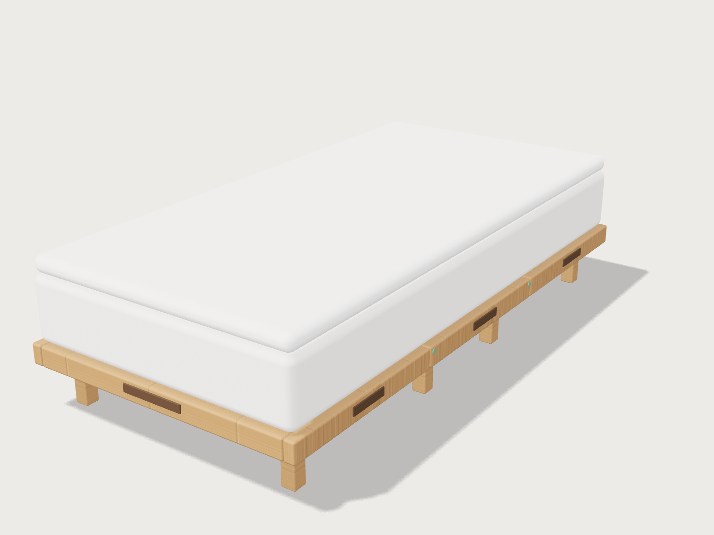 |
| C1-08 | 構造革新 | KUMI | 継手が、ヒンジになる。開く動きが、脚を立てる | 44,800円 | 竹＋スモーク竹（組手の筒） | 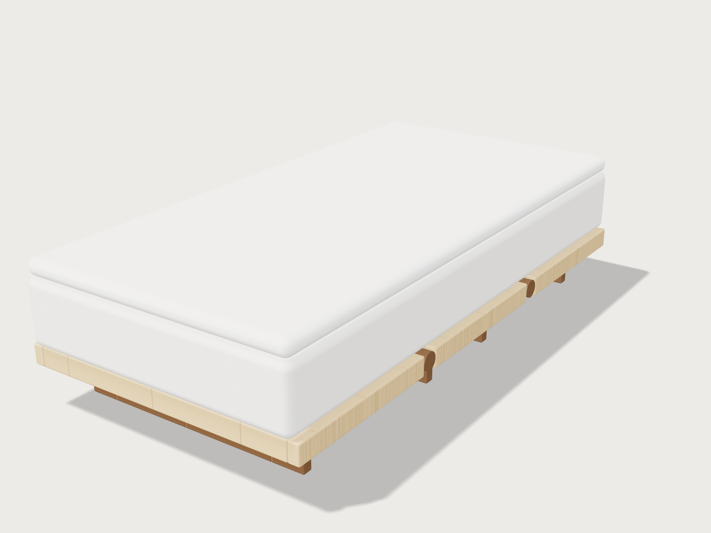 |
| C1-09 | 少し挑戦的 | HAKO | たたんだ姿も、家具である | 47,800円 | 竹集成材＋竹合板（箱構造） | 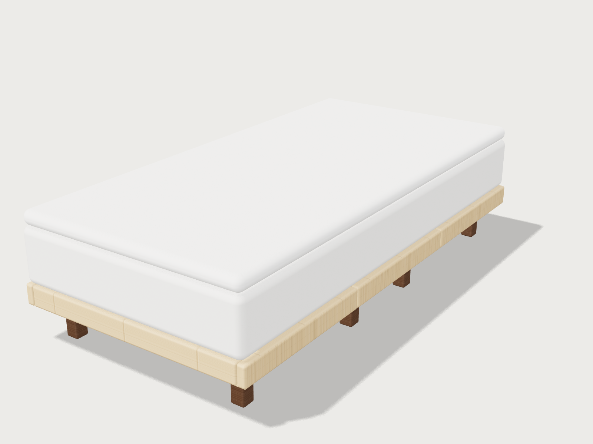 |
| C1-10 | コンセプトモデル | KARA | 箱を捨てない。箱が、ベッドの一部になる | 59,800円（参考） | 竹＋竹パルプ成形 | 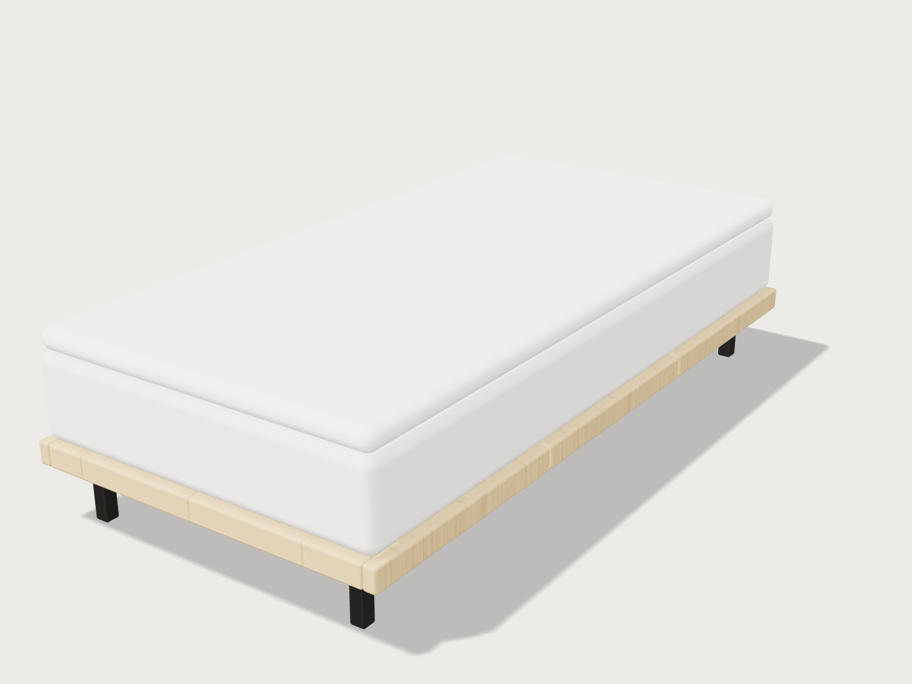 |

## 10案の差分表（似せないためのチェック）
| No | 形のモチーフ | 主素材（CMF） | 価格帯 | 主な訴求点 | 開梱〜就寝（動作・時間） | 梱包 3辺合計・重量【推測】 | ポジショニングマップ上の位置（横: 組立工数の少なさ／縦: 質感・価格） |
|---|---|---|---|---|---|---|---|
| C1-01 | 角枠＋8本の角脚（王道のプラットフォーム） | 竹集成材 ナチュラル | 3万円台後半 | 組立ゼロ×保証耐荷重×200サイズ梱包 | 5動作・約3分 | 197cm・22kg | 空白 A の中心（右・中段） |
| C1-02 | 薄い一枚板が浮く（板脚3枚） | 竹集成材 ライト（薄板・面） | 3万円台半ば | 最軽量・部品最少・面の美しさ | 4動作・約2分半 | 192cm・19kg | 空白 A の下端（右・中下段） |
| C1-03 | 積層の縞（6層の縁） | 炭化竹の積層 ウォールナット2トーン | 4万円台後半 | 素材の格・5年保証 | 5動作・約3分 | 198cm・24kg | 空白 A の最上部（右・上段） |
| C1-04 | 丸いクッション状の縁（R30） | オフホワイト塗装×ナチュラル | 4万円台前半 | トレンド色・やわらかさ | 5動作・約3分 | 197cm・23kg | 空白 A の中段・若年寄り |
| C1-05 | 2段の帯（竹＋スチール）＋12本脚 | 竹×チャコールスチール | 4万円台半ば | 剛性・静音（S 300kg） | 5動作・約3分 | 198cm・24.5kg | 空白 A の中上段（機能で選ぶ層） |
| C1-06 | 丸竹の列 | 丸竹×圧縮竹ハニー | 4万円台後半 | 天然素材・しなり・通気 | 5動作・約3分 | 199cm・22.5kg | 空白 A の中上段（素材で選ぶ層） |
| C1-07 | グリップの凹み＋埋め込みキャスター | 熱処理竹 ハニーブラウン | 4万円台前半 | 持たずに運ぶ・ロックの見える化 | 5動作・約3分（持ち上げなし） | 197cm・22.5kg | 空白 A の右端（組立工数が最も少なく感じる） |
| C1-08 | 組手の筒のヒンジ＋連動板脚 | 竹×スモーク竹 | 4万円台半ば | 開くだけで脚も立つ・継手の意匠 | **4動作・約2分** | 196cm・22kg | 空白 A の右端・上段 |
| C1-09 | 6面仕上げの箱（たたむとベンチ） | 竹集成材＋竹合板 | 4万円台後半 | たたんだ姿も家具（ベッド＋ベンチ） | 5動作・約3分 | 199cm・24kg | 空白 A の上段＋「たたんで使う」新しい軸 |
| C1-10 | 殻（パルプ成形の台座） | 竹×竹パルプ | 5万円台（参考） | 梱包ゼロ・循環 | 4動作・約4分（部品3点） | **209cm**・24kg（要改善） | 空白 A の外（将来・ブランド発信） |

- **重なりの確認**: 形のモチーフは10案すべて異なる。主素材は全案「竹」が【指定】のため共通だが、CMF（仕上げ・色・竹の形態）は10案で重ならない（ナチュラル竹集成材が主役なのは 01 のみ、02 はライトの薄板で面として見せる）。価格帯「4万円台半ば」は 05・08 の2案、「4万円台後半」は 03（49,800）・06（46,800）・09（47,800）の3案だが、価格の数値は3案とも異なり、訴求（素材の格／天然素材／2役）が別のため許容とした。主な訴求点は10案で重ならない。
- **振れ幅**: 01（市場の中心・既存の延長）と 09（たたんだ姿を見せる）・10（梱包を製品にする）の間に、形・体験・物語のすべてで明確な差がある。
- **P4 GOKUMIN RAIL（共通レール溝）**: 企画 0-5 の論点（①に溝を入れるか）について、①の10案はすべて「溝なし」で描いた。溝ありにする場合は縁の外側に 12mm 幅の溝を追加するだけで、形の差分は変わらない（「ユーザーに判断してほしいこと」3）。

## 案C1-01 王道・市場適合型「HIRAKU（ひらく）」

構造（左: 折りたたみ・梱包時／右: 開きかけ）: 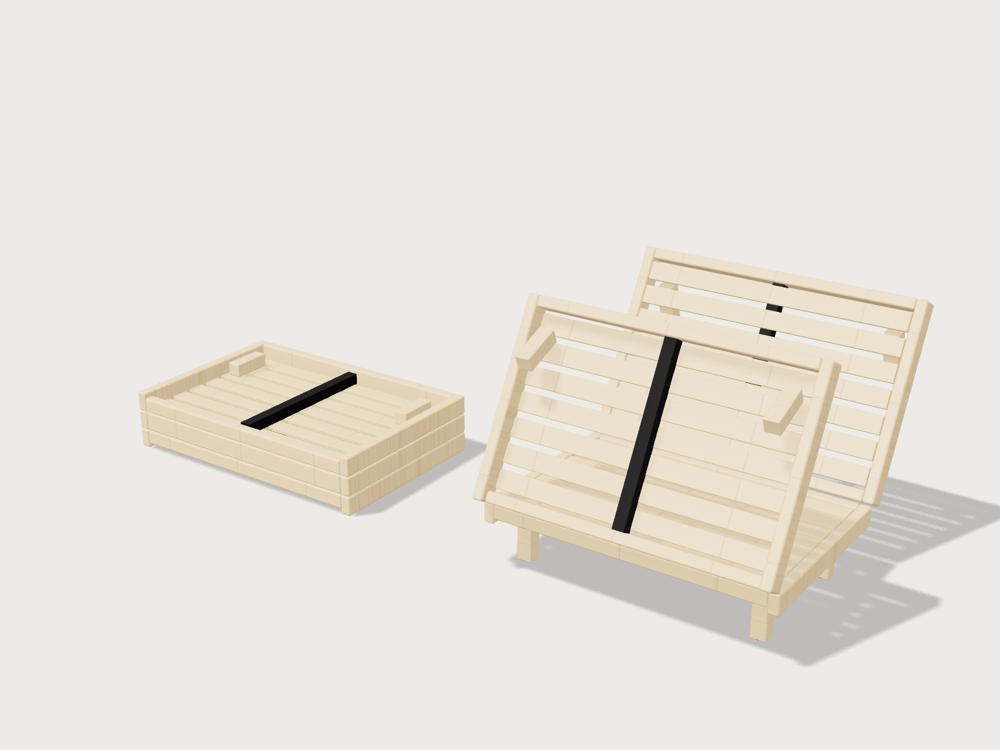 ／ フレーム単体: 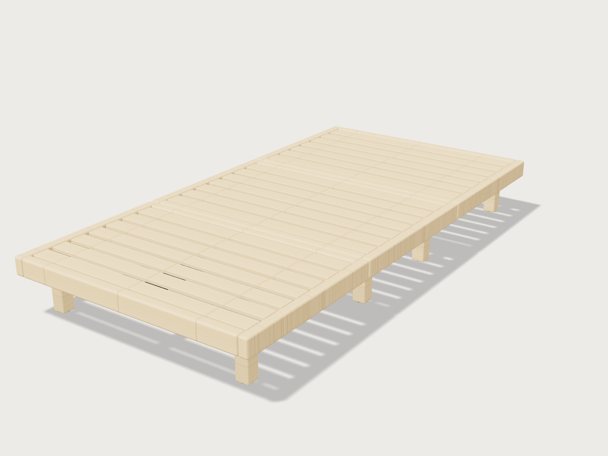 ／ 正面・側面: `C1-01-front.png`・`C1-01-side.png`

- **名称**: C1-01 王道・市場適合型「HIRAKU」
- **デザインコンセプト**: 「開くだけで、THE GOKUMIN の寝床になる。」現行の折りたたみバンブーベッドの形をそのまま一段格上げした、いちばん素直な三つ折りの竹プラットフォーム。ヒンジは外から見せず、竹の枠と8本の角脚だけで「ちゃんとしたベッド」に見せる。
- **ターゲット**: 企画1-2のメインペルソナ（33歳・共働き・2LDK賃貸・THE GOKUMIN 購入者）。マットレスの商品ページから「セットで買う」を押す人。research 結論3 のターゲットの中心。
- **解決する課題**: 不満1位「きしみ・ぐらつき」17.1%（うち半数がネジ緩み）と「組立の手間」14.3% を、ネジゼロ・完成品で同時に消す（research §6）。購入理由1位「組立が簡単・不要」23.5%・2位「頑丈・静か」20.6%（§7）をそのまま満たす。
- **形状**: 外寸 W1000×L1980×H220mm（天面高。THE GOKUMIN 28cm を載せて寝面高 約500mm）。三つ折り（1枚 約660mm、ヒンジ2か所は頭から約660mm・1320mm＝腰の位置を外す）。外枠 38×72mm、角R8。スラット 幅62mm×7本／枚（計21本）。脚 52mm角×8本（外周から95mm内側）。床下 約148mm。
- **素材**: 外枠・スラット・脚 竹集成材／中央の梁（長手）とヒンジ周り 中空スチール角パイプ 40×40／ヒンジ 鋼板プレス＋樹脂ブッシュ／脚先 フェルト（取り付け済み）
- **CMF**: Color ナチュラル竹 `#D9B88A`、ウォールナット調 `#6B4A33`（定番2色）。金物 マットブラック `#2A2A2A`（外から見えない位置）。Material 竹集成材（平積み）。Finish 艶消しウレタン（3分艶）、角R8・小口面取りC2。
- **機能**: オートロックヒンジ（開き切るとカチッとロック、予圧でガタなし）／脚はバネ補助で自動で起きてロック／ヒンジ部の静音パッド／フェルト取り付け済み／保証耐荷重 S 250kg。**入れなかった機能**: キャスター、宮棚・コンセント（王道案は「素のベッド」の完成度に集中。後付けはコンセプト②の規格に任せる）
- **開梱〜就寝（必須）**: ①箱を横に倒し、持ち手ベルトで本体を引き出す ②本体を立てたまま本のように開く（脚がバネで起きてロック） ③床に倒す ④ロックの目印を確認 ⑤マットレスを載せる ＝ **5動作・約3分・工具0・ユーザーが扱う部品1点・1人**【推測】
- **梱包（必須）**: 折りたたみ時 660×1000×216mm → 梱包 約690×1030×250mm（3辺合計 約197cm、宅急便200サイズ内）、重量 約22kg【推測】（竹集成材 約14kg＋スチール・ヒンジ 約6kg＋脚・梱包材 約2kg）
- **競合優位性**: タンスのゲン ワンタッチの「きしみ・すのこが硬い・見た目が安価」[S28] に対し、予圧ロックと竹の質感で勝つ。現行 GOKUMIN 折りたたみバンブーの「耐荷重が保証値でない・梱包が宅急便を超える（210.5cm）」[S1][S31] を、保証 250kg と 197cm の梱包で解消する。
- **製造方法**: 竹集成材の CNC 切削＋R加工＋UV/ウレタン塗装、スチール角パイプの溶接・粉体塗装、ヒンジは鋼板プレス＋カシメ（工場で固定、ユーザーは締めない）。工場での部品点数 約55点【推測】、ユーザー部品 1点。新規の金型はヒンジ用の小型プレス型のみ（規模: 小）。量産の注意点は、三つのパネルのヒンジ芯の位置精度（±0.5mm）と、塗装前の含水率管理（反り防止）。現行バンブーベッドの工程をほぼ流用できる【推測】。
- **想定価格**: 税込 **39,800円**（SD 49,800円）。原価率 約32%【推測】。research 結論4「① S 39,800〜44,800円」の下限。1万円の完成品との差は「保証 250kg・きしみ対策・竹の質感」で説明する。
- **デザイン意図（根拠）**: 最も売れる確率が高い案として、research 結論5「ヘッドレスの低いプラットフォーム・天面高 20〜25cm」「三つ折り」をそのまま採用し、結論2「ネジ締め構造・部品点数の多い構造」を避けた。根拠: research 結論1（組立 23.5%・頑丈 20.6%）、§6 不満1位きしみ 17.1% [S24][S25][S55]、追加B（宅急便 200cm・30kg [S31]）、企画 1-4（三つ折りで腰の位置のヒンジを避ける）。床下 約148mm はロボット掃除機がほぼ全機種通る12cm以上 [S37][S38] で、SNS の「ロボ掃除機が抜ける」カットも撮れる。共有プラットフォーム部品: P1・P2・P3・P5・P6。

## 案C1-02 ミニマル「ITTAN（一反）」

構造（左: 折りたたみ・梱包時／右: 開きかけ）: 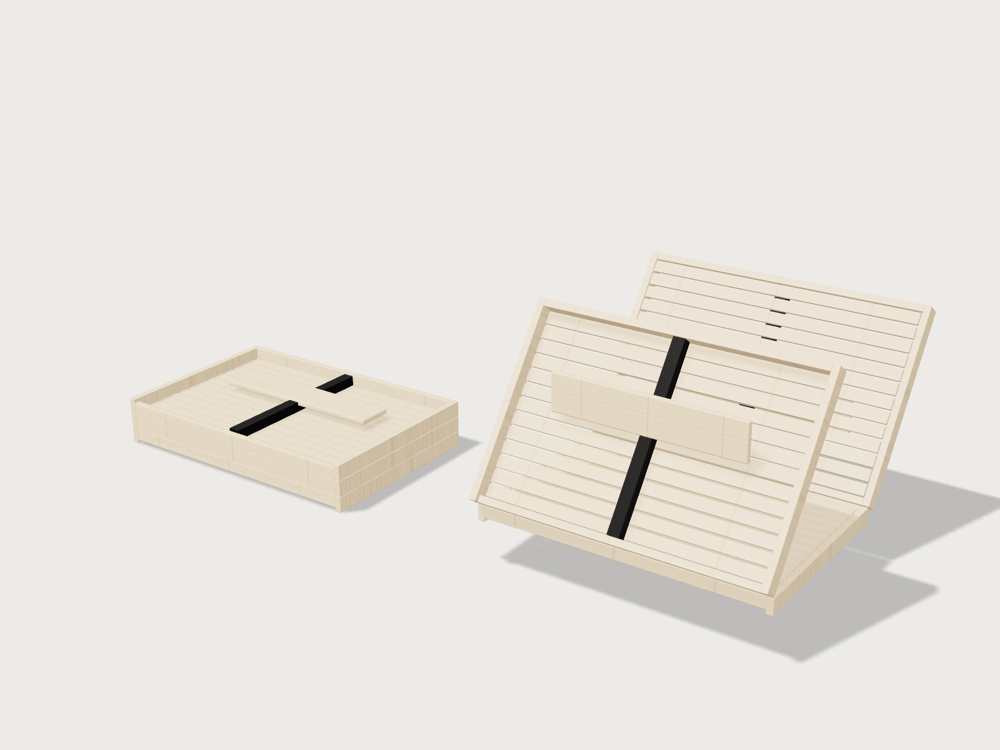 ／ フレーム単体: 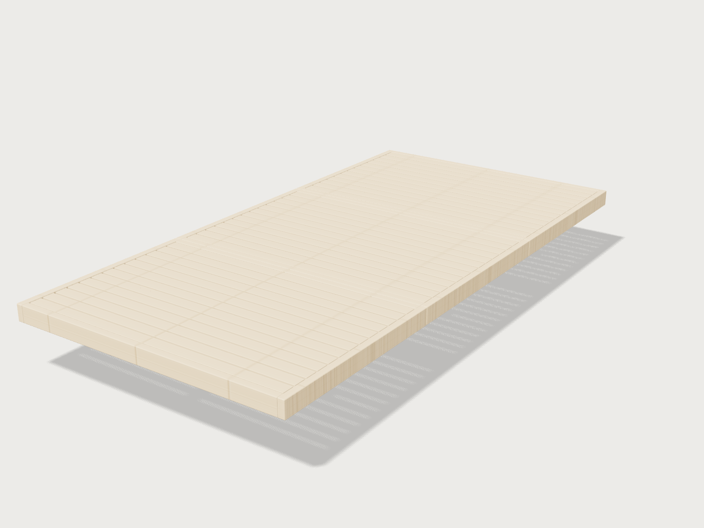 ／ 正面・側面: `C1-02-front.png`・`C1-02-side.png`

- **名称**: C1-02 ミニマル「ITTAN」
- **デザインコンセプト**: 「一枚の竹の板が、床の上に静かに浮かぶ。」縁の厚みを 58mm まで薄くし、細いスラットを隙間 10mm で密に並べて「面」に見せる。脚は各パネルに1枚ずつの板脚（計3枚）を奥に引っ込め、横から見ると薄い板が浮いているだけに見える。
- **ターゲット**: メインペルソナのうち、部屋を「物が少なく、低く、白っぽく」整えたい人（1LDK・一人暮らしの30代）。家具の線を減らしたい人。
- **解決する課題**: 不満「質感・仕上げ（安っぽい）」14.3%、「組立の手間・パーツが多い」14.3%（research §6）。部品を減らして面で見せることで、桐・パインのすのこ（結論2 の避けるべき見た目）と一目で区別がつく。購入理由の「デザイン・部屋になじむ」11.8%（§7）とアンケート1位「デザイン」50.8% [S23] に応える。
- **形状**: 外寸 W990×L1980×H200mm（天面高、寝面高 約480mm）。三つ折り（1枚 660mm）。縁 24×58mm・角R3 の細い枠。スラット 幅40mm×13本／枚（隙間10mm）。脚は竹集成材の板脚 厚20×幅650mm×3枚（各パネル中央、外周から170mm内側）。床下 約142mm。
- **素材**: 枠・スラット・板脚 竹集成材（明るいナチュラル）／長手の梁 中空スチール 40×36／ヒンジ 鋼板プレス＋樹脂ブッシュ／板脚の接地面 フェルト（取り付け済み）
- **CMF**: Color ライトナチュラル竹 `#DCC09A` の1色のみ（ウォールナット調 `#6B4A33` は受注の限定色）。金物は外から見えない。Material 竹集成材。Finish 艶消しオイル調ウレタン（1分艶）、面取りはC1のみで「線を細く」見せる。
- **機能**: オートロックヒンジ／板脚は開くとバネで起きてロック（1枚1動作）／保証耐荷重 S 250kg。**入れなかった機能**: 角脚、見える金物、キャスター、色の目印（ロック確認はヒンジ横の小さな刻み線を合わせる方式にして、見た目を優先）
- **開梱〜就寝（必須）**: ①持ち手ベルトで本体を引き出す ②立てたまま開く（板脚が起きてロック） ③床に倒す ④マットレスを載せる ＝ **4動作・約2分30秒・工具0・部品1点・1人**【推測】
- **梱包（必須）**: 折りたたみ時 660×990×174mm → 梱包 約690×1020×205mm（3辺合計 約192cm）、重量 約19kg【推測】（縁が細く、脚が3枚のため10案で最も軽い）
- **競合優位性**: モダンデコ等の組立式すのこの「ネジ・脚が緩む、仕上げのムラ」[S24] に対し、脚3枚・ネジゼロ・面の仕上げで勝つ。ZINUS SmartBase の「安っぽい」[S20] に対し、竹の面で質感を出す。
- **製造方法**: 竹集成材の CNC 切削・塗装、スチール梁の溶接、ヒンジのプレス＋カシメ。工場での部品点数 約52点【推測】（スラットは多いが脚・金物が少ない）。新規金型 ヒンジ用小型プレス型のみ。量産の注意点: 縁が薄いため、梁（スチール）で曲げ剛性を受け持つ設計にする。端のパネルは板脚から端まで約330mm 張り出すため、張り出し部のたわみを試作で確認する。
- **想定価格**: 税込 **36,800円**（SD 46,800円）。原価率 約30%【推測】。research 結論4 の下限（39,800円）より下げた入口の価格。部品と塗装工程が少ない分を価格に回した。
- **デザイン意図（根拠）**: research 結論5「低く・薄く・浮いて見える」（§10）を、フローティング構造を使わずに「脚を奥に隠す」だけで実現した。結論2「部品点数の多い構造」「桐・パインのすのこと区別がつかない見た目」を避ける。竹の面の見せ方は §8 の推測（小口・面で質感の差を出す）。【推測】端の張り出しと端座りの安定性は、梁の剛性と板脚の幅（650mm）で確保する想定で、試作での確認が必要。共有プラットフォーム部品: P1・P2・P5・P6（P3 脚ソケットは板脚専用のため非共有）。

## 案C1-03 プレミアム「KASANE（かさね）」

構造（左: 折りたたみ・梱包時／右: 開きかけ）: 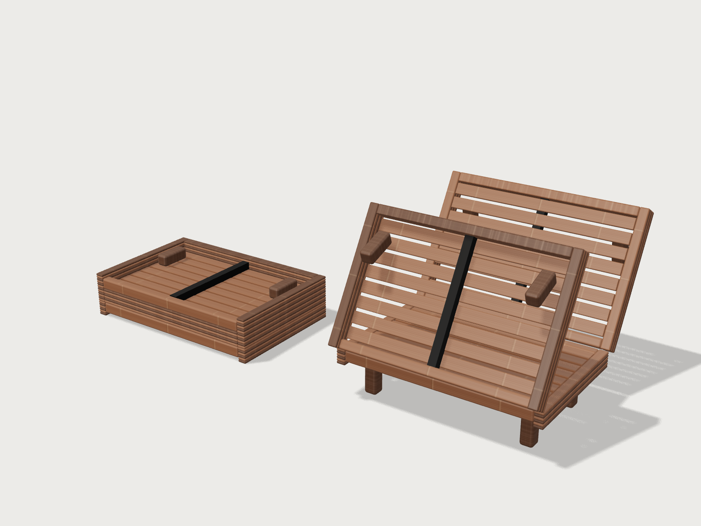 ／ ディテール（積層の縁と脚のコーナー見本）: 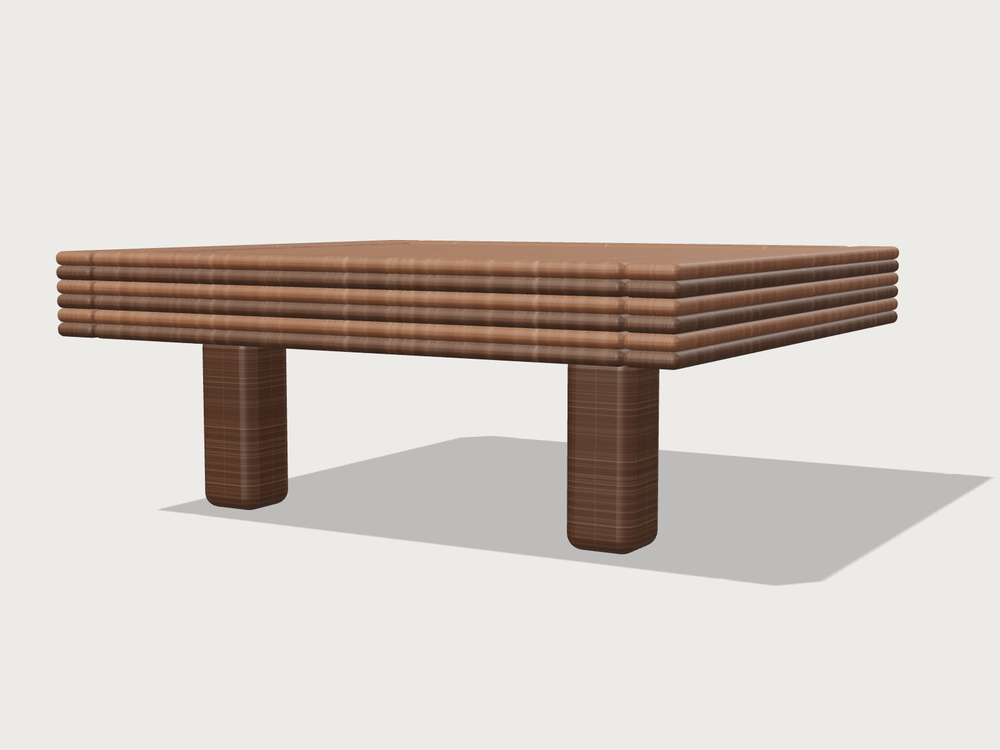 ／ フレーム単体: `C1-03-frame.png` ／ 正面・側面: `C1-03-front.png`・`C1-03-side.png`

- **名称**: C1-03 プレミアム「KASANE」
- **デザインコンセプト**: 「竹を重ねた厚みが、そのまま格になる。」炭化竹の集成材を6層に重ね、その積層を縁の小口にあえて見せる。1層ずつ丸めた縁が陰影の縞をつくり、ホテルのベッドのような厚みと重心の低さを出す。
- **ターゲット**: THE GOKUMIN の最上位（ユーロトップ 28cm、7万円台 [S5]）を買う人の中でも、寝室の家具に「格」を求める38〜45歳の共働き世帯。マットレスと合わせて10万円台の寝室投資をいとわない人。
- **解決する課題**: 不満「質感・仕上げ（安っぽい・高級感なし）」14.3%（research §6）と、research §3 の推測「7万円クラスのマットレスに1万円前後のフレームは見劣りする」。組立の手間ゼロのまま、価格に見合う素材感を出す。
- **形状**: 外寸 W1010×L1990×H245mm（天面高、寝面高 約525mm）。三つ折り（1枚 約663mm）。縁 46×78mm＝13mm×6層の積層、各層R6。スラット 幅56mm×8本／枚。脚 64mm角・角R14 の太い脚×8本（外周から115mm内側）。床下 約167mm。
- **素材**: 縁 炭化竹集成材（濃淡2トーンを交互に積層）／スラット 炭化竹集成材／脚 濃色の炭化竹集成材／長手の梁 中空スチール／ヒンジ 鋼板プレス＋樹脂ブッシュ
- **CMF**: Color 炭化竹ウォールナット `#6A4630`＋ダーク `#4A3122`（2トーン積層、1色展開）。限定色としてナチュラル積層 `#D9B88A`/`#C9A377`。金物 マットブラック `#2A2A2A`（見えない位置）。Material 炭化竹集成材（熱処理で色を出し、塗料で着色しない）。Finish オイル仕上げ＋艶消しウレタンのトップコート、各層R6の手触り。
- **機能**: オートロックヒンジ／脚のバネ補助展開／静音パッド／保証耐荷重 S 250kg（SD 300kg）／**5年保証＋120日の返品受付**（開いて閉じれば元の箱に戻る構造を保証の安心材料に使う）【推測: 保証条件は社内確認】。**入れなかった機能**: 宮棚・照明（プレミアムは「素材と体験」に集中し、機能の足し算で価格を上げない）
- **開梱〜就寝（必須）**: ①持ち手ベルトで本体を引き出す ②立てたまま開く（脚がバネで起きてロック） ③床に倒す ④ロックの目印を確認 ⑤マットレスを載せる ＝ **5動作・約3分・工具0・部品1点・1人**【推測】
- **梱包（必須）**: 折りたたみ時 663×1010×234mm → 梱包 約685×1030×262mm（3辺合計 約198cm）、重量 約24kg【推測】（上限25kg に近い。梱包の両側に持ち手、箱に「2人での持ち運び推奨」の表示は付けない前提で、梱包内の持ち手ベルトで引き出せるようにする）
- **競合優位性**: コアラ（約6万円）の「組立が必要・ギシギシ・重い」[S18] に対し、組立ゼロ・予圧ロックで、価格は約1万円安い。米国の Thuma（$795〜）が「継手と素材」で高価格を成立させている [S45] のを、日本の竹で「完成品」として実現する。
- **製造方法**: 炭化竹の薄板を6層に積層接着 → CNC で各層をR加工（層ごとの丸みは成形カッター1回で加工）→ オイル＋ウレタン塗装。スチール梁の溶接、ヒンジのプレス＋カシメ。工場での部品点数 約60点【推測】。新規金型 ヒンジ用小型プレス型＋成形カッター（小）。量産の注意点: 炭化竹は色ムラが出やすいため、層ごとの色選別が必要（歩留まり低下の要因）。積層の接着層が縁に出るため、接着剤の色合わせが必要。
- **想定価格**: 税込 **49,800円**（SD 59,800円）。原価率 約33%【推測】。research 結論4 の上限（44,800円）を5,000円超えるが、コアラ（約6万円）より下。上限を超える理由: 炭化竹・積層・5年保証の分の上乗せ。THE GOKUMIN とのセット割（例: −5,000円）で実質 44,800円に見せる案を推す。
- **デザイン意図（根拠）**: research §8 の推測「竹の縁（小口）の積層を見せる・面取りを大きくして、安いすのこと見分けがつくようにする」をデザインの主役にした。research 結論5 のカラー「ウォールナット調」を塗装ではなく炭化竹で出す。research §16 空白領域 A（完成品×プレミアム）の最上位を取りにいく案。根拠: §6 質感 14.3%、§3 価格分布（4万円以上はコアラのみ）[S18][S19]、§12 Thuma [S45]。共有プラットフォーム部品: P1（縁の意匠のみ変更）・P2・P3・P6。

## 案C1-04 トレンド「MOCHI（もち）」

構造（左: 折りたたみ・梱包時／右: 開きかけ）: 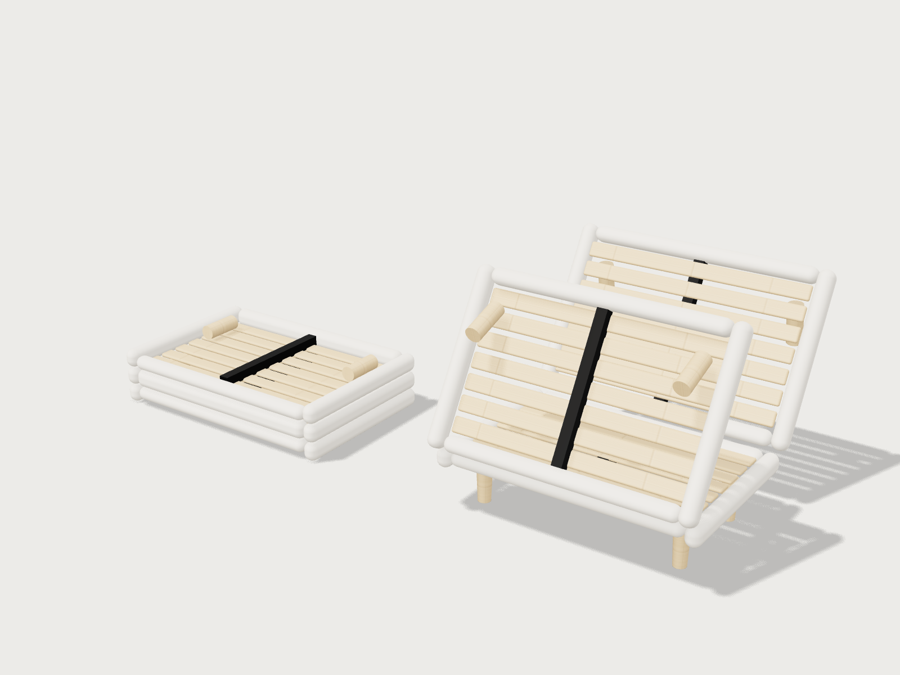 ／ フレーム単体: 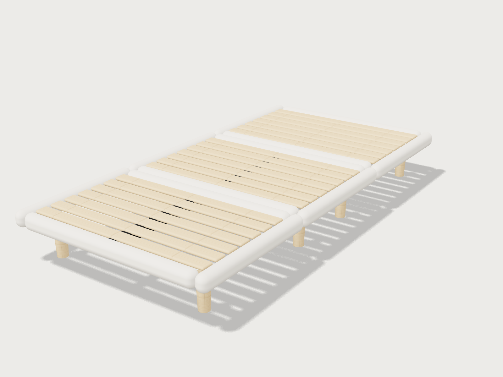 ／ 正面・側面: `C1-04-front.png`・`C1-04-side.png`

- **名称**: C1-04 トレンド「MOCHI」
- **デザインコンセプト**: 「白くて、まるい。触りたくなるベッド。」縁を R30 の太いクッションのような形にして、Cloud Dancer 系のオフホワイトで包む。三つのパネルがそれぞれ「ひとつの柔らかい塊」に見え、折り目がデザインの一部になる。中はナチュラル竹のスラットと丸脚で温かさを残す。
- **ターゲット**: 28〜34歳の一人暮らし・カップル。オフホワイト×木の部屋を SNS（RoomClip・Instagram）で参考にして組み立てる人。research 結論3 のターゲットの若い側。
- **解決する課題**: 不満「質感・仕上げ（安っぽい）」14.3%、アンケート最重視「デザイン」50.8% [S23]。竹ベッドの「ナチュラル＝素朴・和風」の印象を外し、今の内装トレンドに合う選択肢を出す。角が丸いので、足をぶつけたときの痛さ・子どもの安全にも効く。
- **形状**: 外寸 W1000×L1980×H230mm（天面高、寝面高 約510mm）。三つ折り（1枚 660mm）。縁 60×76mm・R30（ほぼ半円の断面）。スラット 幅58mm×7本／枚（角R8）、縁より8mm下げて「縁に抱かれた」見え方に。脚 テーパー丸脚 φ60→φ48×8本（外周から120mm内側）。床下 約154mm。
- **素材**: 縁 竹集成材（R加工後にオフホワイト塗装）／スラット・脚 竹集成材（ナチュラル）／長手の梁 中空スチール／ヒンジ 鋼板プレス＋樹脂ブッシュ
- **CMF**: Color 縁 クラウドホワイト `#E6DFD2`（Cloud Dancer 11-4201 に寄せた色）×スラット・脚 ナチュラル竹 `#D9B88A`。展開2色（もう1色は グレージュ `#B9AFA2`×ナチュラル）。Material 竹集成材。Finish 縁は木目がわずかに透ける艶消しホワイトウォッシュ塗装（汚れ防止のトップコート）、スラットはクリア艶消し。
- **機能**: オートロックヒンジ／脚のバネ補助展開／静音パッド／保証耐荷重 S 250kg。R30 の縁はシーツの端を巻き込みやすく、ボックスシーツがずれにくい【推測】。**入れなかった機能**: LED・照明（research 結論2 で古びやすい演出として避ける）、宮棚
- **開梱〜就寝（必須）**: ①持ち手ベルトで本体を引き出す ②立てたまま開く（脚がバネで起きてロック） ③床に倒す ④ロックの目印を確認 ⑤マットレスを載せる ＝ **5動作・約3分・工具0・部品1点・1人**【推測】
- **梱包（必須）**: 折りたたみ時 660×1000×228mm（丸い縁が3段重なり、そのまま「白い積み重ね」に見える）→ 梱包 約690×1025×258mm（3辺合計 約197cm）、重量 約23kg【推測】
- **競合優位性**: ZINUS（ブラック／ホワイト、10,120円）の「安っぽい・中央が沈む」[S20] に対し、同じ白でも R30 の塗装の質感と保証耐荷重で勝つ。LOWYA・RASIK などデザイン系の組立式（組立が大変という声 [S21]）に対し、デザインのまま組立ゼロ。
- **製造方法**: 竹集成材の CNC で R30 の断面を成形 → 下塗り・ホワイトウォッシュ塗装（2コート）→ トップコート。スチール梁の溶接、ヒンジのプレス＋カシメ。工場での部品点数 約55点【推測】。新規金型 ヒンジ用小型プレス型＋R30 成形カッター（小）。量産の注意点: 白は塗装ムラ・ホコリの混入が不良になりやすく、塗装ブースの管理が必要（歩留まりの懸念）。使用時の手あか汚れ対策としてトップコートの耐汚染性を試験する。
- **想定価格**: 税込 **42,800円**（SD 52,800円）。原価率 約32%【推測】。research 結論4 の範囲の中央。
- **デザイン意図（根拠）**: research §9「Pantone 2026 Cloud Dancer（白）[S49]」「オフホワイト・グレージュの壁、曲線的な家具 [S50]」、結論5 のカラー「差別化色はオフホワイト×ナチュラル」、形状「角は大きめの R で丸める」をそのまま形にした案。企画 4-1「トレンド側: オフホワイト×竹、角の丸いやわらかい形」に対応。SNS の「浮遊感のある寝室」カットに向く（白い縁が影から浮いて見える）。【推測】白い塗装は流行の影響を受けるため、定番色（ナチュラル・ウォールナット）の案と組み合わせて展開するのが安全。共有プラットフォーム部品: P1（縁の断面のみ変更）・P2・P3・P6。

## 案C1-05 機能特化「SHIN（芯）」

構造（左: 折りたたみ・梱包時／右: 開きかけ。裏面のスチールの枠・2本の梁・中央の脚列が見える）: 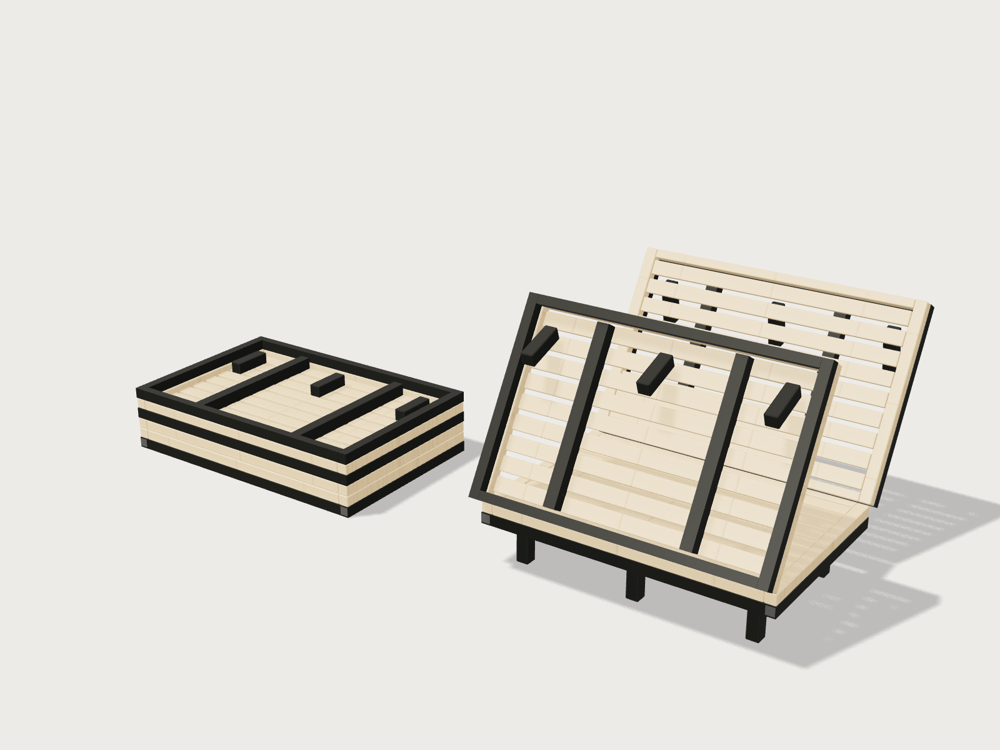 ／ フレーム単体: 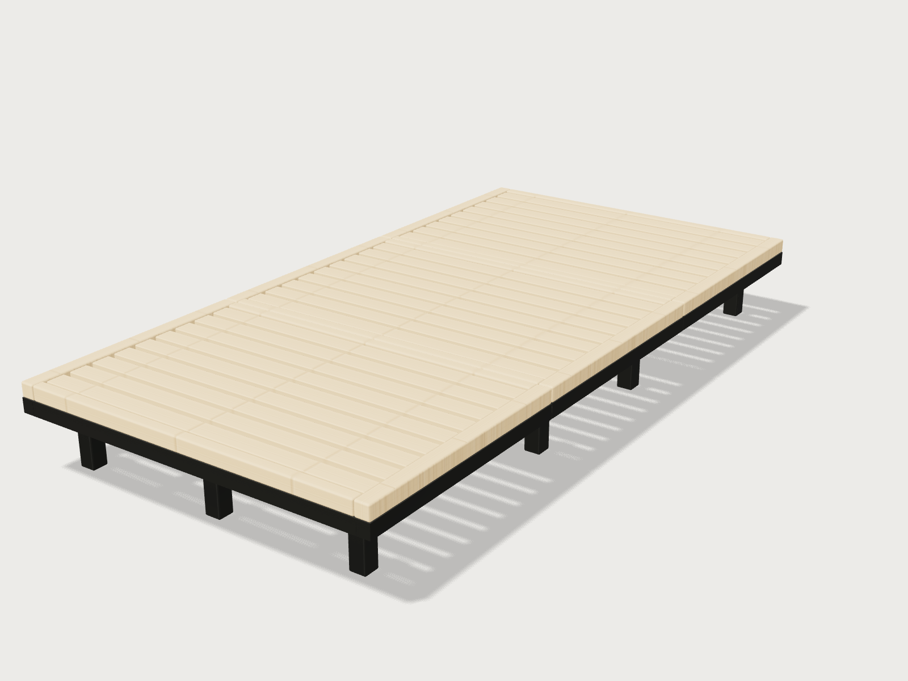 ／ 正面・側面: `C1-05-front.png`・`C1-05-side.png`

- **名称**: C1-05 機能特化「SHIN」
- **デザインコンセプト**: 「26kg のマットレスを、音もなく支える。」最も求められている機能「頑丈・静か」だけを突き抜けさせた案。竹の天面の下にスチールの枠（芯）をあえて帯状に見せ、2本の梁と中央の脚列を加えた12本脚で、THE GOKUMIN の重さでも「沈まない・鳴らない」を形で約束する。
- **ターゲット**: THE GOKUMIN（ユーロトップ・デュアルコイル 25〜28cm、約26kg [S4][S5]）の購入者のうち、体重が重め・二人で座ることがある・前のベッドのきしみで買い替える人。レビューで「きしみ」「たわみ」を必ず読む慎重な比較検討者。
- **解決する課題**: 不満1位「きしみ・ぐらつき」17.1%（半数はネジ緩み）、「寝心地（中央が沈む・たわむ）」14.3%（research §6、[S20][S25]）。購入理由2位「頑丈・静か」20.6%（§7）。research 追加C「ヒンジ部の局所たわみを抑えることが最重要」に正面から答える。
- **形状**: 外寸 W1000×L1980×H225mm（天面高、寝面高 約505mm）。三つ折り（1枚 660mm）。縁は 竹の天面帯 40mm＋スチール帯 38mm の2段（見えるスチールは平らな帯で、パイプには見せない）。スラット 幅50mm×9本／枚（計27本、10案で最多）。梁 スチール 40×45 を2本（中心から±230mm）。脚 44mm角スチール×12本（左右＋中央の3列、外周から100mm内側）。床下 約147mm。
- **素材**: 天面帯・スラット 竹集成材／外周の帯・梁・脚 スチール角パイプ（t1.6）粉体塗装／ヒンジ 鋼板プレス＋樹脂ブッシュ＋静音パッド（EPDM）／脚先 フェルト
- **CMF**: Color ナチュラル竹 `#D9B88A`×チャコールスチール `#33332F`（1色展開＋ウォールナット調 `#6B4A33`×チャコール）。Material 竹集成材＋スチール。Finish 竹は艶消しウレタン、スチールは半艶消しの粉体塗装（指紋が目立ちにくいサテン）。
- **機能**: **保証耐荷重 S 300kg**（他案は 250kg）／ヒンジ部のたわみ 3mm 以下を目標（26kg＋100kg 荷重時）【推測】／オートロックヒンジ（予圧つき）／金属どうしの接点すべてに樹脂ブッシュ・EPDM パッド／中央の脚列が開くと同時にバネで起きてロック。**入れなかった機能**: デザインのための R・装飾、キャスター（剛性を優先）
- **開梱〜就寝（必須）**: ①持ち手ベルトで本体を引き出す ②立てたまま開く（12本の脚がバネで起きてロック） ③床に倒す ④ロックの目印を確認 ⑤マットレスを載せる ＝ **5動作・約3分・工具0・部品1点・1人**【推測】
- **梱包（必須）**: 折りたたみ時 660×1000×234mm → 梱包 約690×1030×262mm（3辺合計 約198cm）、重量 約24.5kg【推測】（スチールが多く10案で最も重い。目標23kg を超え上限25kg に近い＝要検証）
- **競合優位性**: エムール（耐荷重500kg・きしまない、ただし重い）[S17] と同じ「頑丈」の土俵で、組立ゼロ・竹の質感・1梱包で勝つ。タンスのゲン ワンタッチの「きしみ」[S28]、ZINUS の「中央が沈む・耐荷重約120kg」[S20] への明確な答え。耐荷重は1000kg のような数字競争にせず、「THE GOKUMIN＋2人で座っても鳴らない」体験で訴える（research 結論2）。
- **製造方法**: スチール角パイプの切断・溶接（外周の帯・梁・脚ソケットを一体の溶接フレームに）→ 粉体塗装。竹の天面帯・スラットは CNC・塗装後に樹脂ブッシュを介して固定（工場でカシメ）。工場での部品点数 約70点【推測】。新規金型 ヒンジ用小型プレス型＋溶接治具（中）。量産の注意点: 溶接フレームのねじれ（3枚のパネルの平面度）を治具で管理する。重量が上限に近いので、t1.2 への薄肉化やアルミ脚への置き換えを試作で比較する。
- **想定価格**: 税込 **44,800円**（SD 54,800円）。原価率 約35%【推測】（スチール量が多い）。research 結論4 の上限。
- **デザイン意図（根拠）**: research 結論6 の勝ち筋のうち「①重い THE GOKUMIN を支える剛性」を最も強く形にした。企画 4-1 は機能特化を「閉じると立てて置けてキャスターで動く」としていたが、research §7 で「省スペース・移動」8.8% より「頑丈・静か」20.6% の方が2倍以上多く、①のコンセプト【指定】「THE GOKUMIN に耐えられる仕様」に直結するため、機能を「剛性・静音」に振り替えた（キャスターと立てて置く機能は C1-07 に入れた）。企画 1-6 の NG「金具が外から大きく見える、パイプベッドのような見た目」に触れるリスクがあるため、スチールは丸パイプを使わず平らな帯として竹の天面の下に揃え、「芯が見える」意匠として整理した。共有プラットフォーム部品: P1（梁2本の強化版）・P2・P3・P5・P6。

## 案C1-06 素材特化「MARUTAKE（丸竹）」

構造（左: 折りたたみ・梱包時／右: 開きかけ）: 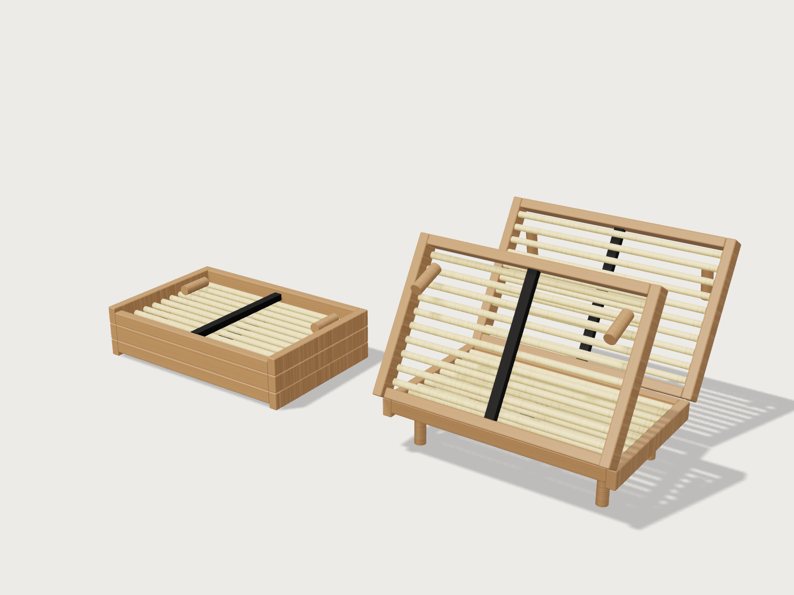 ／ ディテール（丸竹スラットと圧縮竹の枠のコーナー見本）: 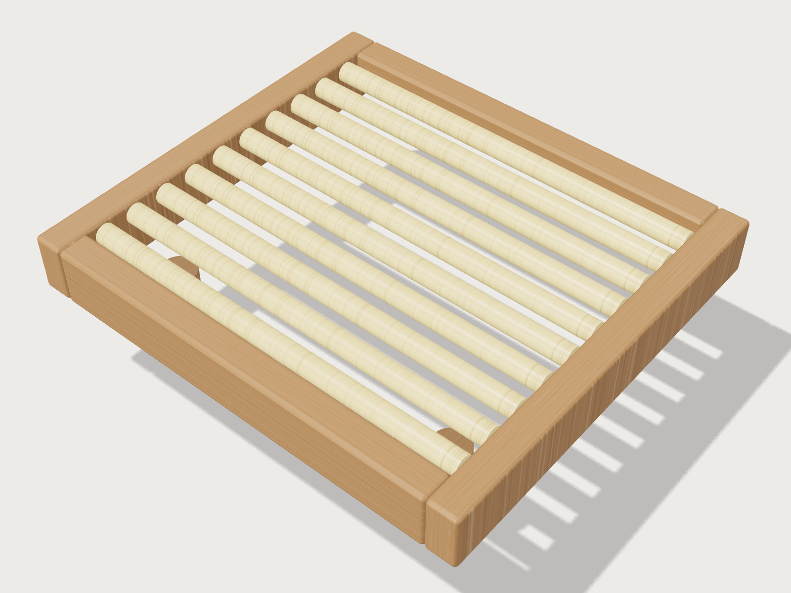 ／ フレーム単体（素材が主役なので、ECではこのカットを2枚目に使う）: 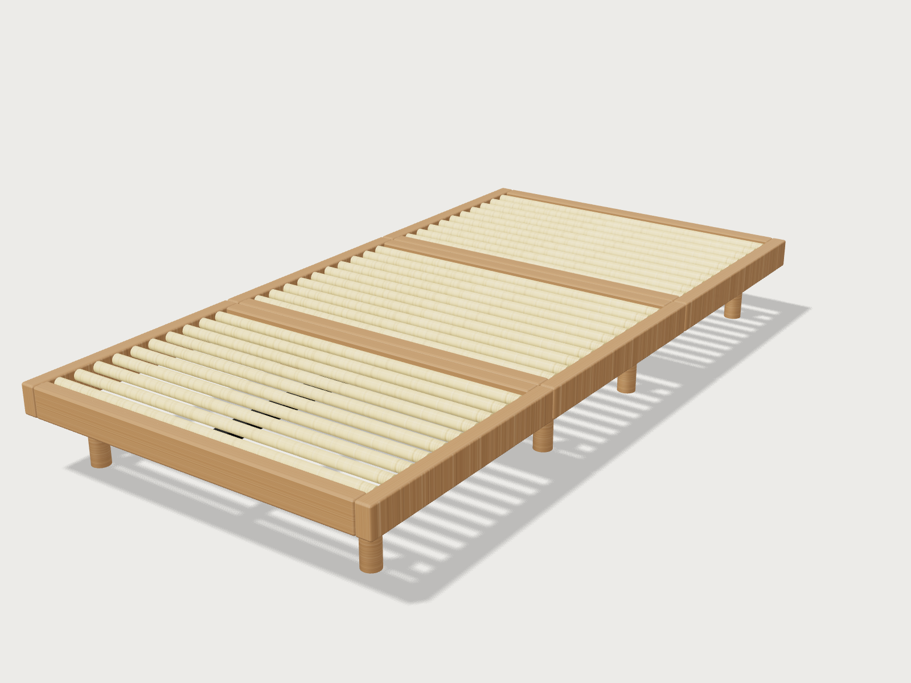 ／ 正面・側面: `C1-06-front.png`・`C1-06-side.png`

- **名称**: C1-06 素材特化「MARUTAKE」
- **デザインコンセプト**: 「竹を、竹のまま使う。」スラットを集成材の板ではなく、節のある丸竹（φ28）そのものにした案。枠は竹の繊維を高圧で固めた圧縮竹（ストランドウーブン）の濃い蜂蜜色。丸竹は中空で軽く、しなって体圧を受け、隙間が広いので通気がよい。「竹のベッド」であることが、一目で・触って分かる。
- **ターゲット**: 天然素材・サステナブル素材で家具を選ぶ30〜40代（アウトドア・北欧／和モダン好き）。「集成材の竹」では竹らしさが物足りないと感じる人。海外（米国）での展開も視野に入れる。
- **解決する課題**: 不満「寝心地（すのこが硬い）」14.3%（research §6、[S28]）に対し、丸竹のしなりで当たりを柔らかくする【推測】。「質感・仕上げ（桐・パインのすのこと同じに見える）」14.3% を、素材そのもので解消。購入理由「通気性・掃除しやすさ」8.8%（§7）にも効く。
- **形状**: 外寸 W1000×L1980×H225mm（天面高、寝面高 約505mm）。三つ折り（1枚 660mm）。枠 42×80mm・角R6。スラット 丸竹 φ28×10本／枚（計30本、ピッチ約58mm）。脚 丸脚 φ48×8本（外周から100mm内側）。床下 約145mm。
- **素材**: スラット 丸竹（孟宗竹の径選別品、表皮を残して油抜き・防カビ処理）／枠・脚 圧縮竹（ストランドウーブン）の化粧材＋竹集成材の芯／長手の梁 中空スチール 30×40（丸竹の下を通す）／丸竹の受け 樹脂ブッシュ（きしみ防止）
- **CMF**: Color 丸竹 ナチュラル `#D2BB7C`（表皮の黄味）×枠 ハニー圧縮竹 `#8F6A45`（1色展開）。Material 丸竹＋圧縮竹。Finish 丸竹は表皮を活かした半艶の自然塗料（植物油系）、枠は艶消しオイル仕上げ。節の位置・色の揺らぎは「個体差＝天然の証」として説明する。
- **機能**: オートロックヒンジ／脚のバネ補助展開／丸竹の両端に樹脂ブッシュ（きしみ・割れ防止）／保証耐荷重 S 250kg。**入れなかった機能**: 塗りつぶしの着色（素材感を消すため）、色展開（丸竹の品質管理を優先）
- **開梱〜就寝（必須）**: ①持ち手ベルトで本体を引き出す ②立てたまま開く（脚がバネで起きてロック） ③床に倒す ④ロックの目印を確認 ⑤マットレスを載せる ＝ **5動作・約3分・工具0・部品1点・1人**【推測】
- **梱包（必須）**: 折りたたみ時 660×1000×240mm → 梱包 約690×1030×270mm（3辺合計 約199cm、ぎりぎり200サイズ内）、重量 約22.5kg【推測】（丸竹は中空で軽いが、圧縮竹は比重が高いため枠は化粧材のみに使う）
- **競合優位性**: 桐すのこ（4,980円〜）・パインのパレットベッドの「ささくれ・安っぽい」[S25] や、タンスのゲンの「すのこが硬い」[S28] に対し、素材の本物感としなりで勝つ。GOKUMIN が持つ竹の資産（「一般の木材の2〜3倍の強度」「抗菌」の訴求 [S6]）を最も直接に使える。竹製家具市場は年9.4%成長の予測 [S51]。
- **製造方法**: 丸竹は径選別（φ28±2mm）→ 油抜き・熱処理・防カビ処理 → 定尺切断 → 端部に樹脂ブッシュを圧入し、枠の穴に差し込む（工場で組む）。圧縮竹の化粧材は既製の板材から CNC。工場での部品点数 約58点【推測】。新規金型 ヒンジ用小型プレス型のみ。量産の注意点: 天然の丸竹は径・曲がり・割れのばらつきがあり、選別の歩留まりが最大のリスク（歩留まり 60〜70% と仮定【推測】）。調達の安定性（産地・季節）と、乾燥割れの抜き取り検査が必要。
- **想定価格**: 税込 **46,800円**（SD 56,800円）。原価率 約35%【推測】（丸竹の選別ロスを含む）。research 結論4 の上限（44,800円）を2,000円超えるが、素材の物語で説明できる範囲と判断。
- **デザイン意図（根拠）**: research §8 の推測「GOKUMIN の竹はすでに持っている素材資産」「安いすのこと見分けがつくよう質感の差をはっきり出す」を、集成材ではなく竹の形そのもので実現した。企画 4-0「竹集成材を見える面に使う（素材特化で別素材を足すのは可）」に沿い、枠は圧縮竹、スラットは丸竹で、竹の3つの形態（丸竹・集成材の芯・圧縮竹）を一台に使う。【推測】丸竹のしなりで寝心地の硬さが和らぐかは、試作で体圧分布を測って確認が必要。共有プラットフォーム部品: P2・P3・P6（P1 のスラット部分は専用）。

## 案C1-07 UX改善「SUTTO（すっと）」

構造（左: 折りたたんでキャスターで立てた状態＝運ぶ・しまう／右: 開きかけ。左側面の埋め込みキャスターとロックの目印が見える）: 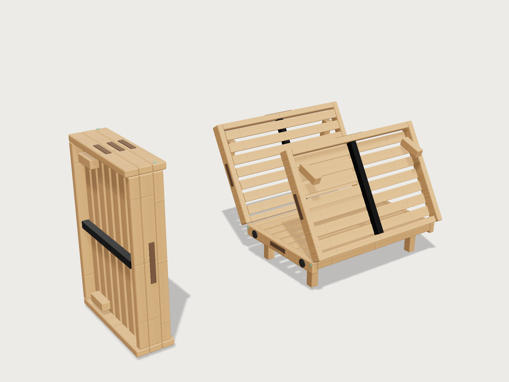 ／ 左斜め（キャスター側）: 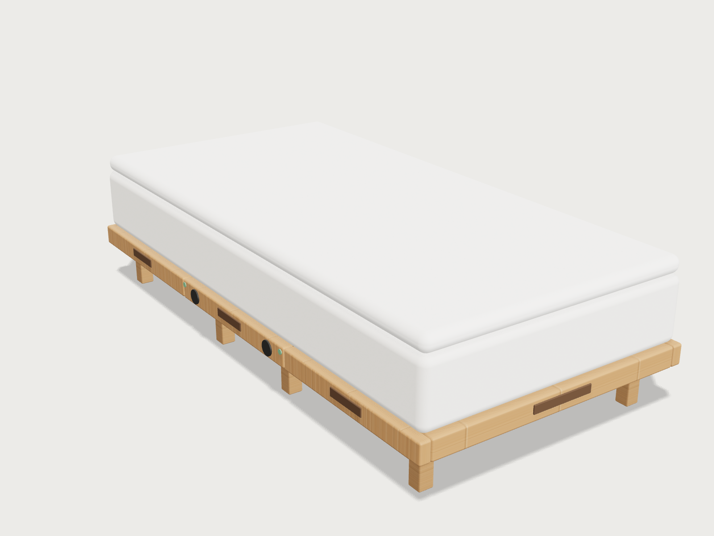 ／ フレーム単体: `C1-07-frame.png` ／ 正面・側面: `C1-07-front.png`・`C1-07-side.png`

- **名称**: C1-07 UX改善「SUTTO」
- **デザインコンセプト**: 「箱から出す、運ぶ、開く、しまう。全部、すっと。」ベッドの形ではなく「使う流れ」を設計した案。すべてのパネルの縁に手を掛ける凹み（グリップ）、ヒンジ横のロック確認の目印、側面に埋め込んだキャスターで、女性1人でも持ち上げずに扱える。たたむとスーツケースのように立てて転がせる。
- **ターゲット**: 一人暮らしの女性・転勤の多い会社員（企画 1-2 のサブターゲット「引越し・新生活で、たたんで運べることを重視する単身者」）。実家の来客用ベッドとして上質な折りたたみを探す40〜50代。
- **解決する課題**: 不満「重い（女性1人で困難・折りたたみが重い）」14.3%、「組立の手間・説明書が分かりにくい」14.3%（research §6、[S17][S55]）。購入理由「省スペース・移動・折りたたみ」8.8%（§7）。research 追加A の推測「完成品の弱点は重さ・梱包サイズ・きしみ」のうち「重さ」を、重量を減らすのではなく「持たずに済む」体験で解く。
- **形状**: 外寸 W1000×L1980×H220mm（天面高、寝面高 約500mm）。三つ折り（1枚 660mm）。縁 40×72mm・角R8。グリップの凹み 150×30mm を各パネルの左右と、頭・足の端に計8か所。ロック目印 φ18（ヒンジ横4か所）。キャスター φ52×2個を中央パネルの左側面に半分埋め込み（開いた状態では床に触れない）。スラット 幅60mm×7本／枚。脚 50mm角×8本。床下 約148mm。
- **素材**: 縁・スラット・脚 熱処理竹集成材（ハニーブラウン）／グリップの凹み 竹集成材の座ぐり（濃色オイルで仕上げ）／ロック目印 着色した樹脂（ロック時だけ見える窓）／キャスター TPE タイヤ＋PP ホイール（床を傷つけない）／梁 中空スチール／ヒンジ 鋼板プレス＋樹脂ブッシュ
- **CMF**: Color ハニーブラウン竹 `#B08457`（熱処理で色を出した竹集成材。01・02 のナチュラルと差をつける標準色）、グリップの凹み ダークブラウン `#5C4430`、ロック目印 セージグリーン `#6F9A78`（発光しない。ロックが掛かると窓に緑が見える）、キャスター チャコール `#2E2D2B`。展開2色（＋ナチュラル `#D9B88A`）。Finish 艶消しウレタン、グリップの内側は手触りのよいオイル仕上げ。
- **機能**: ①**グリップ8か所**（どの向きでも手が掛かる）②**ロックの見える化**（ロックが掛かると窓が緑になる。説明書を読まずに分かる）③**埋め込みキャスター**（たたんで立てると転がせる。部屋の移動・掃除・引越しが1人で可能）④**持ち手ベルトつき梱包**（箱を横倒しにしてベルトで引き出す）⑤オートロックヒンジ・脚のバネ補助展開・保証耐荷重 S 250kg。**入れなかった機能**: 電動・ガス圧の補助（コストと故障の原因）、宮棚
- **開梱〜就寝（必須）**: ①箱を横に倒し、持ち手ベルトで本体を引き出す（持ち上げない）②キャスターで設置場所まで転がす ③グリップを持って本のように開く（脚がバネで起きてロック）④床に倒し、窓が緑になったことを確認 ⑤マットレスを載せる ＝ **5動作・約3分・工具0・部品1点・1人（持ち上げ動作なし）**【推測】
- **梱包（必須）**: 折りたたみ時 660×1000×216mm → 梱包 約690×1030×250mm（3辺合計 約197cm）、重量 約22.5kg【推測】（キャスター分 +0.5kg）。梱包の短辺側に引き出し用ベルトの口を設ける。
- **競合優位性**: タンスのゲン ワンタッチ（キャスター付き・18.2kg）[S10] は「立てて転がせる」が見た目が安価で、きしみの声がある [S28]。SUTTO は同じ便利さを竹の質感と予圧ロックで上位化する。エムールの「重い」[S17]、無印 脚付マットレスの「重くて女性1人では困難」[S55] に対し、持たずに運べる。
- **製造方法**: 竹集成材の CNC（グリップの座ぐり加工を追加）・塗装、スチール梁の溶接、ヒンジのプレス＋カシメ、キャスターは既製品を座ぐりに圧入して固定、ロック目印はヒンジのロックピンに連動する樹脂部品（射出成形の小型金型）。工場での部品点数 約62点【推測】。新規金型 ヒンジ用小型プレス型＋ロック目印の射出成形型（小）。量産の注意点: ロック目印とロックピンの連動の信頼性（誤表示ゼロ）を1,000回の開閉試験で確認する。
- **想定価格**: 税込 **41,800円**（SD 51,800円）。原価率 約32%【推測】。research 結論4 の範囲内の下寄り。
- **デザイン意図（根拠）**: 企画 4-1「機能特化は閉じると立てて置けてキャスターで動く」「UX改善はロックの見える化・箱から引き出す持ち手」をひとつの案にまとめ、使う流れ全体を設計した（C1-05 を剛性特化にしたため）。research 結論5「開いたら自動でロックがかかる」、企画 1-6 必須条件「ロック状態が見て分かる」を最も分かりやすく形にした。research 追加B「一人で安全に持てるのは20kg前後 [S33]」に対し、持ち上げない手順にした。SNS の「箱から出して◯分で完成」の時短動画（§13）が最も撮りやすい案。共有プラットフォーム部品: P1・P2（ロック目印を追加）・P3・P5・P6。

## 案C1-08 構造革新「KUMI（組）」

構造（左: 折りたたみ・梱包時。組手ヒンジの筒が層の間に並ぶ／右: 開きかけ。ヒンジの回転に連動して板脚が下りていく途中）: 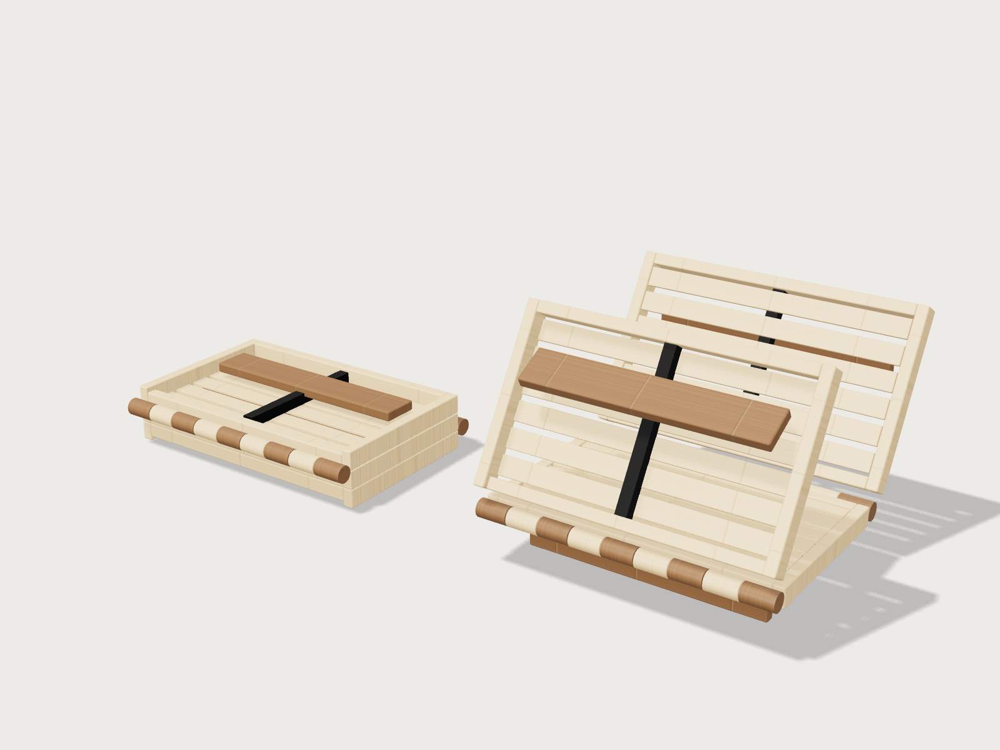 ／ フレーム単体（折り目に交互の組手の筒が見える）: 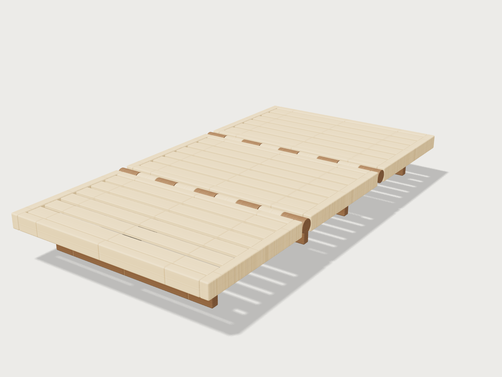 ／ 正面・側面: `C1-08-front.png`・`C1-08-side.png`

- **名称**: C1-08 構造革新「KUMI」
- **デザインコンセプト**: 「継手が、ヒンジになる。開く動きが、脚を立てる。」金物のヒンジを隠すのではなく、日本の組手（指物の組み継ぎ）の形をした竹の筒を交互に噛み合わせてヒンジそのものにし、折り目を意匠として見せる。さらに、ヒンジの回転をリンクで板脚に伝え、パネルを開くと脚が自動で下りてロックする。ユーザーの動作は「開く」だけになる。
- **ターゲット**: 構造やものづくりの背景に価値を感じる30〜40代（ガジェット・道具好き、海外の DTC 家具を知っている層）。「仕組みが美しい」ことを人に話したくなる人。
- **解決する課題**: 不満「組立の手間」14.3%・「きしみ（金具の緩み）」17.1%（research §6）を、「脚を起こす動作」と「金物が擦れる接点」の両方をなくすことで解く。research 追加A のベンチマーク「開梱から寝られるまで5分以内・工具0・1人」をさらに短くする（4動作）。
- **形状**: 外寸 W1000×L1980×H215mm（天面高、寝面高 約495mm）。三つ折り（1枚 約660mm）。折り目に組手の筒 φ62×9分割（竹ナチュラルとスモークを交互、両端はスモークで側面に丸い印が見える）。縁 40×70mm・角R6。スラット 幅66mm×6本／枚。脚 板脚（厚36mm×幅820mm）×4枚（頭端・足端・中央パネルの両ヒンジ寄り）。床下 約145mm。
- **素材**: 縁・スラット 竹集成材（ナチュラル）／組手の筒・板脚 スモーク竹集成材（熱処理で色を出す）／筒の芯 ステンレスシャフト φ12（筒の中を貫通、外からは見えない）＋POM ブッシュ／連動リンク スチール板（パネル内部）／長手の梁 中空スチール
- **CMF**: Color ナチュラル竹 `#D9B88A`×スモーク竹 `#7A5738`（2トーン、1色展開）。Material 竹集成材・スモーク竹。Finish 艶消しオイル仕上げ（組手の筒は触ると木の感触が分かる仕上げ）。金物は完全に内蔵。
- **機能**: ①**組手ヒンジ**（竹の筒どうしが回転し、芯のステンレスと POM ブッシュで金属どうしが当たらない＝きしみにくい）②**連動脚**（パネルを 180°開くと、リンクで板脚が 90°下りて自動ロック。閉じると脚も自動で畳まれる）③開き切るとヒンジ内のラッチがかかる ④保証耐荷重 S 250kg。**入れなかった機能**: 脚の高さ調節（リンク機構を単純に保つため）
- **開梱〜就寝（必須）**: ①持ち手ベルトで本体を引き出して床に置く ②パネルを開く（脚が連動して下りる）③もう一方のパネルを開く ④マットレスを載せる ＝ **4動作・約2分・工具0・部品1点・1人**【推測】（立てる・倒す動作が不要）
- **梱包（必須）**: 折りたたみ時 660×1000×210mm → 梱包 約690×1030×240mm（3辺合計 約196cm）、重量 約22kg【推測】
- **競合優位性**: Thuma（米、$795〜）は日本式の継手を「工具不要の組立」の象徴にして高価格を成立させた [S45]。KUMI は本家の日本から、継手を「完成品のヒンジ」として出す。タンスのゲン ワンタッチ等の金属ヒンジの「きしみ」[S28] に対し、金属どうしの接点をなくす。IKEA のくさび形ダボ（組立を50〜80%短縮）[S48] よりも一歩進めて「組立そのものがない」。
- **製造方法**: 組手の筒は竹集成材の丸棒を旋盤加工 → 交互に溝切り → 各パネルの端に接着・ピン固定、ステンレスシャフトを通して組む。連動リンクはスチール板のレーザー切断＋曲げ。工場での部品点数 約75点【推測】（10案で最多クラス）。新規金型 リンク用の順送プレス型（中）。量産の注意点: 組手の筒の同芯度（9分割がスムーズに回るか）と、竹の含水率変化による渋さ・ガタの発生。リンクの寸法公差で脚のロック位置がずれないよう、治具での組立検査が必要。
- **想定価格**: 税込 **44,800円**（SD 54,800円）。原価率 約36%【推測】（加工工程が多い）。research 結論4 の上限。
- **デザイン意図（根拠）**: 企画 4-1「構造革新は、開く動作で脚が連動して起きる機構、または継手とロックを組み合わせたヒンジの意匠化（Thuma の継手が米国で高価格の象徴 [S45]）」の2つを両方入れた。research §12 の推測「日本式継手が米国で高価格 DTC の象徴になっていて、本家の日本にこの訴求の商品が少ない」を空白として取りにいく。企画 1-6 NG「金具・ヒンジが外から大きく見える」は、ヒンジを金具ではなく竹の意匠に置き換えることで回避した。【推測】組手ヒンジの剛性（26kg＋100kg 荷重時のヒンジ部たわみ 5mm 以下）は、芯のステンレスシャフトと梁で受け持つ設計で、試作での確認が必須。共有プラットフォーム部品: P1（端部の意匠のみ変更）・P5・P6（P2 は組手ヒンジに置き換え、P3 は板脚のため非共有）。

## 案C1-09 少し挑戦的「HAKO（はこ）」

使用シーン（昼: たたんでクッションを載せ、ベンチ・オットマンとして使う）: 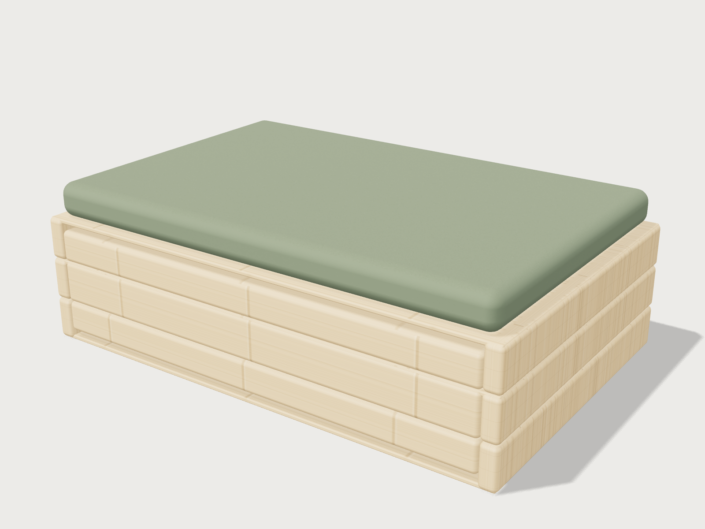 ／ 構造（左: 折りたたみ・梱包時。裏面まで仕上げた「箱」になる／右: 開きかけ。裏板のポケットから脚が起きる）: 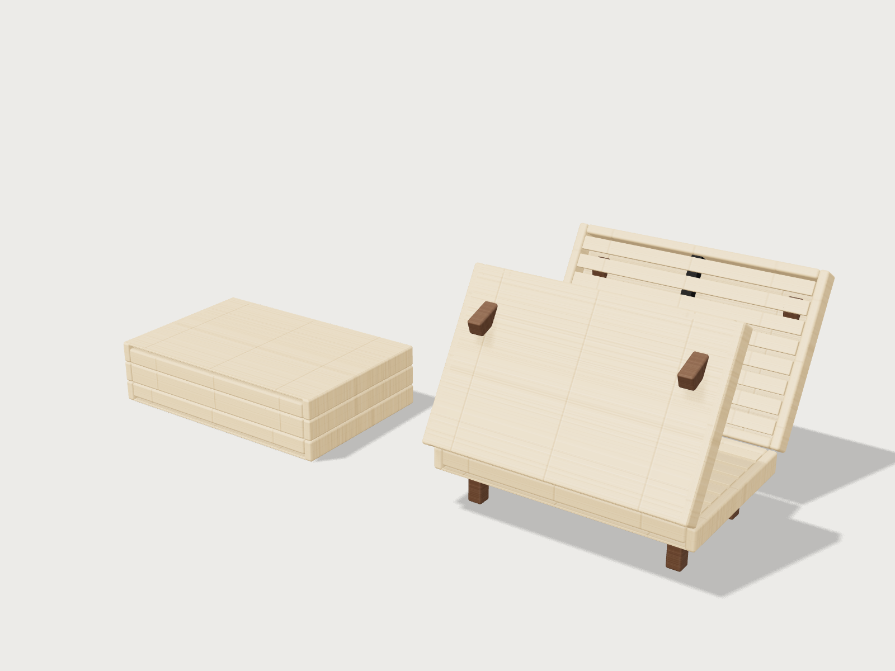 ／ フレーム単体: `C1-09-frame.png` ／ 正面・側面: `C1-09-front.png`・`C1-09-side.png`

- **名称**: C1-09 少し挑戦的「HAKO」
- **デザインコンセプト**: 「たたんだ姿も、家具である。」ベッドの常識「裏側は見せない・たたんだ姿は隠す」を一つだけ崩す。3枚のパネルをそれぞれ裏板つきの浅い箱にし、脚は裏板のポケットに収める。たたむと6面すべてが仕上がった竹の箱になり、昼はクッションを載せてベンチ・オットマン、来客の夜はベッドに戻る。
- **ターゲット**: 1LDK・ワンルームで寝室とリビングが分かれていない28〜38歳。来客用・在宅ワークの日中にベッドを「消したい」人。企画 1-2 のサブターゲット「実家の両親や来客用に、上質な予備ベッドを探す40〜50代」にも合う。
- **解決する課題**: 購入理由「省スペース・移動・折りたたみ」8.8%（research §7）を、「たたんでしまう」ではなく「たたんで使う」に変える。企画 1-6 必須条件「折りたたんだ状態の見た目も美しい（立てて置く・収納する場面がある）」を最も強く満たす。不満「質感・仕上げ」14.3%（§6）にも、裏まで仕上げた作りで答える。
- **形状**: 外寸 W990×L1950×H230mm（天面高、寝面高 約510mm）。三つ折り（1枚 650mm）。各パネルは 縁 36×85mm（角R10）＋裏板の箱構造。脚 56mm角・角R8×8本（ウォールナット調、外周から110mm内側）。床下 約145mm。**たたんだ状態 650×990×255mm**（クッション込みで座面高 約325mm のベンチ）。
- **素材**: 縁・スラット 竹集成材／裏板 竹合板 4mm（通気スリット入り）／脚 炭化竹集成材（ウォールナット調）／梁 中空スチール／ヒンジ 鋼板プレス＋樹脂ブッシュ（箱の内側に隠す）／ベンチ用クッション（別売オプション）ポリエステル混の張地＋ウレタン
- **CMF**: Color ナチュラル竹 `#D9B88A`×脚 ウォールナット調 `#5A3E2A`、オプションのクッション モスグリーン `#6D7862`（ほか グレージュ `#B9AFA2`）。Material 竹集成材・竹合板。Finish 6面とも艶消しウレタン（裏板も表と同じ仕上げ）。
- **機能**: ①**6面仕上げの箱構造**（たたむとベンチ・オットマン・ローテーブルになる。耐荷重は座面として 150kg を目標【推測】）②**ポケット脚**（裏板の凹みに収まり、たたんだとき裏が平らになる）③裏板の通気スリット（マットレスの湿気を逃がす）④オートロックヒンジ・保証耐荷重 S 250kg。**入れなかった機能**: 箱の内部収納（重量と開閉の手間が増えるため）
- **開梱〜就寝（必須）**: ①持ち手ベルトで本体を引き出す ②立てたまま開く（ポケットから脚がバネで起きてロック） ③床に倒す ④ロックの目印を確認 ⑤マットレスを載せる ＝ **5動作・約3分・工具0・部品1点（クッションは別）・1人**【推測】。昼のベンチへの切り替えは「マットレスを立て掛ける→たたむ→クッションを置く」の3動作
- **梱包（必須）**: 折りたたみ時 650×990×255mm → 梱包 約680×1020×285mm（3辺合計 約199cm、ぎりぎり200サイズ内）、重量 約24kg【推測】（裏板の分 +2kg）。箱の形そのままなので、緩衝材は角だけでよい。
- **競合優位性**: 国内の折りたたみベッド（タンスのゲン・山善・ニトリ等）は、たたんだ姿が「しまうための形」で、パイプや裏面が見える [S10][S15][S57]。HAKO は、たたんだ状態をそのまま部屋に置ける家具にする。リクライニング・マット付きの折りたたみ（13,780円）[S9] の「来客用」需要を、上質な家具として取りにいく。
- **製造方法**: 竹集成材の枠を CNC → 裏板（竹合板 4mm、スリットはレーザー加工）を枠の溝に接着 → 脚のポケットを座ぐり → 塗装。ヒンジは箱の内側に取り付け（プレス＋カシメ）。工場での部品点数 約60点【推測】。新規金型 ヒンジ用小型プレス型のみ。量産の注意点: 箱構造は反り・ねじれが出やすいため、裏板の含水率と接着の管理が必要。裏板による重量増（+2kg）と通気の低下を、スリットの開口率で調整する（開口率 20% 以上を目安【推測】）。
- **想定価格**: 税込 **47,800円**（SD 57,800円）、ベンチ用クッション 5,980円【推測】。原価率 約34%【推測】。research 結論4 の上限（44,800円）を3,000円超える。上限を超える理由: 裏板と6面仕上げの分。「ベッド＋ベンチの2役」で説明する。
- **デザイン意図（根拠）**: research §16 の空白（完成品×プレミアム）の中で、さらに「たたんだ状態の価値」という誰も取っていない切り口を狙った【推測】。企画 1-6「折りたたんだ状態の見た目も美しい」を主役に格上げした。research 結論5 の「ヘッドレスの低いプラットフォーム」は開いた状態で守り、市場の常識から外すのは「裏面・たたんだ姿を見せる」の一点だけにした（実現可能性を保つ）。**あえて research と違う方向**: research 結論2 は「一人で運べない重さ（25kg超）」を避けるよう示すが、HAKO は 24kg と上限に近い。2役の価値で重さを上回れるかは、価格つきアンケートで確認したい【推測】。共有プラットフォーム部品: P1（裏板を追加）・P2・P5・P6。

## 案C1-10 コンセプトモデル「KARA（殻）」

低い視点（中央の台座＝梱包の殻が見える）: 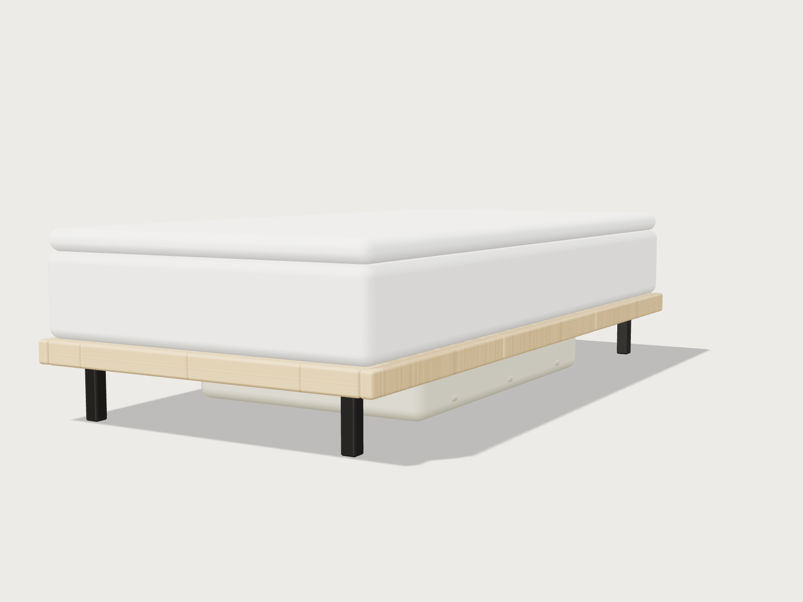 ／ 構造（左: 配送時。竹パルプ成形の殻2つでたたんだ本体を挟む＝段ボールなし／右: 殻を重ねて台座にし、その上で本体を開いていく）: 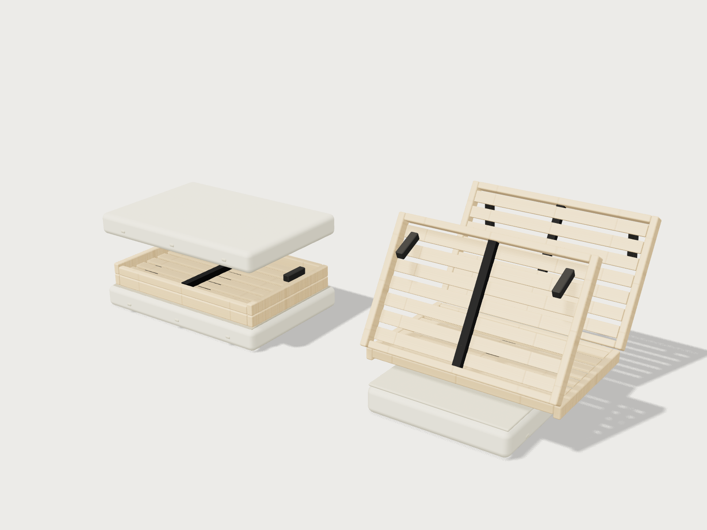 ／ フレーム単体: `C1-10-frame.png` ／ 正面・側面: `C1-10-front.png`・`C1-10-side.png`

- **名称**: C1-10 コンセプトモデル「KARA」
- **デザインコンセプト**: 「箱を捨てない。箱が、ベッドの一部になる。」配送用の段ボール箱の代わりに、竹パルプを成形した2つの「殻」でたたんだ本体を挟んで届ける。開梱したら2つの殻を重ねて中央の台座にし、その上で本体を開く。ごみが出ない、置き場所に困る箱がない、引越しのときは殻に戻して運べる。数年先の「完成品ベッド＝梱包まで含めて一つの製品」という GOKUMIN の姿を示す。
- **ターゲット**: 2028〜2030年の新生活層（サステナビリティを当たり前に求める20代後半〜30代）。短期的には、ブランド発信（展示会・PR・SNS）で「GOKUMIN は梱包まで考えている」を伝える役割。
- **解決する課題**: EC 購入のたびに出る大型の段ボールと緩衝材の処理（【推測】研究では集計していないが、大型家具の開梱で繰り返し語られる不満）。research 追加B の推測「閉じれば元の箱に戻る＝返品・引越しがしやすい」を、箱ではなく殻で実現する。購入理由「省スペース・移動」8.8%（§7）。
- **形状**: 外寸 W1000×L1980×H214mm（天面高、寝面高 約494mm）。三つ折り（1枚 660mm）。縁 36×64mm。台座 2つの殻を重ねた 730×1060×150mm（中央、外周から135mm内側）。頭・足の端に補助脚 40mm角×4本（端に座ったときの転倒防止、折りたたみ式）。スラット 幅60mm×7本／枚。台座の外の床下 約150mm。殻（1個）1060×730×118mm。
- **素材**: 本体 竹集成材＋中空スチールの梁（C1-01 の軽量版）／殻 竹パルプのウェットプレス成形（リブ構造、撥水処理）／補助脚 アルミ押出（チャコール塗装）
- **CMF**: Color 竹 ナチュラル `#D9B88A`×殻 未晒し竹パルプ `#D6D0BB`（素材の色のまま、無着色）×補助脚 チャコール `#3A3936`。Material 竹集成材・竹パルプ成形。Finish 殻は成形のままの繊維の質感（マット）、本体は艶消しウレタン。
- **機能**: ①**殻＝梱包＝台座**（段ボール・発泡緩衝材ゼロ）②殻を重ねるとリブが噛み合ってずれない ③引越し・返品時は殻に戻せば、そのまま配送できる ④補助脚で端座りの安定を確保 ⑤オートロックヒンジ。**入れなかった機能**: 殻を収納ボックスとして使う機能（台座の強度を優先。将来の派生案として検討）
- **開梱〜就寝（必須）**: ①上の殻を持ち上げて外す ②本体を取り出し、2つの殻を重ねて床に置く（台座）③本体を台座の上に置いて開く（補助脚が起きる）④マットレスを載せる ＝ **4動作・約4分・工具0・ユーザーが扱う部品3点（本体＋殻2）・1人**【推測】
- **梱包（必須）**: 殻で挟んだ状態 約1060×730×300mm（3辺合計 約209cm＝**宅急便200サイズを約9cm超える**）、重量 約24kg（本体 約19kg＋殻 約2.5kg×2）【推測】。量産までに、殻の肉厚とリブ形状で 200cm 以内に収めることが課題（本体の薄型化と合わせて −10cm が必要）
- **競合優位性**: 国内外の折りたたみ・完成品ベッドは、すべて段ボール梱包が前提 [S10][S43]。梱包そのものを製品に組み込む商品は、調べた範囲では見つからなかった【推測】。竹製家具市場の成長（年9.4% [S51]）と、竹パルプという自社素材の延長で、ブランドの物語を最も強くできる。
- **製造方法**: 殻は竹パルプのウェットプレス成形（金型は大型、1セット）→ 乾燥 → 撥水処理。本体は C1-01 と同じ工程（竹集成材 CNC・スチール梁・ヒンジのプレス＋カシメ）。工場での部品点数 本体 約50点＋殻2点【推測】。新規金型 殻の成形金型（大、数百万円規模【推測】）＋ヒンジ用小型プレス型。量産の注意点: パルプ成形品に 26kg のマットレス＋就寝者の荷重を中央で受けさせるのは、現時点では強度・クリープ（長期の変形）の実績がない。**実現への道筋**: 第1段階は殻を「梱包と返品用」に限定し、台座は竹集成材で作る（2027年に実証可能）→ 第2段階で成形パルプの強度試験（26kg＋100kg の長期荷重）を経て台座に使う（2028年以降）。
- **想定価格**: 税込 **59,800円**（コンセプトの参考価格。量産時は殻の償却後に 49,800円を目標）。原価率 約40%【推測】（殻の金型償却を含む）。research 結論4 の範囲を超えるため、すぐに量産しない前提。
- **デザイン意図（根拠）**: 企画 4-1「コンセプトモデルは箱そのものが脚台になる」を、梱包材ごと製品にする形で具体化した。research 追加B「梱包の3辺と重量」「返品時の解体・再梱包は客負担 [S34]」「完成品なら閉じれば元の箱に戻る」の論点を、未来の答えとして示す。**Manufacturability・Cost が低いことは承知のうえ**で、ブランドの方向性（竹という素材で、製品から梱包まで循環させる）を示す役割とした。台座を中央に集めた形は research §10「低く・浮いて見える」にも合う。共有プラットフォーム部品: P1・P2・P5（P6 梱包規格は殻に置き換え）。

---

## 自己レビュー
採点は1〜5点。加重平均は企画 1-7 の重み（Usability 22%／Manufacturability 18%／Market Fit 16%／Cost 14%／Design 12%／Brand Fit 10%／Originality 8%）で計算した。数値はすべて修正後。

### 採点表
| No | Market Fit (16) | Design (12) | Originality (8) | Usability (22) | Manufacturability (18) | Cost (14) | Brand Fit (10) | 加重平均 |
|---|---|---|---|---|---|---|---|---|
| C1-01 HIRAKU | 5 | 3 | 3 | 4 | 5 | 5 | 5 | **4.38** |
| C1-02 ITTAN | 4 | 4 | 3 | 4 | 4 | 5 | 4 | **4.06** |
| C1-03 KASANE | 4 | 5 | 4 | 4 | 3 | 3 | 5 | **3.90** |
| C1-04 MOCHI | 4 | 4 | 4 | 4 | 3 | 4 | 3 | **3.72** |
| C1-05 SHIN | 5 | 3 | 3 | 4 | 3 | 3 | 4 | **3.64** |
| C1-06 MARUTAKE | 3 | 4 | 5 | 4 | 3 | 3 | 5 | **3.70** |
| C1-07 SUTTO | 4 | 3 | 4 | 5 | 4 | 4 | 4 | **4.10** |
| C1-08 KUMI | 4 | 4 | 5 | 5 | 3 | 3 | 4 | **3.98** |
| C1-09 HAKO | 3 | 4 | 5 | 4 | 3 | 3 | 4 | **3.60** |
| C1-10 KARA | 2 | 4 | 5 | 3 | 1 | 1 | 5 | **2.68** |

各軸の1行理由（主なもの）
- **Market Fit**: 01・05 は research の購入理由1・2位（組立・頑丈）と価格帯の中心に直結＝5。06・09 は刺さる層が狭い（素材志向・2役需要）＝3。10 は現時点で買える商品ではない＝2。
- **Design**: 03 は積層の縁で質感の差が最も明確＝5。01・05・07 は整っているが印象は既存の延長／機能的＝3。
- **Originality**: 06（丸竹）・08（組手ヒンジ＋連動脚）・09（たたんだ姿を家具に）・10（梱包を製品に）は国内の競合に同種が見当たらない＝5。01 は既存の延長だが「三つ折り×保証耐荷重×200サイズ」の完成品は国内4万円帯に無い（§16）ため3。
- **Usability**: 07（持ち上げなし・ロックが色で分かる）と 08（4動作・脚が自動）＝5。10 は部品3点・殻の扱いが増える＝3。
- **Manufacturability**: 01 は現行工程の流用＋小型金型のみ＝5。03（炭化竹の色選別）・04（白塗装の歩留まり）・05（重量上限・溶接治具）・06（丸竹の選別）・08（部品75点・リンク精度）・09（箱の反り・重量）＝3。10 は大型成形金型と強度実績なし＝1。
- **Cost**: 01・02 は研究の価格帯内で原価率30〜32%＝5。03・05・06・08・09 は原価率34〜36%か価格帯の上限超え＝3。10 は金型償却込みで原価率40%・参考価格59,800円＝1。
- **Brand Fit**: 01・03・06・10 は GOKUMIN の竹・完成品の資産の延長、または竹の循環という物語を強める＝5。04 は白塗装で竹らしさが弱まる＝3。

### 各案の講評
- **C1-01 HIRAKU**: 最も売れる確率が高い。現行品の延長で開発リスクが最小。弱点は「驚きがない」ことで、EC のサムネイルでは 1万円の完成品との差が伝わりにくい。07 の UX 要素か 03 の縁の質感を足すと強くなる。
- **C1-02 ITTAN**: 最軽量（19kg）・最安（36,800円）で、面の美しさはミニマル層に強い。端の張り出し（約330mm）のたわみと端座りの安定が要検証。
- **C1-03 KASANE**: 質感で「フラッグシップ」を最も分かりやすく伝える。49,800円は research の上限超えで、THE GOKUMIN とのセット割が前提。炭化竹の色選別で歩留まりが下がる点がコストの懸念。
- **C1-04 MOCHI**: 今の内装トレンドに最も合い、若い層と SNS に強い。白塗装の歩留まりと汚れ、竹らしさが薄れるブランド面の懸念。定番色の案と2色展開にするのが現実的。
- **C1-05 SHIN**: THE GOKUMIN 購入者の「沈まない・鳴らない」に最も直接答える。24.5kg で一人で運べる目安（20kg前後 [S33]）を超え、見た目は機能的に寄る。スチールの薄肉化・アルミ化で 23kg 以下にできるかが鍵。
- **C1-06 MARUTAKE**: 竹そのものの説得力は10案で最強。丸竹の径・割れのばらつき（歩留まり）と調達の安定性が量産の最大リスク。
- **C1-07 SUTTO**: 使う流れの不満（重い・分かりにくい）を最も確実に消す。形としての個性は控えめで、単独の案より「他案に足す UX パッケージ」としての価値が高い。
- **C1-08 KUMI**: 「開くだけで脚も立つ」は組立工数最小【指定】の究極形で、継手の意匠は海外の高価格 DTC の文脈（Thuma [S45]）にも乗る。部品点数とリンクの精度がコストと品質の懸念。
- **C1-09 HAKO**: 「たたんだ姿を見せる」という一点で市場の常識を崩す。1LDK の来客・昼間の居場所に効く。重量 24kg・価格 47,800円・通気（裏板）の3点が要検証。
- **C1-10 KARA**: 今は作れないが、「梱包まで含めて一つの製品」という GOKUMIN の将来像を最も強く示す。第1段階（殻は梱包・返品専用、台座は竹）なら 2027年に実証できる。

### レビューで修正した点
| No | 軸 | 修正前→修正後 | 何を変えたか |
|---|---|---|---|
| C1-05 | Market Fit | 3→5 | 企画 4-1 の「キャスターで動く」機能特化から、research §7 で2倍以上多い「頑丈・静か」（20.6%）に機能を振り替えた。キャスターと立てて置く機能は C1-07 に移した |
| C1-05 | Design | 2→3 | 最初の描画でヒンジ側のスラットが短く、隙間からスチールの枠が大きく見えて「パイプベッド」に近い印象（企画 1-6 NG）になった。各パネルの両端に竹の受け材を足し、スチールは平らな帯として天面の下にそろえた |
| C1-06 | Manufacturability | 2→3 | 最初の寸法（丸竹 φ32・脚 φ64・縁高 72mm）では、たたんだときに脚が縁の下にはみ出し、丸竹と梁が干渉して梱包が200サイズを超えた。縁高 80mm・丸竹 φ28・脚 φ48 にし、梁を丸竹の下に通して、たたみ厚 240mm・梱包 199cm に収めた |
| C1-08 | Manufacturability | 2→3 | 組手の筒を竹の無垢から削り出して噛み合わせる案では、割れ・渋さ・ガタが出る。筒は竹集成材の丸棒（旋盤）にし、芯にステンレスシャフト＋POM ブッシュを通して金属どうしが当たらない構造にした。リンクは順送プレスの既存工法にした |
| C1-10 | Usability | 2→3 | 最初は殻2つを縦に並べて台座にしたが、合計長さ 2,060mm がベッド（1,980mm）からはみ出し、幅も合わなかった。殻を重ねて中央の1台座にし、頭・足の端に折りたたみの補助脚を足して端座りの転倒を防いだ |
| C1-04 | Design | 3→4 | フレームの白がマットレスの白と同化し、サムネイルで形が読めなかった。クラウドホワイトをわずかに温かい `#E6DFD2` に変え、縁と寝具の境界が見えるようにした |
| C1-07 | Originality | 3→4 | 01・02 と同じナチュラル竹で、差分表の主素材（CMF）が3案重なっていた。標準色を熱処理竹のハニーブラウン `#B08457` に変え、グリップの凹みを濃色にして、形の特徴（凹み・キャスター）が見えるようにした |
| C1-09 | Design | 3→4 | 裏板の見切り（黒い目地）が角から漏れて見えていたため削除し、6面とも同じ竹の仕上げにそろえた |

- やり直し基準の確認: 01〜08 で Market Fit・Manufacturability・Cost が2点以下の案はない。Usability 2点以下・Originality 2点以下の案はない。C1-10 の Manufacturability 1・Cost 1 は、コンセプトモデルとして許容（理由と実現への道筋は C1-10 の「製造方法」に記載）。C1-09 の Manufacturability 3・Cost 3 も許容範囲。

### 推奨上位3案とその理由
1. **売れる確率が最も高い案: C1-01 HIRAKU（加重平均 4.38、1位）** — research の購入理由1・2位を満たし、価格帯の下限 39,800円・原価率 約32%・現行工程の流用で、最も早く確実に空白 A を取れる。採用する場合は C1-07 の UX（グリップ・ロックの見える化・キャスター）を足した「01＋07」を推奨（+2,000円程度【推測】で Usability と Originality が上がる）。
2. **差別化が最も強い案: C1-08 KUMI（3.98、4位）** — 「開くだけで脚も立つ（4動作・約2分）」は【指定】の「組立工数最小」を10案で最も突き詰めた答えで、継手の意匠は「日本の竹の完成品ベッド」として海外にも語れる。量産の懸念（部品75点・リンク精度）は、試作で先に確認すべき。
3. **ブランド価値を最も高める案: C1-03 KASANE（3.90、5位）** — 質感で「フラッグシップ」を一目で伝え、THE GOKUMIN（7万円台）と並べても見劣りしない。価格は上限超えの 49,800円のため、マットレスとのセット販売（セット割）で成立させる。
- 参考: 加重平均2位の C1-07 SUTTO（4.10）と3位の C1-02 ITTAN（4.06）は、単独では「形の印象」が弱いため推奨3案から外した。07 は上記のとおり他案への追加要素として、02 は低価格の入口モデル（36,800円）として、シリーズ展開の候補に残す。

## ユーザーに判断してほしいこと
1. **採用の方向**: 「01（王道）＋07 の UX」で確実に売るか、08（構造革新）で差別化を取るか、03（プレミアム）でブランドの格を取るか。組み合わせ（例: 01 の形×03 の積層の縁、08 の連動脚×07 のグリップ）も可能
2. **価格の上限**: 03（49,800円）・06（46,800円）・09（47,800円）は research の上限 44,800円を超える。セット割前提で許容するか
3. **共通レール溝（P4）の有無**: ①の10案は「溝なし」で描いた。コンセプト②のアクセサリーを後から付けられるよう、①にも溝を入れるか（見た目とコストに小さく影響）
4. **重量の上限**: 03・05・09 は 24〜24.5kg と上限 25kg に近い。「一人で運べる（20kg前後）」をどこまで優先するか（07 の「持ち上げない」手順で補う考え方もある）
5. **C1-10 の扱い**: 量産しないコンセプトとして展示・PR に使うか、第1段階（殻を梱包・返品専用にする）だけ先に検討するか

## 前提・仮説・未確認事項
- 【推測】重量・梱包寸法・原価率・部品点数は、寸法と一般的な材料密度・EC 家具の原価構成からの見積もり。竹集成材 約700kg/m³、スチール角パイプ t1.6 で概算した。試作で実測して確定する
- 【推測】開梱〜就寝の時間は動作数からの推定（企画 0-1 の目標「3分以内」）。梱包材の処理とマットレスの開封・設置は含まない
- 【推測】保証耐荷重（S 250kg、05 は 300kg）とヒンジ部のたわみ（5mm 以下、05 は 3mm 以下）は企画 0-2 の目標値で、構造計算・試験は未実施
- 【未確認】THE GOKUMIN の定義（ユーロトップマスターズ 28cm・S 約26.1kg を仮置き [S4]）、現行の折りたたみバンブーベッドのヒンジ構造と工場設備（企画「前提・仮説・未確認事項」と同じ）
- 【推測】「立てたまま開いて倒す」手順（01〜07・09）は、脚をバネ補助で展開するための想定。08 は床置きのまま開ける。実際の手順は試作で検証する
- 3Dレンダーはコンセプト確認用の形状モデルで、ヒンジ・ロックの内部機構、ネジを使わない締結の詳細、スラットの受け構造は省略している。マットレスは THE GOKUMIN の実物ではなく、寸法（970×1950×280mm、ユーロトップ）を合わせた汎用形状
- ネーミング（HIRAKU・ITTAN・KASANE ほか）は仮称。商標の空き状況は【未確認】
- SD（セミダブル）は企画 0-3 の「ハーフ本体×2を工具なしで連結」を前提に価格を併記した。SD の形状は描いていない

## 次工程（A3プレゼンボード）への申し送り
- 画像はすべて `product/designs/v1/c1/` にある。各案のメインは `C1-XX-three-quarter.png`（マットレスあり）。構造カットは `C1-XX-structure.png`（左: 折りたたみ・梱包時、右: 開きかけ。07 は左がキャスターで立てた状態、10 は左が殻で挟んだ配送状態）。フレーム単体は `C1-XX-frame.png`、正面・側面は `-front`・`-side`
- 追加カット: 03 `C1-03-detail.png`（積層の縁）、06 `C1-06-detail.png`（丸竹スラット）、07 `C1-07-three-quarter-left.png`（キャスター側）、09 `C1-09-scene.png`（ベンチとして使う昼の姿）、10 `C1-10-low.png`（中央の台座が見える低い視点）
- **注意**: メインビジュアル（マットレスあり）は10案とも白いマットレスが画面の大半を占め、サムネイルでは 01・07・09・10 が似て見える。ボードでは、06 はフレーム単体、09 は `-scene`、10 は `-structure` をメインと同じ大きさで並べると差が伝わる
- 全画像に文字は入っていない。一覧画像 `contact-sheet.png` はフレーム単体の10枚に案番号と欧文の仮称のみ
- ボードに載せる必須の数値: 開梱〜就寝（動作数・時間・工具0・部品数）、梱包3辺・重量、保証耐荷重（差分表の列をそのまま使える）
- 画像生成AI用のプロンプト: `prompts/03-design-image-prompts-c1-v1.md`（3Dレンダーを参照画像として併用すると形のずれが減る）
- scene JSON は各 PNG と同じ名前（`C1-XX*.scene.json`）で保存済み。寸法を変えて描き直す場合は `node scripts/render3d.mjs product/designs/v1/c1/C1-XX.scene.json product/designs/v1/c1/C1-XX --views three-quarter,front,side`
