# STEP 3 プロダクトデザイン10案 v1（コンセプト② 自分仕様に育つベッド） — GOKUMIN フラッグシップベッド
- 作成: product-designer ／ 2026-09-28 ／ 入力: research/research.md（結論6項目・追加A〜C・§6/§7/§11/§16）, product/02-planning-v1.md（0章・2章・4章）, research/00-input.md, brief.md, handoff.md, decisions.md, _studio/brand.md, preferences.md, scripts/render3d/README.md
- 凡例: 【推測】=調査の裏付けがない見積もり・仮定
- 画像: `product/designs/v1/c2/`（3Dレンダー。scene JSON と PNG、一覧 `contact-sheet.png`）／画像生成AI用プロンプト: `prompts/03-design-image-prompts-c2-v1.md`
- 共通の前提（全10案）: シングル基準、THE GOKUMIN ユーロトップマスターズ 28cm（S 約26.1kg）[S4] を載せた状態で描画。本体は①と同じ三つ折りのコアデッキ（P1・P2）で「開くだけ」、ユーザーが締めるネジ 0本・工具 0・1人。アクセサリーは共通規格 **GOKUMIN RAIL**（外枠の溝＋アクセサリー側の差し込み舌＋予圧レバー、1規格）に差すだけ

## サマリー
- 「本体は開くだけ、アクセサリーは共通レールに差すだけ」を全案の土台にし、レールの見せ方（同系色 01／影に隠す 02／真鍮調の線 03／布で覆う 04／光る線 05／見せる目盛り 07／外枠そのもの 08）と、育て方（枕元 01・05／ホテル 03／着せ替え 04／竹工芸 06／大きさ 09／部屋 10）で10の切り口に振った。全案で本体の開梱〜就寝は4動作・約2分30秒〜3分30秒、アクセサリー込みで6〜8動作・約3〜6分（10 のみ約11分）、本体の梱包は3辺合計 193〜200cm・18.5〜23.5kg【推測】。
- 推奨上位3案: **C2-01 SODATSU**（売れる確率が最も高い、加重平均 3.94）／**C2-09 TSUNAGU**（差別化が最も強い、3.82）／**C2-06 AJIRO**（ブランド価値を最も高める、4.00）。加重平均1位の C2-02 SEN（4.10）は低価格の入口モデル、2位の C2-07 MEMORI（4.06）の「目盛り・緑のロック表示・4辺レール」はどの採用案にも足せる規格側の UX として推す。
- research の勝ち筋「開くだけ・ネジゼロ・きしまない竹フレームで、②は工具なしで育つ共通レール」（結論6）と、空白領域 B「フレーム共通規格のあるアクセサリー追加」（§16）に全案が乗る。01 はその中心、08・09・10 は規格の可能性を広げる側。

## デザインの前提（research.md から引き継いだこと）
- **狙うターゲット**: 28〜42歳の共働き・一人暮らしの上質志向層（research 結論3）。②のメインは「30歳・一人暮らし・1LDK・在宅勤務あり、ベッドの上の時間が長く、アクセサリーを1つずつ足す人」（企画 2-2）
- **価格**: ② 本体 S 44,800〜49,800円＋アクセサリー 1点 3,980〜12,800円、はじめの一式 5.5〜6.5万円（research 結論4）。範囲を外す案（03 の一式・09 の連結後・10）は各案に理由を記載
- **デザイン方向**: ヘッドレスの低いプラットフォーム（天面高 20〜25cm）、竹集成材＋スチール芯、「フレームの側面と頭側に差し込むだけの共通レール」、金物は目立たせない（research 結論5、企画 2-4・2-6）
- **避けるべきデザイン**: ネジ締めの接合、部品点数の多い構造、桐・パインのすのこに見える外観、LED の色変え、床下入口のテーパー、25kg 超・宅急便に乗らない梱包（research 結論2）。②固有の NG: 工具が要るアクセサリー、規格の増やしすぎ、付けたときにごちゃごちゃ見える、他社アドオン体系の意匠のまね（企画 2-6）
- **勝ち筋**: 後付け需要（楽天『ベッド 棚 後付け』6,006件）はあるが、フレーム側に規格がないため「すのこに付かない」相性問題がある（research §11 [S61]）。フレーム側が規格を持つことで、国内の空白 B を取り、アクセサリーの継続購入で LTV を伸ばす（research 結論6、§16、追加C ②）
- **GOKUMIN RAIL（10案共通の規格）**: 外枠の溝（開口10〜12mm、内部は T 形のライナー、50mm ピッチのロック穴）＋アクセサリー側の差し込み舌（POM）＋予圧レバー。アクセサリーは1点30秒以内・工具0・耐荷重10kg目安、抜き差し1,000回（企画 2-4）。**溝の位置や見せ方は案ごとに変えるが、アクセサリー側の差し込み舌の寸法は1規格にそろえ、10案どれを採用しても同じアクセサリーが付く**ことを前提にした（02 の下端溝・08 の形材は、舌の向きだけが違う互換アダプタで対応【推測】）
- **評価軸の重み（企画 2-7）**: Usability 20%／Originality 16%／Manufacturability 16%／Market Fit 14%／Design 14%／Brand Fit 10%／Cost 10%

## 10案の一覧
| No | タイプ | 名称 | 一言コンセプト | 想定価格 | 主素材 | ビジュアル |
|---|---|---|---|---|---|---|
| C2-01 | 王道・市場適合型 | SODATSU | 届いた日が完成。そこから、育っていく | 本体 46,800円 | 竹集成材（ナチュラル）＋ブロンズのレール | 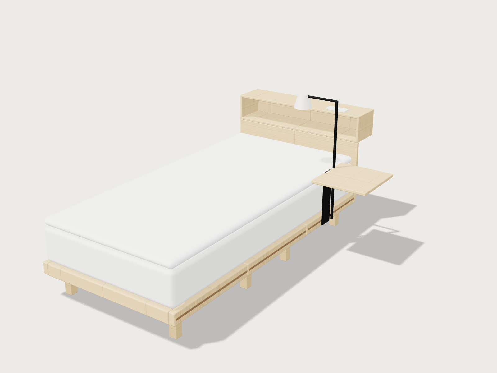 |
| C2-02 | ミニマル | SEN | レールは、影の線になる | 本体 44,800円 | 竹集成材（ライト）＋黒の細い金物 | 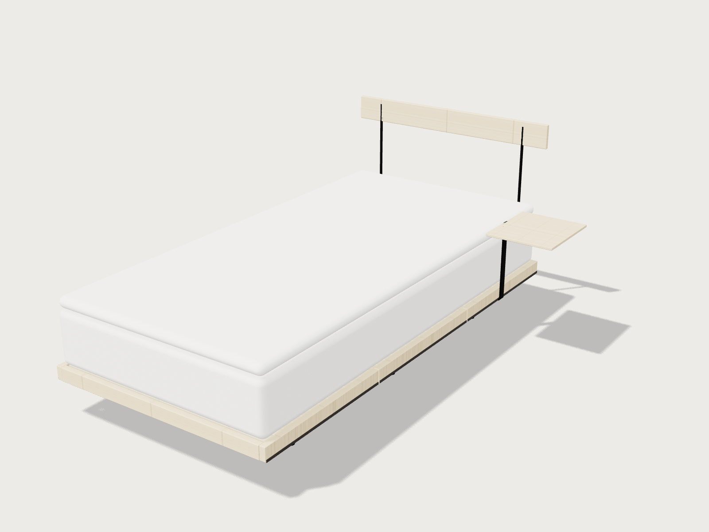 |
| C2-03 | プレミアム | YADO | 家の寝室を、いい宿の一室にする | 本体 49,800円（一式 79,800円） | 炭化竹集成材＋グレージュのファブリック | 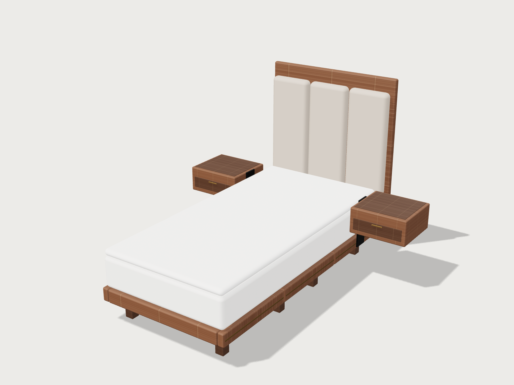 |
| C2-04 | トレンド | TSUKI | 竹のベッドに、布を着せる | 本体 44,800円（着せ替えセット 62,800円） | 竹集成材＋グレージュのファブリック | 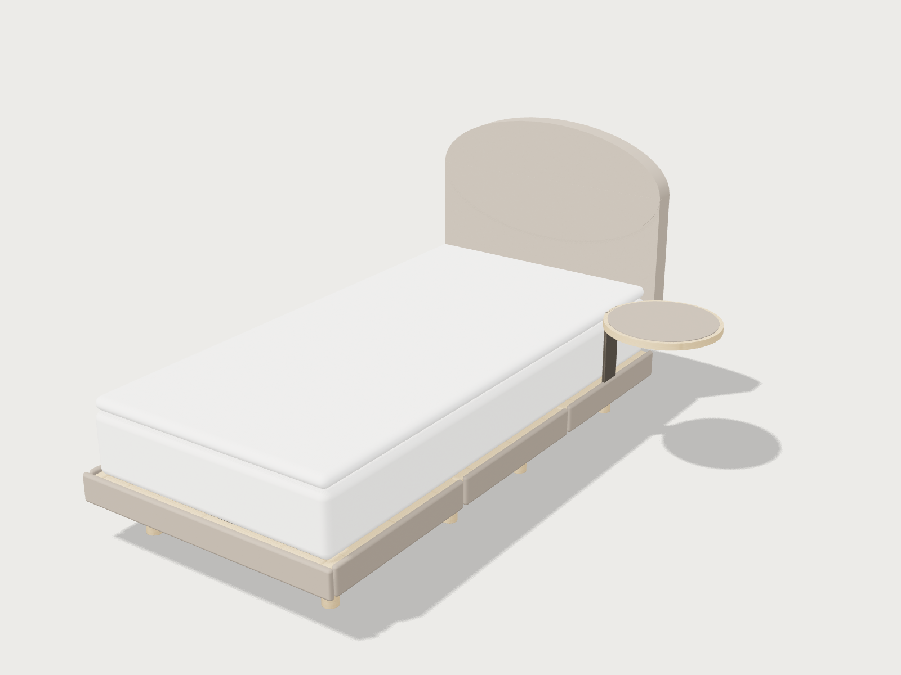 |
| C2-05 | 機能特化 | MOTO | 枕元に、電源と置き場所の全部を | 本体 44,800円（一式 61,600円） | チャコール竹＋スチール＋ナチュラル竹の棚 | 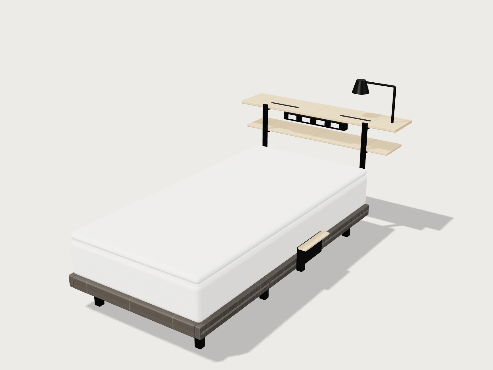 |
| C2-06 | 素材特化 | AJIRO | 竹は、編んでも使える | 本体 46,800円（一式 63,600円） | 煤竹調の竹集成材＋竹ひごの網代編み | 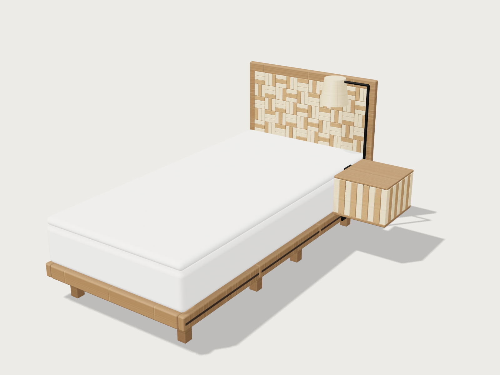 |
| C2-07 | UX改善 | MEMORI | どこに付けるか、付いたか、見れば分かる | 本体 47,800円（一式 58,760円） | ウォールナット調竹＋シャンパンアルミの帯 | 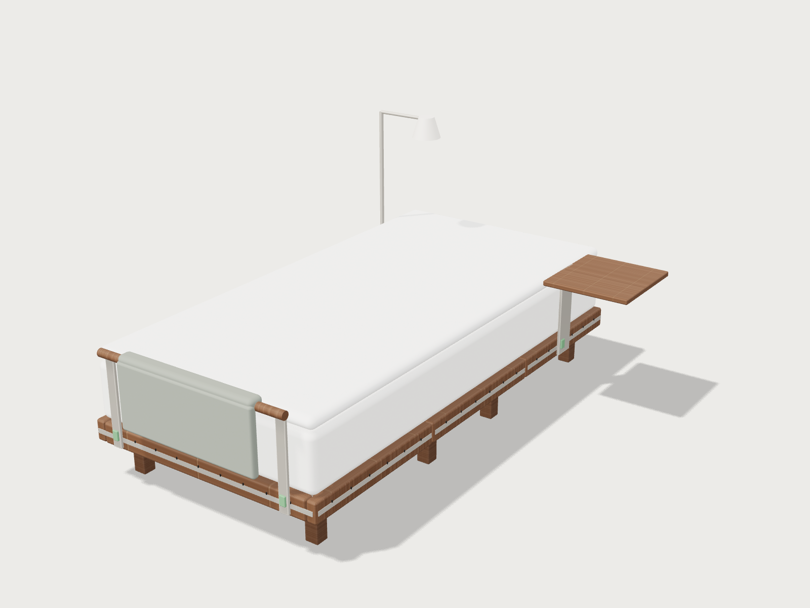 |
| C2-08 | 構造革新 | WA | フレームそのものが、レールになる | 本体 44,800円（一式 57,760円） | ブロンズのアルミ形材＋竹スラット・竹の板脚 | 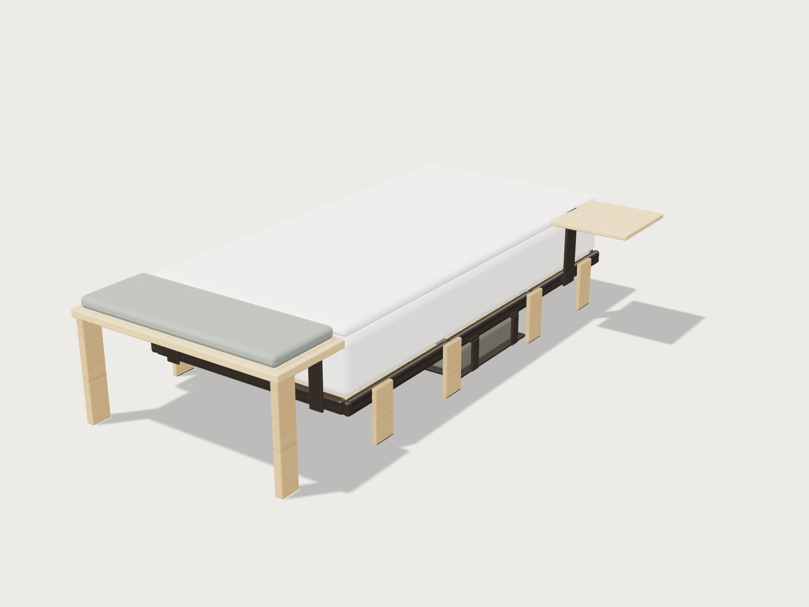 |
| C2-09 | 少し挑戦的 | TSUNAGU | ベッドの大きさも、あとから育つ | 本体 44,800円＋サイドデッキ 24,800円 | 竹集成材（2幅）＋セージのファブリック | 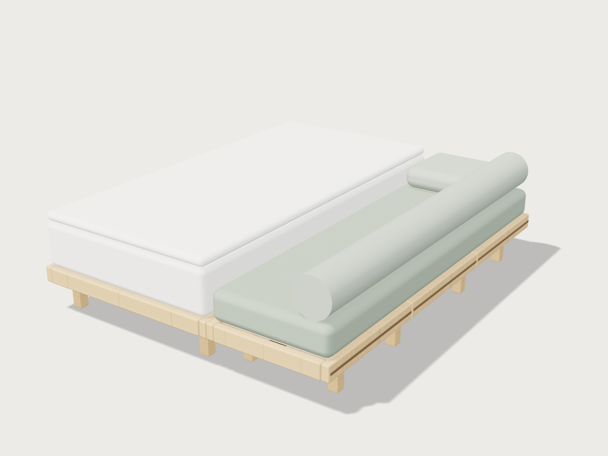 |
| C2-10 | コンセプトモデル | HEYA | ベッドが、ひとつの部屋に育つ | 本体 44,800円＋キット 参考 69,800円 | 竹集成材の柱・棚＋リネン | 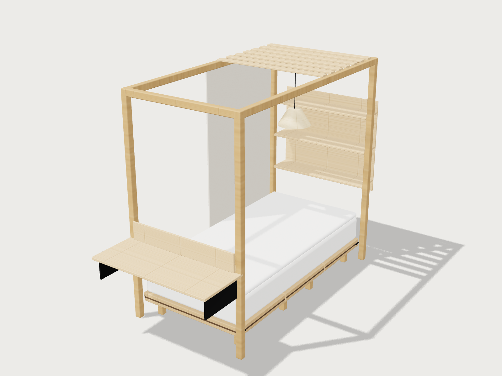 |

## 10案の差分表（似せないためのチェック）
一覧画像（アクセサリーを付けた「育った状態」で比較）: 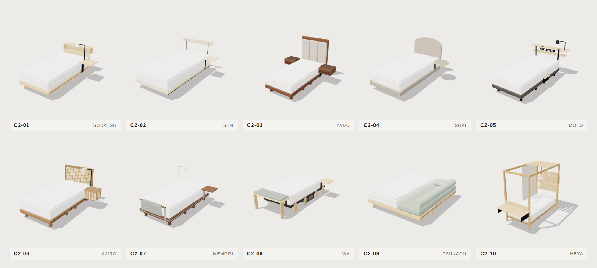

| No | 形のモチーフ | 主素材（CMF） | 価格帯（本体／一式） | 主な訴求点 | レールの見せ方 | 開梱〜就寝（本体／アクセサリー込み） | 本体梱包 3辺合計・重量【推測】 | ポジショニングマップ上の位置（横: 組立工数の少なさ／縦: 質感・価格） |
|---|---|---|---|---|---|---|---|---|
| C2-01 | 宮棚ヘッドボード＋吊りテーブル＋読書灯（定番4種） | 竹 ナチュラル＋ブロンズ | 4万円台後半／5万円台 | 必要な分だけ足せる定番体系 | 同系色の細い溝（隠す） | 4動作3分／7動作4分30秒 | 198cm・23kg | 空白 B の中心（右・中段） |
| C2-02 | 線（竹板1枚＋小板のトレー）、浮く薄板 | ライト竹＋黒の細い金物 | 4万円台前半／5万円台前半 | 余白を崩さない最小の拡張 | 下端の影の線（見えない） | 4動作2分30秒／6動作3分10秒 | 193cm・19.5kg | 空白 B の右端・中下段（入口価格） |
| C2-03 | 左右対称の3連クッション＋ナイトボックス | 炭化竹＋グレージュのブークレ | 4万円台後半／7万円台後半 | ホテルの客室を差し込みで | 真鍮調の細い線 | 4動作3分／7動作5分 | 200cm・23.5kg | 空白 B の最上部（右・上段） |
| C2-04 | アーチ＋丸テーブル＋布のスリーブ | 竹＋グレージュのフェルト布 | 4万円台前半／6万円台 | 布で着せ替える | 布で覆う | 4動作3分／7動作5分（部品10点） | 199cm・22.5kg | 空白 B の中段・若年寄り |
| C2-05 | 鉄骨の枕元ステーション（左右に張り出す棚） | チャコール竹＋黒スチール＋ナチュラル棚 | 4万円台前半／6万円台 | 電源・置き場・配線の全部 | シルバーの光る線 | 4動作3分／7動作4分30秒 | 198cm・22.5kg | 空白 B の中段（機能で選ぶ層） |
| C2-06 | 網代の編み面＋竹かご | 煤竹調＋晒し／炭化の竹ひご | 4万円台後半／6万円台 | 竹工芸（集成材と編み） | 焦げ茶の溝 | 4動作3分／7動作4分30秒 | 198cm・22.5kg | 空白 B の上段（素材で選ぶ層） |
| C2-07 | 目盛りの帯＋緑のロックタブ＋フットバー | ウォールナット調竹＋シャンパンアルミ | 4万円台後半／5万円台後半 | 付ける位置・ロックが見える | 見せる（4辺・目盛り） | 4動作3分／7動作4分20秒 | 198cm・23kg | 空白 B の右端（付け外しが最も簡単に感じる） |
| C2-08 | 外周一周のアルミ形材＋外掛けの板脚＋ベンチ | ブロンズアルミ＋竹 | 4万円台前半／5万円台後半 | フレーム＝レール、脚もアクセサリー | 外枠そのもの（上下2段×4辺） | 4動作3分30秒／7動作5分（部品12点） | 195cm・18.5kg | 空白 B の中段・技術で選ぶ層 |
| C2-09 | 2台並び（本体＋半幅デッキ）＋デイベッド | 竹（2幅）＋セージの布 | 4万円台前半／＋2.5万円 | ベッドの大きさが育つ | 同系色の溝（連結にも使う） | 4動作3分／8動作6分 | 198cm・22.5kg（デッキ 160cm・14kg） | 空白 B の外側（「サイズ」という新しい軸） |
| C2-10 | 4本柱と上枠の「部屋」（本棚・ルーバー・デスク・カーテン） | ハニー竹＋リネン | 参考 11万円台（一式） | ベッドが部屋になる | 縦方向にも伸びる規格 | 4動作3分／8動作11分 | 198cm・22.5kg（門は大型便） | 空白 B のさらに外（将来・ブランド発信） |

- **重なりの確認**: 形のモチーフは10案すべて異なる。主素材は全案「竹」（企画 4-0 の指定）だが、CMF の主役は10案で重ならない（ナチュラル竹が主役なのは 01 と 09 の2案で、09 はセージの布と2台並びの形で区別）。価格帯「4万円台前半」は 02・04・05・08・09 の5案だが、本体価格を 44,800円にそろえたのは「本体はコアデッキ共通で、差はアクセサリーで出す」という②の事業モデル（本体より LTV で回収、企画 2-5）によるもので、一式の価格と訴求点は5案とも異なる。主な訴求点とレールの見せ方は10案で重ならない。
- **振れ幅**: 01（定番4種を足す、市場の中心）と、09（大きさが育つ）・10（部屋になる）の間に、「何が育つか」のスケールで明確な差がある（枕元の小物 → 寝室の家具 → ベッドのサイズ → 部屋）。
- **①との差**: ①（C1）は「開く体験・構造・たたんだ姿」の10案、②（C2）は「足していく体験」の10案で、本体のコアデッキは共通でも、主役がアクセサリーと規格にある。C1-04（白い塗装の丸い縁）と C2-04（布を後から着せる）、C1-06（丸竹）と C2-06（編み）は、同じ「トレンド・素材」の枠でも手段を変えた。

## 案C2-01 王道・市場適合型「SODATSU（そだつ）」

素の本体（アクセサリーなし）: 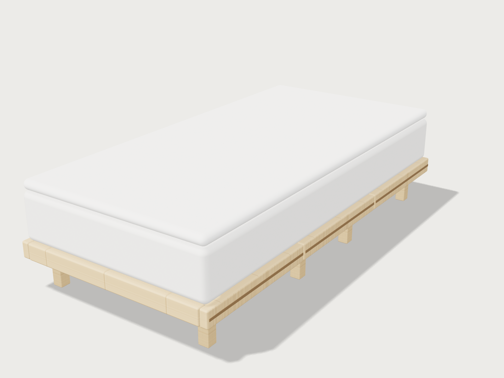 ／ 構造（アクセサリーを持ち上げ・引き離した状態。各アクセサリー下端の黒い舌がレール溝に入る）: 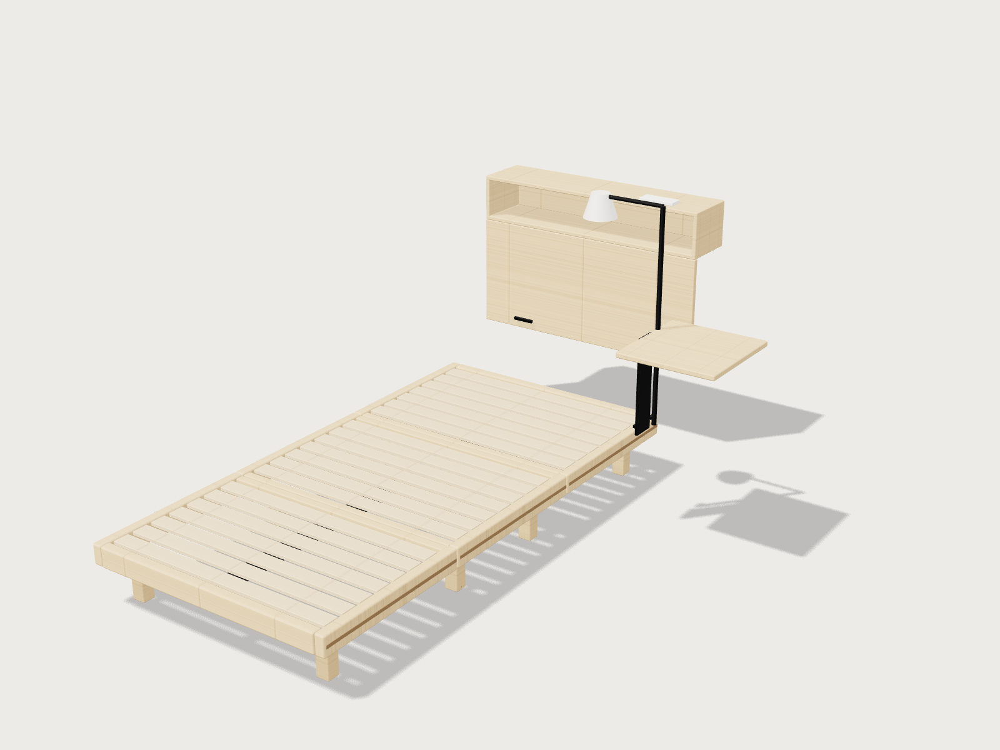 ／ 正面・側面: `C2-01-front.png`・`C2-01-side.png`

- **名称**: C2-01 王道・市場適合型「SODATSU」
- **デザインコンセプト**: 「届いた日が完成。そこから、育っていく。」企画 2-1 のコンセプトをいちばん素直に形にした案。①と同じ三つ折りの竹プラットフォームの外枠に、同系色の細いレール溝（見付け12mm）を両側面と頭側に通し、発売時の4種（宮棚＋USB・サイドテーブル・読書灯・ヘッドボード）が全部そこに「差してカチッ」で付く。
- **ターゲット**: 企画 2-2 のメインペルソナ（30歳・一人暮らし・1LDK 賃貸・在宅勤務あり、ベッドの上でスマホ・読書の時間が長い）。まず「本体＋宮棚」のスターターセットを買い、給料日にサイドテーブル・読書灯を足す人。research 結論3 のターゲットの中心。
- **解決する課題**: 「宮棚・コンセントは欲しいが、パイプベッドの見た目は嫌」「後付け棚を買ったらすのこに付かなかった」（research §11、楽天『ベッド 棚 後付け』6,006件と取付不可の注意 [S61]）。不満1位「きしみ・ぐらつき」17.1%（§6）には、アクセサリー接合部も予圧ロックで対応する。
- **形状**: 本体 外寸 W1000×L1980×H230mm（天面高。THE GOKUMIN 28cm で寝面高 約510mm）。三つ折り（1枚 660mm）。外枠 40×80mm・角R8。スラット 幅62mm×7本／枚。脚 52mm角×8本（外周から95mm内側）、床下 約150mm。**GOKUMIN RAIL**: 外枠の上端から40mm下に、開口12mm・深さ14mmの溝（内部は T 形のアルミライナー、50mmピッチのロック穴）。溝は三つ折りの継ぎ目で途切れるが、アクセサリーは1パネル内に収まる幅（最大600mm）に統一。アクセサリー: 宮棚ヘッドボード W1000×H（床から）790×D230mm（上段は開口高154mmのオープン棚、USB-C×2＋AC×2 のタップ内蔵）／サイドテーブル 天板 380×400mm・高さ 530mm（寝面と同じ高さ）／読書灯 アーム長250mm・高さ980mm。
- **素材**: 本体 竹集成材＋中空スチール梁（コアデッキ P1）／レールライナー アルミ押出（ブロンズ系アルマイト）／アクセサリーの天板・棚 竹集成材／ハンガー（吊り金具）スチール板 t3 粉体塗装／ロック舌 POM＋ステンレスばね／読書灯 スチール＋樹脂シェード
- **CMF**: Color 本体・アクセサリー ナチュラル竹 `#D9B88A`（定番）、ウォールナット調 `#6B4A33`。レール溝 ブロンズ `#8C6F4C`（竹と同系で目立たせない）。金物 マットブラック `#2A2A2A`。読書灯シェード オフホワイト `#EFE9DF`、光は電球色（2700K）。Finish 竹は艶消しウレタン（3分艶）、金物は粉体塗装の細かいシボ。
- **機能**: 本体は開くだけで完成（①と同じオートロックヒンジ・脚のバネ展開）／レールにアクセサリーを「差し込む→レバーを倒す」の2動作・1点30秒・工具0で装着、予圧でガタなし／耐荷重 アクセサリー1点10kg・本体 S 250kg（保証値）／レール位置は50mmピッチで前後に移動可。**入れなかった機能**: 引出し・ベッド下収納（本体の三つ折りと干渉し重量が増える。2弾以降の候補）、LED の色変え（research 結論2）
- **開梱〜就寝（必須）**: 本体 ①箱を倒し持ち手ベルトで引き出す ②立てたまま開く（脚がバネで起きてロック） ③床に倒す ④マットレスを載せる ＝ **4動作・約3分**。アクセサリー（3点付けた場合）⑤宮棚を頭側の溝に差してレバー ⑥サイドテーブルを側面に差してレバー ⑦読書灯を差す ＝ **＋3動作・約1分30秒**。合計 **7動作・約4分30秒・工具0・部品4点（本体1＋アクセサリー3）・1人**【推測】
- **梱包（必須）**: 本体 折りたたみ時 660×1000×230mm → 梱包 約690×1030×260mm（3辺合計 約198cm・宅急便200サイズ内）、重量 約23kg【推測】（①相当22kg＋レールライナー 約1.2kg）。アクセサリーは別箱: 宮棚 1060×260×250mm（157cm・約9kg）、サイドテーブル＋読書灯 同梱 450×420×120mm（99cm・約4kg）【推測】
- **競合優位性**: 宮棚・コンセント付きパイプベッド（12,499円〜）[S8] の「機能が固定・要らない棚も付いてくる・見た目がパイプ」に対し、必要な分だけ竹で足せる。後付け棚の「すのこに付かない」相性問題 [S61] に対し、フレーム側が規格を持つので必ず付く。コアラ ミライカスタム（59,900円〜、組立あり）[S19] に対し、本体は組立ゼロ。
- **製造方法**: 本体は①のコアデッキ工程（竹 CNC・塗装、スチール梁溶接、ヒンジのプレス＋カシメ）に、外枠の溝加工（CNC 1工程追加）とアルミライナーの圧入を足す。アクセサリー: 竹の棚は CNC＋ダボ接着（工場で完成品）、ハンガーはレーザー切断＋曲げ＋粉体塗装、ロック舌は小型射出成形（金型1型を全アクセサリーで共用）。工場での部品点数 本体 約60点／アクセサリー 各8〜15点【推測】。新規金型: ヒンジ用小型プレス型（①と共用）、ロック舌の射出型1型、アルミ押出型1型（いずれも小規模）。量産の注意点: 溝の位置精度（±0.3mm）と、三つ折りの継ぎ目でレールの段差を出さないこと。抜き差し1,000回の耐久試験（research 追加C）。
- **想定価格**: 本体 税込 **46,800円**（SD 56,800円）、アクセサリー 読書灯 3,980円／サイドテーブル 6,980円／宮棚＋USB 9,800円／ヘッドボード 12,800円、スターターセット（本体＋宮棚）54,800円。原価率 本体 約33%・アクセサリー 約30%【推測】。research 結論4「本体 S 44,800〜49,800円、はじめの一式 5.5〜6.5万円」の中央。
- **デザイン意図（根拠）**: 最も売れる確率が高い案として、research 結論5 の「②: フレームの側面と頭側に差し込むだけの共通レールを設け、宮棚・サイドテーブル・USB 照明・ヘッドボードを足せる」をそのまま形にした。宮棚＋コンセントを最初の1点にしたのは、ランキング上位の定番機能だから（research §2・§11 [S7][S8]）。レールを竹と同系色にしたのは、企画 2-6「使っていないときに目立たない」「アクセサリーなしでも完成して見える」ため。根拠: research §16 空白領域 B、§11（後付け 6,006件 [S61]）、§6 きしみ 17.1% [S24][S25]、追加C ②。SNS の「ビフォー・アフター」（素の本体→3点付き）が同じ構図で撮れる。共有プラットフォーム部品: P1・P2・P3・P4・P5・P6（P4 を本格使用）。

## 案C2-02 ミニマル「SEN（線）」

素の本体（アクセサリーなし）: 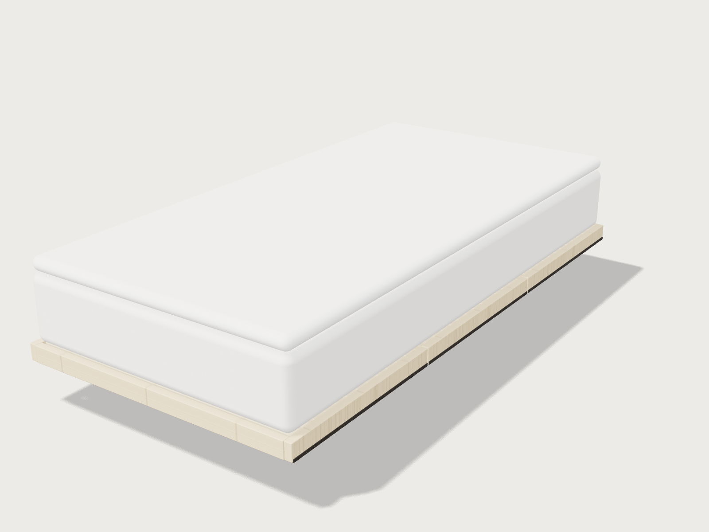 ／ 構造（アクセサリーを持ち上げ・引き離した状態。下端の影の線がレール）: 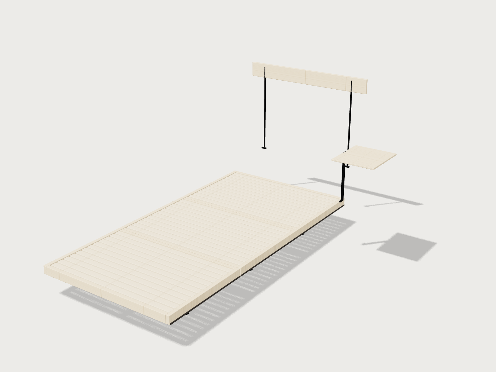 ／ 正面・側面: `C2-02-front.png`・`C2-02-side.png`

- **名称**: C2-02 ミニマル「SEN」
- **デザインコンセプト**: 「レールは、影の線になる。」外枠の下端に溝を入れ、レールそのものを「浮いた板の下の影の線」に見せる。付けるものも線と板だけ──1枚の竹板のヘッドボードと、12mm の竹の小板のサイドトレー。足していっても「線が1本増える」だけで、部屋の余白を崩さない。
- **ターゲット**: 企画 2-2 のペルソナのうち、物を減らして暮らしたい30代の一人暮らし。「宮棚は要らないが、スマホとメガネを置く場所だけ欲しい」人。ミニマル系の部屋を RoomClip で参考にする層。
- **解決する課題**: 企画 2-6 の NG「アクセサリーを付けたとき、ごちゃごちゃして見える（宮棚付きパイプベッドのような見た目）」と、必須条件「レールは使っていないときに目立たない」を最も強く解く。不満「質感・仕上げ（安っぽい）」14.3%（research §6）には、細い縁と面の精度で応える。
- **形状**: 本体 外寸 W1000×L1980×H205mm（天面高、寝面高 約485mm）。三つ折り。外枠 26×58mm・角R3 の細い枠。スラット 幅40mm×12本／枚（密に並べて面に見せる）。脚 φ32 スチール丸脚×6本（外周から160mm内側・各パネル2本）で、横から見ると板が浮いている。床下 約147mm。**GOKUMIN RAIL**: 外枠の下端（床側から5mm）に開口10mmの溝。正面から見ると枠の下の影と一体になり、溝として認識されない。アクセサリー: ラインヘッドボード 竹板 W1000×H110×t18mm（床から上端 845mm、φ12 のスチール棒2本で支持）／サイドトレー 竹板 300×340×t12mm（高さ 505mm＝寝面と同じ）。
- **素材**: 本体 竹集成材（明るいナチュラル）＋中空スチール梁／脚 スチール丸パイプ／レールライナー 黒の樹脂（PA）押出／アクセサリー 竹集成材の薄板＋スチール丸棒・平鋼（黒）
- **CMF**: Color ライトナチュラル竹 `#E2CBA6` の1色展開、金物 マットブラック `#1F1F1F`、レール溝 影色 `#3B352E`。Material 竹集成材。Finish 艶消しオイル調ウレタン（1分艶）、面取りは C1 程度で線を細く見せる。
- **機能**: 本体は開くだけで完成／アクセサリーは下端の溝に「引っ掛けて起こす」1動作で固定（ばね付きの爪が予圧をかける）／アクセサリー1点 5kg（トレー）・3kg（ヘッドボード）。**入れなかった機能**: コンセント・USB（配線が線の美しさを崩すため。スマホは枕元のトレーにワイヤレス充電器を置く前提）、宮棚、読書灯（アクセサリーは2種に絞る）
- **開梱〜就寝（必須）**: 本体 ①持ち手ベルトで引き出す ②立てたまま開く（脚がバネで起きてロック） ③床に倒す ④マットレスを載せる ＝ **4動作・約2分30秒**。アクセサリー ⑤ヘッドボードの2本の棒を頭側の溝に引っ掛けて起こす ⑥トレーを側面の溝に引っ掛けて起こす ＝ **＋2動作・約40秒**。合計 **6動作・約3分10秒・工具0・部品3点・1人**【推測】
- **梱包（必須）**: 本体 折りたたみ時 660×1000×180mm → 梱包 約690×1030×210mm（3辺合計 約193cm）、重量 約19.5kg【推測】（細い枠と6本脚で10案で最も軽い）。アクセサリー2点は1箱 1060×360×60mm（148cm・約3.5kg）【推測】
- **競合優位性**: 後付け棚（6,006件）[S61] の多くは「クランプで挟む」形でフレームの見た目を崩す。SEN はレールが見えないため、付けても外しても本体の見た目が変わらない。無印 脚付マットレス（30,900円〜）[S14] の「ヘッドボードなしの潔さ」を保ったまま、後から必要最小限だけ足せる。
- **製造方法**: 本体は①のコアデッキ工程を流用し、外枠の下端に溝（CNC）を入れて樹脂ライナーを圧入。脚はスチールパイプ＋プレスのソケット（P3 と共通）。アクセサリーは竹薄板の CNC＋塗装、スチール丸棒の曲げ＋溶接＋粉体塗装、ばね爪は板ばねプレス。工場での部品点数 本体 約58点、アクセサリー 各5〜6点【推測】。新規金型: 樹脂ライナーの押出型（小）、ばね爪のプレス型（小）。量産の注意点: 縁が細いため、張り出しのたわみは梁で受ける。薄板のトレーは反り対策に3層の直交積層にする。
- **想定価格**: 本体 税込 **44,800円**（SD 54,800円）、ラインヘッドボード 5,980円／サイドトレー 3,980円（2点セット 8,980円）。はじめの一式 **53,780円**。原価率 本体 約31%・アクセサリー 約28%【推測】。research 結論4「本体 S 44,800〜49,800円」の下限、一式は5.5万円をわずかに下回る入口価格。
- **デザイン意図（根拠）**: research 結論5「低く・薄く・浮いて見える」（§10）を②に当てはめ、レールを「影」として消した。企画 2-6 必須「レールは使っていないときに目立たない」「アクセサリーなしでも完成して見える」、NG「ごちゃごちゃして見える」への最も強い回答。アンケート最重視「デザイン」50.8% [S23] の層に向け、機能より余白を売る。根拠: research §6 質感 14.3%、§10、企画 2-6。【推測】溝が下端にあるため、アクセサリーの支点から天板までの距離が長く、10kg 級の重いアクセサリーには向かない（トレーは 5kg まで）。共有プラットフォーム部品: P1・P2・P4（位置を下端に変更）・P6。

## 案C2-03 プレミアム「YADO（宿）」

素の本体（アクセサリーなし）: 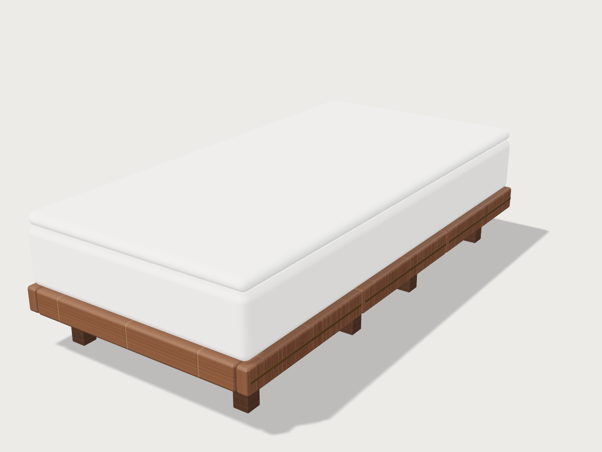 ／ 構造（ヘッドボードと左右のナイトボックスを持ち上げ・引き離した状態）: 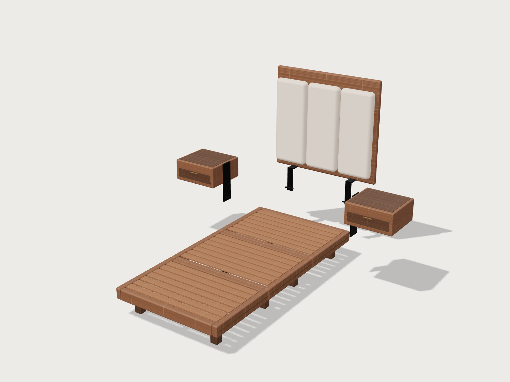 ／ 正面・側面: `C2-03-front.png`・`C2-03-side.png`

- **名称**: C2-03 プレミアム「YADO」
- **デザインコンセプト**: 「家の寝室を、いい宿の一室にする。」炭化竹の厚い枠（100mm）の本体に、ファブリック張りの3連クッションのヘッドボードと、引出し付きのナイトボックスを左右に吊る。ホテルの客室の「左右対称・枕元に引出し・背にやわらかい壁」を、工具なしの差し込みだけで完成させる。
- **ターゲット**: THE GOKUMIN の上位モデルを買う 35〜45歳の共働き夫婦・DINKs。寝室に「ホテルライク」を求め、マットレス＋フレームで10万円を超える投資をいとわない人（research 結論3「部屋をホテルのように保ちたい」）。SD で左右それぞれにナイトボックスを置く使い方。
- **解決する課題**: research §3 の推測「7万円クラスのマットレスに1万円前後のフレームは見劣りする」、不満「質感・仕上げ（高級感なし）」14.3%（§6）。ヘッドボード付きの高級ベッドは組立が重く大変（一般的な組立式は約1時間・2人推奨 [S60]）という問題を、本体は開くだけ・ヘッドボードは差し込むだけで解く。
- **形状**: 本体 外寸 W1000×L1980×H245mm（天面高、寝面高 約525mm）。外枠 50×100mm・角R12 の厚い枠。スラット 幅62mm×7本／枚。脚 64mm角×8本（外周から120mm内側）、床下 約145mm。**GOKUMIN RAIL**: 上端から50mm下、開口10mm、ブロンズ色のアルミライナー（真鍮調の細い線として見せる）。アクセサリー: ファブリックヘッドボード W1080×H（床から）1365×D135mm（竹の額縁＋3連クッション 330×820×80mm、クッションは面ファスナーで外して洗える）／ナイトボックス 440×400×H200mm・天面高 545mm、引出し1杯（有効 380×340×90mm）、左右共通。
- **素材**: 本体 炭化竹集成材（外枠は炭化竹の外皮＋内側は通常の竹集成材の中空積層）＋中空スチール梁／レールライナー アルミ押出（ブロンズアルマイト）／ヘッドボード 炭化竹集成材の額縁＋ウレタンフォーム＋ファブリック（ポリエステル×ウールのブークレ調、撥水）／ナイトボックス 炭化竹集成材、引出しの取っ手 真鍮調アルミ／ハンガー スチール t4
- **CMF**: Color 炭化竹ウォールナット `#6A4630`＋ダーク `#4A3122`（天面のインレイ・引出し前板）、ファブリック グレージュ `#B9ADA0`（別色 チャコール `#4E4B47`）、ライン・取っ手 ブロンズ `#A8844A`。金物 マットブラック（隠れる位置）。Finish 竹はオイル＋艶消しウレタン、ファブリックは起毛のブークレ調。
- **機能**: 本体は開くだけ／ヘッドボードは2本の L 形ハンガーを頭側の溝に差してレバー（1動作）／ナイトボックスは左右どちらの溝にも付く（10kg まで）／クッションは外して洗える・色替えできる（別売 6,980円）／5年保証【推測: 保証条件は社内確認】。**入れなかった機能**: コンセント内蔵（ナイトボックスの引出しの中に USB タップを置ける配線口だけ設ける）、照明（宿の雰囲気は部屋の照明に任せる）
- **開梱〜就寝（必須）**: 本体 ①持ち手ベルトで引き出す ②立てたまま開く ③床に倒す ④マットレスを載せる ＝ **4動作・約3分**。アクセサリー ⑤ヘッドボードを頭側に差してレバー ⑥ナイトボックス右 ⑦ナイトボックス左 ＝ **＋3動作・約2分**（ヘッドボードは 11kg のため壁に立てかけてから差し込む）。合計 **7動作・約5分・工具0・部品4点・1人**【推測】
- **梱包（必須）**: 本体 折りたたみ時 663×1000×245mm → 梱包 約690×1030×275mm（3辺合計 約200cm・上限ぎりぎり）、重量 約23.5kg【推測】（枠は厚いが中空積層で軽くした。それでも10案で最も重い）。ヘッドボード 1110×1000×170mm は3辺合計 228cm で宅急便を超えるため、**額縁とクッションを分けて2箱**（額縁 1110×1010×70mm＝219cm も超える）→ **額縁を上下2分割し、ダボで差し合わせる構造**にして 1110×520×80mm（171cm・約7kg）＋クッション3個 850×360×260mm（147cm・約4kg）。ナイトボックス2個 1箱 480×440×440mm（136cm・約9kg）【推測】
- **競合優位性**: コアラ（約6万円）[S18] の「組立が必要・ギシギシ・重い」に対し、本体組立ゼロ。国内の「ホテルライク」なヘッドボード付きベッドは組立に1時間前後かかる（[S60]）のに対し、差し込み式で5分。米国 Floyd のアドオン [S46]・Burrow のヘッドボードの付け替え [S47] を、日本の竹と布で上位に置く。
- **製造方法**: 本体は①のコアデッキに炭化竹の厚枠（積層接着）と溝加工を追加。ヘッドボード: 竹額縁の CNC＋ダボ接合（2分割）、クッションは合板ベース＋ウレタン＋縫製カバー（外注の縫製工場）。ナイトボックス: 竹集成材の箱組み（工場で完成品）＋スライドレール。工場での部品点数 本体 約62点、ヘッドボード 約25点、ナイトボックス 各18点【推測】。新規金型: 額縁の分割ダボ治具（小）、ハンガー用プレス型（小）。量産の注意点: 炭化竹の色ムラ選別（歩留まり）、クッションの縫製品質のばらつき、ヘッドボードの梱包が大きくなりやすいこと。
- **想定価格**: 本体 税込 **49,800円**（SD 59,800円）、ファブリックヘッドボード 17,800円、ナイトボックス 各9,800円。ホテル一式（本体＋ヘッドボード＋ナイトボックス×2）**87,200円**→セット価格 **79,800円**。原価率 本体 約34%・アクセサリー 約32%【推測】。本体は research 結論4 の上限（49,800円）に収めた（自己レビューで修正: 当初 54,800円／一式 89,800円）。枠は 100mm の見付けを保ったまま、中を中空の積層（炭化竹の外皮＋内側は通常の竹集成材）にして炭化竹の使用量を約4割減らした【推測】。一式は research の想定（5.5〜6.5万円）を超えるため、「上位ライン」として別の価格帯に置く。
- **デザイン意図（根拠）**: 企画 4-2「プレミアム案はヘッドボードをファブリック張りにしたホテル調」をそのまま採用し、アクセサリー込みで「フラッグシップの格」を最も強く見せる案にした。竹の色は塗装ではなく炭化で出す（research §8 の推測、結論5 のウォールナット調）。根拠: research 結論3（ホテルのように保ちたい）、§3（4万円以上はコアラのみ [S18][S19]）、§6 質感 14.3%、§12（Floyd・Burrow のヘッドボード [S46][S47]）。【推測】ヘッドボードの梱包が最大の弱点で、額縁の2分割が必要。共有プラットフォーム部品: P1（枠を厚く変更）・P2・P3・P4・P6。

## 案C2-04 トレンド「TSUKI（月）」

素の本体（アクセサリーなし）: 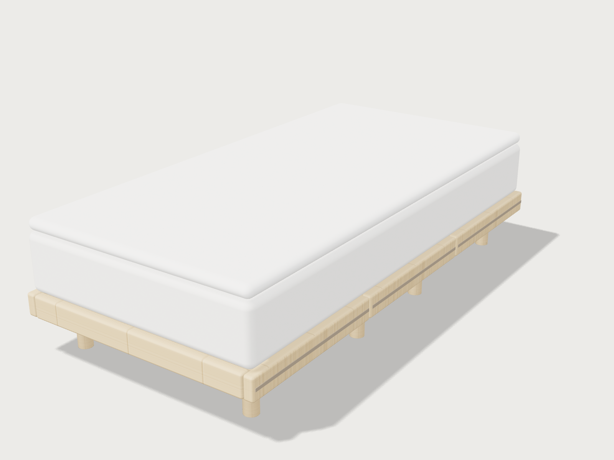 ／ 構造（布のスリーブ・アーチのヘッドボード・丸テーブルを外した状態）: 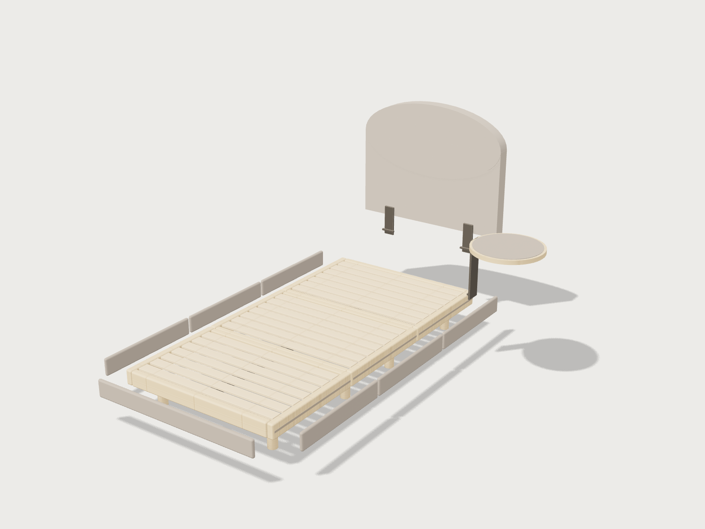 ／ 正面・側面: `C2-04-front.png`・`C2-04-side.png`

- **名称**: C2-04 トレンド「TSUKI」
- **デザインコンセプト**: 「竹のベッドに、布を着せる。」本体は竹のままで届き、レールに差し込む布のスリーブ（外枠カバー）で「張りぐるみのベッド」に着せ替える。アーチ形の布ヘッドボードと、月のような丸いサイドテーブルで、今の「グレージュ×曲線」の部屋に合わせる。季節や模様替えで布だけ替えられる。
- **ターゲット**: 26〜34歳の一人暮らし・カップル。Instagram・RoomClip で「韓国インテリア」「くすみカラー」「曲線の家具」を参考に部屋を作る人。research 結論3 のターゲットの若い側で、企画 2-4「アクセサリーでファブリック色を足して自分の色にする」の中心層。
- **解決する課題**: アンケート最重視「デザイン」50.8%、色・素材 各約7.4% [S23]。竹ベッドの「ナチュラル＝素朴・和風」の印象が合わない部屋の人にも選んでもらう。張りぐるみのベッドは「重い・組立が大変・汚れても洗えない」が一般的だが、TSUKI は布を後から差すだけで、外して洗える。
- **形状**: 本体 外寸 W1000×L1980×H235mm（天面高、寝面高 約515mm）。外枠 40×90mm・角R10。脚 φ56 の竹丸脚×8本（外周から120mm内側）、床下 約145mm。**GOKUMIN RAIL**: 上端から45mm下、開口12mm。アクセサリー: 布スリーブ（外枠カバー）厚22×高106mm、三つ折りの1パネルごとに1枚（側面6枚＋足元1枚）、裏の樹脂の爪をレールに押し込む／アーチヘッドボード W1000×H（床から）1100mm（上部は半楕円、アーチの高さ 230mm）×D80mm、布張り／丸テーブル φ430mm・高さ 525mm、天面に布のインレイ。
- **素材**: 本体 竹集成材（ナチュラル）＋中空スチール梁／スリーブ PP 押出の芯材＋ポリエステルのフェルト調ファブリック（撥水、取り外して手洗い可）／ヘッドボード 合板＋ウレタン＋ファブリック／丸テーブル 竹集成材の曲げ輪＋天板、ハンガー スチール（ウォームグレー塗装）
- **CMF**: Color 布 グレージュ `#9D9286`（スリーブ）・`#A99E91`（ヘッドボード）、別色 セージ `#9AA595`・チャコール `#4E4B47`・オートミール `#CFC4B3` の4色。竹 ナチュラル `#D6B98F`。金物 ウォームグレー `#8F877C`（黒より柔らかく）。Finish 布はフェルト調の起毛、竹は艶消しウレタン、角は大きなR（R10〜30）。
- **機能**: 本体は開くだけ／スリーブは押し込むだけ（1枚5秒）で外枠を布で包む。角に足をぶつけても痛くない／ヘッドボード・丸テーブルは差してレバー／布は4色から選べて、後から色替えできる（スリーブ一式 7,980円）。**入れなかった機能**: 照明（丸テーブルに置けるコードレスのランプで足りる）、コンセント（トレンド層はワイヤレス充電器を使う想定）
- **開梱〜就寝（必須）**: 本体 ①持ち手ベルトで引き出す ②立てたまま開く ③床に倒す ④マットレスを載せる ＝ **4動作・約3分**。アクセサリー ⑤スリーブ7枚を押し込む（1枚5秒） ⑥ヘッドボードを差してレバー ⑦丸テーブルを差す ＝ **＋3動作・約2分**。合計 **7動作・約5分・工具0・部品10点（本体1＋スリーブ7＋ヘッドボード1＋テーブル1）・1人**【推測】。スリーブは枚数が多いため、同じ形の6枚＋足元1枚にして、向きを間違えない形にする
- **梱包（必須）**: 本体 梱包 約690×1030×265mm（3辺合計 約199cm）、重量 約22.5kg【推測】。アクセサリー: スリーブ7枚 1030×680×130mm（184cm・約4kg）、アーチヘッドボード 1030×900×110mm（204cm → **200サイズを超えるため、アーチの上部を別パーツにしてダボで差し込む** 1030×620×130mm＝178cm・約7kg）、丸テーブル 460×460×90mm（101cm・約2.5kg）【推測】
- **競合優位性**: LOWYA・RASIK などデザイン重視の組立式ベッド [S21][S22] の「組立が大変」に対し、本体は組立ゼロ、布の着せ替えも工具なし。張りぐるみのベッドの「汚れても洗えない」に対し、スリーブは外して洗える【推測: 一般論、research に張りぐるみの不満データはない】。
- **製造方法**: 本体は①のコアデッキ＋溝加工。スリーブは PP 押出の芯材（1型）にファブリックを貼り、爪を一体成形。ヘッドボードは合板の CNC＋ウレタン＋縫製カバー。丸テーブルは竹の曲げ輪（ホットプレス）＋天板。工場での部品点数 本体 約58点、スリーブ 各3点、ヘッドボード 約12点、テーブル 約8点【推測】。新規金型: スリーブ芯の押出型（小）、竹の曲げ輪のプレス型（小）。量産の注意点: 布色が4色×スリーブ7枚でSKUが増える（在庫リスク）。布の色ロット差。
- **想定価格**: 本体 税込 **44,800円**、布スリーブ一式 7,980円、アーチヘッドボード 12,800円、丸テーブル 5,980円。「着せ替えセット」（本体＋スリーブ＋ヘッドボード）**62,800円**。原価率 本体 約32%・アクセサリー 約32%【推測】。research 結論4 の本体下限・一式 5.5〜6.5万円の中。
- **デザイン意図（根拠）**: research §9「2026年はオフホワイト・グレージュの壁、グレー×ブラウン、曲線的な家具」[S50] と、企画 2-4「アクセサリーでファブリック色（グレージュ・チャコール等）を足して自分の色にする」を形にした。竹のコアデッキは共通のまま、見た目の大半をアクセサリー側で変えるので、本体の SKU を増やさずに「今の気分」に追従できる。C1-04（白い塗装の丸い縁）とは違い、塗装ではなく「後から着せる布」で変える。根拠: research §9 [S49][S50]、アンケート [S23]、企画 2-4・4-2（グレージュのファブリックパネル）。共有プラットフォーム部品: P1・P2・P3・P4・P5・P6。

## 案C2-05 機能特化「MOTO（枕元）」

素の本体（アクセサリーなし）: 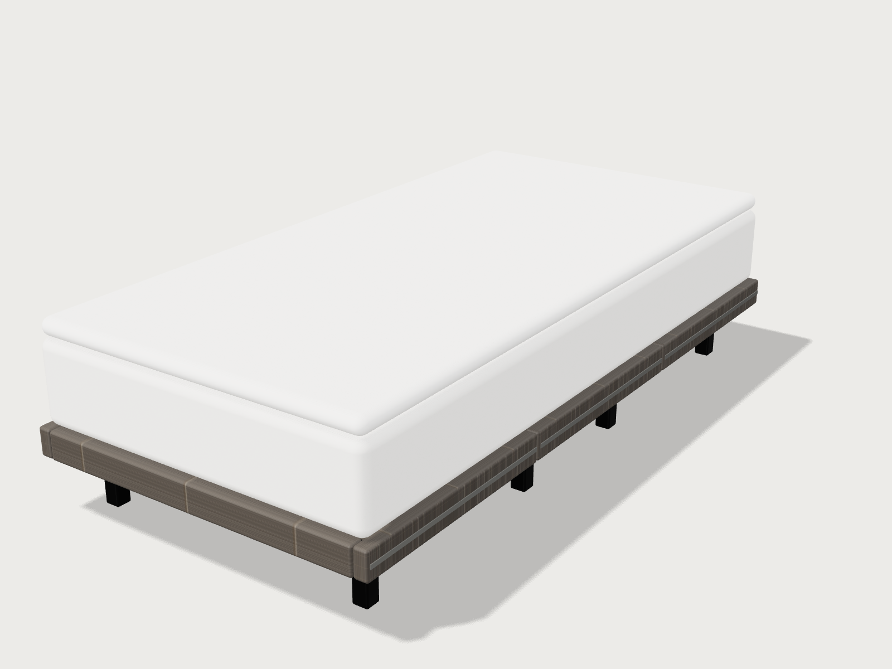 ／ 構造（枕元ステーションを持ち上げた状態。下端の黒い箱は配線ダクト、脚元は側面のフック棚）: 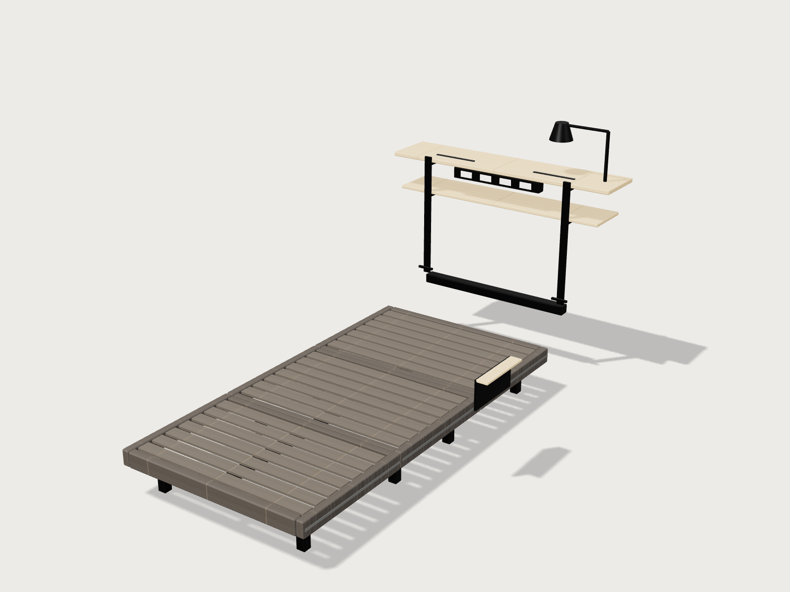 ／ 正面・側面: `C2-05-front.png`・`C2-05-side.png`

- **名称**: C2-05 機能特化「MOTO」
- **デザインコンセプト**: 「枕元に、電源と置き場所の全部を。」ランキング上位の定番「宮棚＋コンセント」を1つの機能として突き詰めた案。頭側のレールに差す鉄骨の「枕元ステーション」に、2段の竹の棚・AC×2＋USB-C×2 の電源バー・スマホを立てるスロット2本・首振りの読書灯・配線ダクトをまとめる。本体はチャコールで引き締め、竹の棚板だけを明るく見せる。
- **ターゲット**: ベッドの上で仕事・動画・読書をする在宅勤務の30代（企画 2-2 のメインペルソナの「枕元にコンセントと置き場所がほしい」を最優先する人）。2台持ちのスマホ・タブレット・イヤホンを毎晩充電する人。
- **解決する課題**: 購入理由の「機能」8.8%（research §7）と、売れ筋の共通点「宮棚・コンセント」（§2 [S7][S8]、Amazon 売れ筋の宮棚＋2口コンセント [S12]）。宮棚付きパイプベッドの「コードがぐちゃぐちゃ」「置き場所が狭い」【推測: research に直接の不満データはない】を、電源・ケーブルの通り道まで設計して解く。
- **形状**: 本体 外寸 W1000×L1980×H230mm（寝面高 約510mm）。外枠 40×80mm。脚 44mm角のスチール脚×8本（外周から110mm内側）、床下 約150mm。**GOKUMIN RAIL**: 上端から40mm下、開口12mm、シルバーのアルミライナー（チャコールの枠に細い光る線）。枕元ステーション: 幅1300mm（ベッドより左右150mmずつ張り出し、スマホ・メガネの定位置にする）×高さ（床から）833mm×奥行280mm。上段 竹 t24、下段 竹 t18（有効高160mm、本・ティッシュ）。上段にスマホスタンドのスロット 240×16mm×2。電源バー 520×60×50mm（AC×2＋USB-C×2、ベッド側を向く）。読書灯 高さ1080mm・アーム260mm・首振り。配線ダクト 860×50×60mm を頭側のデッキ下に通す。側面フック棚 300×60mm（リモコン・メガネ置き＋バッグ掛け）。
- **素材**: 本体 竹集成材（チャコールの染色）＋中空スチール梁／脚 スチール角パイプ／ステーション 支柱 スチール平鋼 40×14（粉体塗装）、棚板 竹集成材（ナチュラル）、電源バー PC/ABS（PSE 適合品を採用）、読書灯 スチール＋アルミ／レールライナー アルミ（シルバー）
- **CMF**: Color 本体 チャコール竹 `#4A4540`、棚板 ナチュラル竹 `#D6B88C`、金物・電源バー マットブラック `#1F1F1F`、レール シルバー `#9A9A96`、光は電球色（2700K、調光3段）。別色 本体ナチュラル×金物ブラック。Finish 竹は艶消しウレタン、金物は粉体塗装の細かいシボ。
- **機能**: 本体は開くだけ／ステーションは左右2本の支柱をレールに差してレバー（1動作）、コンセントは電源バーから1本だけ壁へ／スマホスロット（ケーブルを下段に通して充電しながら立てる）／首振りの読書灯（ステーションの左右どちらにも差し替え可）／配線ダクトでコードを床に垂らさない／ステーション耐荷重 上段 10kg・下段 8kg。**入れなかった機能**: ワイヤレス充電の内蔵（規格の更新が早く古びる。スロットに市販品を置く）、引出し、LED の色変え（research 結論2）
- **開梱〜就寝（必須）**: 本体 ①持ち手ベルトで引き出す ②立てたまま開く ③床に倒す ④マットレスを載せる ＝ **4動作・約3分**。アクセサリー ⑤ステーションを頭側に差してレバー ⑥電源プラグを壁に挿す ⑦フック棚を側面に差す ＝ **＋3動作・約1分30秒**（ステーションは工場で組立済み、8.5kg）。合計 **7動作・約4分30秒・工具0・部品3点・1人**【推測】
- **梱包（必須）**: 本体 梱包 約690×1030×260mm（3辺合計 約198cm）、重量 約22.5kg【推測】（スチール脚で竹脚より少し重い）。ステーション 1360×340×120mm（182cm・約9.5kg）、読書灯・フック棚は同梱【推測】
- **競合優位性**: 楽天の「USB＋2口コンセント 2段宮棚パイプベッド」（12,499円〜・1,427件）[S8] と Amazon の宮棚＋コンセント＋引出し [S12] は、機能は同じでも「パイプの見た目・組立・きしみ」がある。MOTO は本体組立ゼロ・竹の質感・配線の整理で上位に置く。宮棚が要らなくなったら外せる（固定式にはできない）。
- **製造方法**: 本体は①のコアデッキ＋チャコール染色＋溝加工。ステーション: 平鋼のレーザー切断・曲げ・溶接・粉体塗装（工場で完成品）、竹棚板の CNC、電源バーは既製の PSE 適合タップを専用ケースに収める（ケースは射出成形の小型型1型）、読書灯は OEM。工場での部品点数 本体 約58点、ステーション 約30点【推測】。新規金型: 電源バーケースの射出型（小）。量産の注意点: 電気用品安全法（PSE）への適合と、床置きしないステーションの支柱の曲げ剛性（上段に10kg＋肘をつく荷重）。
- **想定価格**: 本体 税込 **44,800円**、枕元ステーション（電源バー・読書灯込み）**16,800円**、フック棚 2,980円。はじめの一式 **61,600円**。原価率 本体 約32%・ステーション 約38%【推測: 電装品の分が高い】。research 結論4 の一式 5.5〜6.5万円の中。
- **デザイン意図（根拠）**: 「最も求められている機能」を research §2・§11 の「宮棚・コンセント・USB が当たり前の機能になった」[S7][S8] と判断し、それを1点で突き抜けさせた。01 の宮棚が「箱」なのに対し、05 は「鉄骨＋板＋電源＋配線」で、機能を見せる道具として作る。張り出し幅 1300mm は、サイドテーブルを別に買わなくても枕元に置き場所ができるようにするため。根拠: research §2・§7・§11、結論1「⑤宮棚・コンセントなど枕元の便利さ」、競合 [S8][S12]。【推測】電装品を持つため、アクセサリーの中で原価率が最も高い。共有プラットフォーム部品: P1・P2・P3・P4・P6。

## 案C2-06 素材特化「AJIRO（網代）」

素の本体（アクセサリーなし）: 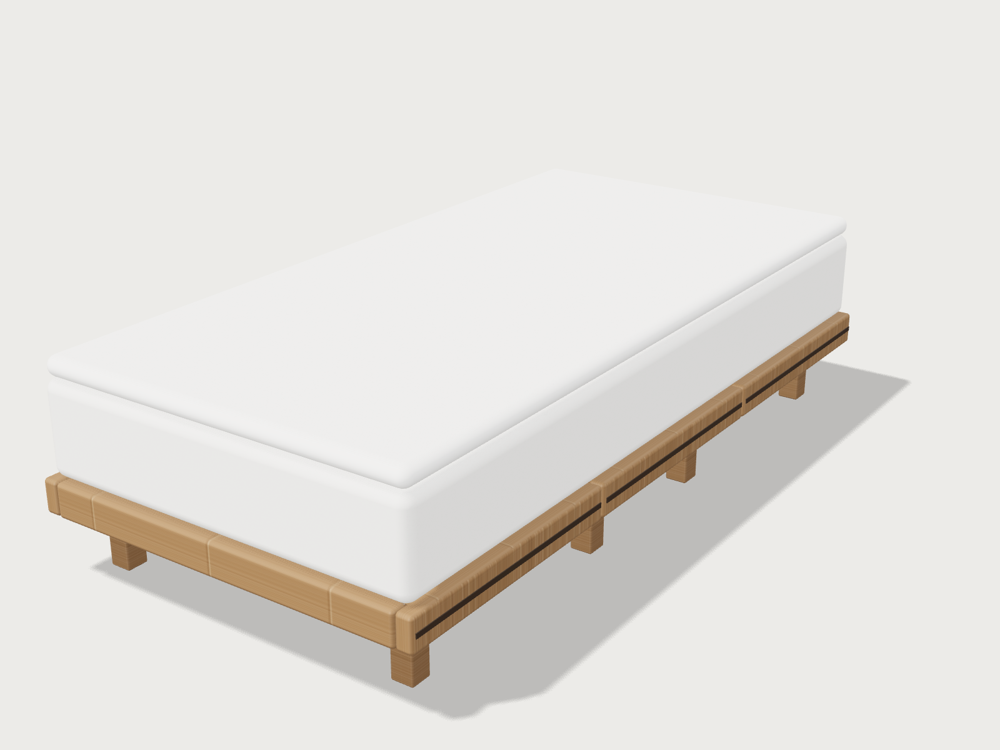 ／ 構造（網代のヘッドボード・竹かごのナイトボックス・竹編みシェードの灯りを外した状態）: 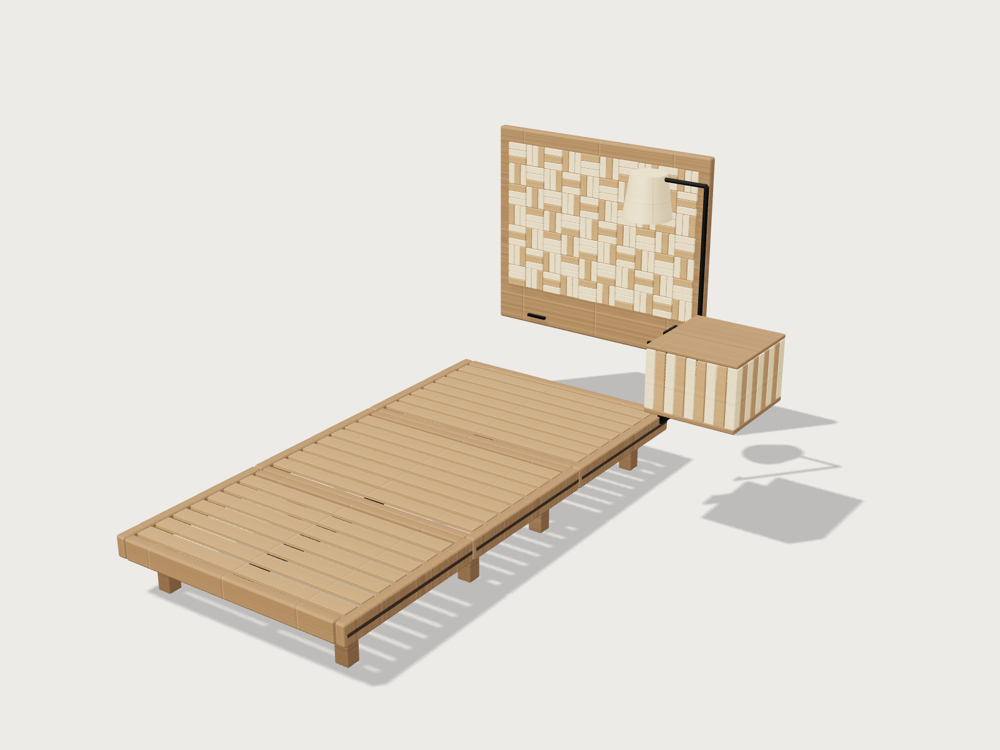 ／ 正面・側面: `C2-06-front.png`・`C2-06-side.png`

- **名称**: C2-06 素材特化「AJIRO」
- **デザインコンセプト**: 「竹は、編んでも使える。」本体は煤竹（すすだけ）調の竹集成材、アクセサリーはすべて竹を「編む」技法で作る。網代編みのヘッドボード、竹かごのナイトボックス、竹ひごのランプシェード。竹の「集成材（固い面）」と「編み（やわらかい面）」の2つの表情を1台に持たせ、アクセサリーを足すほど竹の工芸品に近づく。
- **ターゲット**: 素材で選ぶ層。天然素材・手仕事・サステナブルに価値を感じる 30〜45歳（和モダン・北欧×和の部屋、古民家リノベ、旅館好き）。海外（米国の日本的な家具を好む層 [S45]）への展開も視野。
- **解決する課題**: 不満「質感・仕上げ（安っぽい）」14.3%（research §6）と、research §8 の推測「桐・パインの安いすのこと見分けがつかない見た目を避ける」。竹の強みを「強度」（集成材）だけでなく「編める・しなる・通気する」まで広げ、竹製家具市場の成長（年9.4%予測 [S51]）を GOKUMIN の素材資産として取りにいく。
- **形状**: 本体 外寸 W1000×L1980×H230mm（寝面高 約510mm）。外枠 42×84mm・角R10。脚 56mm角×8本（外周から105mm内側）、床下 約146mm。**GOKUMIN RAIL**: 上端から42mm下、開口12mm、焦げ茶の樹脂ライナー。アクセサリー: 網代ヘッドボード W1000×H（床から）1000×D36mm（竹集成材の額縁＋市松網代の編み面 910×約650mm、90mm角の升に竹ひご3本を縦横交互に編む）／竹かごナイトボックス 360×380×H260mm・天面高 520mm（側面は竹ひごの縦編み、天板は集成材）／竹編みシェードの読書灯 シェード φ190×H170mm・高さ1000mm。
- **素材**: 本体 竹集成材（煤竹調の熱処理）＋中空スチール梁／ヘッドボードの編み面 竹ひご（幅28mm・厚1.2mm、晒し竹と炭化竹の2色）を網代編み→裏に不織布を貼って合板の額縁にはめる／ナイトボックス 竹ひごの縦編み＋竹集成材の天板・底板／シェード 竹ひごの巻き編み／ハンガー・灯りの支柱 スチール（黒）
- **CMF**: Color 本体 煤竹調 `#8B6A48`、編み 晒し竹 `#E0C89C`＋炭化竹 `#A9845A` の2色、金物 マットブラック `#2A2A2A`、灯りは電球色（2700K、シェード越しに編み目の影が落ちる）。Finish 本体は艶消しウレタン、編み面は無塗装に近い植物オイル（手触りを残す）。
- **機能**: 本体は開くだけ／アクセサリーは差してレバー（共通）／網代の編み面は通気し、壁側の結露を防ぐ【推測】／ナイトボックスは中が見えにくい編みで、充電ケーブルを通す隙間がある。**入れなかった機能**: 電源（素材の表情を優先。電源タップはナイトボックスの中に置ける）、引出し（かごの口から出し入れ）
- **開梱〜就寝（必須）**: 本体 ①持ち手ベルトで引き出す ②立てたまま開く ③床に倒す ④マットレスを載せる ＝ **4動作・約3分**。アクセサリー ⑤ヘッドボード ⑥ナイトボックス ⑦読書灯 をそれぞれ差してレバー ＝ **＋3動作・約1分30秒**。合計 **7動作・約4分30秒・工具0・部品4点・1人**【推測】
- **梱包（必須）**: 本体 梱包 約690×1030×260mm（3辺合計 約198cm）、重量 約22.5kg【推測】。ヘッドボード 1030×800×70mm（190cm・約6kg、上端から下のハンガー部は折りたたみ式にして高さを抑える）、ナイトボックス＋読書灯 同梱 420×420×300mm（114cm・約3.5kg）【推測】
- **競合優位性**: 国内上位の素材は桐・パイン・スチール＋木 [S10][S19][S20]。竹の編みを家具の面として使う量産ベッドは、調べた範囲の競合に見当たらない（research §8・§14）。米国 Thuma の「日本式継手」が高価格の象徴になっている [S45] のと同じ文脈で、「日本の竹工芸」を工具なしのアクセサリーとして提供する。
- **製造方法**: 本体は①のコアデッキ（熱処理竹）＋溝加工。編み面: **天井材・内装材として量産されている既製の竹網代シート**（不織布で裏打ち済みのロール・定尺品）を仕入れ、定尺に切って額縁にはめ込む（自己レビューで修正: 当初は手編みで、月産数と品質のばらつきが量産の壁だった）。2色の市松は、晒しと炭化の竹ひごを使ったシートを指定する【推測: 仕様どおりのシートの調達可否は未確認】。ナイトボックス: 竹ひごの縦編みを機械で編んだ既製のかご材＋集成材の天板・底板。工場での部品点数 本体 約58点、ヘッドボード 約12点（編み面は1部品として数える）【推測】。新規金型: なし（治具のみ）。量産の注意点: 網代シートの色ロット差、竹ひごのカビ・虫対策（熱処理・防カビ処理の指定）、シートの切り口のほつれ（額縁の溝で押さえる）。
- **想定価格**: 本体 税込 **46,800円**、網代ヘッドボード 16,800円、竹かごナイトボックス 9,800円、竹編みの読書灯 6,980円。はじめの一式（本体＋ヘッドボード）**63,600円**。原価率 本体 約33%・編みのアクセサリー 約34%【推測: 既製の網代シートを使う場合】。research 結論4 の本体・一式の範囲内。
- **デザイン意図（根拠）**: 素材そのものを価値にするため、GOKUMIN の竹を「集成材」と「編み」の2つで見せた。research §8「竹は GOKUMIN の素材資産」「竹の見せ方で安いすのこと差をつける」を、形ではなく技法で差別化する。C1-06（丸竹を並べる）とは違い、アクセサリー側で竹の工芸性を足していく構成で、本体の量産性は保つ。根拠: research §8 [S6][S51]、§6 質感 14.3%、§12 Thuma [S45]。【推測】既製の網代シートを使う前提で量産性を確保したが、「手仕事の竹工芸」という物語とは少しずれる。手編みの限定品（上位版）を別に用意する案もある。共有プラットフォーム部品: P1・P2・P3・P4・P6。

## 案C2-07 UX改善「MEMORI（目盛り）」

素の本体（アクセサリーなし。明るいレールに100mm ごとの目盛り）: 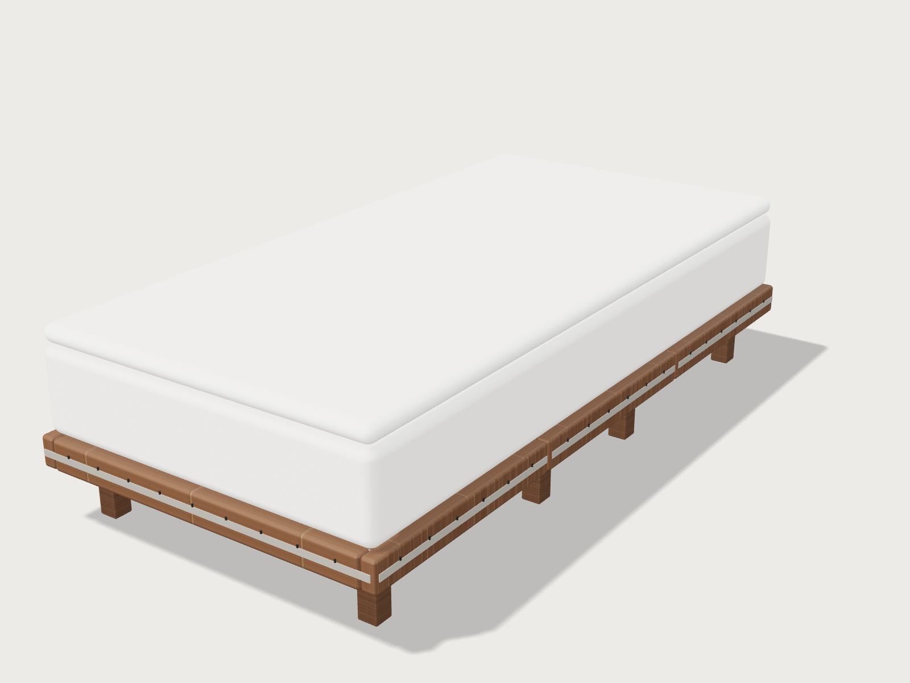 ／ 構造（アクセサリーを持ち上げた状態。緑のタブがロック表示）: 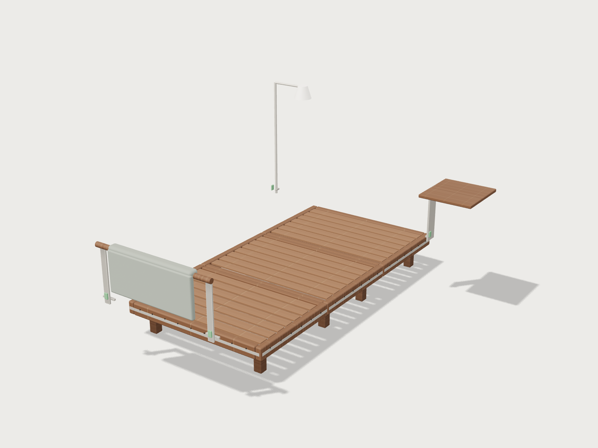 ／ 正面・側面: `C2-07-front.png`・`C2-07-side.png`

- **名称**: C2-07 UX改善「MEMORI」
- **デザインコンセプト**: 「どこに付けるか、見れば分かる。付いたか、見れば分かる。」レールをあえて明るいアルミの帯にして「見せる規格」にし、100mm ごとの目盛り・4辺（足元も）のレール・緑色のロック表示で、説明書なしで付け外しできるようにした。付ける・動かす・外す・左右を入れ替える、の流れの迷いをなくすことに集中した案。
- **ターゲット**: 企画 2-2 のサブターゲット「同棲・結婚で SD にするカップル」（左右でアクセサリーを別々に選ぶ・入れ替える）と、家具の組立が苦手な人。説明書を読まない人、「本当にロックできているか不安」な人。
- **解決する課題**: 不満「組立の手間・精度（穴が合わない・説明書が分かりにくい）」14.3%（research §6 [S24]）を、アクセサリーの付け外しで再発させない。research 追加C のリスク「アクセサリーの接合部がきしみの原因になる（緩みの不満）」を、ロック状態の見える化で予防する。企画 4-2「UX改善は『レールの位置を目盛りで合わせられる』『ロック状態が色で分かる』」をそのまま採用。
- **形状**: 本体 外寸 W1000×L1980×H230mm（寝面高 約510mm）。外枠 42×84mm・角R10。脚 54mm角×8本（外周から100mm内側）、床下 約146mm。**GOKUMIN RAIL**: 上端から42mm下、見付け18mm の明るいアルミ帯（中央に開口10mm の溝）を**両側面・頭側・足元の4辺**に通す。帯の上端に100mm ごとの刻み（左右対称の位置に同じ目盛り）。アクセサリー: サイドテーブル 天板 360×380mm・高さ 530mm／読書灯（左側）高さ1000mm・アーム240mm／フットバー（足元のブランケット掛け）W820×高さ520mm・φ32 の竹丸棒。全アクセサリーのロックレバーに 26×40mm の緑のタブ（ロックすると帯の上に出る・外すと隠れる）。
- **素材**: 本体 竹集成材（ウォールナット調の熱処理＋着色）＋中空スチール梁／レール帯 アルミ押出（ナチュラルアルマイト、刻みはレーザーマーキング）／アクセサリー 竹集成材＋アルミのハンガー／ロックタブ ガラス入り PA（緑の原着）／フットバー 竹集成材の丸棒
- **CMF**: Color 本体 ウォールナット調竹 `#6B4A33`、レール帯・ハンガー シャンパンアルミ `#CFCAC0`、目盛り `#2A2622`、ロックタブ セージグリーン `#6F9A74`（信号の緑より落ち着いた色で、寝室でうるさくしない）、ブランケット例 `#8A8F86`。Finish 竹は艶消しウレタン、アルミはヘアライン。
- **機能**: 本体は開くだけ／**目盛り**で左右のアクセサリーの位置をそろえられる（サイドテーブルを左右対称に付ける等）／**4辺レール**で足元にもフットバー・トレーを付けられる／**ロックの見える化**（緑が出ていればロック済み、隠れていれば未ロック）／**片手レバー**（もう片方の手でアクセサリーを持ったまま操作）／アクセサリーは左右共通で入れ替え可能。**入れなかった機能**: 電源（本案は付け外しの体験に集中。電源は C2-05 のステーションが共通レールで付く）
- **開梱〜就寝（必須）**: 本体 ①持ち手ベルトで引き出す ②立てたまま開く ③床に倒す ④マットレスを載せる ＝ **4動作・約3分**。アクセサリー ⑤サイドテーブル ⑥読書灯 ⑦フットバー を目盛りに合わせて差し、緑を確認 ＝ **＋3動作・約1分20秒**。合計 **7動作・約4分20秒・工具0・部品4点・1人**【推測】
- **梱包（必須）**: 本体 梱包 約690×1030×260mm（3辺合計 約198cm）、重量 約23kg【推測】（4辺のアルミ帯で ＋0.6kg）。アクセサリー: サイドテーブル＋読書灯 450×420×120mm（99cm・約4kg）、フットバー 880×120×120mm（112cm・約2.5kg）【推測】
- **競合優位性**: 後付け棚 [S61] は「付くかどうか分からない」「締め付けが緩む」。MEMORI は付く場所が見え、ロック状態が見える。無印の脚付マットレスの「ボルトの締め不足できしむ」[S55] のような、締め付け不足による不具合を構造的に起こしにくい。Floyd [S46] のアドオンは付け外しに工具が要らないが、位置合わせやロックの確認は利用者任せ【推測】。
- **製造方法**: 本体は①のコアデッキ＋4辺の溝加工。レール帯はアルミ押出（1型）＋レーザーマーキング＋アルマイト、溝に圧入。ロックタブは射出成形（2色成形ではなく原着の単色部品）で、レバーに組み込む（全アクセサリー共通部品）。工場での部品点数 本体 約64点、アクセサリー 各8〜12点【推測】。新規金型: アルミ押出型（小）、ロックレバー＋タブの射出型2型（小）。量産の注意点: 目盛りの位置を三つ折りの継ぎ目をまたいで合わせる（治具で位置決め）、アルミ帯の傷（梱包で保護）。
- **想定価格**: 本体 税込 **47,800円**、サイドテーブル 6,980円、読書灯 3,980円、フットバー 4,980円。はじめの一式（本体＋サイドテーブル＋読書灯）**58,760円**。原価率 本体 約34%・アクセサリー 約30%【推測】。research 結論4 の範囲内。
- **デザイン意図（根拠）**: 使う流れの不満を体験設計で解く案。research §6「組立の手間・精度 14.3%」「きしみ（うち半数が緩み）17.1%」は、アクセサリーの付け外しでも起こりうる。そこで「位置（目盛り）」「確認（緑のタブ）」「片手操作」の3つを規格側に持たせた。レールを隠すのではなく見せるのは、01・02 と逆の判断で、「規格があること自体」を商品の説明にする（EC のサムネイルでも伝わる）。根拠: research §6 [S24][S55]、追加C ② のリスク、企画 4-2 UX改善。共有プラットフォーム部品: P1・P2・P3・P4（4辺に拡張）・P6。

## 案C2-08 構造革新「WA（環）」

素の本体（アクセサリーなし。外周のアルミ形材がそのままレール、脚も外から掛けている）: 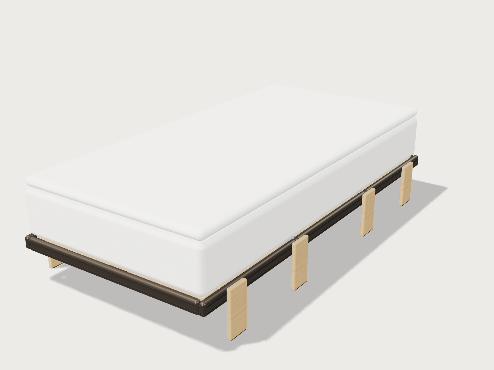 ／ 構造（フットベンチ・サイドテーブルを持ち上げ、ベッド下トレーを横に引き出した状態）: 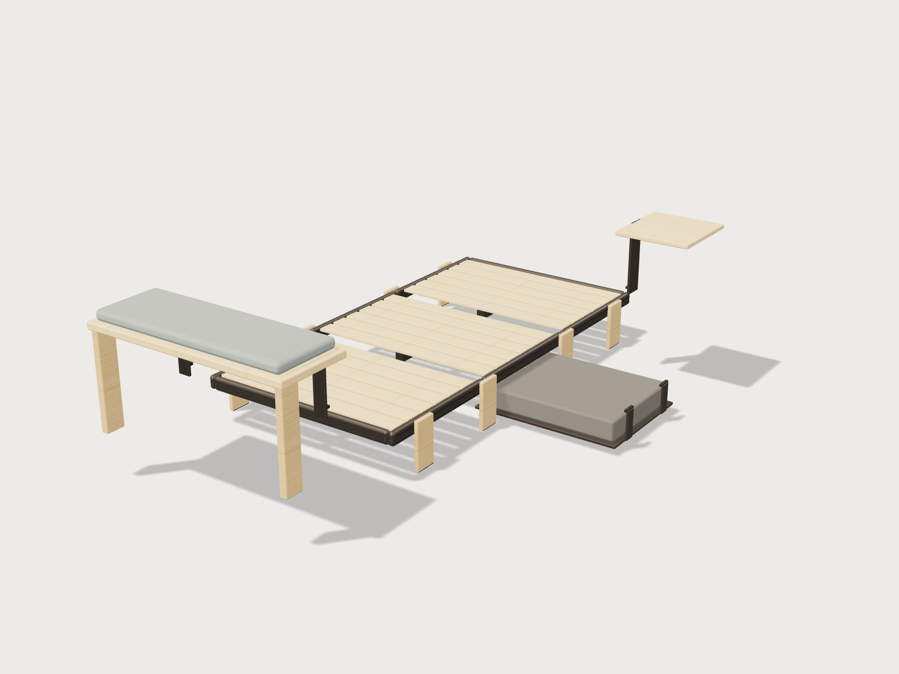 ／ 正面・側面: `C2-08-front.png`・`C2-08-side.png`

- **名称**: C2-08 構造革新「WA」
- **デザインコンセプト**: 「フレームそのものが、レールになる。」外枠を「上下2本の溝を持つアルミ押出形材」1種類で作り、ベッドの外周を一周させる。竹のスラットはその内側に落とし込むだけ。溝を後から彫るのではなく、形材の断面に最初から持たせるので、4辺どこにでも・上下2段で付く。**脚さえもレールに掛けるアクセサリー**にして、脚の位置・本数・高さを後から変えられる。
- **ターゲット**: 「長く使い倒したい」「引越しのたびに部屋に合わせて変えたい」30代。足元にベンチ、ベッド下に収納、枕元にテーブルと、ベッドまわりを1つのシステムで組み上げたい人。DIY・ガジェット好き、規格や拡張性に価値を感じる人。
- **解決する課題**: research 追加C ② のリスク「規格を増やしすぎると本体の価格が上がる」「アクセサリーの在庫リスク」を、構造側で解く。溝加工の追加工程をなくし、竹の外枠・スチール梁・溝加工の3つを「アルミ形材1本」にまとめて部品と工程を減らす。企画 4-2「構造革新はレールを外枠全周に回して『どこにでも付く』、または脚ソケットにもアクセサリーを付けられる」の両方を満たす。不満「重い」14.3%（§6）にはアルミで軽くして応える。
- **形状**: 本体 外寸 W1000×L1980×H225mm（寝面高 約505mm）。外枠 アルミ形材 30×64mm（角R14、上下に開口8mm の溝2本）を一周。三つ折り（形材の中にヒンジを内蔵）。スラット 竹 幅80mm×6本／枚。脚 竹集成材の板脚 22×110mm×8枚（外枠の外側に下段の溝で掛ける。位置は外周のどこでも可）、床下 約160mm（脚が外にあるので床下が広く、ロボット掃除機が脚を避けなくてよい）。アクセサリー: フットベンチ W1000×D360×座面高 510mm（前脚2本は床に着地、後ろは足元の上段溝に掛ける。座面はクッション付き）／ベッド下トレー 700×540×H114mm（側面の下段溝から吊り、横に引き出す。布のボックス付き）／サイドテーブル 360×380mm・高さ 525mm。
- **素材**: 外枠 アルミ押出形材（ブロンズアルマイト）／ヒンジ 形材内蔵のステンレス軸＋POM ブッシュ／スラット 竹集成材／中央の梁 スチール角パイプ（中央パネルのみ）／脚 竹集成材の板＋アルミのフック／ベンチ 竹集成材＋ウレタンクッション（布）／トレー スチール板＋布ボックス
- **CMF**: Color 外枠 ブロンズ `#5B5249`、竹 ナチュラル `#D9B88A`（スラット・脚）/`#C9A577`（脚）、溝 `#2A2622`、クッション セージグレー `#8E948C`、布ボックス `#6F6A62`。別色 外枠シルバー×竹。Finish アルミはマットアルマイト（指紋が目立ちにくい）、竹は艶消しウレタン。
- **機能**: 本体は開くだけ（形材内蔵ヒンジ）／**上下2段の溝×4辺**＝どこにでも付く（上段: テーブル・ベンチ・ヘッドボード、下段: 脚・トレー・フック）／**脚もアクセサリー**（標準8枚、SD 連結時や重いマットレスでは10枚に増やせる、高さ違いの脚に替えられる）／ベッド下トレーは横に引き出せる。**入れなかった機能**: ヘッドボード（発売時は WA 用を作らず、C2-01 などの共通アクセサリーを流用）、電源
- **開梱〜就寝（必須）**: 本体 ①持ち手ベルトで引き出す ②床に置いて開く（脚は付いていないので寝かせたまま開ける） ③脚8枚を外周の溝に掛ける（1枚5秒、位置は形材の刻印に合わせる） ④マットレスを載せる ＝ **4動作・約3分30秒**。アクセサリー ⑤フットベンチ ⑥サイドテーブル ⑦ベッド下トレー ＝ **＋3動作・約1分30秒**。合計 **7動作・約5分・工具0・部品12点（本体1＋脚8＋アクセサリー3）・1人**【推測】。脚の枚数が多い分、①の「開くだけ」より手数が増える
- **梱包（必須）**: 本体 折りたたみ時 660×1000×200mm（脚なしで薄い）→ 梱包 約690×1030×230mm（3辺合計 約195cm）、重量 約18.5kg【推測】（アルミで10案で最も軽い）。脚8枚は本体の箱の中の隙間に同梱。フットベンチ 1060×420×120mm（160cm・約8kg、前脚は折りたたみ）、トレー 740×580×130mm（145cm・約4kg）【推測】
- **競合優位性**: 後付け棚 [S61] や Floyd [S46] のアドオンは「本体に付ける場所が決まっている」。WA は外周全部が規格。タンスのゲン パレットの「金具の緩み・たわみ」[S25] に対し、ネジのない形材＋予圧のフック。ZINUS SmartBase（9.6kg・中央が沈む）[S20] のような軽量フレームの弱点を、アルミ形材の断面剛性と中央梁で補う【推測】。
- **製造方法**: アルミ押出形材（1断面、金型1型）を定尺切断 → 角のコーナーピース（ダイカスト、または樹脂）で四角に組む → 形材の中にヒンジを挿入してカシメ。竹スラットは CNC（①と共通）。脚は竹集成材の板＋アルミのフック（プレス）。工場での部品点数 本体 約40点（竹の外枠・溝加工・スチール梁の多くが不要になる）【推測】。新規金型: アルミ押出型（中規模、断面が大きく精度が要る）、コーナーのダイカスト型（中）。量産の注意点: 形材の反り・ねじれ（1,980mm 長）、ヒンジを内蔵した形材の三つ折り部の段差、アルマイトの色ムラ。①の竹フレームの工場ではなく、アルミ加工の協力工場が必要。
- **想定価格**: 本体 税込 **44,800円**、フットベンチ 14,800円、ベッド下トレー 5,980円、サイドテーブル 6,980円、交換用の高脚セット 4,980円。はじめの一式（本体＋トレー＋テーブル）**57,760円**。原価率 本体 約30%【推測: 部品・工程の削減分】。research 結論4 の範囲内。
- **デザイン意図（根拠）**: 企画 4-2 の構造革新の2つの方向（全周レール・脚ソケットにもアクセサリー）を1つの構造で同時に満たした。GOKUMIN RAIL を「外枠に追加する溝」から「外枠そのもの」に変えることで、レールのコストが本体の値上げ要因になる問題（research 追加C ②）を、逆にコスト減に変える狙い。脚を外に出すのは C2 の10案で WA だけで、床下の中央が空き、ベッド下収納（トレー）とロボット掃除機の両方に効く（research §11・③の考え方を②に応用）。【推測】竹の外枠を使わないため「竹のベッド」らしさは弱まる（Brand Fit の懸念）。根拠: research 追加C ②、§6（重い 14.3%・緩み [S25]）、§11 [S46]、企画 4-2。共有プラットフォーム部品: P2（形材内蔵に変更）・P4（外枠と一体化）・P5・P6。P1（竹の外枠）と P3（脚ソケット）は非共有。

## 案C2-09 少し挑戦的「TSUNAGU（つなぐ）」

素の本体（シングル単体）: 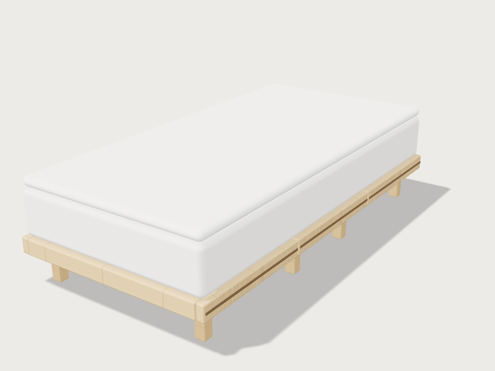 ／ 構造（サイドデッキを引き離し、コネクター3個でレールどうしをつなぐ様子）: 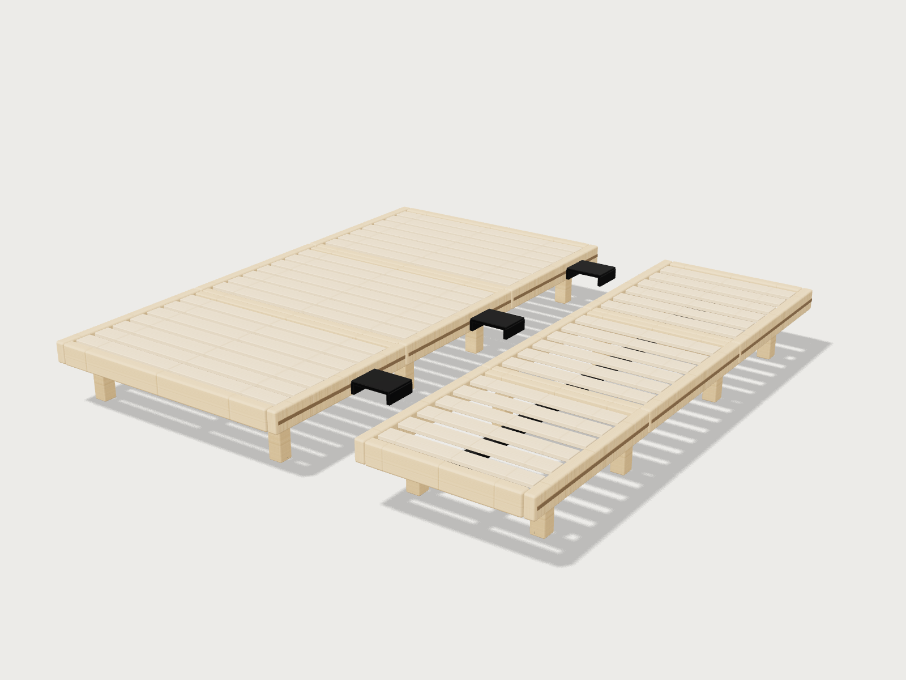 ／ 正面・側面: `C2-09-front.png`・`C2-09-side.png`

- **名称**: C2-09 少し挑戦的「TSUNAGU」
- **デザインコンセプト**: 「ベッドの大きさも、あとから育つ。」ベッドの常識「サイズは買うときに決める」を1つだけ崩す。シングルの側面レールに、幅620mm のサイドデッキ（同じ三つ折り構造の半幅ユニット）をコネクターでつなぐと、今はシングル＋デイベッド（ソファ）、2人になったら W1620mm のワイドベッドに育つ。サイドデッキ側にも同じレールがあるので、他のアクセサリーもそのまま使える。
- **ターゲット**: 企画 2-2 のサブターゲット「同棲・結婚で SD・D に買い替えたいカップル」の手前にいる人（一人暮らしの今はシングルで十分だが、数年後に2人になるかもしれない）。1LDK で「寝室兼リビング」の人（昼はデイベッドとして座る）。子どもの添い寝やペットと寝たい家庭。
- **解決する課題**: 生活の変化でベッドを買い替える無駄（企画 2-3「引越しや生活の変化で、ベッドを買い替えなくてよい」）。購入理由の「拡張・連結」5.9%（research §7）、SNS で話題の「連結できるローベッド」[S22]、Floyd のサイズ拡張 [S46]。research 申し送りの「SD の2台連結＝パーツで拡張」（企画 4-2 挑戦側）を、半幅ユニットでより小さく・安く実現する。
- **形状**: 本体 外寸 W1000×L1980×H230mm（①相当、外枠 40×80mm、脚8本、床下 約150mm）。サイドデッキ W620×L1980×H230mm（三つ折り、脚8本）。連結時 W1620×L1980mm（≒ワイドダブル相当の幅）。コネクター 150×120mm のスチール製「コ」の字の金具×3個（両方の側面レールに上から落とし込み、レバーで予圧）。デイベッド仕様: 厚150mm のクッション＋φ190mm の長いボルスター＋ピロー（布）。ワイド仕様: サイドデッキ用の半幅マットレス（THE GOKUMIN 側で用意する前提、【推測】）、またはシングル＋セミシングルの2枚並べ。
- **素材**: 本体・サイドデッキ 竹集成材＋中空スチール梁（コアデッキを幅違いで2種）／コネクター スチール t4 粉体塗装＋POM パッド（金属どうしを当てない）／クッション ウレタン＋ファブリック（撥水・カバーは洗える）
- **CMF**: Color 竹 ナチュラル `#D4B284`、レール溝 ブロンズ `#7D6446`、クッション セージ `#9AA595`＋ライトセージ `#AAB3A6`（別色 グレージュ・チャコール）、コネクター マットブラック `#2A2A2A`。Finish 竹は艶消しウレタン、布は平織り。
- **機能**: 本体は開くだけ／サイドデッキも開くだけ（同じ三つ折り）／コネクター3個を上から落としてレバー＝連結完了（ずれ・段差なし）／左右どちらにもつなげる／サイドデッキにも側面レールがあり、サイドテーブル等をワイド側の外に付け替えられる／耐荷重 本体 S 250kg、サイドデッキ 150kg【推測】。**入れなかった機能**: 高さ違いの連結（段差ができると隙間に手足が落ちるため、同じ高さのみ）、隙間を埋めるパッド（コネクターで隙間5mm以下に抑える前提、実測が必要）
- **開梱〜就寝（必須）**: 本体 ①〜④（引き出す・開く・倒す・マットレス）＝ **4動作・約3分**。サイドデッキ ⑤引き出して開き、倒す ⑥本体の横に寄せる ⑦コネクター3個を落としてレバー ⑧クッションを載せる ＝ **＋4動作・約3分**。合計 **8動作・約6分・工具0・部品6点（本体1＋デッキ1＋コネクター3＋クッション1）・1人**【推測】。**企画の目標（5分以内）を約1分超える**が、サイドデッキは後から買い足す前提で、初回はシングルの4動作・約3分
- **梱包（必須）**: 本体 梱包 約690×1030×260mm（3辺合計 約198cm）、約22.5kg【推測】。サイドデッキ 折りたたみ時 660×620×230mm → 梱包 約690×650×260mm（160cm・約14kg）、コネクター同梱。クッション類 圧縮梱包 700×400×400mm（150cm・約6kg）【推測】
- **競合優位性**: タンスのゲン パレットベッドの「連結・拡張できる」[S25] は支持されているが「金具の緩み・ささくれ・フェルト貼り」が不満。TSUNAGU はネジなし・竹の仕上げ・フェルト取り付け済み。Floyd は Twin→Queen の拡張に組立と工具不要の部材追加が要る [S46]。TSUNAGU は「開いて寄せて落とす」だけ。SD を新たに買う（49,800〜54,800円、research 結論4）より、サイドデッキの追加（下記）の方が安く、シングル本体を捨てない。
- **製造方法**: 本体は①のコアデッキ＋溝加工。サイドデッキは同じ部材・治具で幅だけ変えたコアデッキ（スラットの長さ違い）。コネクターはレーザー切断＋曲げ＋粉体塗装。工場での部品点数 本体 約60点、サイドデッキ 約45点、コネクター 各4点【推測】。新規金型: なし（コネクターはプレス型を共用）。量産の注意点: 本体とサイドデッキの天面高さを ±1mm で合わせる（段差は寝心地の不満に直結）、連結部の荷重試験（2人が中央に寝る・端に座る）、隙間の実測。
- **想定価格**: 本体 税込 **44,800円**、サイドデッキ（コネクター3個込み）**24,800円**、デイベッドクッション一式 12,800円。連結後の合計 69,600円（ワイドダブル相当）。原価率 本体 約32%・サイドデッキ 約34%【推測】。research 結論4 の本体範囲内。サイドデッキは SD を買い直すより安い価格に置く。
- **デザイン意図（根拠）**: 市場の常識「サイズは買うときに決める」を1つだけ崩し、「育つ」を大きさにまで広げた。research §16 空白領域 B（共通規格のアクセサリー追加）の中で最も印象に残る使い方で、SNS では「ベッドがソファに・ワイドに育つ」ビフォー・アフターが撮れる。研究の結論とあえて違う点: 開梱〜就寝5分以内（企画 0-1）を連結時は約1分超える。理由: サイドデッキは後から買う前提で、初回の手順はシングルだけ（約3分）のため許容した。根拠: research §7（拡張・連結 5.9%）、§13 [S22]、§12 Floyd [S46]、競合 [S25]、企画 4-2 挑戦側。共有プラットフォーム部品: P1（幅違い2種）・P2・P3・P4・P5・P6。

## 案C2-10 コンセプトモデル「HEYA（部屋）」

素の本体（アクセサリーなし）: 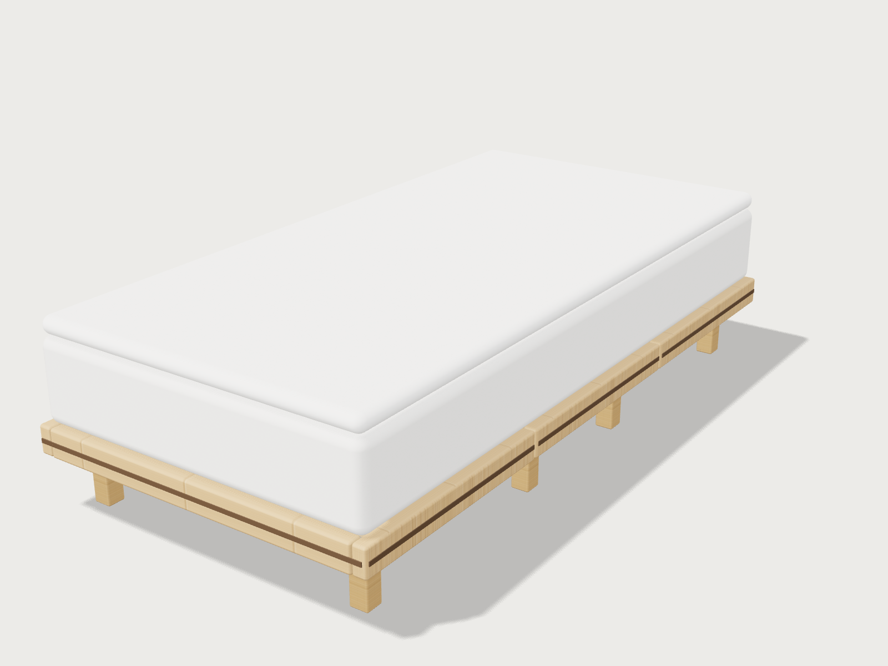 ／ 構造（4本の柱と上枠・本棚・デスクを持ち上げ、外側へ引き離した状態。柱の下の黒い舌がレールの四隅に入る）: 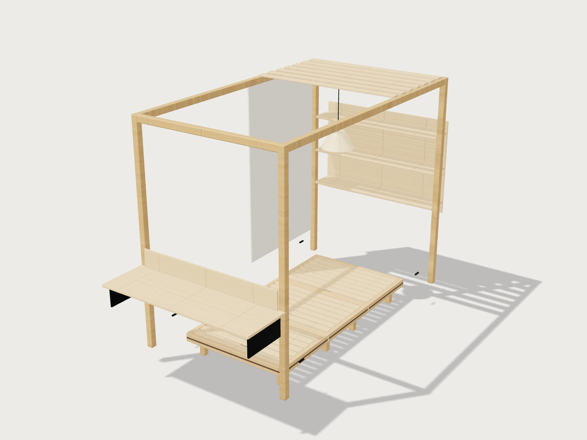 ／ 正面・側面: `C2-10-front.png`・`C2-10-side.png`

- **名称**: C2-10 コンセプトモデル「HEYA」
- **デザインコンセプト**: 「ベッドが、ひとつの部屋に育つ。」GOKUMIN RAIL の四隅に竹の柱を4本差すと、ベッドのまわりに「小さな部屋の骨組み」が立ち上がる。頭側は本棚の壁、上は竹のルーバー屋根と吊り下げの灯り、横はリネンのカーテン、足元は外向きのデスク。ワンルームの中に、寝る・読む・働くがそろった「自分だけの部屋」をつくる。数年先の、ベッドを中心にした暮らしの理想像。
- **ターゲット**: ワンルーム・1K に住む 20代後半〜30代の単身者、在宅勤務の人、シェアハウスの住人（個室の中に「こもれる場所」がほしい）。実家暮らしで自分の部屋が狭い人。企画 4-2「コンセプトモデルはベッドを中心にした小さな部屋（読書・仕事・収納が一体）」。
- **解決する課題**: 狭い部屋でベッドが面積の大半を占め、机・本棚・照明を置く場所がない【推測: research に直接のデータはない】。後付け需要（ベッドサイド棚 65,241件 [S61]）の「もっと載せたい」の行き着く先を、壁や床に頼らずベッドの上の空間で解く。
- **形状**: 本体 外寸 W1000×L1980×H230mm（①相当、4辺にレール）。柱 竹集成材 56mm角×高さ2000mm×4本（本体の四隅の外側に立て、レールに舌で固定し、床にも接地）。上枠 50×60mm で四角に結ぶ。全体の外寸 約W1116×L2176×H2018mm（ルーバー含む）。ルーバー屋根 70×18mm×7本（頭側の半分）。本棚 W1060×奥行240mm×3段（高さ760・1100・1440mm）＋背板。デスク W1116×奥行460mm・天板高 753mm（足元の2本の柱にブラケットで固定、ベッドに背を向けて座る）。カーテン リネン 1000×1700mm（左側の頭側半分）。吊り灯 竹編みシェード φ300mm。
- **素材**: 本体 竹集成材＋中空スチール梁／柱・上枠・ルーバー・本棚・デスク 竹集成材（柱は中にアルミの芯）／ブラケット スチール（黒）／カーテン リネン／灯り 竹ひごのシェード
- **CMF**: Color 竹 ハニーナチュラル `#C7A273`（柱 `#B8925F`、板 `#D3B184`）、リネン `#D8D0C2`、金物 マットブラック `#2A2A2A`、灯りは電球色（2700K）。Finish 竹は艶消しオイル調ウレタン、リネンは生成りの平織り。
- **機能**: 本体は開くだけ（他案と共通）／柱は「レールの四隅に差す＋上枠で結ぶ」だけで自立（工具0）／上枠・柱にもレールと同じ溝を持たせ、棚・灯り・カーテン・フックを高さ方向にも付けられる（規格を縦に伸ばす）／カーテンを閉めると半個室になる。**入れなかった機能**: 天井のパネル（圧迫感と火災時の安全性）、照明の色変え（research 結論2）、はしご・ロフト（安全性と耐荷重の検証が別次元になる）
- **開梱〜就寝（必須）**: 本体 ①〜④ ＝ **4動作・約3分**。部屋化（自己レビューで修正: 柱・上枠・棚をばらばらに組む手順をやめ、工場で組んだ2つの「門」にした） ⑤頭側の門（柱2本＋上枠＋本棚が一体、折りたたみ）を開いてレールの頭側の角に差す ⑥足元の門（柱2本＋上枠＋デスクが一体）を足元の角に差す ⑦側面の上枠2本を門どうしに落とし込む ⑧ルーバー・カーテン・灯りを掛ける ＝ **＋4動作・約8分**（門は1つ約12kg、上枠の落とし込みは踏み台で1人でも可、2人なら約5分）。合計 **8動作・約11分・工具0・部品8点**【推測】。**企画の目標（5分以内）は満たさない**。将来は門を本体の三つ折りと連動して起きるユニットにして、5分以内を目指す
- **梱包（必須）**: 本体 梱包 約690×1030×260mm（198cm・約22.5kg）。門は高さ2000mm のままでは宅急便を超えるため、**柱の中間に折りたたみ継手を入れ、門を半分の高さにたたむ**前提で、頭側の門 1120×1020×200mm（234cm）→ **200サイズを超えるため佐川ラージ等の大型便**（260cm・50kg まで [S32]）、足元の門 同等、上枠・ルーバー・カーテン・灯り 2100×300×150mm（255cm・大型便）【推測】。合計4箱。宅急便に収めるには門をさらに分割する必要があり、手数とのトレードオフが残る
- **競合優位性**: 国内にはロフトベッドやキャノピーベッドはあるが、「普通のベッドに後から柱を差して部屋にする」商品は、調べた範囲では見当たらない【推測】。Floyd のアドオン [S46] もベッドの面の中に留まる。GOKUMIN RAIL を「縦」に伸ばすことで、共通規格の将来の広がり（照明・収納・仕事）を最も強く示す。
- **製造方法**: 本体は①のコアデッキ＋4辺の溝。柱・上枠: 竹集成材の長尺材＋アルミ芯（反り防止）、門の柱の中間に入れる折りたたみ継手（竹の組手＋ステンレス軸）の加工、柱の溝は本体レールと同じアルミライナー。本棚・デスクは竹板の CNC。工場での部品点数 約120点（本体含む）【推測】。新規金型: 継手の治具、柱のキャップ（射出、小）。量産の注意点: 2m の柱の自立と横揺れ（上枠の結合部の剛性、耐震）、柱に寄りかかった・つかまったときの転倒試験、長尺竹材の反りと歩留まり。**現時点で量産は想定しない**（展示・PR・限定受注向け）。実現への道筋: ①まず「柱2本＋本棚」のヘッド側だけ（高さ1400mm）を2弾アクセサリーとして検証 → ②4本柱＋上枠 → ③折りたたみユニット化。
- **想定価格**: 本体 44,800円＋「HEYA キット」（柱・上枠・ルーバー・本棚・デスク・カーテン・灯り）**参考 69,800円**、合計 **参考 114,600円**。原価率 約40%【推測: 長尺材と少量生産のため】。research 結論4 の範囲を大きく超えるが、コンセプトモデルとして価格帯の検証は行わない。
- **デザイン意図（根拠）**: ブランドの方向性を示す案として、「育つベッド」を最も遠くまで伸ばした。research の結論とあえて違う点: 5分以内・1人・200サイズ以内（企画 0-1）を満たさない。理由: 共通規格の将来像（縦方向・部屋全体）を見せることが目的で、STEP 5 以降の量産判断の対象外とするため。SNS では「ベッドが部屋になる」一枚が撮れ、GOKUMIN RAIL の物語の到達点になる。根拠: research §11（後付け需要 [S61]）、§16 空白領域 B、企画 4-2 コンセプトモデル、§12 Floyd [S46]。共有プラットフォーム部品: P1・P2・P3・P4（縦方向に拡張）・P6。

## 自己レビュー

### 採点表
重みは企画 2-7（Usability 20／Originality 16／Manufacturability 16／Market Fit 14／Design 14／Brand Fit 10／Cost 10）。点数はレビューで修正した後の値。

| No | Market Fit (14) | Design (14) | Originality (16) | Usability (20) | Manufacturability (16) | Cost (10) | Brand Fit (10) | 加重平均 |
|---|---|---|---|---|---|---|---|---|
| C2-01 SODATSU | 5 | 3 | 3 | 4 | 4 | 4 | 5 | **3.94** |
| C2-02 SEN | 3 | 5 | 4 | 4 | 4 | 5 | 4 | **4.10** |
| C2-03 YADO | 3 | 5 | 3 | 3 | 3 | 3 | 5 | **3.48** |
| C2-04 TSUKI | 4 | 4 | 4 | 3 | 3 | 4 | 3 | **3.54** |
| C2-05 MOTO | 5 | 3 | 3 | 4 | 3 | 3 | 4 | **3.58** |
| C2-06 AJIRO | 3 | 5 | 5 | 4 | 3 | 3 | 5 | **4.00** |
| C2-07 MEMORI | 4 | 3 | 4 | 5 | 4 | 4 | 4 | **4.06** |
| C2-08 WA | 3 | 4 | 5 | 4 | 3 | 4 | 2 | **3.66** |
| C2-09 TSUNAGU | 4 | 3 | 5 | 3 | 4 | 4 | 4 | **3.82** |
| C2-10 HEYA | 2 | 4 | 5 | 3 | 1 | 1 | 5 | **3.00** |

各軸の1行理由（主なもの）
- **Market Fit**: 01（定番4種で宮棚・コンセントの需要 [S7][S8] と後付け需要 [S61] に直結）と 05（ランキング上位の機能を1点で満たす）＝5。02（アクセサリー2種・電源なし）、03（一式 8万円で刺さる層が狭い）、06（素材志向）、08（規格好き）＝3。10 は現時点で買える商品ではない＝2。
- **Design**: 02（線と余白）・03（ホテルの完成度）・06（編みの表情）＝5。01・05・07・09 は整っているが、アクセサリーの形は既存の延長か機能的＝3。
- **Originality**: 06（竹の編み）・08（フレーム＝レール）・09（大きさが育つ）・10（部屋になる）は国内の競合に同種が見当たらない＝5。01・03・05 は「フレーム側の共通規格」自体は国内の空白（§16 B）だが、付けるもの（宮棚・ヘッドボード・電源）は既存＝3。
- **Usability**: 07（位置の目盛り・ロックの見える化・片手レバー）＝5。03（ヘッドボード 11kg）・04（スリーブ7枚・部品10点）・09（連結で約6分）・10（約11分）＝3。
- **Manufacturability**: 01・02・07・09 は①のコアデッキ工程＋溝加工と小型型のみ＝4。03（炭化竹・縫製）・04（布の SKU）・05（PSE・電装）・06（網代シートの調達）・08（新しいアルミ押出の協力工場）＝3。10 は長尺材・門の折りたたみ・大型便＝1。
- **Cost**: 02 は一式 53,780円で原価率 28〜31%＝5。03・05・06 は原価率 34〜38% か一式が高い＝3。10 は参考 11万円台・原価率 約40%＝1。
- **Brand Fit**: 01・03・06・10 は GOKUMIN の竹と「育てられるブランド」の物語を強める＝5。04 は布で竹が隠れる＝3。08 はアルミが主役で「竹のベッド」らしさが弱い＝2。

### 各案の講評
- **C2-01 SODATSU**: 最も売れる確率が高い。企画 2-4 の発売時4種がすべてそろい、スターターセット（54,800円）で入口をつくれる。弱点は「驚きがない」ことで、07 の目盛り・ロック表示を足すと規格の価値が EC の画像で伝わる。
- **C2-02 SEN**: 加重平均1位。余白の美しさとコスト（一式 5.4万円弱）で強いが、アクセサリーは2種・5kg までで「育つ」幅が小さく、Market Fit を3にした。②の入口モデル、またはミニマル派向けのサブラインが適所。
- **C2-03 YADO**: 「フラッグシップの格」をアクセサリー込みで最も強く見せる。本体を 49,800円に収めたが、一式 79,800円とヘッドボードの梱包（額縁の2分割）が課題。
- **C2-04 TSUKI**: 今の内装トレンドに最も合い、若い層と SNS に強い。スリーブ7枚の手数と、布4色×7枚の SKU・在庫が懸念。竹が隠れるためブランド面の説明が要る。
- **C2-05 MOTO**: 「枕元の便利さ」（research 結論1 ⑤）に最も直接答える。電装品で原価率が上がり PSE 対応が要る。ステーション単体を 01 など他案の追加アクセサリーにする使い方も有効。
- **C2-06 AJIRO**: 竹を「編む」ことで GOKUMIN の素材資産を最も広げる。既製の網代シートを使う前提で量産性を確保したが、指定色のシートが調達できるかは未確認。
- **C2-07 MEMORI**: 付け外しの不安（位置・ロック・緩み）を最も確実に消す。形の個性は控えめで、単独の案より「GOKUMIN RAIL の標準仕様（目盛り・緑のタブ・4辺）」として全案に入れる価値が高い。
- **C2-08 WA**: 規格の考え方を「追加する溝」から「フレームそのもの」に変えた最も技術的な案。最軽量（18.5kg）・部品約40点と合理的だが、竹らしさが弱く、アルミ加工の新しい協力工場が必要。
- **C2-09 TSUNAGU**: 「ベッドの大きさが育つ」は印象に残り、同棲・結婚という大きな買い替えの機会を GOKUMIN に取り込める。連結時の手順（約6分）と、天面高さ・隙間の精度が要検証。
- **C2-10 HEYA**: 今は量産しないが、GOKUMIN RAIL を縦方向・部屋全体に伸ばした将来像として、ブランドの発信力が最も強い。第1段階（頭側の門＋本棚だけ）を2弾アクセサリーとして検証できる。

### レビューで修正した点
| No | 軸 | 修正前→修正後 | 何を変えたか |
|---|---|---|---|
| C2-03 | Cost | 2→3 | 本体 54,800円・一式 89,800円は research の本体上限（49,800円）超えで、原価率も約35%だった。外枠を「炭化竹の外皮＋内側は通常の竹集成材」の中空積層に変えて炭化竹の使用量を約4割減らし、本体 49,800円・一式 79,800円に下げた（重量も 24.5→23.5kg） |
| C2-06 | Manufacturability | 2→3 | 網代の編み面を手編みにしていたため、月産数の上限と品質のばらつきが量産の壁だった。天井材・内装材として量産されている既製の竹網代シートを仕入れて額縁にはめる方式に変えた（ナイトボックスも機械編みの既製かご材に） |
| C2-10 | Usability | 2→3 | 柱4本・上枠4本・棚板・デスクをばらばらに組む手順（10動作・約18分・2人推奨・部品20点前後）だった。工場で組んだ「頭側の門（柱2本＋上枠＋本棚）」「足元の門（柱2本＋上枠＋デスク）」の2ユニットにして、8動作・約11分・部品8点・踏み台で1人でも可にした |
| C2-10 | Design | 3→4 | 最初の描画では、デスクを側面の上枠から棒で吊っていたため、上枠から外へ張り出した金物が物干しのように見え、ベッドとの関係も読めなかった。デスクを足元の2本の柱の間に移し、ベッドに背を向けて座る向きにした |
| C2-08 | Design | 2→4 | 最初はアルミ形材の外枠に細い金属脚を外付けしていて、企画 1-6・2-6 の NG「パイプベッドのような見た目」になった。脚を竹集成材の幅広の板脚（22×110mm）に変え、竹の面が外周に並ぶようにした |
| C2-01 | Design | 2→3 | 最初の宮棚は2本の細い支柱で浮かせた箱で、マットレスの後ろに箱が宙に浮いて見えた。レールに差すヘッドボードのパネルの上に棚箱を載せる構成に変え、「宮棚ヘッドボード」として読めるようにした |
| C2-06 | Design | 4→5 | 最初の編み面は単純な市松（2色の正方形）で、網代ではなくチェック柄に見えた。1升に竹ひご3本を縦横交互に入れる市松網代にし、編みの表情が出るようにした |
| C2-04 | Design | 3→4 | アーチのヘッドボードで、アーチ部と四角い部分の境目に線が出て、布張りに見えなかった。四角い部分の角丸をやめて面をそろえ、布の色もマットレスの白と分かれる濃さ（`#A99E91`）に変えた |

- やり直し基準の確認: 01〜08 で Market Fit・Manufacturability・Cost が2点以下の案は、修正後はない（C2-03 Cost・C2-06 Manufacturability を修正）。Usability 2点以下は修正後はない（C2-10 を修正）。Originality 2点以下の案はない。C2-10 の Manufacturability 1・Cost 1 はコンセプトモデルとして許容（理由と実現への道筋は C2-10 の「製造方法」に記載）。C2-08 の Brand Fit 2 はやり直し基準の対象外だが、「竹らしさが弱い」懸念として判断してほしいことに挙げた。

### 推奨上位3案とその理由
1. **売れる確率が最も高い案: C2-01 SODATSU（加重平均 3.94、4位）** — Market Fit 5・Brand Fit 5。企画の発売時4種（宮棚＋USB・サイドテーブル・ヘッドボード・読書灯）がそろい、スターターセット 54,800円で research の一式 5.5〜6.5万円の入口に置ける。採用する場合は **C2-07 MEMORI の目盛り・緑のロック表示を規格の標準仕様として足す「01＋07」**を推奨（本体 +1,000円程度【推測】で Usability 4→5、Originality 3→4）。
2. **差別化が最も強い案: C2-09 TSUNAGU（3.82、5位）** — 「サイズが育つ」は競合にない切り口で、共通レールを「連結」にも使う。同棲・結婚で SD・D に買い替える機会を、本体を捨てずに GOKUMIN に残せる。Originality 5 の中で、Manufacturability 4 と最も現実的に作れる。連結部の段差・隙間の試作確認が前提。
3. **ブランド価値を最も高める案: C2-06 AJIRO（4.00、3位）** — Design 5・Originality 5・Brand Fit 5。GOKUMIN の竹を「集成材（強さ）」と「編み（工芸）」の両面で見せ、国内だけでなく海外（日本的な家具の高価格 DTC [S45]）にも語れる。網代シートの調達確認が前提。
- 参考: 加重平均1位の C2-02 SEN（4.10）は、アクセサリーが2種で「育つ」物語が弱いため推奨から外し、②の入口モデル（ミニマル派向けサブライン）として残す。2位の C2-07 MEMORI（4.06）は上記のとおり規格の標準仕様として全案に入れる。

## ユーザーに判断してほしいこと
1. **採用の方向**: 「01（定番4種）＋07 の UX」で確実に売るか、09（サイズが育つ）で差別化を取るか、06（竹の編み）でブランドの格を取るか。組み合わせ（例: 01 の本体×06 の網代ヘッドボード、01×05 の枕元ステーション、09 のサイドデッキを 01 の追加アクセサリーにする）も可能
2. **レールの見せ方**: 「隠す」（01 同系色・02 影の線）か、「見せる」（07 目盛りの帯）か。規格の分かりやすさ（EC で伝わる）と、アクセサリーなしの見た目のどちらを優先するか
3. **発売時のアクセサリー**: 企画の4種（宮棚・サイドテーブル・ヘッドボード・読書灯）のままでよいか。枕元ステーション（05）・布スリーブ（04）・サイドデッキ（09）のどれかを発売時に入れるか
4. **価格の上限**: 03 の一式 79,800円、10 のキット参考 69,800円は research の一式の想定（5.5〜6.5万円）を超える。「上位ライン」として許容するか
5. **C2-08 WA の扱い**: アルミ形材で竹らしさが弱い（Brand Fit 2）。規格の考え方（フレーム＝レール）だけを将来の本体改良に取り込み、商品としては見送るか
6. **C2-10 HEYA の扱い**: 量産しないコンセプトとして展示・PR に使うか、第1段階（頭側の門＋本棚）だけ2弾アクセサリーとして検証するか

## 前提・仮説・未確認事項
- 【推測】重量・梱包寸法・原価率・部品点数は、寸法と一般的な材料密度・EC 家具の原価構成からの見積もり（竹集成材 約700kg/m³、スチール角パイプ t1.6、アルミ形材の断面から概算）。試作で実測して確定する
- 【推測】開梱〜就寝の時間は動作数からの推定。梱包材の処理とマットレスの開封・設置は含まない。アクセサリーの「1点30秒以内」（企画 2-4）を前提にした
- 【推測】アクセサリーの耐荷重（10kg 目安、02 のトレーは 5kg）、抜き差し1,000回の耐久、予圧レバーでガタが出ないことは、構造計算・試験は未実施
- 【推測】「10案どれを採用しても同じアクセサリーが付く」ために、アクセサリー側の差し込み舌を1規格にそろえ、02（下端溝）・08（形材）は向きだけが違う互換アダプタで対応する想定。互換性の詳細設計は未実施
- 【未確認】既製の竹網代シートの2色指定での調達可否（06）、PSE 適合の電源バーの仕様（05）、THE GOKUMIN の半幅マットレスの有無（09）
- 【未確認】THE GOKUMIN の定義（ユーロトップマスターズ 28cm・S 約26.1kg を仮置き [S4]）、現行の折りたたみバンブーベッドのヒンジ構造と工場設備（企画の未確認事項と同じ）
- 3Dレンダーはコンセプト確認用の形状モデルで、レールの内部形状（T 溝・ロック穴）、予圧レバーの機構、ヒンジの内部、電源バーの配線は省略している。アクセサリーの差し込み舌は黒・金物色の小さな板で表現した。マットレスは THE GOKUMIN の実物ではなく、寸法（970×1950×280mm、ユーロトップ）を合わせた汎用形状
- ネーミング（SODATSU・SEN・YADO ほか）は仮称。商標の空き状況は【未確認】。「GOKUMIN RAIL」は企画書の仮称をそのまま使った
- SD（セミダブル）は企画 0-3 の「ハーフ本体×2を工具なしで連結」を前提に価格を併記した案がある。SD の形状は描いていない（09 の連結は SD 構成の検証にも使える）

## 次工程（A3プレゼンボード）への申し送り
- 画像はすべて `product/designs/v1/c2/` にある。各案のメインは `C2-XX-three-quarter.png`（アクセサリーを付けた「育った状態」＋マットレス）。**素の本体は `C2-XX-bare.png`**（同じ構図・マットレスあり）で、メインと並べると「ビフォー・アフター」になる。構造カットは `C2-XX-structure.png`（マットレスを外し、アクセサリーを持ち上げ・引き離した状態。アクセサリー下端の小さな舌がレールに入る）。正面・側面は `-front`・`-side`
- 見せ方の注意: 07 は foot 側（足元）にもアクセサリーがあるため、メインで足元のフットバーが手前に大きく写る。09 の構造カットはクッションを外した2台のデッキとコネクター3個。10 はメインが縦長の構図で、ボードでは他案より少し大きく置くと伝わる
- 全画像に文字は入っていない。一覧画像 `contact-sheet.png` はメイン10枚に案番号と欧文の仮称のみ
- ボードに載せる必須の数値: 開梱〜就寝（本体／アクセサリー込みの動作数・時間・工具0・部品数）、梱包3辺・重量、本体価格と一式価格、共通規格 GOKUMIN RAIL の仕様（差分表・前提の列をそのまま使える）
- 画像生成AI用のプロンプト: `prompts/03-design-image-prompts-c2-v1.md`（3Dレンダーを参照画像として併用すると形のずれが減る。bare 版も同じ構図で作れる）
- scene JSON は各 PNG と同じ名前（`C2-XX.scene.json`・`C2-XX-bare.scene.json`・`C2-XX-structure.scene.json`）で保存済み。生成スクリプトは `product/designs/v1/c2/gen/`（`lib.py` が共通の本体・レール・アクセサリー、`c2_XX.py` が各案）。寸法を変えて描き直す場合は `cd product/designs/v1/c2/gen && python3 c2_XX.py` の後、`node scripts/render3d.mjs projects/gokumin-flagship-bed/product/designs/v1/c2/C2-XX.scene.json projects/gokumin-flagship-bed/product/designs/v1/c2/C2-XX --views three-quarter,front,side`
