# STEP 3 プロダクトデザイン10案 v1（コンセプト③ 掃除が楽になるベッド） — GOKUMIN フラッグシップベッド
- 作成: product-designer ／ 2026-09-28 ／ 入力: research/research.md（結論6項目・追加A〜C・§6/§7/§9/§10/§16）, product/02-planning-v1.md（0章・3章・4章）, research/00-input.md, brief.md, handoff.md, decisions.md, _studio/brand.md, preferences.md, scripts/render3d/README.md
- 凡例: 【推測】=調査の裏付けがない見積もり・仮定
- 画像: `product/designs/v1/c3/`（3Dレンダー。scene JSON と PNG、一覧 `contact-sheet.png`、生成スクリプト `gen/`）／画像生成AI用プロンプト: `prompts/03-design-image-prompts-c3-v1.md`
- 共通の前提（全10案）: シングル基準、THE GOKUMIN ユーロトップマスターズ 28cm（S 約26.1kg）[S4] を載せた状態で描画。本体は三つ折りのコアデッキ（P1・P2）を「立てたまま開く」、脚ユニットは下面のソケット（P3）に「差して1/4回転」（06 はスライド）。ユーザーが締めるネジ 0本・工具 0・1人。床下の有効高さは標準脚で 125mm（10 のみ150mm）、入口は垂直でテーパーなし、脚は外周から150〜250mm 内側（08 は中央台座＋補助脚。全案で企画の「10cm以上」を満たす）
- 画像の見方: メイン `C3-XX-three-quarter.png`（マットレスあり）／構造 `C3-XX-structure.png`（本体を持ち上げ脚を抜いた分解状態。07 は組立途中）／床下 `C3-XX-robot.png`（低い視点、ロボット掃除機 φ344×高さ約100mm の簡易モデル）／正面・側面 `-front`・`-side`。scene の生成スクリプトは `product/designs/v1/c3/gen/`

## サマリー
- 「立てたまま開く・脚を差して回す・床下125mm・脚は外周から150mm 以上内側」を全案の土台にし、浮かせ方（影の帯 01／影の台 02／器と闇 03／同系色 04／伸びる脚 05／継ぎ目のない殻 06／組立体験 07／背骨 08／光 09／透明 10）と脚の配置（6本・4本・中央台座＋補助脚・透明4本）で10の切り口に振った。全案で開梱〜就寝は5動作・約3〜4分・工具0・1人、梱包は3辺合計 194〜199.5cm・20〜24kg【推測】。
- 推奨上位3案: **C3-07 TATERU**（売れる確率が最も高い、加重平均 4.35）／**C3-05 NOBI**（差別化が最も強い、3.92）／**C3-03 RIN**（ブランド価値を最も高める、3.91）。C3-01 UKI（4.18）は 07 と同じ骨格の「手順を足さない最安構成」で、07 の緑のロック窓と立てたまま差す手順は 01 にもそのまま足せる。
- research の勝ち筋「脚ワンタッチで床下12cm以上」（結論6）と空白領域 C「床下の高さをワンタッチで変えられる × 浮いて見える」（§16）に全案が乗る。01・07 がその中心、05 は「高さを変える」を、08・10 は「浮いて見える」を最も先まで進めた案。

## デザインの前提（research.md から引き継いだこと）
- **狙うターゲット**: 28〜42歳の共働き・一人暮らしの上質志向層（research 結論3）。③のメインは「38歳・共働き・2LDK〜3LDK、ロボット掃除機を持ち、ベッド下のホコリが気になるが重いベッドを動かす時間はない」（企画 3-2）
- **価格**: ③ S 44,800〜54,800円、脚ユニットの交換品 4,980円〜（research 結論4）。範囲を外すのは 10（参考 59,800円、理由は各案に記載）
- **デザイン方向**: ヘッドレスの低いプラットフォーム、脚は外周から10cm以上内側で浮かせる、床下12cm以上（脚の交換で12／18／25cm）、竹集成材＋スチール芯、金物はマットブラックで目立たせない、脚は差し込んでロックするワンタッチ（research 結論5、企画 3-4・3-6）
- **避けるべきデザイン**: ネジ締めの接合、部品点数の多い構造、桐・パインのすのこに見える外観、LED の色変え、床下入口のテーパー（エラー停止の例 [S59]）、25kg 超・宅急便に乗らない梱包（research 結論2）。③固有の NG: 脚が多すぎる・細すぎて安っぽい、金属だけの組立式に見える、浮遊感のために安定性を犠牲にする、床下側の細かい凹凸（企画 3-6）
- **勝ち筋**: 床下10cm 以上でルンバが通り、12cm 以上でほぼ全機種が通る [S37][S38]。ロボ対応はランキング上位の訴求 [S8]、RoomClip に専用タグ [S53]、フローティングは海外で再流行 [S40][S41]。高さ調節はねじ込み（無印 [S14]）や継脚（コアラ [S19]）で、「工具なしで脚を差し替えて床下12cm以上」を両立した商品は見当たらない（research §16 空白 C、結論6）
- **全案共通の必須条件（企画 0-1・4-0）**: 開梱〜就寝5分以内・工具0・ユーザーが締めるネジ0・1人・1梱包23kg 以下（上限25kg）・3辺合計200cm 以内・保証耐荷重 S 250kg。**各案に「開梱〜就寝の手順（動作数）」「梱包の3辺と推定重量」を記載**した
- **評価軸の重み（企画 3-7）**: Usability 20%／Design 18%／Market Fit 15%／Manufacturability 15%／Originality 12%／Brand Fit 10%／Cost 10%

## 10案の一覧
| No | タイプ | 名称 | 一言コンセプト | 想定価格 | 主素材 | ビジュアル |
|---|---|---|---|---|---|---|
| C3-01 | 王道・市場適合型 | UKI | ベッドの下まで、美しい | 46,800円 | 竹集成材（ナチュラル）＋黒スチール脚 | 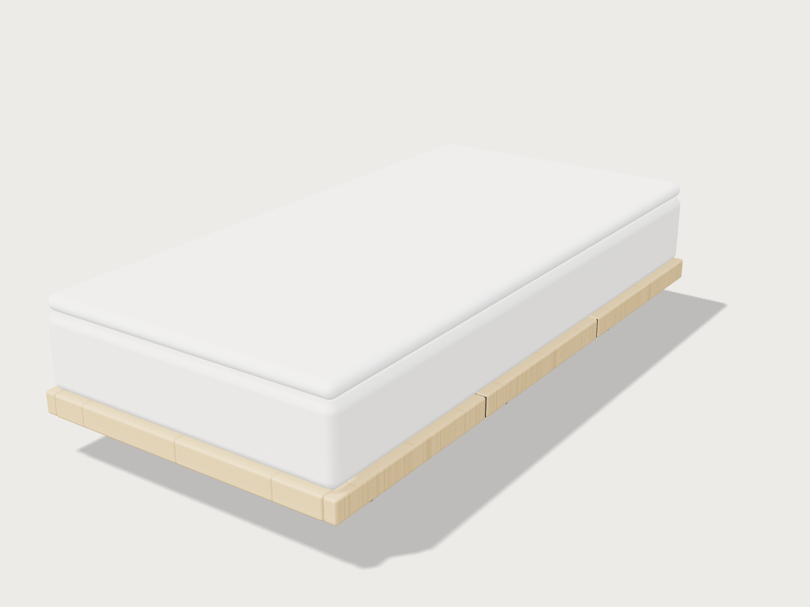 |
| C3-02 | ミニマル | KAGE | 見えるのは、竹の線と影だけ | 44,800円 | 竹集成材（ライト・薄縁）＋黒の沈んだ台 | 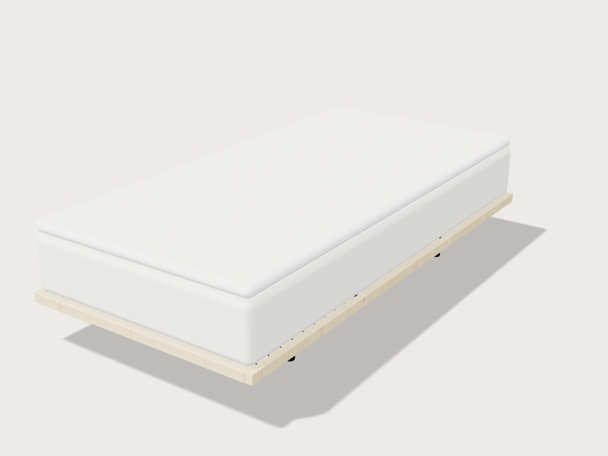 |
| C3-03 | プレミアム | RIN | マットレスを竹の器に沈め、脚は闇に消す | 54,800円 | 炭化竹集成材＋真鍮調の細線 | 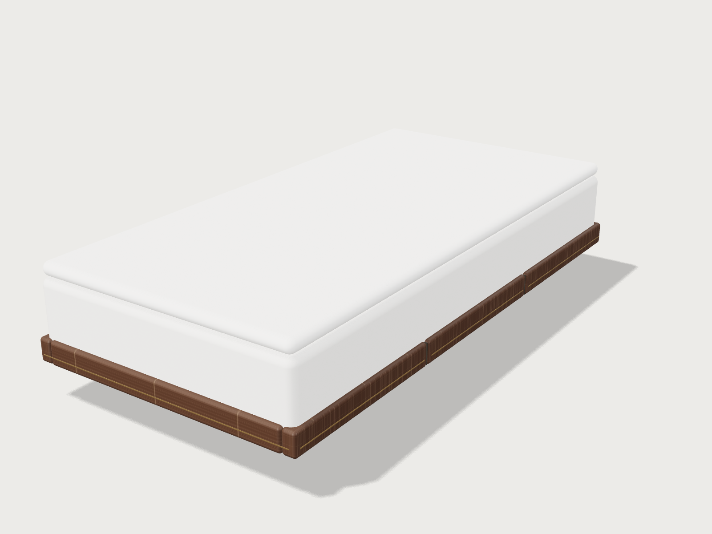 |
| C3-04 | トレンド | KUMO | 角のない雲が、床の上に浮かぶ | 47,800円 | 竹集成材＋グレージュ塗装（トーン・オン・トーン） | 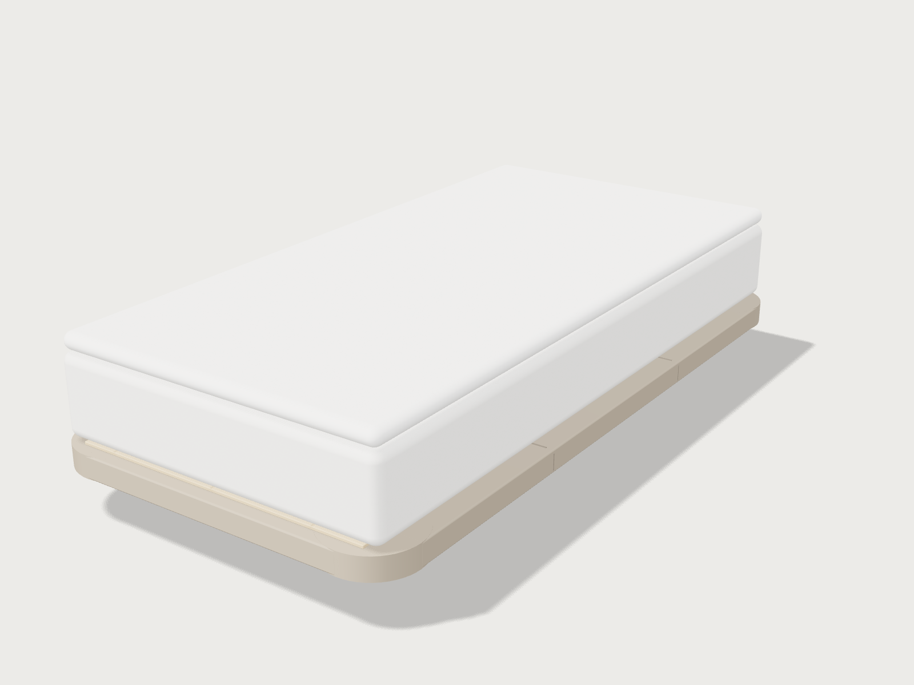 |
| C3-05 | 機能特化 | NOBI | 1本の脚で、床下を3段に | 49,800円 | 竹集成材（ハニー）＋伸縮スチール脚 | 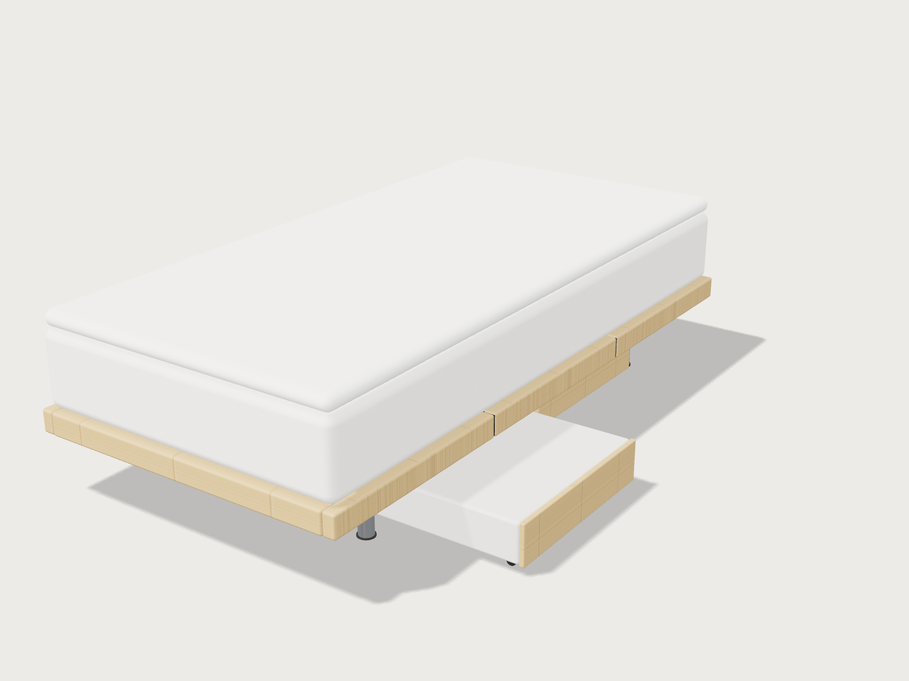 |
| C3-06 | 素材特化 | SUMI | 竹と竹炭で、継ぎ目のない器をつくる | 52,800円 | 竹繊維＋竹炭のコンポジット一体成形＋竹スラット | 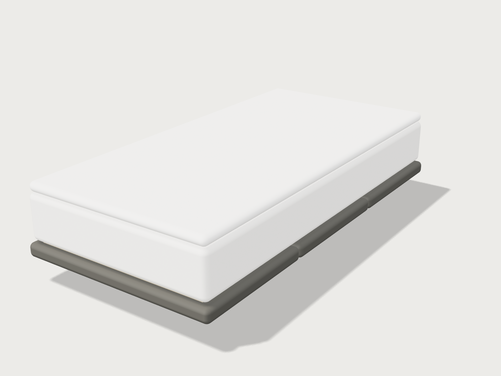 |
| C3-07 | UX改善 | TATERU | 立てたまま、脚を差す。緑が見えたら、倒すだけ | 47,800円 | ウォールナット調竹＋黒脚（緑のロック窓） | 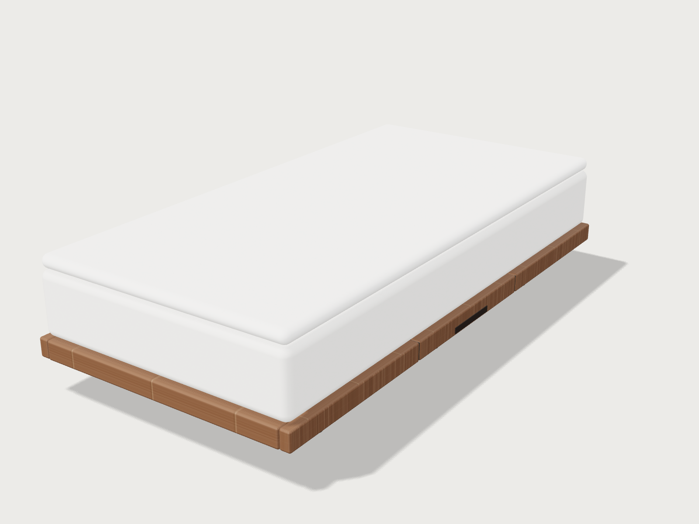 |
| C3-08 | 構造革新 | HARI | 背骨1本で支え、縁は薄く、床はほぼ全部あける | 48,800円 | 竹集成材（薄縁）＋スチールの竜骨・中央台座 | 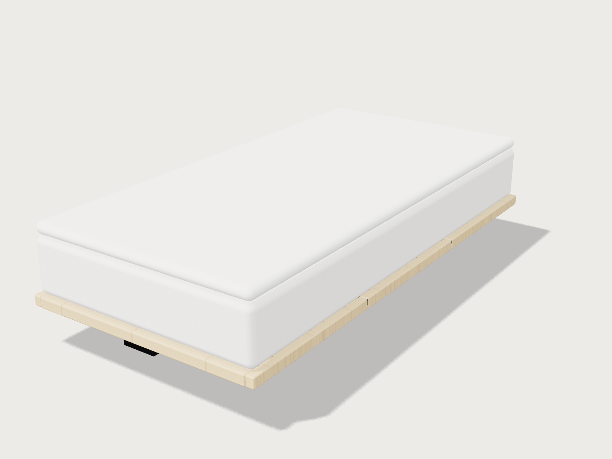 |
| C3-09 | 少し挑戦的 | TERASU | ベッドの下を、隠さず照らす | 52,800円 | 炭色の竹集成材＋電球色の床下灯 | 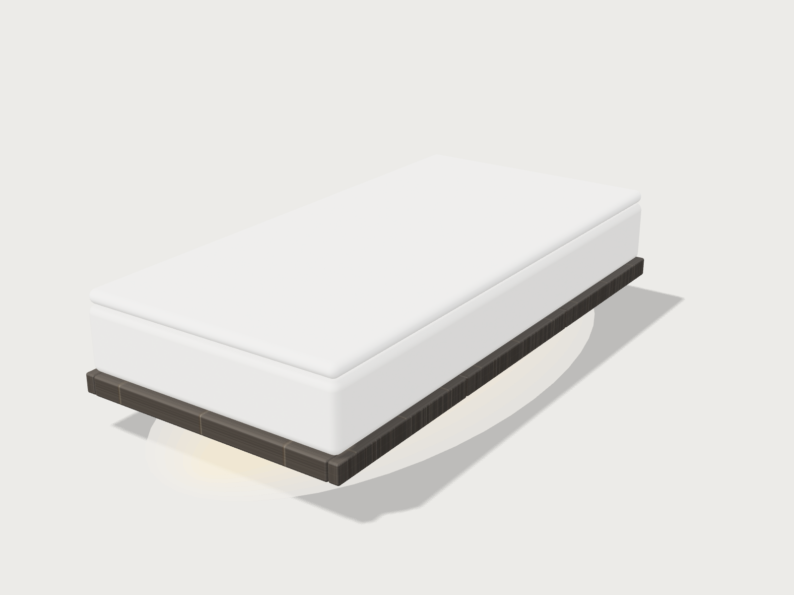 |
| C3-10 | コンセプトモデル | KUU | 床に触れず、掃除する者も住まわせる | 59,800円（参考） | 竹集成材（明るい薄縁）＋透明ポリカーボネートの脚 | 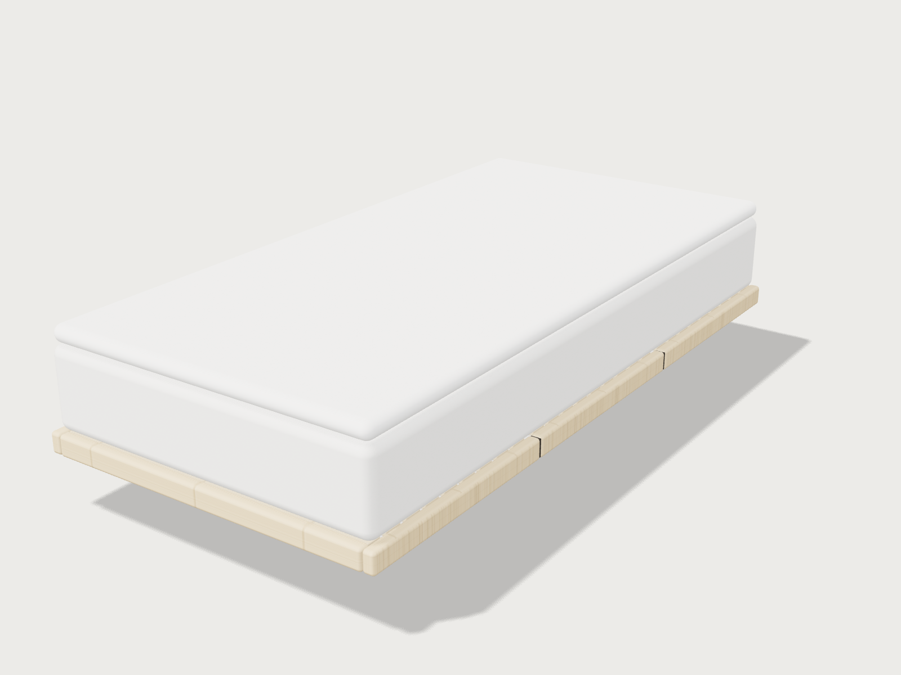 |

## 10案の差分表（似せないためのチェック）
一覧画像（床下が見える低い視点で比較）: 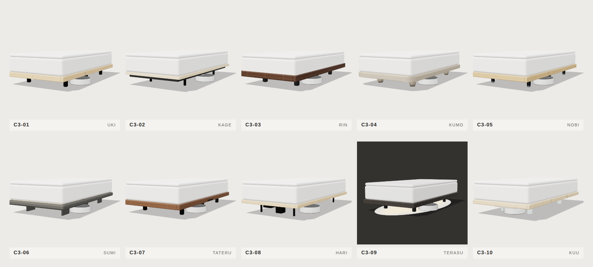

| No | 形のモチーフ（浮かせ方） | 主素材（CMF） | 価格帯 | 主な訴求点 | 脚の配置・床下 | 開梱〜就寝 | 梱包 3辺合計・重量【推測】 | ポジショニングマップ上の位置（横: 組立工数の少なさ／縦: 質感・価格） |
|---|---|---|---|---|---|---|---|---|
| C3-01 | 幅広の竹の縁＋影の帯 | ナチュラル竹＋黒脚 | 4万円台後半 | 差して回すだけ・床下125mm の定番 | 角脚6本・150mm 内側／125mm | 5動作3分30秒 | 197cm・22.5kg | 空白 C の中心（右・中段） |
| C3-02 | 薄い竹の線＋沈んだ黒い台 | ライト竹＋黒 | 4万円台前半 | 線と影だけ・部品最少 | 丸脚4本・170mm 内側／125mm（縁下165mm） | 5動作3分 | 199cm・21.5kg | 空白 C の右端・中下段（入口価格） |
| C3-03 | 器（マットレスを沈める）＋闇に消える脚 | 炭化竹＋真鍮線 | 5万円台前半 | ホテルの佇まい・5年保証 | 角脚6本・200mm 内側／125mm | 5動作3分30秒 | 199.5cm・24kg | 空白 C の最上部（右・上段） |
| C3-04 | 平面 R130 の雲形＋小石の脚 | グレージュ濃淡（塗装） | 4万円台後半 | 今の色と曲線 | 小石形6本・190mm 内側／125mm | 5動作3分30秒 | 199cm・21kg | 空白 C の中段・若年寄り |
| C3-05 | 伸縮する脚＋引き出しトレー | ハニー竹＋ガンメタ／シルバー | 4万円台後半 | 1本の脚で床下3段（125/180/250） | 伸縮脚6本・160mm 内側／125〜250mm | 5動作3分30秒 | 197cm・23kg | 空白 C の中段（機能で選ぶ層） |
| C3-06 | 継ぎ目のない殻＋フィン脚 | 竹繊維＋竹炭コンポジット（炭グレー） | 5万円台前半 | 水拭きできる・素材の由来 | フィン6枚・170mm 内側／125mm | 5動作3分30秒 | 197cm・21kg | 空白 C の上段（素材で選ぶ層） |
| C3-07 | 立てて差す組立体験＋緑のロック窓 | ウォールナット調竹＋黒脚 | 4万円台後半 | 裏返さない・付いたか見える | 角脚6本・150mm 内側／125mm | 5動作3分（持ち上げ動作なし） | 197cm・22.5kg | 空白 C の右端（組立が最も楽に感じる） |
| C3-08 | 背骨（竜骨）＋中央台座＋補助ピン | ナチュラル竹（薄縁）＋黒スチール | 4万円台後半 | 床に触れる点が少ない・縁が薄い | 台座3＋補助脚4／125mm（縁下157mm） | 5動作4分 | 198.5cm・21.5kg | 空白 C の中段・技術で選ぶ層 |
| C3-09 | 床下の光だまり | 炭色竹＋電球色 LED | 5万円台前半 | 床下を照らして見せる | 角脚6本・200mm 内側／125mm | 5動作4分 | 197cm・23kg | 空白 C の外側（夜の浮遊感） |
| C3-10 | 透明な脚＋ロボットの住む床下 | ライト竹＋白い下面＋透明 PC | 参考 5万円台後半 | 床から消える・ロボットのドック内蔵 | 透明4本・250mm 内側／150mm | 5動作3分30秒 | 194cm・20kg | 空白 C のさらに外（将来・ブランド発信） |

- **重なりの確認**: 形のモチーフ（浮かせ方）は10案すべて異なる。主素材は竹が9案（企画 4-0 の指定。06 は竹繊維コンポジット＋竹スラット）だが、CMF の主役は重ならない（ナチュラル竹が主役なのは 01 と 08 の2案で、08 は縁の薄さと中央の黒い竜骨で区別）。価格帯「4万円台後半」は 01・04・05・07・08 の5案だが、③の価格幅（44,800〜54,800円）が1万円しかないためで、主な訴求点と脚の配置は5案とも異なる。訴求点は10案で重ならない。
- **振れ幅**: 01（黒い角脚6本で浮かせる定番）と、09（光で床下を見せる）・10（透明な脚とロボットのドック）の間に、「床下との関係」のスケールで明確な差がある（通れる → 高さを選べる → 見せる → ロボットが住む）。
- **脚の配置案（research 申し送り5）**: 6本（01・03・04・05・06・07・09）、4本（02・10）、中央台座＋補助脚（08）の3系統を出した。6本が多いのは、三つ折りの各パネルを脚で直接支えてヒンジに荷重を集めないため（企画 0-2 たわみ5mm以下）。
- **①②との差**: ①（C1）は「開く体験・構造・たたんだ姿」、②（C2）は「足していく体験」、③（C3）は「床下との関係（浮かせ方・高さ・掃除）」が主役。C1 にも脚を内側に引っ込めた案（C1-02 ITTAN など）があるが、C3 は脚を交換・伸縮できるユニットとし、下面を平らに閉じて床下125mm 以上を約束する点で分けた。C1-03 KASANE（積層の縁を見せる）と C3-03 RIN（器に沈めて脚を消す）、C1-04 MOCHI（白い丸い縁の断面）と C3-04 KUMO（平面の円弧とグレージュの濃淡）は、同じ「プレミアム・トレンド」の枠で手段を変えた。

## 案C3-01 王道・市場適合型「UKI（浮き）」

構造（本体を持ち上げ、脚ユニット6本をソケットから抜いた状態。脚の上端の黒い差し込みプラグが下面のソケットに入る）: 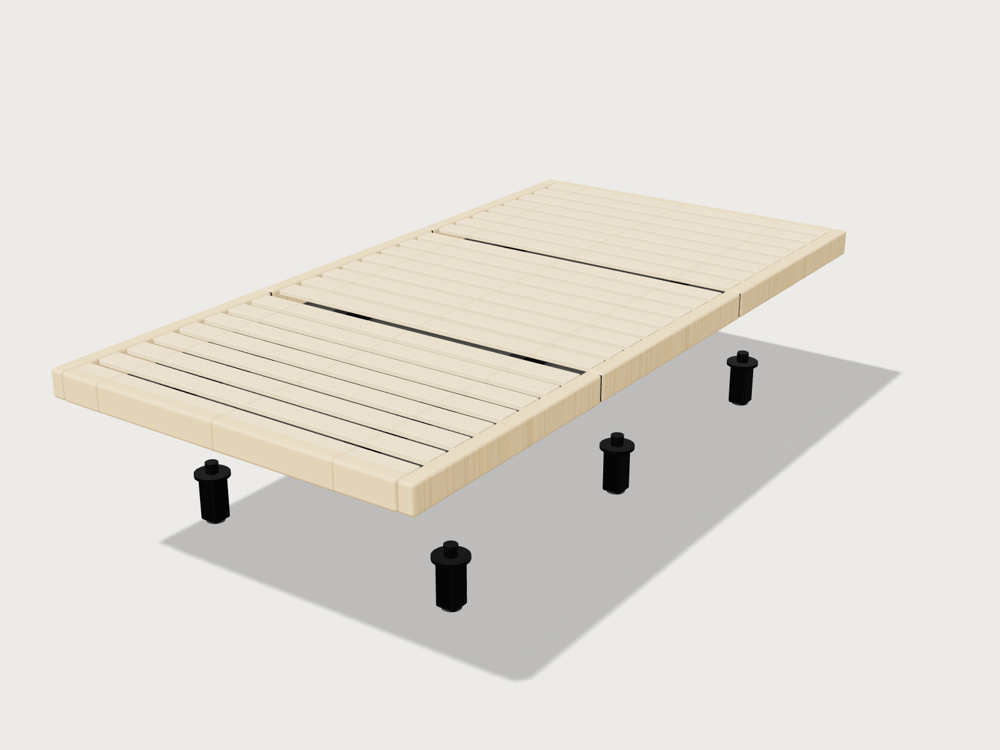 ／ 床下（ロボット掃除機 高さ約100mm が床下125mm を通る。低い視点）: 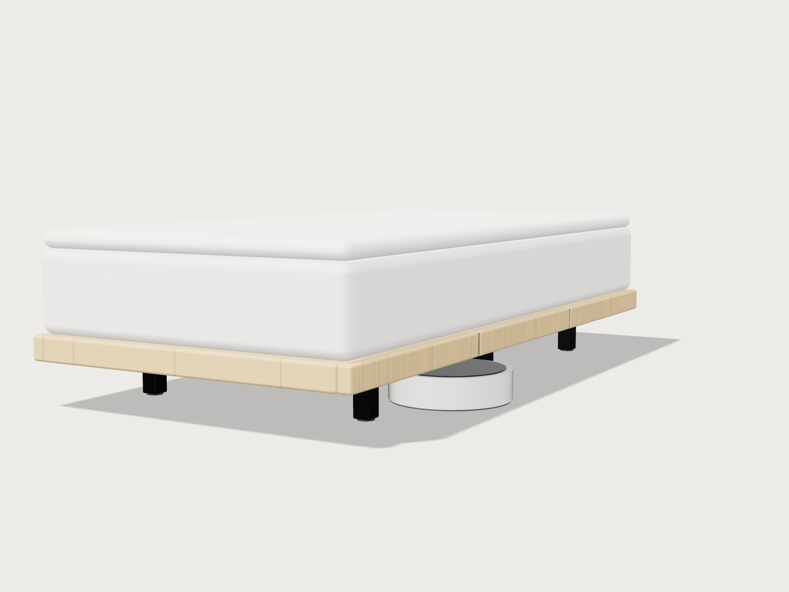 ／ 正面・側面: `C3-01-front.png`・`C3-01-side.png`

- **名称**: C3-01 王道・市場適合型「UKI」
- **デザインコンセプト**: 「ベッドの下まで、美しい。」企画 3-1 のコンセプトをいちばん素直に形にした案。幅広の竹の縁（見付け70mm）で囲った三つ折りデッキを、外周から150mm内側に引っ込めた黒い角脚6本で支え、床から浮いた「影の帯」をつくる。脚は差して1/4回すだけで付き、床下は125mm。
- **ターゲット**: 企画 3-2 のメインペルソナ（38歳・共働き・2LDK〜3LDK、ロボット掃除機を持っていて、ベッド下のホコリが気になるが重いベッドを動かす時間はない）。「ロボット掃除機対応 ベッド」「床下12cm」で検索して比較する人。research 結論3 のターゲットの中心。
- **解決する課題**: ベッド下の掃除の手間（ロボ対応はランキング上位の訴求 [S8]、RoomClip に専用タグ [S53]）。不満1位「きしみ・ぐらつき」17.1% と「組立の手間」14.3%（research §6）には、ネジゼロの差し込み脚で応える。床下に入らない不満（§6、2.9%）も解消。
- **形状**: 外寸 W1000×L1980×H195mm（天面高。THE GOKUMIN 28cm で寝面高 約475mm）。三つ折り（1枚 660mm）。縁 40×70mm・角R8、スラット 幅56mm×8本／枚。デッキ下面は継ぎ目のない平らな1枚板（床側にリブ・溝なし）。脚 50mm角×6本（各パネル2本、外周から150mm・端から310mm内側）、床下の有効高さ **125mm**（標準脚）／交換脚で 180・250mm。
- **素材**: 縁・スラット 竹集成材／長手の梁 中空スチール 40×40（縁の高さの中に収め、床下に出さない）／下面板 竹合板＋黒の塗装／脚ユニット スチール角パイプ（粉体塗装）＋上端の差し込みプラグ（亜鉛ダイカスト）＋接地面 フェルト（取り付け済み）／ヒンジ 鋼板プレス＋樹脂ブッシュ
- **CMF**: Color 縁・スラット ナチュラル竹 `#D9B88A`（定番）、ウォールナット調 `#6B4A33`（2色展開）。脚・下面 マットブラック `#1F1F1F`（影に溶けて見えない）。Material 竹集成材。Finish 艶消しウレタン（3分艶、拭き取りやすいトップコート）、脚は細かいシボの粉体塗装。
- **機能**: 脚ユニットは「差して1/4回転」のバヨネット式、ロックすると予圧がかかりガタなし（企画 0-2 のきしみ対策）／脚は向きのないプラグ（丸プラグ＋1か所の切り欠きで差し間違えない）／床下125mm・入口は垂直でテーパーなし／保証耐荷重 S 250kg。**入れなかった機能**: 足元灯（09 の役割）、ベッド下収納（床下の掃除を優先）、宮棚（②の役割。ただし P4 レール溝は入れずコストを抑える）
- **開梱〜就寝（必須）**: ①箱を倒し、持ち手ベルトで本体を引き出す ②本体を立てたまま開く（ヒンジが自動ロック。立てた状態で下面のソケットが手前を向く） ③脚ユニット6本を差して1/4回す（1本約5秒） ④本体を床に倒す ⑤マットレスを載せる ＝ **5動作・約3分30秒・工具0・ユーザーが扱う部品7点（本体1＋脚6）・1人**【推測】
- **梱包（必須）**: 折りたたみ時 660×1000×210mm（縁70mm×3枚）。脚6本はパルプモールドのトレーに入れて本体の横に同梱 → 梱包 約690×1030×250mm（3辺合計 **約197cm**・宅急便200サイズ内）、重量 **約22.5kg**【推測】（本体19.5kg＋脚6本2.4kg＋梱包材）。18・250mm の交換脚は別箱（約300×200×120mm）
- **競合優位性**: タンスのゲン パレット「お掃除ロボ対応」（14,999円〜・床下11cm）[S8][S65] の「金具の緩み・たわみ・ささくれ」[S25] に対し、ネジゼロ・床下125mm・竹の仕上げで勝つ。無印 脚付マットレスの「脚をねじ込む・重くて1人では困難・ボルト緩み」[S55] に対し、差して回すだけで1人。コアラ ミライカスタム（約6万円、組立あり）[S19] より約1.3万円安い。
- **製造方法**: コアデッキ（P1）の工程（竹 CNC・塗装、スチール梁溶接、ヒンジのプレス＋カシメ）に、下面板の接着と脚ソケット（P3、亜鉛ダイカスト＋ばねのロック）6か所の圧入を加える。脚ユニットはスチール角パイプの切断・プラグ圧入・粉体塗装。工場での部品点数 本体 約62点／脚 各4点【推測】。新規金型 ソケット・プラグのダイカスト型1組（3コンセプト共通の P3）、ヒンジのプレス型（①と共用）。量産の注意点: ソケット位置の精度（±0.5mm）と、端座り時に脚1本にかかる荷重（約150kg を想定）でプラグが抜けない保持力の試験。
- **想定価格**: 税込 **46,800円**（SD 56,800円）、交換脚 180mm・250mm 各6本セット 4,980円。原価率 約32%【推測】。research 結論4「③ S 44,800〜54,800円、交換脚 4,980円〜」の下側で、まず数を取る価格。
- **デザイン意図（根拠）**: research 結論5 の「脚は外周から10cm以上内側に引っ込めて浮いて見せる」「床下12cm以上（③は脚の交換で12／18／25cm）」「③: 脚は差し込んでロックするワンタッチ式」を最も素直に満たした。脚を6本（各パネル2本）にしたのは、三つ折りの各パネルを脚で直接支え、ヒンジに荷重を集めないため（企画 0-2 たわみ5mm以下）。脚を150mm引っ込めても、端座りの荷重は6本のうち手前の3本で受けられる（research 申し送り5 の安定性。【推測】端から150mm の張り出しに100kg で転倒しないことは試作で確認）。根拠: research §16 空白領域 C、§6 きしみ 17.1% [S24][S25][S55]、追加C ③ [S37][S38][S59]。SNS の「ロボット掃除機が床下を抜ける」「浮遊感のある寝室」のカットが、そのまま撮れる。共有プラットフォーム部品: P1・P2・P3・P5・P6。

## 案C3-02 ミニマル「KAGE（影）」

構造（本体を持ち上げ、細い丸脚4本を抜いた状態）: 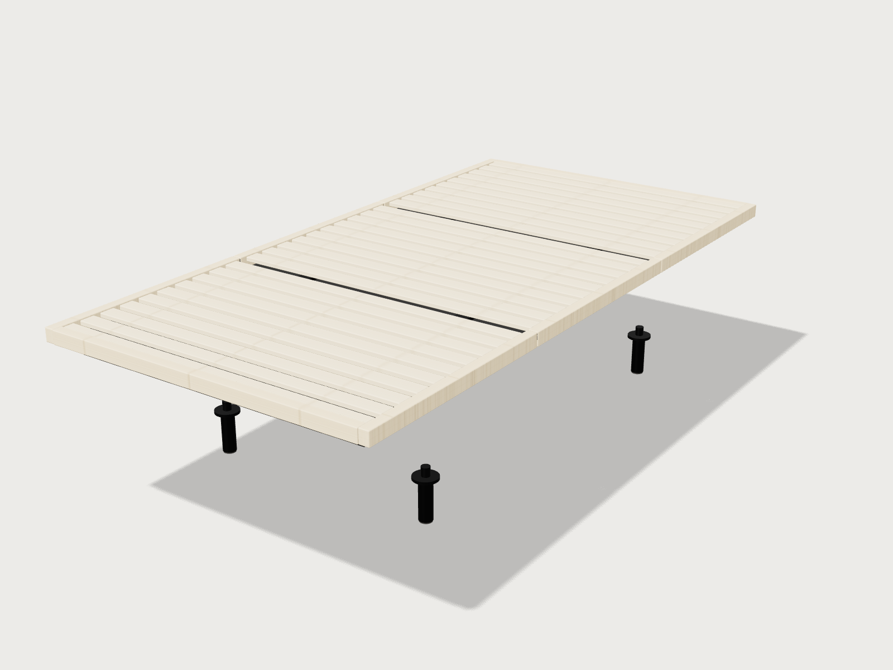 ／ 床下（低い視点。竹の薄い縁の下に、60mm 引っ込んだ黒い台が影として見える）: 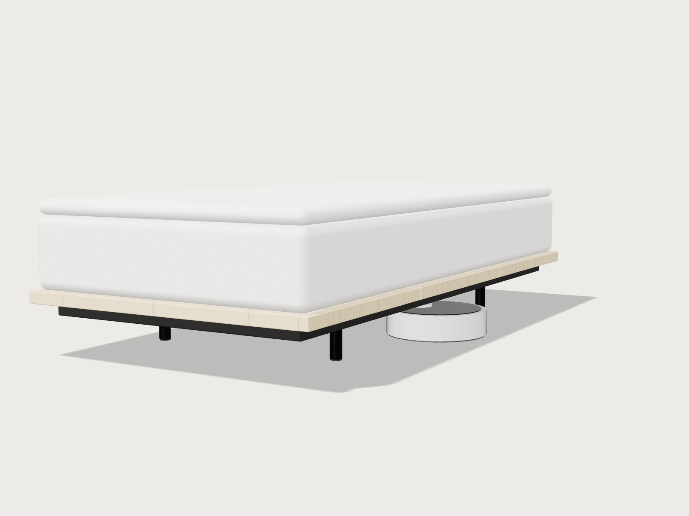 ／ 正面・側面: `C3-02-front.png`・`C3-02-side.png`

- **名称**: C3-02 ミニマル「KAGE」
- **デザインコンセプト**: 「見えるのは、竹の線と影だけ。」見付け40mm の明るい竹の薄い縁だけを外に見せ、その下に外周から60mm 引っ込めた黒い台（厚40mm）を重ねる。黒い台は影と見分けがつかないため、竹の線が床から約165mm の高さに1本浮いて見える。脚は φ38 の黒い丸脚を4本だけ。
- **ターゲット**: ペルソナのうち、家具の線と数を減らしたい30代の一人暮らし〜夫婦。白い壁・明るい床の部屋で、ベッドを「床に置いた1枚の板」のように見せたい人。ロボット掃除機を「見せない家電」として使う人。
- **解決する課題**: 質感・仕上げの不満 14.3%（research §6）と「部品点数の多い構造」（結論2）。フローティング品の「脚10本・金属の組立式で安っぽい」印象 [S42] に対し、脚を4本に減らして答える。床下の掃除は、黒い台の下面が平らで凹凸がないため、ロボットもフロアワイパーも一定の高さで抜けられる。
- **形状**: 外寸 W1000×L1980×H205mm（天面高、寝面高 約485mm）。三つ折り（1枚 660mm）。竹の縁 30×40mm・角R3（10案で最も細い）、スラット 幅44mm×10本／枚。黒い台 W880×L1860×H40mm（外周から60mm内側）。脚 φ38×4本（外周から170mm・両端から430mm内側。両端のパネルに2本ずつ）。床下の有効高さ **125mm**（黒い台の下面）、竹の縁の下は 165mm。
- **素材**: 縁・スラット 竹集成材（明るいナチュラル）／黒い台 スチールのはしご形フレーム＋竹合板の下面板（黒塗装）。三つ折りの継ぎ目をまたいで、はしご形フレームがヒンジのロックで一体の梁になる／脚ユニット スチール丸パイプ＋差し込みプラグ（P3）＋フェルト
- **CMF**: Color 縁・スラット ライトナチュラル竹 `#E3CDA8` の1色のみ（受注でウォールナット調 `#6B4A33`）。台・脚 マットブラック `#1C1C1C`。Material 竹集成材。Finish 艶消しオイル調ウレタン（1分艶）、面取りは C1 で線を細く見せる。
- **機能**: 脚は差して1/4回転のバヨネット（P3）／床下125mm・テーパーなし／保証耐荷重 S 250kg。**入れなかった機能**: 6本目以降の脚（見た目を優先。中央パネルは脚で受けず、ロックしたはしご形フレームで受ける）、色の目印、足元灯、収納
- **開梱〜就寝（必須）**: ①持ち手ベルトで本体を引き出す ②立てたまま開く（ヒンジ自動ロック） ③丸脚4本を差して1/4回す ④床に倒す ⑤マットレスを載せる ＝ **5動作・約3分・工具0・部品5点（本体1＋脚4）・1人**【推測】（脚が4本で10案で最も少ない）
- **梱包（必須）**: 折りたたみ時 660×1000×240mm（縁40＋台40 の80mm×3枚）→ 梱包 約690×1030×270mm（3辺合計 **約199cm**）、重量 **約21.5kg**【推測】（本体19.5kg＋脚4本1.2kg＋梱包材）
- **競合優位性**: 国内のフローティング品（脚10本・センサーライト・1000kg 表記）[S42] の「金属の組立式に見える」弱点に対し、竹の細い線と脚4本・組立ゼロで品よく見せる。ZINUS の「安っぽい・中央が沈む」[S20] に対し、スチールのはしご形フレームで中央を受ける。
- **製造方法**: 竹の縁・スラットの CNC・塗装（コアデッキ P1 の工程）＋スチールのはしご形フレームの溶接（パネルごとに1枚、計3枚）＋下面板の接着＋ヒンジ（P2）。工場での部品点数 約55点【推測】（脚が少なく、ソケットも4か所）。新規金型 なし（P3 のソケット・プラグ、P2 のヒンジ型を共用）。量産の注意点: 中央パネルを脚なしで受けるため、ヒンジのロック部に曲げが集中する。26kg＋100kg を中央に載せたたわみ5mm以下（企画 0-2）を試作で必ず確認する。脚が4本のため、端座り時の安定は脚の内側への引っ込み量（170mm）と台の重量で決まり、【推測】100kg の端座りは限界に近い。
- **想定価格**: 税込 **44,800円**（SD 54,800円）、交換脚（180・250mm）4本セット 3,980円。原価率 約30%【推測】。research 結論4 の下限。部品が少ない分を価格に回した入口モデル。
- **デザイン意図（根拠）**: research §10「低く・薄く・浮いて見える」を、脚の数ではなく「影の台」で強調した。research 結論2「部品点数の多い構造」を避け、research 申し送り5「脚の配置案を複数出す」のうち最少の4本案を担う。脚が4本だと端座りの安定性が最も厳しいため、懸念として明記する（C3-01 の6本、C3-08 の中央台座と比較できる）。根拠: §10 [S40][S41]、§6 質感 14.3%、§15 [S20][S42]。SNS では「竹の線が浮いている」写真が撮れる。共有プラットフォーム部品: P1・P2・P3・P5・P6。

## 案C3-03 プレミアム「RIN（凛）」

構造（本体を持ち上げ、脚6本を抜いた状態。スラットが縁より30mm低い「器」の形）: 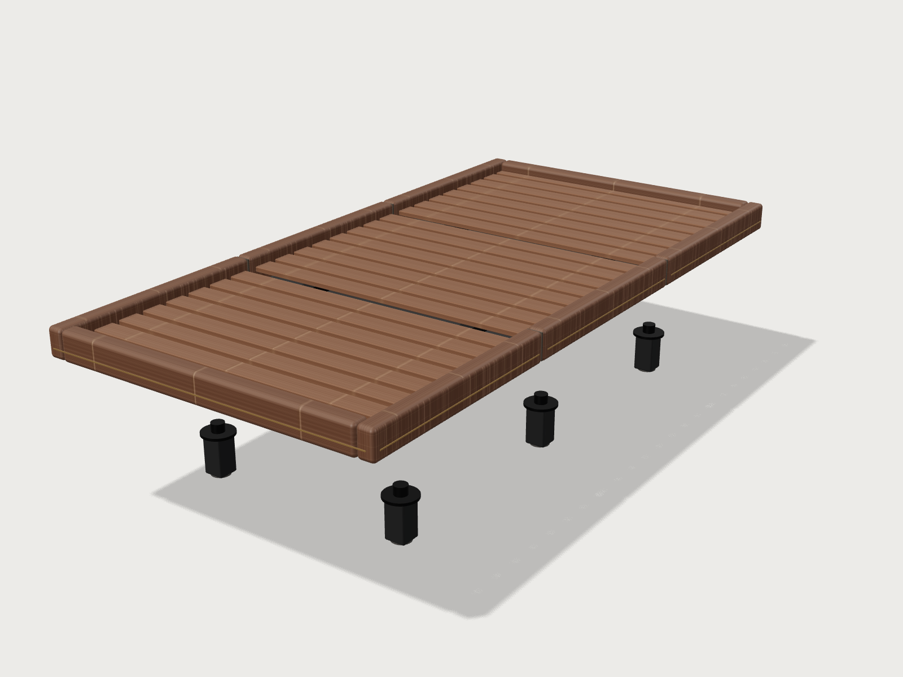 ／ 床下（低い視点。脚は外周から200mm内側で、艶のない黒）: 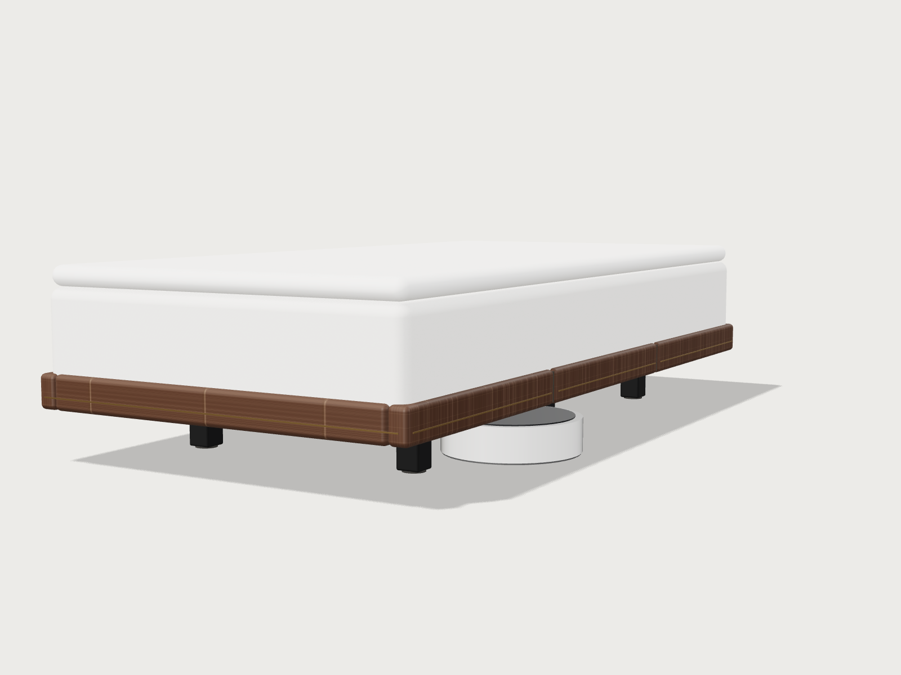 ／ 正面・側面: `C3-03-front.png`・`C3-03-side.png`

- **名称**: C3-03 プレミアム「RIN」
- **デザインコンセプト**: 「マットレスを竹の器に沈め、脚は闇に消す。」炭化竹の縁（見付け84mm）の内側にスラットを30mm 下げて、THE GOKUMIN をホテルのベッドのように「器に収めた」見え方にする。縁の下から30mm の位置に真鍮調の細線を1本通し、脚は外周から200mm 内側・艶のない黒で、影の中に消す。
- **ターゲット**: THE GOKUMIN の最上位（ユーロトップ 28cm、7万円台 [S5]）を買う38〜45歳の共働き世帯。寝室を「ホテルのように保ちたい」（research 結論3）という気持ちが最も強く、寝具と家具で10万円台の投資をいとわない人。
- **解決する課題**: 不満「質感・仕上げ（安っぽい・高級感なし）」14.3%（research §6）と、research §3 の推測「7万円クラスのマットレスに1万円前後のフレームは見劣りする」。マットレスの側面が縁の内側に30mm 入るため、シーツのずれ・マットレスの横ずれも抑える【推測】。床下は清掃のため 125mm を確保。
- **形状**: 外寸 W1000×L1980×H209mm（縁の天面高）、スラット面 179mm（THE GOKUMIN 28cm で寝面高 約459mm。10案で最も低く、ホテルのような低い重心）。三つ折り（1枚 660mm）。縁 50×84mm・角R12。スラット 幅60mm×8本／枚（縁より30mm 低い）。脚 60mm角×6本（外周から200mm・両端から350mm 内側）、床下の有効高さ **125mm**／交換脚で 180・250mm。
- **素材**: 縁・スラット 炭化竹集成材（熱処理で色を出す）／細線 真鍮調のアルミ押出（t2×3mm を縁の溝にはめ込み）／長手の梁 中空スチール（スラットの下、縁の高さ内）／下面板 竹合板＋黒塗装／脚ユニット スチール角パイプ＋艶消し黒の電着塗装＋P3 プラグ＋フェルト
- **CMF**: Color 縁・スラット 炭化竹 `#4F3526`（ダークウォールナット、1色展開）、細線 シャンパンブラス `#B89660`、脚 艶消し黒 `#141414`。限定色として ナチュラル竹 `#D9B88A`×真鍮線。Material 炭化竹集成材（塗料で着色しない）。Finish オイル仕上げ＋艶消しウレタンのトップコート（拭き取れる）、角R12 の手触り。
- **機能**: 脚は差して1/4回転（P3）／床下125mm・テーパーなし／保証耐荷重 S 250kg（SD 300kg）／**5年保証＋120日の返品受付**【推測: 保証条件は社内確認】／購入時に脚の高さ（125・180・250mm）を選べる。**入れなかった機能**: 照明・宮棚・収納（「素材と佇まい」に集中し、機能の足し算で価格を上げない）
- **開梱〜就寝（必須）**: ①持ち手ベルトで本体を引き出す ②立てたまま開く（ヒンジ自動ロック） ③脚6本を差して1/4回す ④床に倒す ⑤マットレスを器に落とし込む ＝ **5動作・約3分30秒・工具0・部品7点・1人**【推測】
- **梱包（必須）**: 折りたたみ時 660×1000×252mm（縁84mm×3枚）→ 梱包 約685×1025×285mm（3辺合計 **約199.5cm**、200サイズぎりぎり）、重量 **約24kg**【推測】（炭化竹は密度が高く、10案で最も重い。上限25kg の内側）。【推測】縁を84mm より厚くすると200サイズを超えるため、「厚く見せる」量はここが上限
- **競合優位性**: コアラ（約6万円）の「組立が必要・ギシギシ・重い」[S18] に対し、組立ゼロで価格は約5,000円安い。米国の Thuma（$795〜）が素材と継手で高価格を成立させている [S45] のを、竹の完成品で国内価格にする。C1-03 KASANE（積層の縁を見せる固定脚）とは、「器に沈める・脚を消す・床下125mm」で役割を分ける。
- **製造方法**: 炭化竹集成材の CNC（縁の内側に段を付けてスラットの受けにする）・細線用の溝加工・オイル＋ウレタン塗装、真鍮調アルミ線のはめ込み、スチール梁溶接、ヒンジ（P2）、ソケット（P3）6か所。工場での部品点数 約66点【推測】。新規金型 なし（アルミ線は汎用の押出材を切断）。量産の注意点: 炭化竹は色ムラが出るため、縁の材の色選別が必要（歩留まり低下）。三つ折りの継ぎ目で細線が途切れるので、継ぎ目の位置で線の端をそろえる治具が要る。
- **想定価格**: 税込 **54,800円**（SD 64,800円）、交換脚 4,980円。原価率 約34%【推測】。research 結論4 の上限（54,800円）。THE GOKUMIN とのセット購入を主な売り方にする。
- **デザイン意図（根拠）**: 企画 4-3「プレミアム案は縁を厚く見せ、脚は黒で消す」をそのまま形にした。research 結論5 のカラー「ウォールナット調」を炭化竹で、「金物はマットブラックか同色で目立たせない」を脚で表現。research §8 の推測「安いすのこと見分けがつくよう質感の差を出す」を、器の形と真鍮線で行う。根拠: §6 質感 14.3%、§3 価格分布（4万円以上はコアラのみ）[S18][S19]、§12 [S45]、追加B（200サイズの上限 [S31] から縁の厚さを決めた）。SNS の「浮遊感のある寝室」カットが、濃い縁と黒い影のコントラストで最も強く出る。共有プラットフォーム部品: P1（縁の意匠を変更）・P2・P3・P6。

## 案C3-04 トレンド「KUMO（雲）」

構造（本体を持ち上げ、丸い「小石」形の脚6本を抜いた状態）: 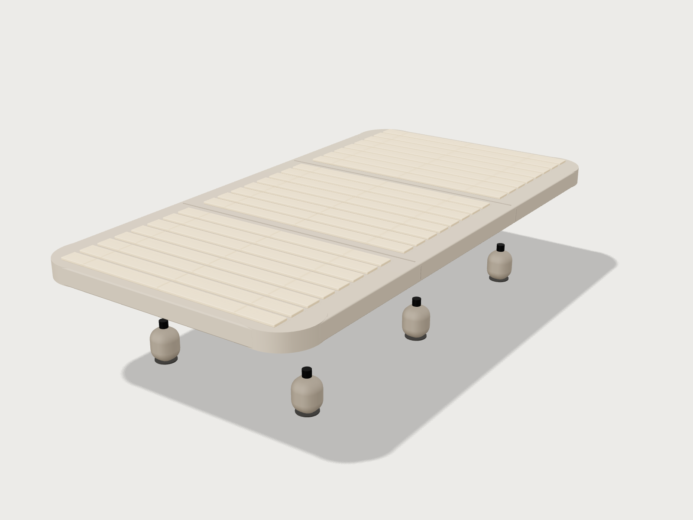 ／ 床下（低い視点。本体と脚を同じグレージュの濃淡でまとめる）: 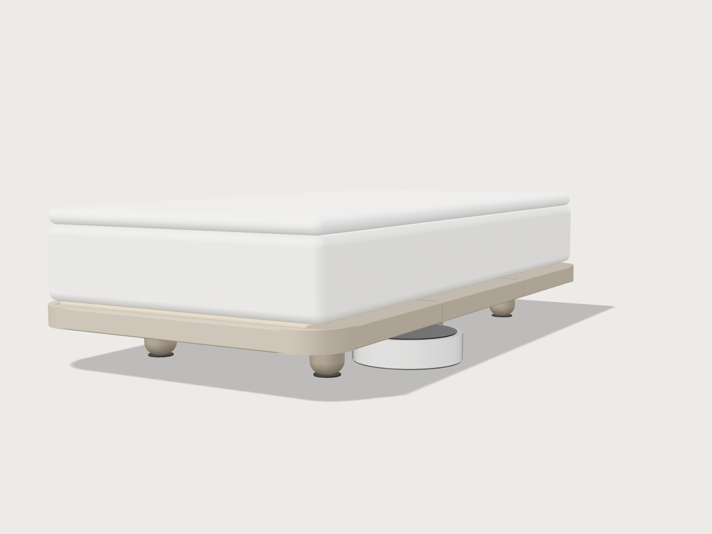 ／ 正面・側面: `C3-04-front.png`・`C3-04-side.png`

- **名称**: C3-04 トレンド「KUMO」
- **デザインコンセプト**: 「角のない雲が、床の上に浮かぶ。」平面の四隅を R130 の大きな円弧にした台を、グレージュ1色で塗り、同じ色の濃いトーンの「小石」形の脚（96mm角・R40）で浮かせる。本体・脚・影がすべて同系色のグラデーションになる、2026年の内装（グレージュの壁・曲線の家具）に合わせた案。
- **ターゲット**: 28〜35歳の一人暮らし・カップル。グレージュやベージュの部屋を RoomClip・Instagram で参考に組み立てる人。ロボット掃除機を「インテリアを崩さない家電」として選ぶ人。research 結論3 のターゲットの若い側。
- **解決する課題**: アンケート最重視「デザイン」50.8% [S23] と、竹ベッドの「ナチュラル＝和風・素朴」の印象。角が丸いため、狭い寝室で足をぶつけたときの痛さや、ロボット掃除機がベッドの角で引っかかる動き（【推測】角の円弧に沿って回り込みやすい）にも効く。床下125mm。
- **形状**: 外寸 W1040×L2010×H189mm（天面高、スラット面 198mm、寝面高 約478mm）。平面の四隅 R130、縁の高さ64mm、縁の角 R5。三つ折り（1枚 670mm。両端のパネルに円弧の角がくる）。スラット 幅58mm×8本／枚（天面に埋め込み）。脚 96mm角・R40 の小石形×6本（外周から190mm 内側）、床下の有効高さ **125mm**。
- **素材**: 台 竹集成材（CNC で円弧を削り出し、不透明塗装）／スラット 竹集成材（ナチュラル、塗装なしのクリア）／脚 ガラス繊維入り PP の射出成形（小石形・中空）＋P3 プラグ＋フェルト／梁 中空スチール／ヒンジ P2
- **CMF**: Color 台 グレージュ `#A99D8C`、脚 ダークグレージュ `#8F8475`、スラット ナチュラル竹 `#DCC29C`。展開2色（もう1色は クラウドホワイト `#E6DFD2`×ウォームグレー脚 `#B7AEA2`）。Material 竹集成材＋塗装、脚 PP。Finish 台はしっとりした艶消し塗装（指紋・手あかが目立ちにくいソフトマット、拭き取り可能なトップコート）、脚は細かいシボ。
- **機能**: 脚は差して1/4回転（P3）／床下125mm・テーパーなし／角 R130 で子どもの安全【推測】／保証耐荷重 S 250kg。**入れなかった機能**: ファブリック張り（ホコリがたまり、清掃性のコンセプトと矛盾するため）、LED（research 結論2）
- **開梱〜就寝（必須）**: ①持ち手ベルトで本体を引き出す ②立てたまま開く（ヒンジ自動ロック） ③小石形の脚6本を差して1/4回す ④床に倒す ⑤マットレスを載せる ＝ **5動作・約3分30秒・工具0・部品7点・1人**【推測】
- **梱包（必須）**: 折りたたみ時 670×1040×192mm（縁64mm×3枚）→ 梱包 約700×1070×222mm（3辺合計 **約199cm**）、重量 **約21kg**【推測】（脚が樹脂で軽い）。【推測】平面の R と外寸（W1040）を大きくした分、縁の高さを64mm に抑えて200サイズに収めた
- **競合優位性**: ZINUS（ブラック／ホワイト、10,120円）の「安っぽい」[S20] と LOWYA・RASIK などデザイン系の組立式 [S21][S22] に対し、今の色と形を組立ゼロ・床下125mm で出す。国内のフローティング品 [S42] の金属の冷たさに対し、曲線と同系色のやわらかさ。C1-04 MOCHI（縁の断面を丸めた白）とは、「平面の円弧・グレージュの濃淡・小石の脚」で分ける。
- **製造方法**: 竹集成材の CNC（平面の円弧・スラットの埋め込み溝）→ 下塗り・不透明塗装（2コート）→ トップコート。脚は PP の射出成形（2つ割り＋超音波溶着、中にスチールの芯）。工場での部品点数 約58点【推測】。新規金型 脚の射出型1型（中規模）。量産の注意点: 平面 R130 の角は三つ折りの端パネルだけに付くため、左右のパネルで塗装の色合わせが必要。不透明塗装はホコリの混入が不良になりやすく、塗装ブースの管理が要る。
- **想定価格**: 税込 **47,800円**（SD 57,800円）、交換脚（小石形 180・250mm）6本セット 5,980円。原価率 約32%【推測】。research 結論4 の範囲の中央。
- **デザイン意図（根拠）**: research §9「オフホワイトやグレージュの壁、グレー×ブラウン、曲線的な家具 [S50]」と結論5「角は大きめの R で丸める」、企画 4-3「トレンド側: オフホワイトやチャコール、角の丸い台座」に対応。本体と脚を同じ色相の濃淡にしたのは、脚を「黒で消す」のではなく「床と同化させる」別の浮遊感の出し方として（C3-01・03 との差）。根拠: §9 [S49][S50]、§7 デザイン 11.8%・[S23] 50.8%、§16 空白 C。SNS の「浮遊感のある寝室」カットで、柔らかい曲線の影が写る。共有プラットフォーム部品: P2・P3・P5（色追加）・P6（P1 は外形を変更）。

## 案C3-05 機能特化「NOBI（伸び）」

（床下180mm の設定。横に引き出せるキャスター付きトレーを2つ入れ、手前の1つを引き出した状態）
構造（本体を持ち上げ、同じ脚ユニットを3段に伸ばした状態。手前の2本＝125mm／中央＝180mm／奥＝250mm。オレンジの輪が押しボタン）: 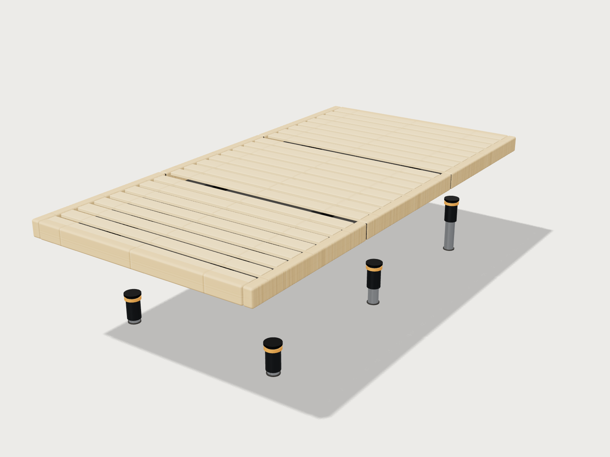 ／ 床下125mm の設定でロボット掃除機が通る（低い視点）: 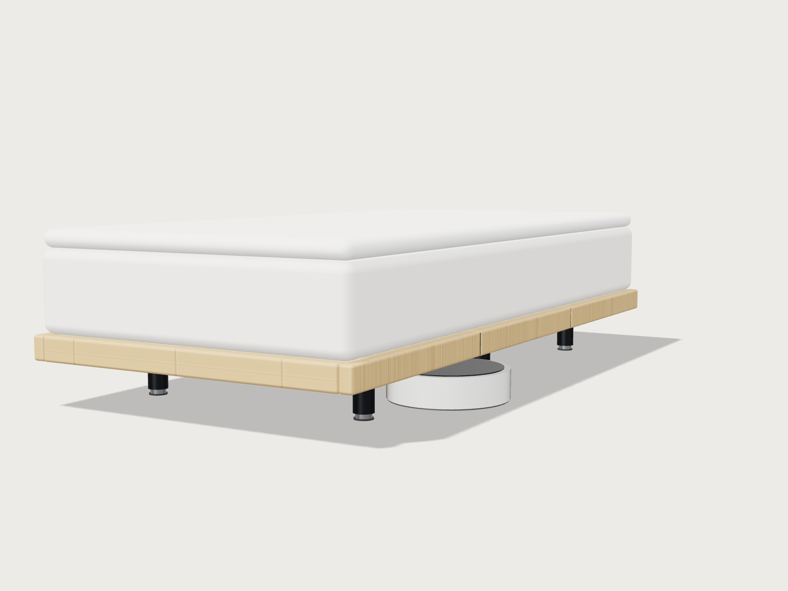 ／ 正面・側面: `C3-05-front.png`・`C3-05-side.png`

- **名称**: C3-05 機能特化「NOBI」
- **デザインコンセプト**: 「1本の脚で、床下を3段に。」最も求められている機能＝「床下の高さを変えられること」を突き抜けさせた案。脚ユニットそのものを伸縮式にし、押しボタンを押して引くだけで床下 125／180／250mm を切り替える。交換脚を買い足さずに、ロボット掃除機（125）⇔ 掃除機＋薄型収納（180）⇔ たっぷり収納（250）を暮らしに合わせて変えられる。
- **ターゲット**: 企画 3-2 のサブターゲット「床下に収納ケースを置きたい人」とメインペルソナの両方。子どもの成長・引越し・ロボット掃除機の買い替えで、ベッド下の使い方が変わる30〜40代の家庭。
- **解決する課題**: research §16 空白領域 C「床下の高さをワンタッチで変えられる」を最も直接に解く。競合の高さ調節は、無印がねじ込み式 [S14]、コアラが継脚 [S19] で、どちらも付け替えに手間がかかる。収納と掃除の両立（フローティングは床下の収納量が減る [S42]、research 追加C ③ リスク）にも、高さの切り替えで答える。
- **形状**: 外寸 W1000×L1980mm、天面高 195／250／320mm（床下125／180／250mm＋縁70mm。寝面高 約475／530／600mm）。三つ折り（1枚 660mm）。縁 40×70mm・角R8。脚 伸縮式 外筒 φ56×100mm＋内筒 φ44（外周から160mm 内側、6本）。オプションのトレー 640×560×高さ150mm（床下180mm 用、キャスター付き、横に引き出す。250mm 用は高さ220mm）。
- **素材**: 縁・スラット 竹集成材（熱処理のハニー色）／脚 外筒 スチール（ガンメタ塗装）・内筒 アルミ押出（アルマイト）・押しボタンの輪 POM（オレンジ）・内部のロックピン ステンレス＋P3 プラグ／トレー PP の底＋竹の前板＋キャスター
- **CMF**: Color 縁・スラット ハニー竹 `#C9A878`、脚 外筒 ガンメタ `#3A3D40`・内筒 シルバー `#B9BCBF`、ボタンの輪 アンバー `#D98A3A`（高さを変える場所だけに色を付ける）、トレー ウォームホワイト `#DEDBD5`＋竹の前板。展開 ハニー竹・ナチュラル竹 `#D9B88A` の2色。Finish 竹は艶消しウレタン、アルミはサテン。
- **機能**: 脚の高さ切り替え（ボタンを押して引く→3段のどこかでカチッ。1本約10秒、ベッドの片側ずつ持ち上げて行う）／脚は P3 のバヨネットで本体に付く（ほかのコンセプトの購入者も後から買える）／床下は全段テーパーなし／保証耐荷重 S 250kg（250mm 設定でも同じ）。**入れなかった機能**: 電動昇降（価格・重量・故障のリスク）、無段階調節（ガタの原因になり、きしみの不満に逆行する）
- **開梱〜就寝（必須）**: ①持ち手ベルトで本体を引き出す ②立てたまま開く（ヒンジ自動ロック） ③脚6本を差して1/4回す（出荷時は125mm に縮めてある） ④床に倒す ⑤マットレスを載せる ＝ **5動作・約3分30秒・工具0・部品7点・1人**【推測】。高さを変えるとき: マットレスを載せたまま片側ずつ持ち上げて3本の脚を伸ばす＝約1分×2回【推測】（1人で持ち上げるのは片側 約25kg）
- **梱包（必須）**: 折りたたみ時 660×1000×210mm → 脚6本（縮めた状態 φ56×125mm）を同梱して 約690×1030×250mm（3辺合計 **約197cm**）、重量 **約23kg**【推測】（伸縮脚は固定脚より1本あたり約0.3kg 重い）。トレーは別箱（2個で 約680×600×170mm・約5kg）
- **競合優位性**: 無印 脚付マットレス（脚12/20/26cm の付け替え・ねじ込み、重くて1人では困難）[S14][S55] に対し、脚を外さずボタンで3段・1人。コアラ ミライカスタム（高さ3段階・継脚・約6万円）[S19] に対し、工具も継ぎ足す部品もなく約1万円安い。LOWYA（31/36/41cm）[S21] に対し、床下125mm の「ロボット側」の段を持つ。
- **製造方法**: 本体はコアデッキ（P1・P2）＋ソケット（P3）6か所。伸縮脚は スチール外筒の切断・穴あけ・塗装、アルミ内筒の押出・切断・ロック穴加工、ボタン輪の射出成形、ロックピン＋ばねの組込み（工場で完成品）。工場での部品点数 本体 約62点／脚 各8点【推測】。新規金型 ボタン輪の射出型1型（小）。量産の注意点: 伸縮部のガタ＝きしみの原因になるため、内筒と外筒のすき間に樹脂のスリーブを入れ、ロック時にくさびで予圧をかける（企画 0-2）。250mm 設定で端座りしたときの脚の曲げ（外周から160mm 内側、横方向の力）を試験する。
- **想定価格**: 税込 **49,800円**（SD 59,800円）、トレー 1個 6,980円。原価率 約35%【推測】（伸縮脚が固定脚の約2.5倍のコスト）。research 結論4 の範囲の中央やや上。「交換脚 4,980円を買わなくていい」分を価格に含めた。
- **デザイン意図（根拠）**: research 結論5「③: 脚は差し込んでロックするワンタッチ式で高さを変えられる」「床下は脚の交換で 12／18／25cm」を、交換ではなく「伸縮」で満たした。企画 4-3「機能特化は床下25cm＋収納も選べる脚」に対応。高さを変える場所（ボタンの輪）だけに色を付け、使い方が見て分かるようにした。【推測】250mm 設定の寝面高 約600mm は高めのため、標準は125mm と明記する（企画 3-4）。根拠: §16 空白 C、§10 高さ3段階が当たり前に [S19][S21]、追加C ③ [S37][S38]、[S42]。SNS では「ボタンを押して脚が伸びる」短い動画が撮れる。共有プラットフォーム部品: P1・P2・P3（伸縮脚は他コンセプトにも付く）・P5・P6。

## 案C3-06 素材特化「SUMI（炭）」

構造（本体を持ち上げ、板状の脚「フィン」6枚を抜いた状態。3枚のパネルはそれぞれ継ぎ目の見えない殻＋竹スラット）: 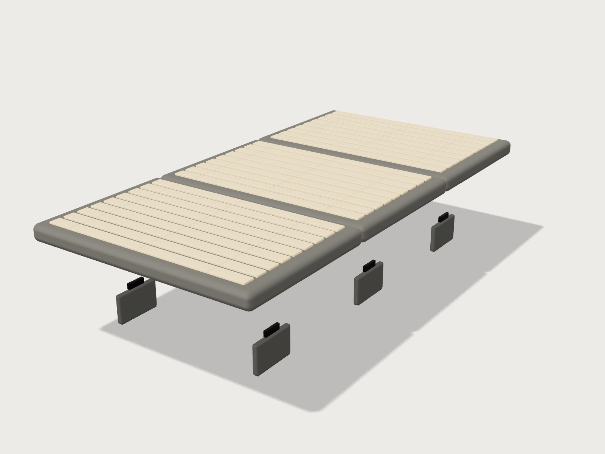 ／ 床下（低い視点）: 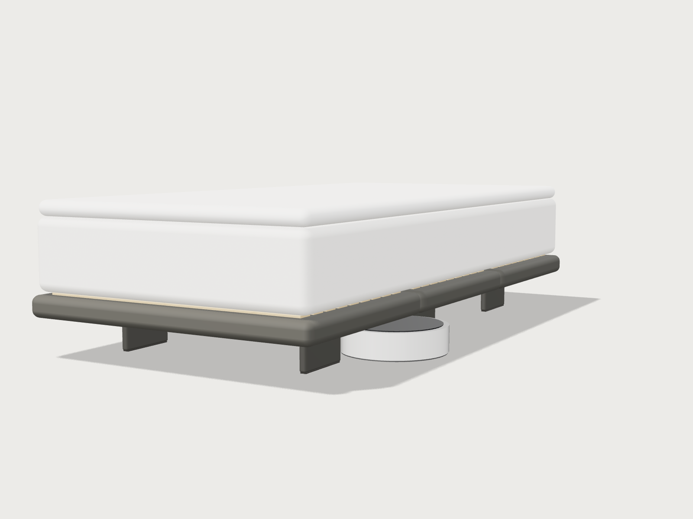 ／ 正面・側面: `C3-06-front.png`・`C3-06-side.png`

- **名称**: C3-06 素材特化「SUMI」
- **デザインコンセプト**: 「竹と竹炭で、継ぎ目のない器をつくる。」竹の繊維と竹炭の粉を練り込んだ樹脂で、縁と下面をひと続きの「殻」にする（縁は押出成形の丸い形材、下面は同じ素材のシートを外周で溶着）。見える継ぎ目・ネジ穴・木口がないので、ホコリが入り込む場所がそもそもなく、水拭きもできる。寝る面だけは素肌に近いナチュラル竹のスラット。脚は同じ素材の薄い板（フィン）で、横から見ると線にしか見えない。
- **ターゲット**: 企画 3-2 のサブターゲット「ハウスダストが気になる人、アレルギー対策をしたい家庭」。ペットがいて、ベッドの縁や下面を気軽に拭きたい人。素材の由来（竹・端材の再利用）で商品を選ぶ30〜40代。
- **解決する課題**: 清掃性の「最後の1cm」＝縁の継ぎ目・ネジ穴・木口のささくれにたまるホコリ（パレットの「ささくれ」[S25]、質感の不満 14.3%、research §6）。企画 3-6 の NG「ホコリがたまる細かい凹凸・溝を床下側に作る」を素材ごと解消する。
- **形状**: 外寸 W1000×L1980×H195mm（天面高、スラット面 203mm、寝面高 約483mm）。三つ折り（1枚 660mm）。殻 厚み70mm・全周R24（上下とも丸い「ひと続きの縁」）、下面は完全に平ら。スラット 幅50mm×9本／枚（殻の上に載る）。脚 フィン 厚24×長さ200mm×6枚（外周から170mm 内側、長手方向に向ける）、床下の有効高さ **125mm**。
- **素材**: 殻 竹繊維（竹の加工端材の粉砕繊維 約30%）＋竹炭粉＋PP のコンポジット【推測: 配合は素材メーカーと要検討】。縁＝押出形材（R24 の丸い断面、中空）＋四隅のコーナーキャップ（射出成形）、下面＝同素材の押出シート（t4）を縁に熱溶着、内部にスチールの梁／スラット 竹集成材／フィン脚 同じコンポジット＋スチール芯＋P3 のフラットプラグ＋フェルト
- **CMF**: Color 殻・フィン 炭グレー `#55544F`（竹炭の黒い粒がわずかに見える）、スラット ナチュラル竹 `#D6B98C`。展開2色（もう1色は 生成り `#CFC6B4`＝竹繊維の色そのまま）。Material 竹繊維コンポジット。Finish 殻は型の細かいシボ（指紋・傷が目立ちにくい、水拭き可）、スラットは艶消しウレタン。
- **機能**: 見える継ぎ目のない殻で水拭き・アルコール拭き可【推測】／脚は差し込んで横にスライドしてロック（フィン用のフラットなバヨネット、P3 の形状違い）／床下125mm・テーパーなし／保証耐荷重 S 250kg。**入れなかった機能**: 抗菌・消臭の数値訴求（竹炭の効果は【未確認】のため、根拠が取れるまで表示しない）、照明、収納
- **開梱〜就寝（必須）**: ①持ち手ベルトで本体を引き出す ②立てたまま開く（ヒンジ自動ロック） ③フィン脚6枚を差して横にスライド ④床に倒す ⑤マットレスを載せる ＝ **5動作・約3分30秒・工具0・部品7点・1人**【推測】
- **梱包（必須）**: 折りたたみ時 660×1000×210mm → 梱包 約690×1030×250mm（3辺合計 **約197cm**）、重量 **約21kg**【推測】（中空の押出形材でスチール梁を内包）
- **競合優位性**: 竹・木のすのこベッド全般（タンスのゲン パレットの「ささくれ・フェルト貼り」[S25]、モダンデコの「仕上げのムラ」[S24]）に対し、継ぎ目も木口もない成形の殻で、拭くだけで清潔を保てる。国内フローティング品 [S42] の金属＋ネジに対し、素材で一体。竹の端材を使う点は、竹製家具市場の成長（年9.4% [S51]）とサステナブルの訴求に乗る。
- **製造方法**: 縁は竹繊維コンポジットの押出成形（1断面・長さ切り）、四隅はコーナーキャップの射出成形、下面は押出シートを外周で熱溶着、スチール梁を内部に通す。スラットは竹 CNC。フィンは同じ材料の射出成形。工場での部品点数 約48点【推測】。新規金型 押出ダイ1型（断面1種）、コーナーキャップの射出型1型、フィンの射出型1型（いずれも小〜中規模）。※自己レビュー前の案は「パネル1枚を丸ごと射出圧縮成形」だったが、大型金型（数千万円規模【推測】）が必要なため押出＋溶着に変更した。量産の注意点: 天然繊維入り樹脂の反り（長さ660mm の押出材の直線度）、溶着部の見え方、色の粒のばらつき、竹繊維の調達の安定。
- **想定価格**: 税込 **52,800円**（SD 62,800円）。原価率 約34%【推測】（コンポジット材の単価が竹集成材より高い）。research 結論4 の範囲の上側。
- **デザイン意図（根拠）**: research §8「竹は GOKUMIN の素材資産」「竹製家具市場 年9.4%成長 [S51]」を、集成材ではなく「竹の繊維と竹炭」という別の形で価値にした。寝る面（スラット）に竹集成材を残すことで、企画 4-0「竹集成材を見える面に使う」を満たす（縁の見た目を竹から変える理由は、継ぎ目のない清掃性を素材で出すため）。research 結論2 の「桐・パインの安いすのこと区別がつかない見た目」とは、まったく違う質感になる。根拠: §6 質感 14.3%・[S25] ささくれ、§8 [S6][S51]、企画 3-2 サブターゲット・3-6 NG。SNS では「ベッドの縁を水拭きする」動画が撮れる。共有プラットフォーム部品: P2・P3（フラット形状の派生）・P6（P1 は殻に置き換え）。

## 案C3-07 UX改善「TATERU（立てる）」

構造（組立の途中。開いた本体を梱包材のパルプ台に立てたまま、下面を手前に向けて脚を横から差している。4本装着済み・2本は床に置いた状態。脚の緑の窓がロックの目印）: 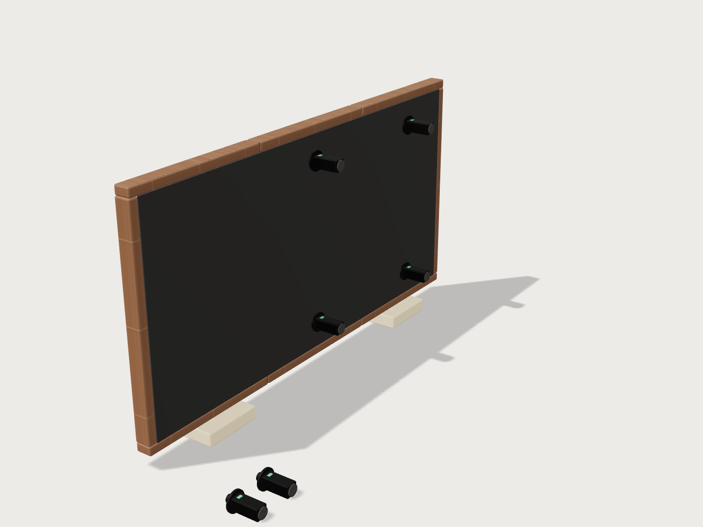 ／ 床下（低い視点。長辺の中央に黒い指掛け）: 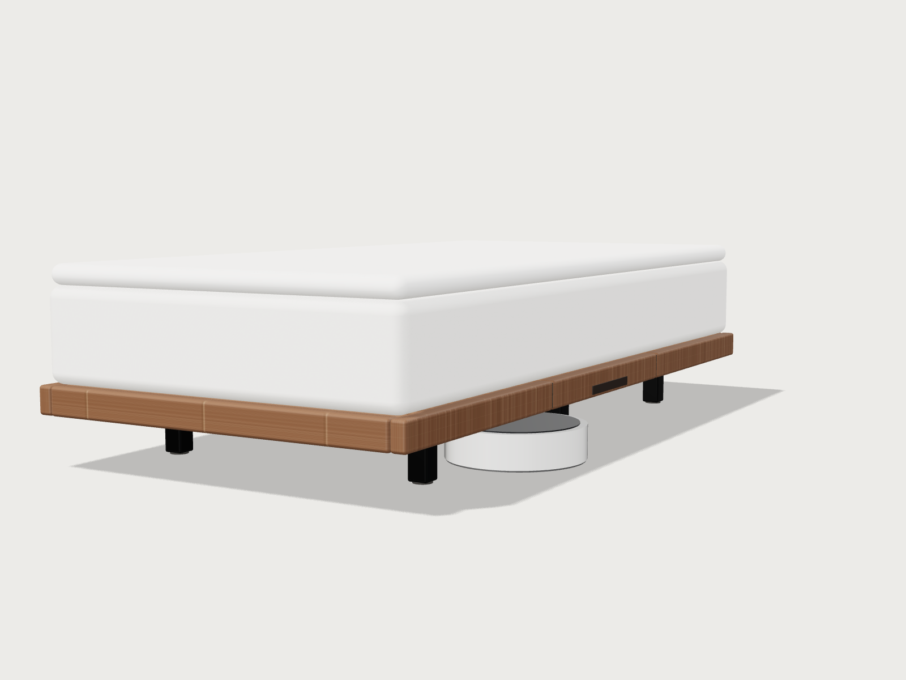 ／ 正面・側面: `C3-07-front.png`・`C3-07-side.png`

- **名称**: C3-07 UX改善「TATERU」
- **デザインコンセプト**: 「立てたまま、脚を差す。緑が見えたら、倒すだけ。」企画 3-4 の課題「重い本体を1人で裏返すのは負担」を体験設計で解いた案。箱の中のパルプの受け台がそのまま「立てて置く台」になり、開いた本体を長辺で立てたまま、腰の高さで下面のソケットに脚を横から差す。ロックすると脚の付け根に緑の窓が出る。最後に指掛けを持って手前に倒す。
- **ターゲット**: メインペルソナのうち、1人で組み立てる女性・腰に不安がある人。家具の組立で失敗した経験があり、「ちゃんと付いたか」が分からないことにストレスを感じる人（research §6「説明書が分かりにくい」[S24]）。
- **解決する課題**: 不満「組立の手間・精度」14.3%・「重い（女性1人で困難）」14.3%（research §6、[S55]）。脚付きベッドで最も重い作業＝本体を裏返す・持ち上げる動作をなくす。脚の付け忘れ・半差し（→ぐらつき・きしみ 17.1%）を緑の窓で防ぐ。掃除のときに片側を持ち上げたい場面（ロボットが入れない家具の移動など）には、長辺中央の指掛けで応える。
- **形状**: 外寸 W1000×L1980×H195mm（天面高、寝面高 約475mm）。三つ折り（1枚 660mm）。縁 40×70mm・角R8、スラット 幅56mm×8本／枚。長辺中央の縁の下側に指掛け（幅220×高さ22mm の凹み）。脚 50mm角×6本（外周から150mm 内側）、付け根に緑の窓。床下の有効高さ **125mm**。パルプの受け台 200×60×260mm×2（梱包の角当てを兼ねる）。
- **素材**: 縁・スラット 竹集成材（ウォールナット調）／脚 スチール角パイプ＋P3 プラグ＋ロック表示の樹脂スライダー（緑）＋フェルト／指掛け 縁の CNC 加工（黒の内塗装）／受け台 パルプモールド（再生紙）
- **CMF**: Color 縁・スラット ウォールナット調竹 `#6F4D35`（定番の濃色）、ナチュラル竹 `#D9B88A`（2色展開）。脚 マットブラック `#222222`、ロック窓 グリーン `#3FA66A`（ロックすると見え、外れると隠れる）、指掛け ダークブラウン `#2B2019`。Finish 艶消しウレタン（3分艶）。
- **機能**: 立てたまま脚を差せる手順（受け台で本体が自立）／ロック表示の緑窓（6本すべて緑なら完了）／脚は差して1/4回転（P3）／長辺中央の指掛け（片側を持ち上げて掃除・脚交換）／床下125mm・テーパーなし／保証耐荷重 S 250kg。**入れなかった機能**: 電子的なロック確認・アプリ（価格と故障のリスク。目で見えれば十分）、キャスター（床の上で動くと端座りの安定を損なう）
- **開梱〜就寝（必須）**: ①箱を倒し、持ち手ベルトで本体を引き出す ②パルプの受け台を床に置き、本体を長辺で立てたまま開く（ヒンジ自動ロック。下面が手前を向く） ③腰の高さで脚6本を横から差して1/4回す（緑の窓を確認、1本約5秒） ④指掛けを持って手前に倒す ⑤マットレスを載せる ＝ **5動作・約3分・工具0・部品7点・1人**【推測】（本体を裏返す・持ち上げる動作がない）
- **梱包（必須）**: 折りたたみ時 660×1000×210mm。受け台が梱包の角当てを兼ね、脚はその中に入る → 梱包 約690×1030×250mm（3辺合計 **約197cm**）、重量 **約22.5kg**【推測】
- **競合優位性**: 無印 脚付マットレスの「脚をねじ込むために裏返す・重くて1人では困難・締め不足できしむ」[S55] に対し、裏返さず・ねじ込まず・緑で確認。モダンデコの「説明書が分かりにくい・穴が合わない」[S24] に対し、手順そのものを箱と部品の形で示す。C1-07 SUTTO（箱から出す・運ぶ・しまう）とは、「脚の装着とロック確認」に絞った点で分ける。
- **製造方法**: コアデッキ（P1・P2）＋ソケット（P3）＋指掛けの CNC 加工。脚のロック表示は、P3 のプラグ内のばねで緑の樹脂スライダーが押し出される機構（射出成形の小部品2点を追加）。受け台はパルプモールドの型1型。工場での部品点数 本体 約63点／脚 各6点【推測】。新規金型 ロック表示スライダーの射出型1型（小）、パルプの型1型。量産の注意点: 立てた状態で本体が倒れないよう、受け台の幅と本体の重心の関係を試作で確認。
- **想定価格**: 税込 **47,800円**（SD 57,800円）。原価率 約32%【推測】。research 結論4 の範囲の中央。
- **デザイン意図（根拠）**: 企画 3-4 ③「裏返さずに済む手順（立てた状態のまま脚を差す）を STEP 3 で探る」と企画 4-3「UX改善は裏返さずに脚を差せる手順」に直接答えた。research 追加A のベンチマーク「開梱から寝られるまで5分以内・工具0・1人」を、動作の「重さ」まで含めて満たす。根拠: §6 組立 14.3%・重い 14.3%・きしみ 17.1%（[S24][S55]）、追加A、追加B（女性の継続作業は20kg が上限 [S33]）。SNS では「立てて・差して・倒す」3カットの時短動画になる。共有プラットフォーム部品: P1・P2・P3（ロック表示付きプラグは他コンセプトにも展開可）・P5・P6（受け台を追加）。

## 案C3-08 構造革新「HARI（梁）」

構造（本体を持ち上げ、中央の台座3つと細い補助脚4本を抜いた状態。下面の中央に黒い竜骨＝背骨、両端に補助脚を受ける腕）: 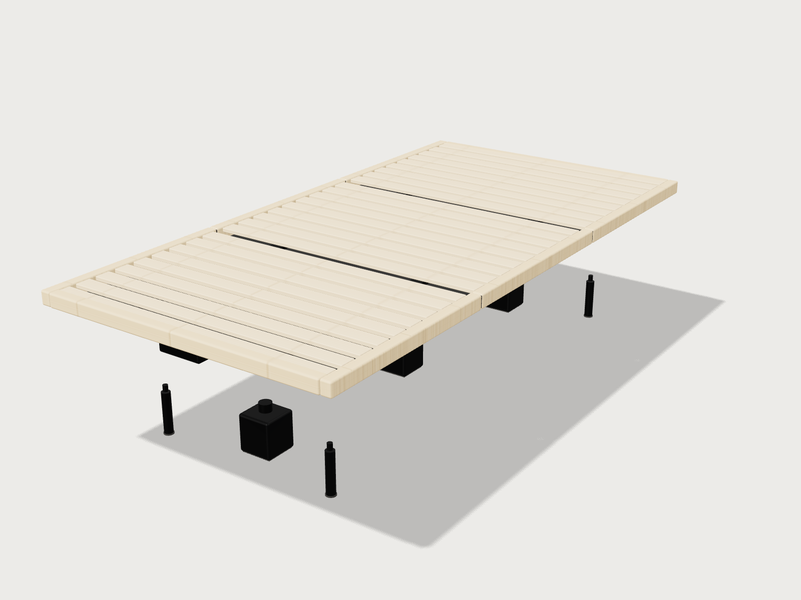 ／ 床下（低い視点。中央の太い台座と、縁寄りの細い補助脚だけが床に触れる）: 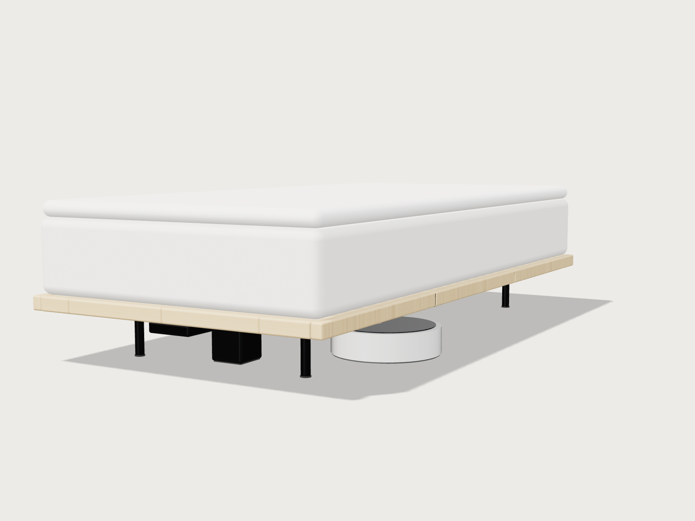 ／ 正面・側面: `C3-08-front.png`・`C3-08-side.png`

- **名称**: C3-08 構造革新「HARI」
- **デザインコンセプト**: 「背骨1本で支え、縁は薄く、床はほぼ全部あける。」荷重の大半を、デッキ下面の中央に通したスチールの竜骨（背骨）と、その真下の台座3つで受ける。縁は荷重を受けなくてよいので45mm まで薄くでき、端座りの荷重だけを細い補助脚4本（φ28）で受ける。床に触れる面積は脚6本案の約半分【推測】で、縁の下は床から約155mm 浮く。
- **ターゲット**: メインペルソナのうち、ロボット掃除機の「走行のしやすさ」まで比べる家電好きの30〜40代。脚の間を縫うロボットの動き（脚まわりの取り残し）が気になっている人。
- **解決する課題**: research 申し送り5「浮いて見える」と「端に座ったときの安定性」は相反する、を構造で解く。中央台座（フローティングの典型）は THE GOKUMIN の重さを支える剛性が要る（research 追加C ③ リスク）→ 竜骨で受ける。脚まわりの取り残し・ロボットの迷走（脚が多いほど増える【推測】）を、床に触れる点を中央に寄せて減らす。
- **形状**: 外寸 W1000×L1980×H202mm（天面高、寝面高 約482mm）。三つ折り（1枚 660mm）。縁 36×45mm・角R6、スラット 幅50mm×9本／枚。竜骨 140×32mm（パネルごとに1本、ヒンジのロックで1本の梁になる）。台座 110mm角×3（中心線上、各パネル1つ）。補助脚 φ28×4本（外周から200mm・両端から240mm 内側、竜骨から伸びる腕 640×20mm の先）。床下の有効高さ **125mm**（竜骨の下）、縁の下 約157mm。
- **素材**: 縁・スラット 竹集成材（明るいナチュラル）／竜骨 スチール角パイプ 140×32（粉体塗装）、腕 スチール平角／台座 スチール角パイプ＋P3 プラグ＋フェルト（床面 100×100）／補助脚 スチール丸棒＋小型プラグ＋フェルト／ヒンジ P2（竜骨どうしをくさびで締めてロック）
- **CMF**: Color 縁・スラット ナチュラル竹 `#DCBF94`、竜骨・台座・補助脚 マットブラック `#262626`。展開2色（ウォールナット調 `#6B4A33`）。Finish 竹は艶消しウレタン、スチールは細かいシボの粉体塗装。
- **機能**: 中央の竜骨＋台座3つで荷重の約8割を受ける【推測】／補助脚は端座り用（台座だけでは転倒するため必須、外すと本体が傾く＝付け忘れが分かる）／台座・補助脚とも差して1/4回転（P3）／床下125mm・テーパーなし／保証耐荷重 S 250kg。**入れなかった機能**: 補助脚なしの完全な中央台座（端座りの転倒リスク。10 のコンセプトモデルで扱う）、高さ切り替え（竜骨と腕の位置が固定のため、交換脚は 180mm の1種のみ）
- **開梱〜就寝（必須）**: ①持ち手ベルトで本体を引き出す ②立てたまま開く（ヒンジと竜骨のくさびが自動ロック） ③台座3つと補助脚4本を差して1/4回す ④床に倒す ⑤マットレスを載せる ＝ **5動作・約4分・工具0・部品8点（本体1＋台座3＋補助脚4）・1人**【推測】（部品は10案で最も多いが、補助脚は軽く小さい）
- **梱包（必須）**: 折りたたみ時 660×1000×231mm（縁45＋竜骨32 の77mm×3枚）→ 梱包 約690×1030×265mm（3辺合計 **約198.5cm**）、重量 **約21.5kg**【推測】（縁が薄い分だけ竹が減り、スチールの竜骨が増える）
- **競合優位性**: 海外の LED 付きフローティングベッド（中央台座）[S40][S41] と国内の脚10本のフローティング品 [S42] の中間の答え。前者の「端に座ると不安」、後者の「脚が多く金属の組立式に見える」に対し、中央台座＋細い補助脚で浮遊感と安定を両立。タンスのゲン パレット（床下11cm）[S65] より床下が高く、脚まわりの取り残しも少ない【推測】。
- **製造方法**: 竜骨・腕はスチールの切断・溶接・粉体塗装（パネルごとに1組、計3組）、コアデッキの竹部分は縁が薄い分だけ CNC が軽い。台座・補助脚は P3 の共通プラグ。工場での部品点数 約58点【推測】。新規金型 竜骨のくさびロック用の小型プレス型1型。量産の注意点: 竜骨のくさびロックの予圧管理（ガタ→きしみ）、中央パネルの台座に荷重が集中するため台座の座屈と床へのへこみ（床面 100×100 のフェルトで分散）を試験。端座り時の補助脚の荷重（1本あたり最大 約120kg を想定）。
- **想定価格**: 税込 **48,800円**（SD 58,800円）。原価率 約33%【推測】（スチールが増え竹が減る。差し引きで C3-01 と同程度）。research 結論4 の範囲の中央。
- **デザイン意図（根拠）**: 企画 4-3「構造革新は中央台座（センタービーム）＋小さな補助脚で浮遊感と端座り安定を両立」を形にした。research 申し送り5「脚の配置案を複数出す」のうち、4本（C3-02）・6本（C3-01 ほか）と並ぶ第3の配置。荷重を中央に集めることで「縁を薄くできる＝竹の使用量と重量が減る」というコスト面の効果も狙う（企画 0-4 の竹＋スチールの役割分担を徹底した形）。根拠: research §10 フローティングの再流行 [S40][S41]・国内品 [S42]、追加C ③ リスク（安定性・剛性）、結論5。SNS の「ロボット掃除機が床下を抜ける」カットで、脚がほとんど写らない。共有プラットフォーム部品: P2（竜骨ロックを追加）・P3・P5・P6（P1 は縁を薄く変更）。

## 案C3-09 少し挑戦的「TERASU（照らす）」

構造（本体を持ち上げ、脚6本を抜いた状態。下面の外周から60mm 内側に下向きの電球色 LED の線）: 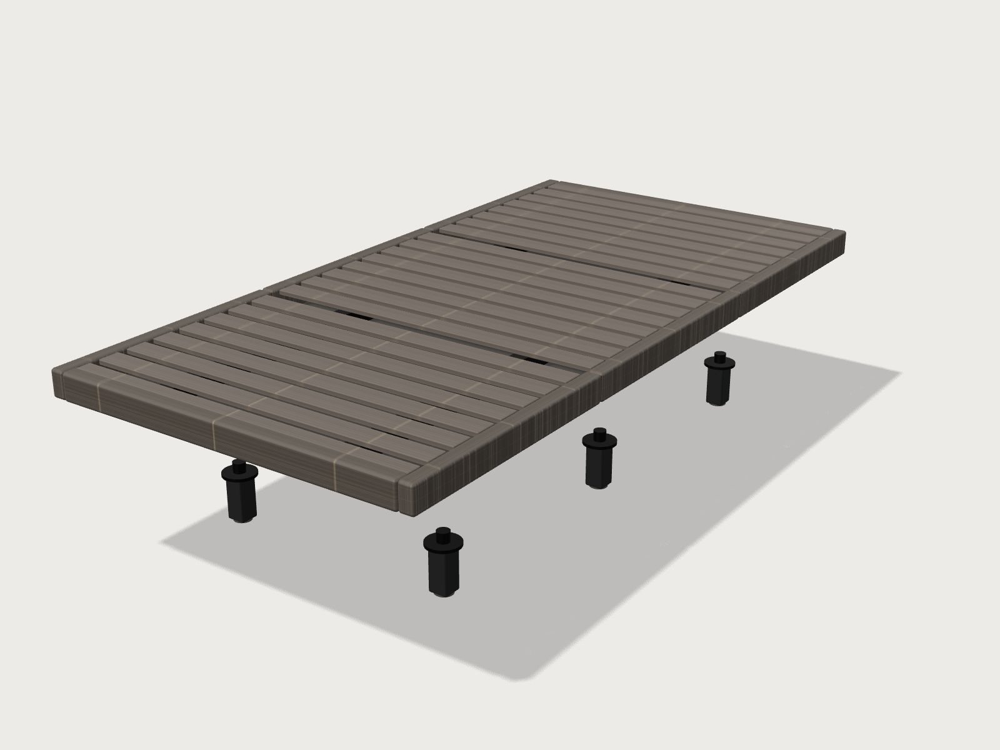 ／ 夜の床下（低い視点。人やロボットの動きで床下灯が点き、床のホコリの有無が見える）: 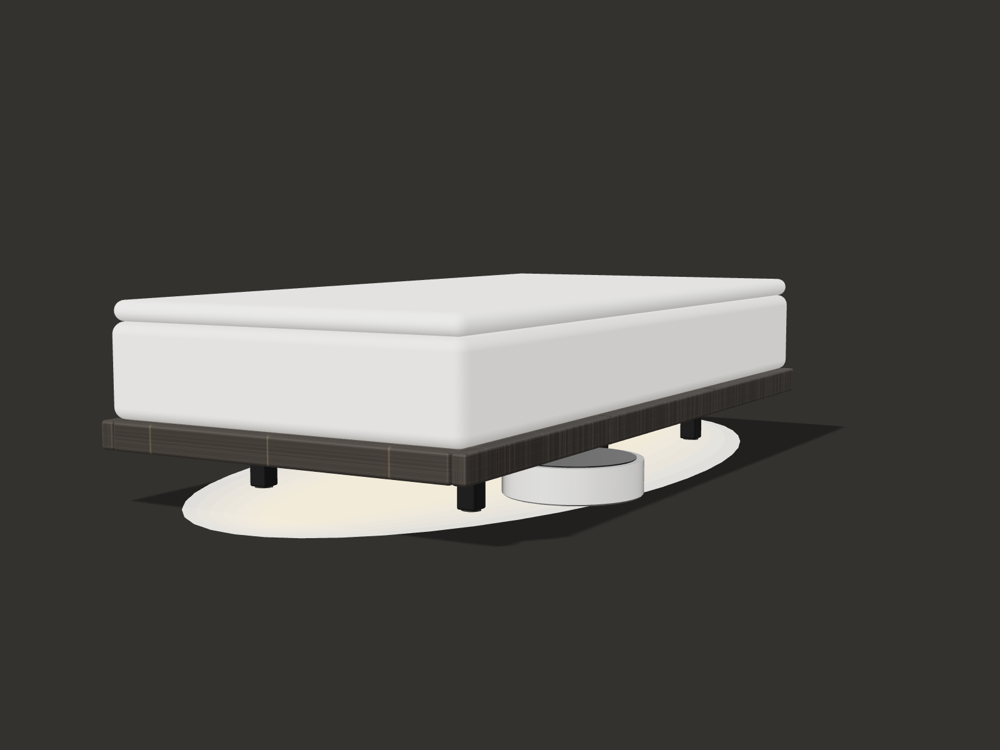 ／ 正面・側面: `C3-09-front.png`・`C3-09-side.png`

- **名称**: C3-09 少し挑戦的「TERASU」
- **デザインコンセプト**: 「ベッドの下を、隠さず照らす。」ベッド下は「見せない場所」という常識を1つだけ崩す。デッキ下面の外周から60mm 内側に、下向きの電球色（2700K）の線状 LED を1周入れ、床に柔らかい光だまりをつくる。光が床を斜めに照らすので、ホコリがあれば見え、なければ「きれいな床」が浮かぶ。浮遊感は夜にいちばん強くなる。
- **ターゲット**: メインペルソナのうち、寝室を「ホテルのように保ちたい」気持ちが強く、夜中のトイレ・子どもの様子見で足元灯を使っている30〜40代。SNS に寝室の写真を載せる人。
- **解決する課題**: 「掃除したつもりでも、ベッド下は暗くて見えない」（【推測】ロボット掃除機の取り残しの確認）。夜中の足元の暗さ（足元灯の需要）。research §13 の投稿の型③「浮いて見える寝室」の写真が、照明で最も強く撮れる。
- **形状**: 外寸 W1000×L1980×H195mm（天面高、寝面高 約475mm）。三つ折り（1枚 660mm）。縁 40×70mm・角R8、スラット 幅56mm×8本／枚。LED 線 幅10mm（下面の外周から60mm 内側・全周、アルミのチャンネルに埋め込み、光源が直接見えない）。脚 50mm角×6本（外周から200mm 内側、艶のない黒）。床下の有効高さ **125mm**。
- **素材**: 縁・スラット 竹集成材（炭色に染色）／LED 電球色 2700K の COB テープ＋乳白の拡散カバー＋アルミチャンネル（パネルごとに分割、ヒンジ部はばね接点で通電）／人感センサー（頭側の下面に1個）／電源 USB-C 給電（5V、ケーブル1本を頭側から出す）／脚 スチール＋艶消し黒＋P3 プラグ
- **CMF**: Color 縁・スラット 炭色の竹 `#3E3A36`（チャコール、差別化色）、脚 `#161616`、光 電球色 `#FFCF8A`（2700K 固定・色は変えない）。展開2色（ナチュラル竹 `#D9B88A`）。Finish 艶消しウレタン（3分艶）、拡散カバーは乳白マット。
- **機能**: 床下灯（人感センサーで点灯・30秒で消灯、明るさ2段、常時点灯も可）／光は2700K 固定で色変え・点滅・音楽連動なし／ロボット掃除機の走行中は点けない設定も可【推測】／脚は差して1/4回転（P3）／床下125mm・テーパーなし／保証耐荷重 S 250kg。**入れなかった機能**: RGB の色変え・ネオン演出（research 結論2・§9 [S41]、企画 3-6 の NG）、スマートスピーカー連携（価格と古びやすさ）
- **開梱〜就寝（必須）**: ①持ち手ベルトで本体を引き出す ②立てたまま開く（ヒンジ自動ロック・パネル間の通電も自動） ③脚6本を差して1/4回す ④床に倒す ⑤USB-C ケーブルを差してマットレスを載せる ＝ **5動作・約4分・工具0・部品8点（本体1＋脚6＋ケーブル1）・1人**【推測】
- **梱包（必須）**: 折りたたみ時 660×1000×210mm → 梱包 約690×1030×250mm（3辺合計 **約197cm**）、重量 **約23kg**【推測】（LED・チャンネル・センサーで約0.6kg 増）
- **競合優位性**: 国内の「空中ベッド」（脚10本・人感センサーライト・1000kg 表記）[S42] と海外 TikTok の LED フローティングベッド [S41] の「派手な光・安っぽい」に対し、光源を見せない電球色1色・竹の質感・ネジゼロで大人の寝室にする。ほかの国内ロボ対応ベッド [S8] にはない「床下を見せる」価値。
- **製造方法**: コアデッキ（P1・P2・P3）に、下面の LED 溝の CNC 加工、アルミチャンネル＋LED の組込み、ヒンジ部のばね接点、センサー基板の取り付けを追加。電気用品の安全確認（PSE の対象範囲は USB 給電で最小化【推測】）。工場での部品点数 約72点【推測】。新規金型 ばね接点の小型プレス型1型、センサーカバーの射出型1型。量産の注意点: 三つ折りの開閉を繰り返したときの接点の耐久（1,000回）、LED の発熱と竹の変色、断線時の交換性（パネルごとにユニット交換できる構造）。
- **想定価格**: 税込 **52,800円**（SD 62,800円）。原価率 約36%【推測】（電装で約2,500円増）。research 結論4 の範囲の上側。
- **デザイン意図（根拠）**: 企画 4-3「少し挑戦的は電球色の足元灯を床下に控えめに入れる（色変えは NG）」に、清掃性の意味（照らすことで床のきれいさを見せる）を重ねた。research 結論2・§9「LED の色変え演出は古びやすい（S41）、照明は電球色の足元灯程度に抑える」を守ったうえで、research §13 の SNS の型③を最も強く撮れる案にした。【推測】照明付きは「古びる・壊れる」リスクがあるため、LED はパネル単位で交換できる設計とし、照明なしの派生（＝C3-01 に近い）にも戻せる。根拠: §9・§13 [S41][S42]、結論2、企画 3-4 の足元灯の記述。共有プラットフォーム部品: P1・P2（通電接点を追加）・P3・P6。

## 案C3-10 コンセプトモデル「KUU（空）」

構造（本体を持ち上げ、透明な脚4本を抜いた状態。足側の下面に、ロボット掃除機の充電ドックが吊り下がる）: 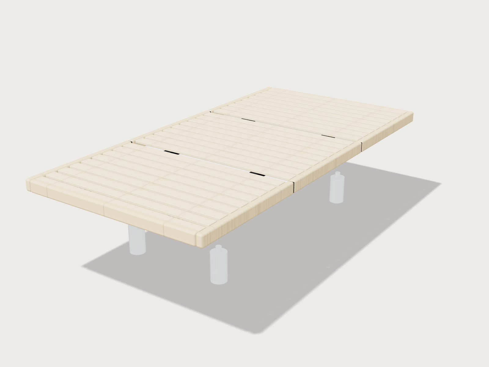 ／ 床下（低い視点。ロボット掃除機が足側の床下のドックで待機している）: 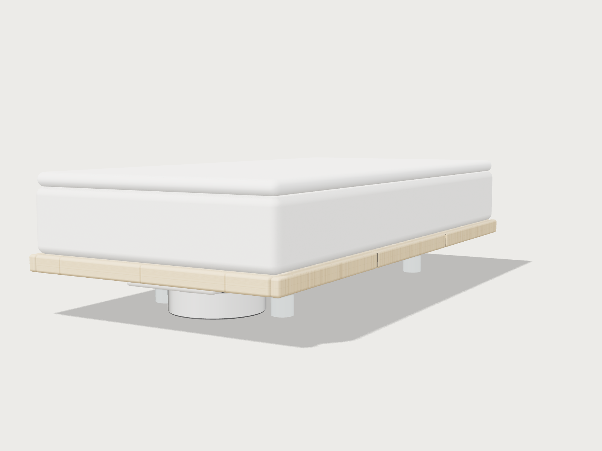 ／ 正面・側面: `C3-10-front.png`・`C3-10-side.png`

- **名称**: C3-10 コンセプトモデル「KUU」
- **デザインコンセプト**: 「床に触れず、掃除する者も住まわせる。」数年先の理想像。脚は透明なポリカーボネートの柱4本を外周から250mm 内側に置き、床下の白い下面が光を返して、ベッドが床から完全に浮いて見える。さらに、ロボット掃除機の充電ドックをベッドの足側の下面に吊り下げて内蔵し、ロボットの「家」をベッドの下に置く。部屋の床から、ベッドの脚もロボットの基地も消える。
- **ターゲット**: 【推測】2029年前後の、ロボット掃除機が当たり前になった世帯（普及率 約10〜15% [S35] から拡大）。ワンルーム〜1LDK で、ロボットの基地を置く場所に困っている人。GOKUMIN が「寝室の清潔をまるごと引き受けるブランド」になる姿を示す、ブランド発信用のモデル。
- **解決する課題**: ロボット掃除機の基地の置き場所（部屋の隅を占有し、コードが出る）【推測】。ベッドの脚が床を分断し、ロボットの走行を複雑にする（C3-08 の課題の延長）。research §16 空白 C「浮いて見える」を極限まで進める。
- **形状**: 外寸 W1000×L1980×H210mm（天面高、寝面高 約490mm）。三つ折り（1枚 660mm）。縁 34×60mm・角R10、スラット 幅52mm×9本／枚。下面 ウォームホワイト。脚 φ80 透明×4本（外周から250mm・両端から430mm 内側）、床下の有効高さ **150mm**（10案で最も高い標準）。ドック 360×40×90mm（足側の端から170mm、下面から吊り下げ、床には置かない。下端は床から110mm）。
- **素材**: 縁・スラット 竹集成材（明るいナチュラル）／下面板 竹合板＋ウォームホワイト塗装（光を反射して「影を消す」）／脚 ポリカーボネートの無垢の柱（内部にスチール芯を入れない場合の強度は【未確認】）＋P3 プラグ（透明樹脂＋ステンレス）／ドック ABS＋充電接点＋電源ケーブル（頭側に配線）
- **CMF**: Color 縁・スラット ライトナチュラル竹 `#E0C69E`、下面 ウォームホワイト `#F1EDE6`、脚 クリア（わずかに青みの透明 `#E8F1F3`）、ドック ライトグレー `#E6E2DB`。Finish 竹は艶消しオイル調、脚は磨きの透明、下面はマット。
- **機能**: 透明脚（差して1/4回転、P3）／床下150mm・テーパーなし／ロボット掃除機のドック内蔵（主要メーカーの充電接点に合わせたアダプター式【推測】）／保証耐荷重 S 250kg を目標（透明脚の強度・クリープは要検証）。**入れなかった機能**: 自動でゴミを集める据え置きステーション（大きく床下に入らない）、照明
- **開梱〜就寝（必須）**: ①持ち手ベルトで本体を引き出す ②立てたまま開く（ヒンジ自動ロック） ③透明脚4本を差して1/4回す ④床に倒す ⑤ドックの電源ケーブルを差し、マットレスを載せる ＝ **5動作・約3分30秒・工具0・部品6点（本体1＋脚4＋ケーブル1）・1人**【推測】
- **梱包（必須）**: 折りたたみ時 660×1000×180mm（縁60mm×3枚、ドックは下面に付いたまま）→ 梱包 約690×1030×220mm（3辺合計 **約194cm**）、重量 **約20kg**【推測】（縁が薄く、脚が4本）
- **競合優位性**: 既存のロボ対応ベッド（床下11〜12cm [S8][S65]）が「ロボットが入れる」に留まるのに対し、「ロボットがベッドに住む」という一段先の関係をつくる。海外の LED フローティング [S41] が光で浮かせるのに対し、透明な脚と白い下面で「光を使わずに」浮かせる。
- **製造方法**: コアデッキ（P1・P2）＋下面の白塗装＋ドックの吊り下げ部。透明脚はポリカーボネートの押出丸棒の切断・研磨（または射出成形）。ドックは射出成形（ロボットメーカーとの共同開発が前提）。工場での部品点数 約60点【推測】。新規金型 ドックの射出型（中規模）。**量産の課題と道筋**: ①透明脚の長期荷重（クリープ）と傷→ 中心にステンレスの細い芯を入れた「透明に見える」脚で解く ②ドックの機種互換→ 主要2社の接点に合わせたアダプターを別売りにする ③電気用品の安全（PSE）とロボットメーカーとの責任分担→ まずは「ドックなし・透明脚のみ」の派生として量産し、ドックは提携が決まってから追加する。
- **想定価格**: 参考 税込 **59,800円**（ドック付き。ロボット掃除機は含まない）。原価率 約40%【推測】。research 結論4（③ 44,800〜54,800円）を超える理由: 透明脚・ドックの開発費。量産時は「透明脚のみ」で 49,800円を目標。
- **デザイン意図（根拠）**: 企画 4-3「コンセプトモデルは床から完全に浮いて見える極端な引っ込み脚」を、脚を「黒で消す」（C3-03）でも「床と同化させる」（C3-04）でもなく「透明にする」ことで表現し、さらにロボット掃除機市場の成長（年16.9% [S36]、普及率 10〜15% [S35]）の先にある「ベッドとロボットの共生」を示した。すぐに量産しなくてよい案として、Manufacturability と Cost が低いことを前提にする（上の道筋を参照）。根拠: §16 空白 C、追加C ③ [S35][S36][S37][S38]、§10 [S40][S41]。SNS では「ロボットがベッドの下から出てきて、また帰る」動画が撮れる。共有プラットフォーム部品: P1・P2・P3・P6。

## 自己レビュー
### 採点表
重み（企画 3-7）: Market Fit 15%／Design 18%／Originality 12%／Usability 20%／Manufacturability 15%／Cost 10%／Brand Fit 10%。各軸 1〜5点。

| No | Market Fit | Design | Originality | Usability | Manufacturability | Cost | Brand Fit | 加重平均 |
|---|---|---|---|---|---|---|---|---|
| C3-01 UKI | 5 | 4 | 3 | 4 | 5 | 4 | 4 | **4.18** |
| C3-02 KAGE | 4 | 5 | 3 | 3 | 3 | 5 | 4 | 3.81 |
| C3-03 RIN | 4 | 5 | 3 | 4 | 3 | 3 | 5 | 3.91 |
| C3-04 KUMO | 4 | 4 | 4 | 4 | 3 | 4 | 3 | 3.75 |
| C3-05 NOBI | 5 | 3 | 4 | 5 | 3 | 3 | 4 | 3.92 |
| C3-06 SUMI | 3 | 4 | 5 | 4 | 3（修正前 2） | 3（修正前 2） | 4 | 3.72 |
| C3-07 TATERU | 5 | 4 | 4 | 5 | 4 | 4 | 4 | **4.35** |
| C3-08 HARI | 4 | 4 | 4 | 4 | 3 | 4 | 3 | 3.75 |
| C3-09 TERASU | 3 | 4 | 5 | 4 | 3 | 3 | 3 | 3.62 |
| C3-10 KUU | 2 | 4 | 5 | 4 | 2 | 2 | 5 | 3.42 |

採点の理由（1行ずつ）
- **Market Fit**: 01・05・07 は企画ペルソナの検索語（ロボ対応・床下12cm・高さ調節）と価格帯の中心に直結＝5。09 は照明が好みを分け、10 は価格・時期が先＝2〜3。06 は素材の良さが EC のサムネイルで伝わりにくい＝3。
- **Design**: 02（線と影）・03（器と真鍮線）は完成度が高い＝5。05 は伸縮脚の金属感とボタンの色が道具っぽい＝3。
- **Originality**: 01・02・03 はフローティングの定石の範囲＝3（01 は脚ユニットの交換と平らな下面で競合との差は出る）。06・09・10 は国内に同種がない＝5。
- **Usability**: 05（脚を買い替えずに高さ変更）・07（裏返さない・ロック確認）＝5。02 は脚4本で端座りの安定が最も厳しい＝3。
- **Manufacturability**: 01 は P1〜P3 の共通部品だけでできる＝5、07 は小部品追加のみ＝4。02（中央パネルを脚なしで受ける）・03（炭化竹の色選別・24kg）・04（不透明塗装・脚の型）・05（伸縮部のガタ管理）・06（押出材の反り）・08（竜骨のくさび）・09（電装）＝3。10 は透明脚のクリープとドックの互換＝2。
- **Cost**: 02 は部品が最少で原価率 約30%＝5。03・05・06・09 は原価率 34〜36%＝3。10 は約40%＝2。
- **Brand Fit**: 03（炭化竹の上位）・10（「寝室の清潔を引き受ける」ブランド像）＝5。04（塗装で竹が見えない）・08（スチールが主役）・09（電装で「竹の完成品」から離れる）＝3。

### 各案の講評
- **C3-01 UKI**: 企画 3-1 の素直な実装。量産性とコストは10案で最良。弱点は見た目の新しさ（Originality 3）で、差は「脚の交換」「床下125mm の実走確認表示」で伝える必要がある。
- **C3-02 KAGE**: 最も美しく安い入口モデル。ただし脚4本・中央パネル脚なしは、端座り安定とたわみの試作確認が必須。
- **C3-03 RIN**: ブランドの最上位にふさわしい。24kg・200サイズぎりぎりで、これ以上縁を厚くできない。
- **C3-04 KUMO**: 今の内装に最も合う。塗装で竹の質感が消えるため、竹のブランドとしては中庸。
- **C3-05 NOBI**: 空白 C を最も直接に取る。伸縮部のガタ＝きしみの原因にならない設計が成否を分ける。
- **C3-06 SUMI**: 清掃性を素材で解く独自案。竹炭の効能は【未確認】のため数値で訴求しない。材料開発のリードタイムが長い。
- **C3-07 TATERU**: 01 の骨格に「裏返さない手順」と「ロックの見える化」を足しただけで、Usability が最も高い。追加コストは小さい。
- **C3-08 HARI**: 浮遊感と端座り安定の両立を構造で示した。部品8点・補助脚の付け忘れ対策（傾いて分かる）が要確認。
- **C3-09 TERASU**: SNS の「浮遊感」カットでは最強。照明の好み・故障・PSE の論点があり、単独の主力より限定色・上位オプション向き。
- **C3-10 KUU**: ブランドの方向を示す将来像。量産は「透明に見える芯入り脚のみ」から段階的に（案の本文に道筋を記載）。

### レビューで修正した点
| 案 | 修正前 | 修正後 | 点数の変化 |
|---|---|---|---|
| C3-06 SUMI | 縁と下面を「パネル1枚＝1ショット」の射出圧縮成形で一体成形（660×1000mm の大型金型 2〜3型、数千万円規模【推測】） | 縁＝押出形材（断面1種）＋コーナーキャップ（射出）、下面＝同素材シートを熱溶着。見える継ぎ目がない点は維持 | Manufacturability 2→3、Cost 2→3（加重平均 3.47→3.72） |
| C3-03 RIN | 縁の見付け 110mm・マットレスを40mm 沈める | 縁 84mm・30mm 沈める。110mm だと折りたたみ330mm で梱包が約208cm になり、宅急便200サイズ（[S31]、企画 0-1）を超えるため | Manufacturability 2→3（梱包条件を満たした） |
| C3-04 KUMO | 外寸 W1060×L2040・平面 R150・縁80mm | W1040×L2010・R130・縁64mm。梱包が約207cm になっていたため | Manufacturability 2→3 |
| C3-08 HARI | 竜骨の高さ 60mm | 32mm。三つ折りの重ね厚が 315mm になり梱包が200サイズを超えるため。縁の下の浮き（約185→157mm）は小さくなった | Manufacturability 2→3、Design 5→4 |
| C3-03 RIN（画像） | 炭化竹の色が赤茶に見えた | `#4F3526` に濃くしてダークウォールナットに寄せた | — |
| C3-03 RIN（画像） | 梁がスラットより上に突き出ていた（scene の破綻） | 梁の高さを器の底より下に修正して描き直した | — |

- やり直し基準の確認: 01〜08 で Market Fit・Manufacturability・Cost が2点以下の案は、修正後はなし。Usability 2点以下なし。Originality 2点以下なし。10 は Market Fit 2・Manufacturability 2・Cost 2 だがコンセプトモデルのため許容（理由と実現への道筋は案の本文「製造方法」に記載）。09 は Market Fit・Manufacturability・Cost が3点で基準内。

### 推奨上位3案とその理由
1. **売れる確率が最も高い案: C3-07 TATERU（加重平均 4.35、1位）** — 形は市場の中心（01 と同じ黒脚6本のフローティング・床下125mm）のまま、ペルソナの最大の手間「重い本体を裏返して脚を付ける」をなくし、ロック確認を緑の窓で見せる。レビュー1位の不満（組立・きしみ・重い、research §6）に最も多く同時に答え、追加コストは小さい。ウォールナット調の完成形は THE GOKUMIN とのセット写真にもなじむ。
2. **差別化が最も強い案: C3-05 NOBI（3.92）** — 空白領域 C「床下の高さをワンタッチで変えられる」（research §16）を、交換ではなく「1本の脚の伸縮」で満たす。競合の高さ調節（ねじ込み [S14]・継脚 [S19]）との差が1枚の画像で伝わり、収納とロボット掃除の両立という③のリスク（[S42]）にも答える。伸縮脚は P3 規格なので①②の購入者にも売れる。
3. **ブランド価値を最も高める案: C3-03 RIN（3.91）** — 炭化竹の器に THE GOKUMIN を沈め、脚を闇に消す「ホテルの寝室」。research §3 の「7万円クラスのマットレスに見合うフレーム」を③で担い、価格帯の上限（54,800円）で GOKUMIN の格を示す。
- 補足: 加重平均2位の **C3-01 UKI（4.18）** は、07 から緑のロック窓と受け台を除いた最安構成。STEP 5 で 07 を選ぶ場合も、01 を「スタンダード」、07 を「かんたん組立仕様」とする2段構えにできる。

## ユーザーに判断してほしいこと
1. **床下の標準高さ**: 標準脚を125mm（寝面高 約475mm）とした。ロボット掃除機の通過（12cm以上 [S37][S38]）と寝面高 50cm 前後（research §10）の両立のため。ほぼ全機種に余裕を持たせる150mm を標準にするか（寝面高 約500mm）
2. **高さ変更の方式**: 「交換脚を別売り（01 など、4,980円）」と「伸縮脚を標準（05、本体 +3,000円程度）」のどちらを③の基本にするか
3. **脚の本数**: 6本（安定・たわみに有利）を基本とし、4本（02・10）と中央台座（08）は試作で端座り試験をしてから判断する進め方でよいか
4. **照明（09）**: 電球色1色・人感センサーの床下灯は「過剰な LED 演出」に当たらない範囲と判断したが、ブランドとして照明付きを出すか
5. **素材の新規開発（06）**: 竹繊維＋竹炭のコンポジットを素材メーカーと開発するか（リードタイムが長く、③の2027年秋発売には間に合わない可能性）

## 前提・仮説・未確認事項
- 【推測】重量・梱包・原価率・部品点数・金型規模・組立時間は、寸法と一般的な材料からの見積もり。試作での実測が必要（企画 0-1 の目標値との照合）
- 【推測】端座りの安定性は、脚が外周から150〜250mm 内側にあるため全案で要試験（research 追加C ③ の検証: 端に100kg の荷重試験）。特に 02（脚4本）・08（台座＋補助脚）・10（透明脚4本・250mm 内側）
- 【推測】ロボット掃除機の高さは約100mm（上部のセンサーを含む）で描画した。7.98cm の超薄型機 [S39] から10cm 超の機種まであるため、主要3機種での実走試験（research 追加C ③）を STEP 5 以降で行う
- 【未確認】竹炭の抗菌・消臭効果（06）、透明ポリカーボネート脚の長期荷重（10）、PSE の対象範囲（09・10）
- 【推測】三つ折りの本体を長辺で立てたまま開く手順（全案の②）は、①の開き方（企画 1章）と同じ前提。立てた状態での自立と倒すときの安全は 07 の受け台で最もよく担保される
- 共有プラットフォーム（P1〜P6）の使い方は各案の「デザイン意図」末尾に記載。P4（GOKUMIN RAIL の溝）は③の全案で入れていない（コストと見た目を優先。企画の判断してほしいこと5 に従い STEP 5 で決める）

## 次工程（A3プレゼンボード）への申し送り
- 各案のボードは、メイン（`C3-XX-three-quarter.png`）＋構造（`-structure.png`）＋床下（`-robot.png`）の3カットを基本に。床下カットは③の価値（ロボットが通る・浮いて見える）を最もよく伝えるため、メインと同じ大きさで扱うことを推奨
- C3-05 はメインでトレーを引き出した状態（床下180mm）を描いた。構造カットで3段の脚を並べているので、「125／180／250」の数字はボード側で添える
- C3-07 の構造カットは「組立の途中」（立てて脚を差す）。手順①〜⑤の図解をボード側で組むと、案の価値が伝わる
- C3-09 の床下カットは夜の設定（背景が暗い）。一覧で浮かないよう、ボードでは夜のカットとして明示する
- 画像には文字を入れていない。寸法（床下125mm・寝面高・梱包3辺）、開梱〜就寝の動作数と時間はボード側で組むこと
- 一覧画像 `contact-sheet.png` は床下が見える低い視点（`-robot.png`）で並べた。メインの斜めビューでの一覧が必要なら、同じ HTML の画像名を `-three-quarter.png` に替えて書き出せる
