# STEP 3 プロダクトデザイン10案 v2 — コンセプト① 完全組立不要ベッド「起こすだけヘッドボード」
- 作成: product-designer ／ 2026-09-30 ／ 入力: `research/research.md`（v2）, `research/notes/v2-premium-beds.md`, `research/notes/v2-headboard-types.md`, `product/02-planning-v2.md`（0章・1章・4章）, `brief.md`（v2 の条件）, `handoff.md`, `decisions.md`（承認済みの決定なし）, `research/01-research-feedback.md`, `research/00-input.md`, `projects/_studio/preferences.md`, `projects/_studio/brand.md`, `scripts/render3d/README.md`
- 凡例: 【推測】=調査の裏付けがない見積もり・仮定（寸法・重量・原価率・所要時間はすべて試作前の推定）
- **v1 からの変更点**: v1 の10案（`product/03-design-v1-c1.md`）は全案ヘッドレスで、細い角材のすのこに見えたため不採用。v2 は **全10案ヘッドボード込み**、**10万円帯（S 89,800〜149,800円）の質感**、**「起こすだけヘッドボード」を軸にした新しい切り口**で作り直した。v1 から引き継いだのは三つ折りデッキの折り目位置（約65cm・130cm）と THE GOKUMIN の重量条件だけ
- 画像: `product/designs/v2/c1/`（scene JSON は `gen-scenes.mjs` で生成、`render-one.sh C1-XX` で再描画できる）

## サマリー
- 10案すべてが「箱から引き出して開き、ヘッドボード（HB）を起こすだけ」で完成する。HBは本体とヒンジでつながった床着地の構造で、**ユーザーが扱う部品は1点（C1-04・05・09 のみ2点）、工具0、ネジ0、女性1人**。
- HBの型は **フラット竹／薄板竹／縦の畝／アーチ布張り／薄型ニッチ／網代編み／額縁クッション／門型の柱／ハイバック＋ウィング／ワイドの壁＋ナイトボックス** の10通り。高さは床から **780〜1100mm**、素材は竹4種と布4色に分けた。
- 推奨上位3案: **C1-07 ICHIDO**（売れる確率が最も高い）、**C1-08 SEBONE**（差別化が最も強い）、**C1-03 SUMI**（ブランド価値を最も高める）。王道の C1-01 OKOSU は C1-07 の土台として残す。
- 勝ち筋「国産竹の剛性とホテルのようなHBを、1人・工具なし・10分で“起こす”だけで完成させ、S 99,800円で売る」（research 結論6）に対し、C1-01・02・07 は価格の中心、C1-03・06・09 は上位、C1-10 は将来のブランド発信を受け持つ。

## デザインの前提（research.md から引き継いだこと）
- **ターゲット**: 28〜39歳の共働き夫婦・同棲カップル（都市部、2〜5年で住み替え）。THE GOKUMIN の購入者・検討者（research 結論3、企画 1-2）
- **価格**: S 99,800円／SD 109,800円／D 119,800円（HB込み）を中心に、帯 S 89,800〜109,800円。国内HB付き19商品の中央値 99,900円（research 結論4、§3）
- **デザイン方向**: 竹の本体＋竹または布のHB、もたれられる低めのパネル型（床から80〜90cm、厚み8〜12cm、もたれ角5〜10度）、角R・やわらかい曲線（research 結論5、§10）
- **避けるべきデザイン**: ヘッドレス、ボルト留めの重いHB、クランプ1点のHB、深い宮棚、洗えない布張り、LEDの“光るだけ”、本体色を増やすこと（research 結論2）。加えて「安いすのこ・簡易ベッドに見えること」（企画 1-6、research 結論6 リスク①）
- **勝ち筋**: 空白A（国内×HB込み×1人・工具なし・10分以内×9〜13万円）と空白B（一番重くてぐらつくHBの組立をなくす）を同時に取る（research §16、結論6）
- **設計ルール**: 企画 0-3 の R1〜R7（HBは床着地、クランプ1点なし、自重で締まる、ロックが見える、金属どうしを当てない、もたれ耐久、HBは届いた日から付いている）

### 10案に共通する仕様（各案で違う点だけを案ごとに書く）【推測】
| 項目 | 共通仕様 |
|---|---|
| 本体の構造 | 三つ折りデッキ（頭・腰・足の3区画。折り目は頭側から約65cm・130cm で腰の位置を避ける）。見える面は国産竹の集成材、荷重部は中空スチール芯（見えない位置）。デッキ天面は竹の無垢板張りで、外からすのこの隙間を見せない |
| HBの取り付け | 頭側区画の端に **HBヒンジ（スチール芯を通した回転軸）**。HBの下半分は **床着地の脚フラップ**で、HBを起こすとリンクで脚フラップが下りて床に着き、くさびが本体の頭側と噛み合う（R1・R3）。起こし切ると「カチッ」という音と、側面の色の目印でロックが分かる（R4） |
| デッキの脚 | 開くとリンクで起きる連動脚。外から見えない位置まで奥に引っ込め、影に見せる（浮いて見える） |
| 開梱〜就寝（基本の4動作） | ① 箱を横に倒し、持ち手ベルトで本体を床に引き出す（持ち上げない）→ ② 床の上で三つ折りを開く（脚は連動で起きる）→ ③ HBを起こす（脚フラップが床に着いてロック）→ ④ マットレスを載せる |
| 工具・ネジ | 工具0、ユーザーが締めるネジ0。フェルト・静音パッド・ロックは工場で取り付け済み |
| 分解 | 逆の手順（HBのロック解除レバーは両手で引く2か所。子どもの誤操作対策）で、同じ箱に戻せる（切り口6） |
| 保証・耐荷重 | 保証耐荷重 S 250kg。フレーム構造10年保証、布・電装2年（企画 0-4）【推測】 |
| 共通プラットフォーム | P1 竹デッキ、P3 床着地脚とくさび継手、P5 CMF、P6 梱包規格は全案で使用。P2（HBフェイス規格）・P4（電源差し込み口）は案ごとに記載 |

## 10案の一覧
| No | タイプ | 名称 | 一言コンセプト | 想定価格（S・税込） | 主素材 | ビジュアル |
|---|---|---|---|---|---|---|
| C1-01 | 王道・市場適合型 | OKOSU（おこす） | ひらいて、起こす。竹の一枚板のホテルベッド | 99,800円 | 竹集成材（ナチュラル） | 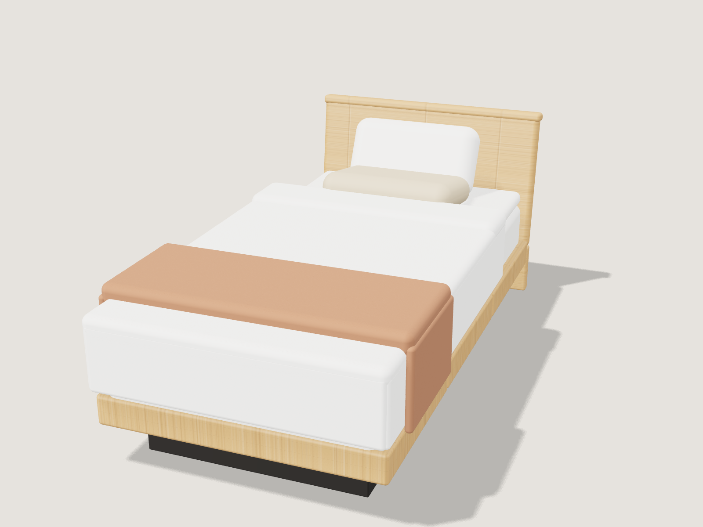 |
| C1-02 | ミニマル | HIRA（ひら） | 一枚の板を、折り返しただけ | 89,800円 | 竹集成材（淡色） | 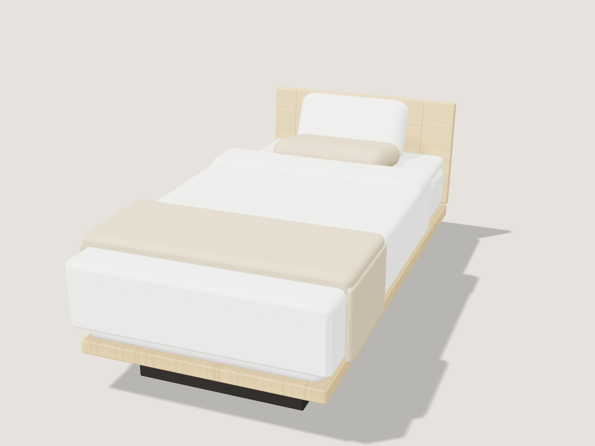 |
| C1-03 | プレミアム | SUMI（すみ） | 炭化竹の畝が、寝室の格を決める | 119,800円 | 炭化竹 | 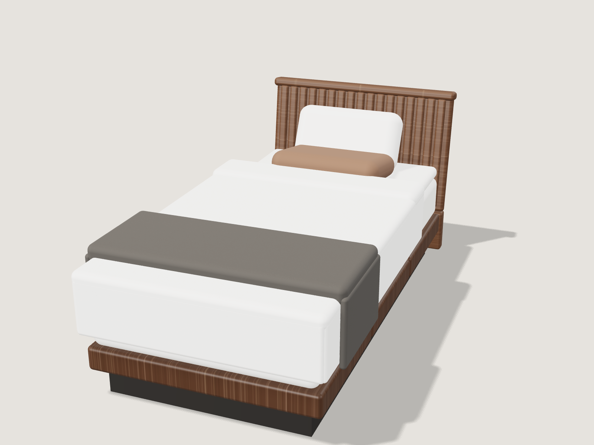 |
| C1-04 | トレンド | MARU（まる） | 竹のアーチに、ブークレをまとう | 109,800円 | 竹＋ブークレ | 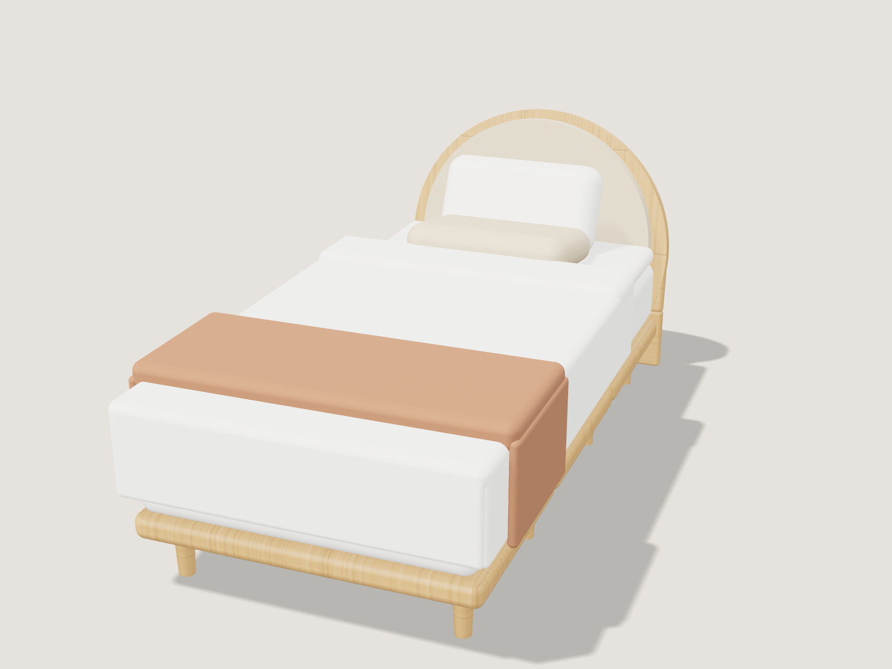 |
| C1-05 | 機能特化 | NICHE（ニッチ） | 起こすと、枕元の棚と灯りが現れる | 109,800円 | 竹＋撥水布（チャコール） | 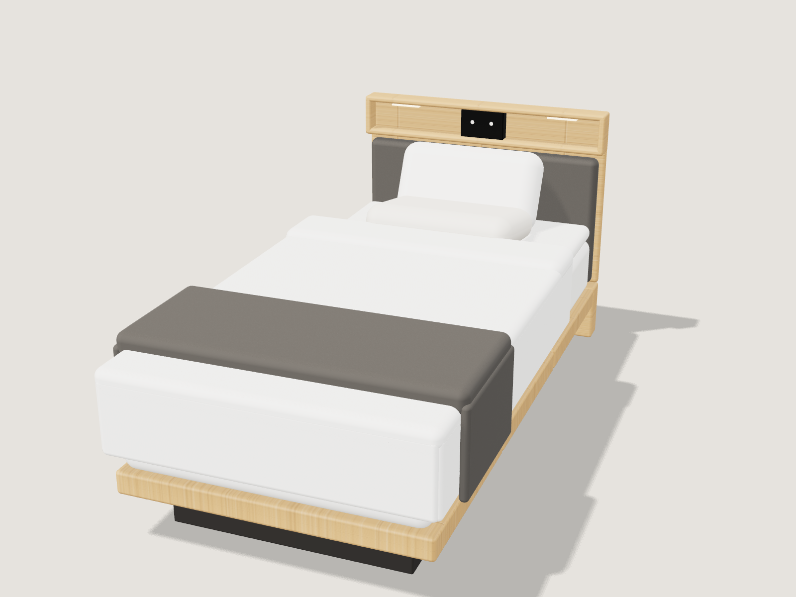 |
| C1-06 | 素材特化 | AJIRO（あじろ） | 竹を編んだ面を、寝室の顔に | 109,800円 | 燻し竹＋竹網代 | 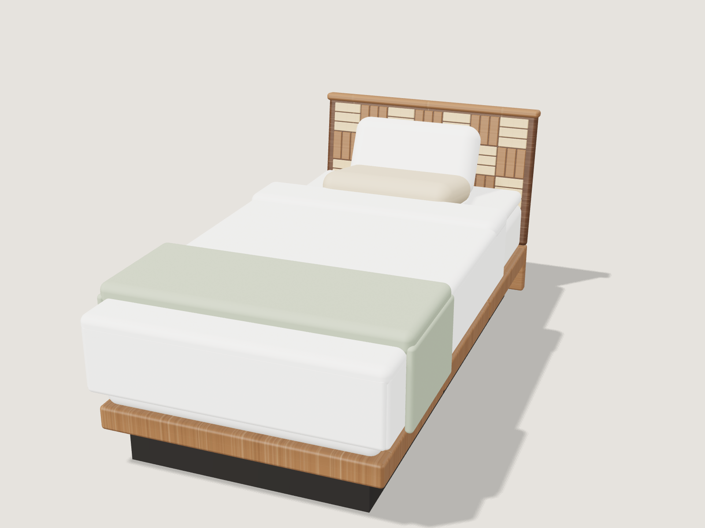 |
| C1-07 | UX改善 | ICHIDO（いちど） | 一度起こせば、全部ロック | 99,800円 | 竹＋洗える布（クレイ） | 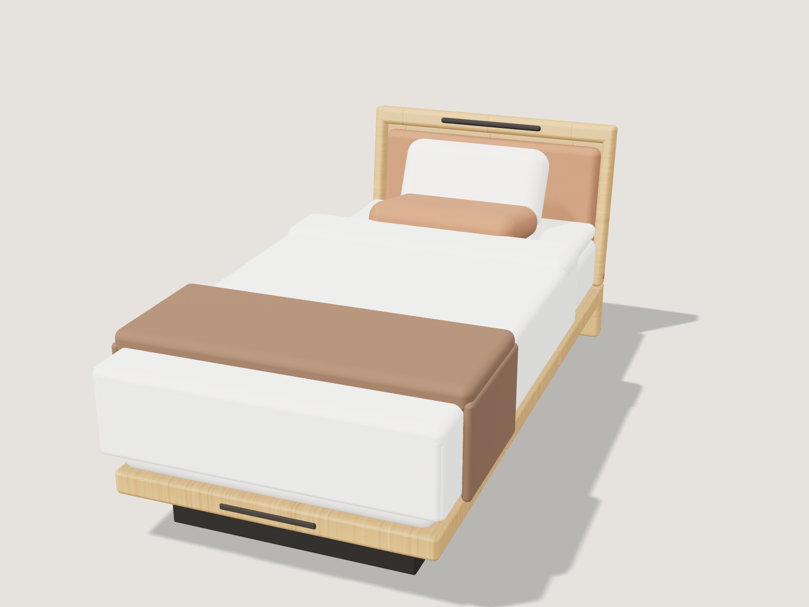 |
| C1-08 | 構造革新 | SEBONE（せぼね） | ヘッドボードが、ベッドの背骨になる | 104,800円 | 竹（柱・梁）＋布（モカ） | 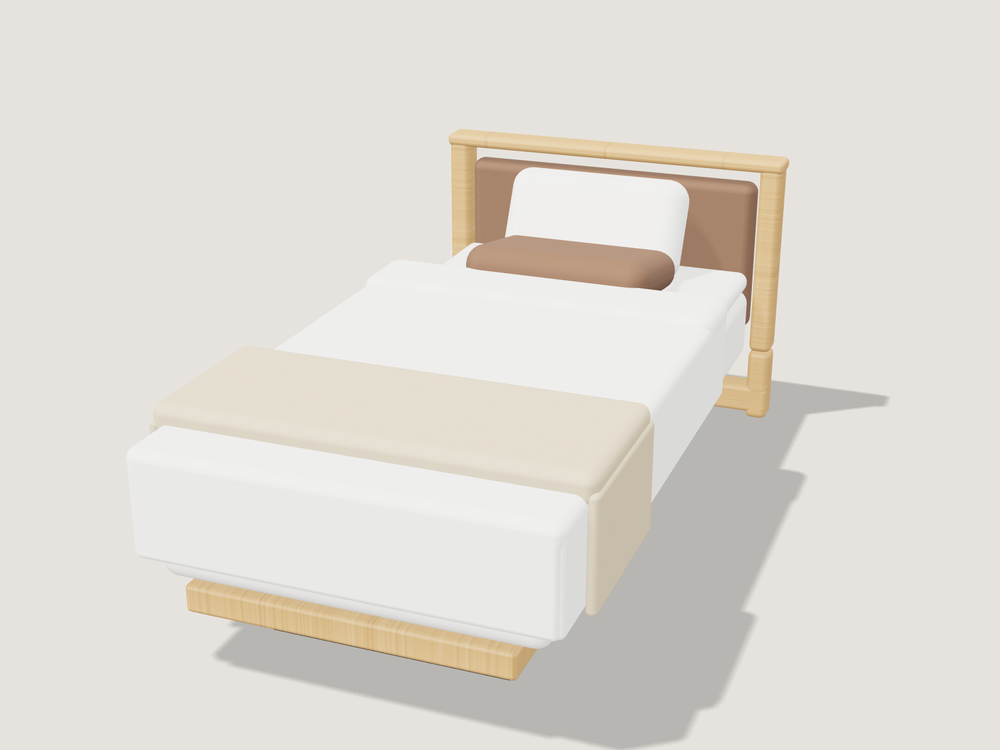 |
| C1-09 | 少し挑戦的 | TAKA（たか） | 110cm の背もたれに、包まれて眠る | 129,800円 | 布張り（チャコール）＋竹芯 | 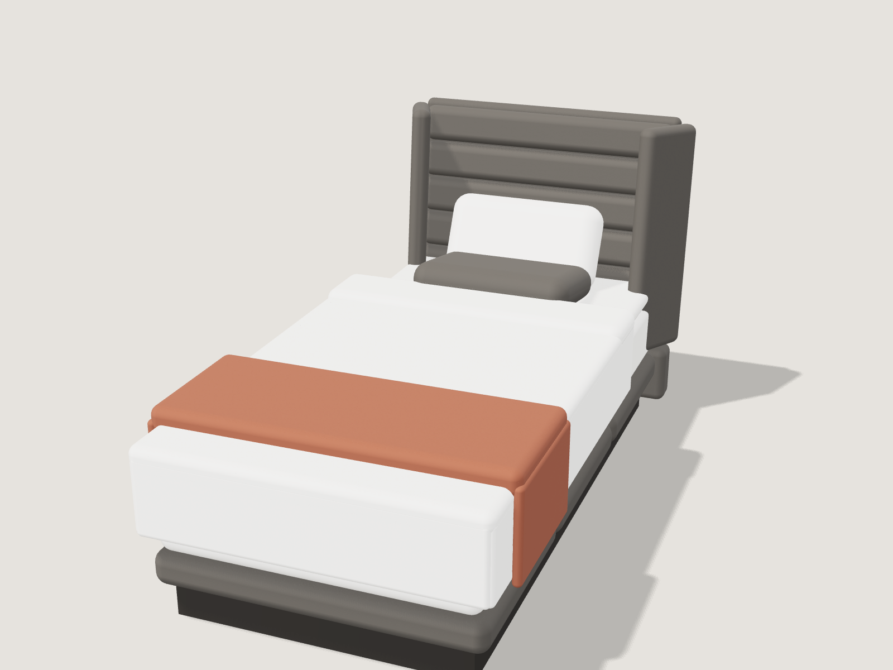 |
| C1-10 | コンセプトモデル | HAKO（はこ） | たたむとベッドが、箱になる | 149,800円【コンセプト】 | 炭化竹＋クリーム塗装 | 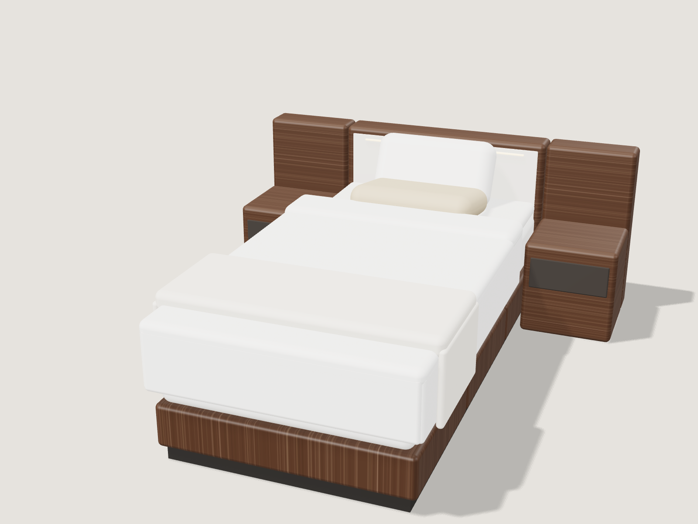 |

一覧画像（フレーム＋HB単体）: 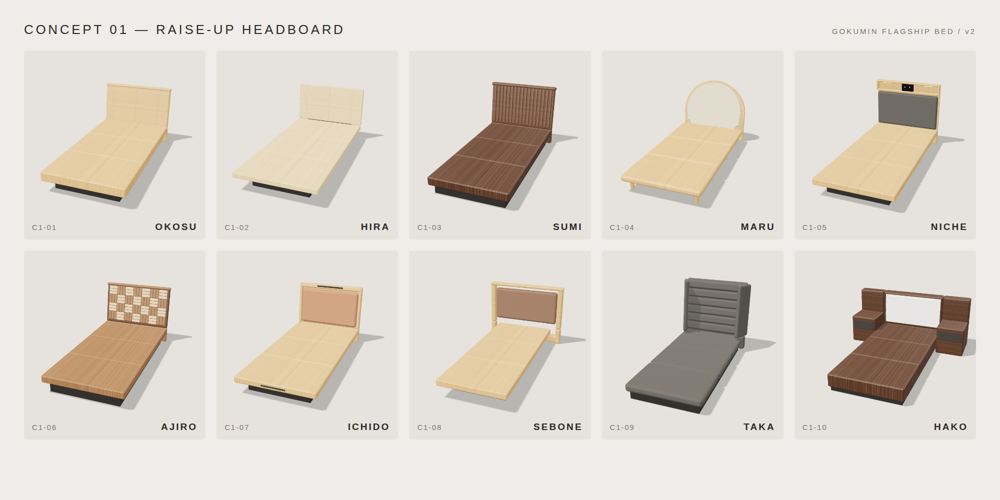

## 10案の差分表（似せないためのチェック）
| No | 形のモチーフ | HBの型 | HB高さ（床から） | HB素材・色 | HBの機能 | 主素材（本体） | 価格帯 | 主な訴求点 | マップ上の位置 |
|---|---|---|---|---|---|---|---|---|---|
| C1-01 | 厚い一枚板＋笠木 | フラットパネル | 850mm | 竹ナチュラル | もたれ角7度 | 竹ナチュラル（縁76mm＋立ち上がり40mm） | 中心 | 部品1点・4分・王道の格 | 開くだけ×9.9万（空白Aの中心） |
| C1-02 | 薄い板の折り返し（L字） | 薄板パネル | 780mm | 竹淡色 | もたれ角5度 | 竹淡色（縁60mm） | 下 | 最軽量23.5kg・最安 | 開くだけ×9万 |
| C1-03 | 縦の畝＋厚い縁＋影の台座 | 縦の畝パネル | 900mm | 炭化竹（ブラウン） | もたれ角8度 | 炭化竹（縁110mm） | 上 | 和モダンの最上位 | 開くだけ×12万 |
| C1-04 | アーチ（半円） | アーチ布張り | 950mm（頂部） | 竹枠＋ブークレ（ラテ） | 洗えるカバー、もたれ角6度 | 竹ナチュラル（丸脚） | 中上 | 曲線トレンド・SNS映え | 開くだけ＋カバー×11万 |
| C1-05 | 上端の水平の棚 | 薄型ニッチ＋クッション | 950mm | 竹＋撥水布チャコール | ニッチ・読書灯・USB-C | 竹ナチュラル | 中上 | 枕元の便利さ（全長+9cm以内） | 開くだけ×11万 |
| C1-06 | 市松の編み目 | 網代パネル | 860mm | 燻し竹×淡竹の網代 | もたれ角7度 | 燻し竹 | 中上 | 竹そのものの素材価値 | 開くだけ×11万 |
| C1-07 | 額縁（枠＋クッション） | 額縁クッション | 880mm | 竹枠＋洗える布クレイ | 一挙動ロック・握り溝・洗えるカバー | 竹ナチュラル | 中心 | 3動作・3分・洗える | 開くだけ×9.9万（空白A＋C） |
| C1-08 | 門型（柱＋梁） | 柱で立つ門型 | 870mm | 竹の柱・梁＋布モカ | 背骨構造（頭側の脚を兼ねる） | 竹ナチュラル（デッキ幅830） | 中心上 | HBがあるほど強い構造・浮くマットレス | 開くだけ×10.5万 |
| C1-09 | 背の高い壁＋袖 | ハイバック＋ウィング | 1100mm | 布チャコール（横のチャネル） | 包み込み・二つ折り | 布張りフレーム | 上 | ホテルスイートの存在感 | 差して起こす×13万 |
| C1-10 | 箱（直方体） | ワイドの壁＋ナイトボックス | 800mm（幅1850） | 炭化竹＋クリーム | 間接光・両脇収納 | 炭化竹（縁180mm） | 最上 | 同じ箱に戻る究極形 | 開くだけ×15万（将来） |

- 重なりの確認: 主素材が「竹ナチュラル」の案は C1-01・04・05・07・08 の5案あるが、**HBの素材・型がすべて異なる**（フラット竹／アーチ布／ニッチ＋布／額縁布／門型）。本体色を2色に抑える企画方針（0-4、research 結論2-7）のため、違いはHBで出した。形のモチーフ・HBの型・主な訴求点はすべて異なる。価格帯「中心」は C1-01・07 の2案まで、「中上」は C1-04・05・06 の3案だが、訴求点（曲線／機能／素材）が異なる
- 振れ幅: C1-01（市場の中心、フラット竹、850mm）→ C1-09（ハイバック1100mm、布張り本体）→ C1-10（ワイド1850mm、箱に戻る）

---

## 案C1-01 王道・市場適合型「OKOSU（おこす）」

正面 `C1-01-front.png` ／ 側面 `C1-01-side.png` ／ フレーム単体 `C1-01-frame.png` ／ 構造（たたんだ状態・HBを起こす途中）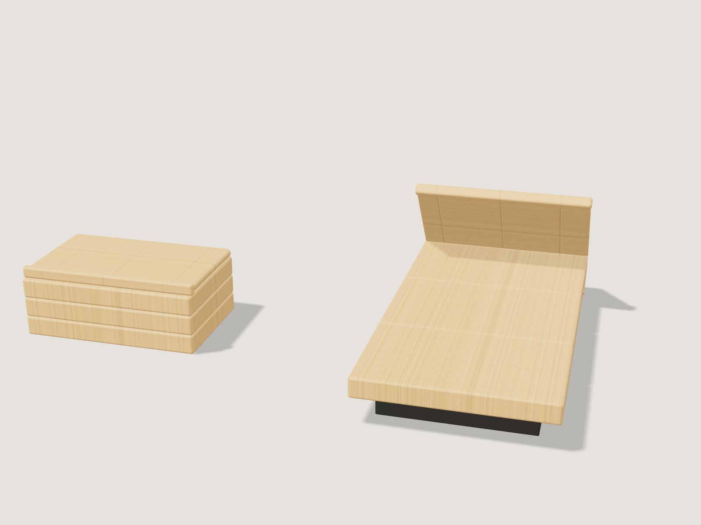

- **名称**: C1-01 王道・市場適合型「OKOSU」
- **デザインコンセプト**: 「ひらいて、起こす。竹の一枚板のホテルベッド。」売れている10万円帯の条件（フラットな木のHB・床から約85cm・もたれられる・厚い縁）をすべて満たし、そのうえで組立を「起こす」だけにした最も確実な案。
- **ターゲット**: THE GOKUMIN を買った32歳・34歳の共働き夫婦。同棲を始める週末に、2人で家具を揃える。組立に休日を使いたくない（research 結論3、企画 1-2 のメインペルソナ）。
- **解決する課題**: 不満1位「組立が重い・2人必要・時間がかかる」28.6%（research §6）と、HBのぐらつき・きしみ（§6、Floyd [S23]）。購入理由1位「工具不要・短時間」57.1%、2位「静か・ぐらつかない」42.9%（§7）に正面から答える。
- **形状**: 外寸 W1040×L2100×H850mm（HB込み）。デッキ天面 226mm、縁の見付け 76mm＋マットレスを受ける立ち上がり 40mm（マットレスの下端を隠し、“載せただけ”に見せない）。HBは厚み52mmの竹パネル、角R26、上端に小口の積層を見せる笠木（厚み40mm・前後に張り出し）。脚は外周から110mm奥に引っ込めた影の台座。
- **ヘッドボード仕様**: 型=フラットパネル（脚フラップ一体で床から立つ）／高さ=床から850mm（マットレス上端から約340mm）／素材=竹集成材ナチュラル／機能=もたれ角7度、ロックの目印／取り付け方式=頭側区画にヒンジ一体、起こすと脚フラップが床着地しくさびでロック（R1〜R4）／企画 0-2 の標準どおり
- **素材**: デッキ・縁・HB=国産竹集成材（見える面すべて）、芯=中空スチール（角パイプ）、脚・台座=スチール（マットブラック粉体塗装）、床当たり=フェルト、ヒンジ部=樹脂ブッシュ
- **CMF**: Color=ナチュラル竹 #C89C66（標準）／炭化竹 #5B3D28 の2色。Material=竹集成材。Finish=マットのオイル調ウレタン（3分艶）、HBの笠木は小口の積層を研ぎ出し。金物はマットブラック #232323 で、見えるのはロックの目印のみ
- **機能**: 起こすだけHB（部品0）、三つ折りのオートロック、連動脚、もたれ角7度。**入れなかった機能**: 宮棚・コンセント（EC低価格帯の当たり前で10万円の差別化にならない、research 結論2 推測）、照明（古びやすい [S54]）。電源は P4 のオプションモジュール（14,800円【推測】）で後から差す
- **競合優位性**: コアラ ファブリック（99,900円）の「パーツが重く2人推奨・寝返りで音」[S40] に対し、同価格で部品1点・1人・4分・竹の剛性。シモンズ／カリモク（9.3〜13万円）の「業者頼みの設置」【推測】に対し、届いた日に自分で完成
- **製造方法**: 竹集成材のCNC加工＋ウレタン塗装、スチール芯は角パイプの曲げ・溶接、ヒンジ・ロックは既存の折りたたみバンブーベッドの機構を流用し強化（ダイカストのロック爪1型）。部品点数（工場での組立）約48点、ユーザーが扱うのは1点。新規金型はロック爪・脚フラップのリンク部の小型2型のみ。量産の注意点: HBヒンジの軸穴位置の精度（くさびの噛み合い）、竹の含水率管理（反り）
- **開梱〜就寝**: 基本の4動作、**約4分**【推測】。工具0・ネジ0・部品1点・女性1人
- **梱包**: 1箱、約106×68×26cm（3辺200cm）、約27.5kg【推測】（上限28kg以内。持ち上げずに引き出す）
- **想定価格**: S 99,800円（SD 109,800円／D 119,800円）。原価率 約38%【推測】。research 結論4 の「狙うべき価格」そのもの
- **デザイン意図**: 根拠: research 結論1「10万円帯は家具としての仕立て・剛性・工具なし・長く使える安心で選ばれる」、§10「国内HB高 80〜87cm（シモンズ 約83cm）」[S7][S12][S16]、§7 購入理由「もたれられるHB」21.4%。厚い縁・立ち上がり・影の台座は「安いすのこに見えない」（企画 1-6、research リスク①）ための具体策。SNS の1カット「箱→起こす→完成」が最もそのまま撮れる案（research §13）

## 案C1-02 ミニマル「HIRA（ひら）」

正面 `C1-02-front.png` ／ 側面 `C1-02-side.png` ／ フレーム単体 `C1-02-frame.png` ／ 構造 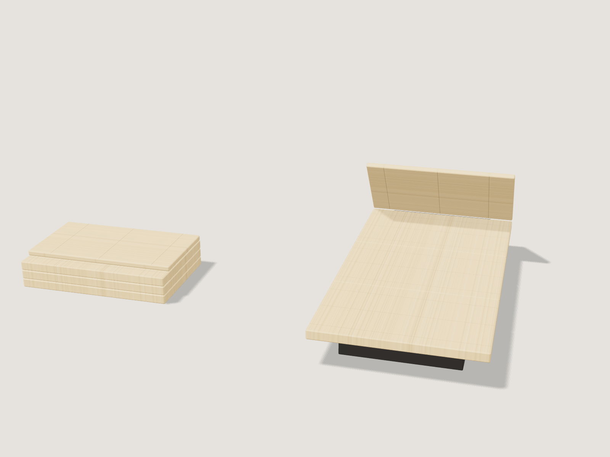

- **名称**: C1-02 ミニマル「HIRA」
- **デザインコンセプト**: 「一枚の板を、折り返しただけ。」HBとデッキの縁を同じ見付け（HB 36mm／縁 60mm の比率で揃え、角Rも同じR8〜10）にして、ベッド全体を一枚の竹板の折り返しとして見せる。ヒンジと折り目を細い1本の目地に整理した。
- **ターゲット**: 1LDK に住む30代の単身者（research 結論3 の第2ターゲット）。白い部屋・北欧〜和の簡素な空間が好きで、家具の線を増やしたくない。
- **解決する課題**: 宮付きで「全長が十数cm伸びる」不満 [S44]（§6 寸法 21.4%）。HB込みの全長を 2054mm（HBの奥行き 8.4cm）に抑える。重さの不満（§6）に対し、10案で最軽量。
- **形状**: 外寸 W1010×L2054×H780mm。デッキ天面 230mm、縁 60mm、目地 3mm。台座は外周から150mm 奥に引っ込め、床から浮いて見える。HBは厚み36mm、角R10、笠木なしの一枚板。脚フラップはHB幅より狭い黒の板（正面からはほぼ見えない）。
- **ヘッドボード仕様**: 型=薄板パネル／高さ=床から780mm（0-2 の標準より5cm低い。圧迫感を減らすため）／素材=竹集成材 淡色／機能=もたれ角5度／取り付け方式=ヒンジ一体＋床着地の脚フラップ（R1〜R4）
- **素材**: デッキ・縁・HB=竹集成材（淡色の選別材）、芯=中空スチール、脚フラップ・台座=スチール黒
- **CMF**: Color=淡色竹 #D6B584（標準）／炭化竹 #5B3D28。Finish=ほぼ艶のないマットクリア（1分艶）。金物は外から見せない
- **機能**: 起こすだけHB、三つ折り。**入れなかった機能**: 笠木・布・棚・電源。すべて削って部品と重量を減らした（P4 のモジュールは後付け可）
- **競合優位性**: 無印 オーク＋HB（46,900円）の「脚を付けないとHBを付けられない」[S41] に対し、HBは最初から一体。エマ ファブリック（56,000円）の「付属工具で組む」[S13] に対し工具0
- **製造方法**: C1-01 と同じ工程で、笠木と立ち上がりを省く。工場での部品点数 約40点。竹の選別（淡色）で歩留まりが下がるため、淡色は表面の突板で揃える【推測】。金型は C1-01 と共通
- **開梱〜就寝**: 4動作、約4分【推測】。工具0・ネジ0・部品1点・1人
- **梱包**: 1箱、約103×68×24cm（195cm）、約23.5kg【推測】（女性の継続作業の目安 20kg [S72] に最も近い）
- **想定価格**: S 89,800円。原価率 約36%【推測】。research 結論4 の帯の下限（89,800円）
- **デザイン意図**: 根拠: research 結論2-4「深い宮棚・全長が伸びる」を避ける、§10「フラット（素材を見せる板状）」が国内で11商品と最多の型（notes/v2-headboard-types.md）。**犠牲にしたもの**: 存在感とブランドの格（Design・Market Fit）。細く見えすぎると「簡易ベッド」に近づくため、縁の見付けを60mmより細くしない、台座を深く引っ込めて“浮かせる”ことで線の少なさを上質に見せる

## 案C1-03 プレミアム「SUMI（すみ）」

正面 `C1-03-front.png` ／ 側面 `C1-03-side.png` ／ フレーム単体 `C1-03-frame.png` ／ 構造 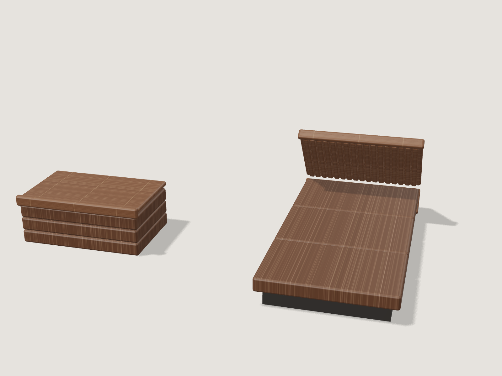

- **名称**: C1-03 プレミアム「SUMI」
- **デザインコンセプト**: 「炭化竹の畝が、寝室の格を決める。」炭化竹（ブラウン）の縦の畝をHBの面に並べ、厚い笠木と110mm の厚い縁、影のすき間で浮かせた台座で、飛騨・カリモク級の“家具の仕立て”を見せる和モダンの最上位。
- **ターゲット**: 世帯年収の高い30代後半の夫婦。ホテルのスイートや旅館の設えが好きで、寝室を“見せる部屋”にしたい。THE GOKUMIN の上位モデル（ユーロトップ）購入者。
- **解決する課題**: 10万円帯で求められる「素材・接合部・塗装・HBの存在感」[S42]（§7）。D2C は「格が一段足りない」、家具メーカーは「重く業者頼み」（research 結論3 推測）の間を取る。
- **形状**: 外寸 W1030×L2130×H900mm。デッキ天面 230mm。縁の見付け 110mm（構造は60mm のデッキ＋下に折れる50mm のエプロンで、見た目の厚みと梱包の薄さを両立）。台座は外周から60mm 奥の影のすき間。HBは畝17本（幅45mm・奥行き26mm・R12）を背板に並べ、上端に張り出した笠木（46mm）。
- **ヘッドボード仕様**: 型=縦の畝パネル／高さ=床から900mm（0-2 の上限寄り）／素材=炭化竹／機能=もたれ角8度（畝の凹凸が背中に当たりすぎないよう、上部400mm だけ畝を浅くする）【推測】／取り付け方式=ヒンジ一体＋床着地の脚フラップ（R1〜R4）
- **素材**: 本体・HB=炭化竹集成材、畝=炭化竹の無垢ひご材、芯=中空スチール、エプロン=炭化竹（ヒンジで内側にたためる）、台座=スチール黒
- **CMF**: Color=炭化竹 #5B3D28（本体・HB同色の1色展開）、金物マットブラック #232323。Finish=オイル仕上げ風のマットウレタン（2分艶）、畝の先端だけ手擦り感のある艶。寝具の合わせ色はチャコール・モカ
- **機能**: 起こすだけHB、エプロン連動（開くとエプロンが下りて縁が厚く見える）、三つ折り。**入れなかった機能**: 電源・照明（格を下げないため本体に作り込まない。P4 のモジュールで対応）
- **競合優位性**: 飛騨産業 月光（14万円〜、受注生産で40〜60日）[S9] に対し、2万円安く即納・自分で4分。カリモク NW49（132,110円）[S5] の「業者設置」【推測】に対し工具0
- **製造方法**: 畝は竹ひごのCNC一括加工→背板に接着。部品点数 約70点（畝17本を含む）。エプロンのヒンジ4か所が追加。炭化竹は色ぶれの管理が必要（ロット管理）。金型は C1-01 と共通＋エプロン用の小型ヒンジ1型
- **開梱〜就寝**: 4動作、約5分【推測】（エプロンは連動で下りる）。工具0・ネジ0・部品1点・1人
- **梱包**: 1箱、約105×69×26cm（200cm）、約29.5kg【推測】（上限30kg に近い。持ち手ベルトで引き出す手順を必須にする）
- **想定価格**: S 119,800円（SD 129,800円／D 139,800円）。原価率 約42%【推測】。research 結論4 の帯（S 109,800円まで）をやや超えるが、飛騨・常盤（14〜15万円）より下で「最上位」の位置を取る
- **デザイン意図**: 根拠: research 結論6 切り口7「竹を“和モダンの高級素材”に格上げ（炭化竹×黒い金具×日本式木組み）」、§9「ブラウンが2026年の最重要色」[S50]、§10「チャネル（縦の畝）」[S28][S29]、企画 4-1 の 03 の振れ幅。**犠牲にしたもの**: 重量（29.5kg）と原価。重量はエプロン構造で上限内に抑えた

## 案C1-04 トレンド「MARU（まる）」

正面 `C1-04-front.png` ／ 側面 `C1-04-side.png` ／ フレーム単体 `C1-04-frame.png` ／ 構造 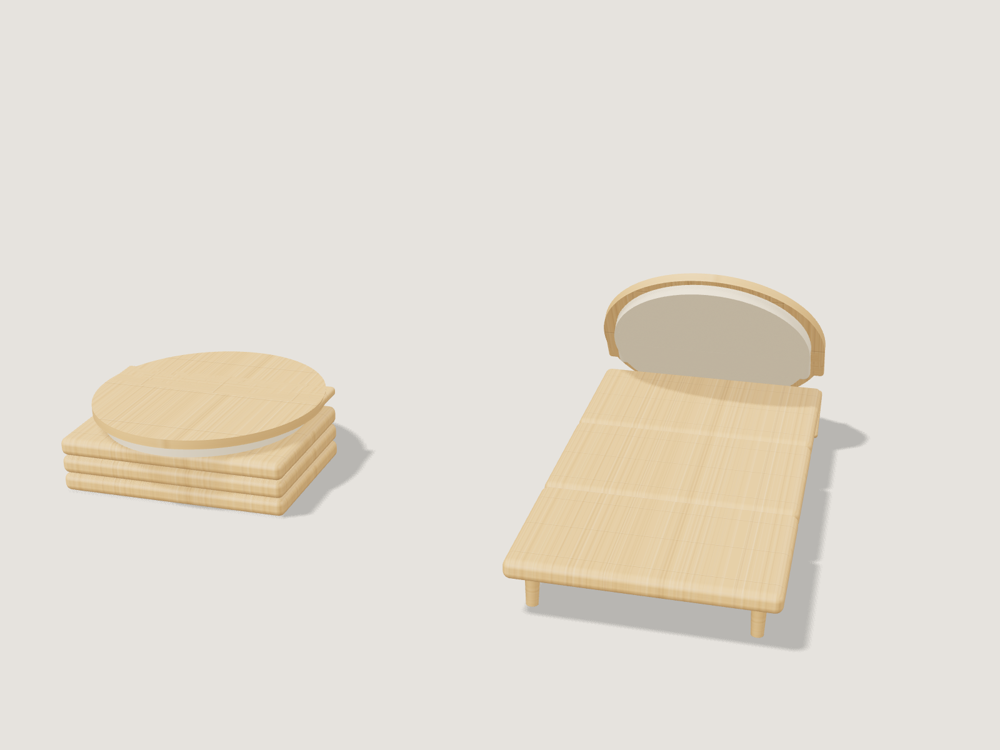

- **名称**: C1-04 トレンド「MARU」
- **デザインコンセプト**: 「竹のアーチに、ブークレをまとう。」2026年の曲線・アーチ・ブークレを、竹の細いアーチ枠と、そこに落とし込む洗えるブークレのクッションで表現。縁も角R30 と丸い竹の脚で、全体をやわらかくまとめた。
- **ターゲット**: 20代後半〜30代前半の同棲カップル。Instagram・RoomClip で寝室の実例を集めて、写真映えする家具を選ぶ（research §13）。
- **解決する課題**: 布張りHBの「汚れ・ホコリ・洗えない」不満（§6、[S43]）をジッパーで外せるカバーで解消。デザインで選ぶ層（購入理由 35.7%、§7）に応える。
- **形状**: 外寸 W1010×L2150×H950mm（アーチ頂部）。デッキ天面 230mm、縁 80mm・角R30。脚は竹の丸脚（φ60→φ47 のテーパー、8本、区画ごとに連動で起きる）。HBは竹のアーチ枠（厚み40mm、半径505mm）の前に、ひと回り小さいブークレのアーチクッション（厚み70mm）。
- **ヘッドボード仕様**: 型=アーチ布張り（竹枠＋クッション）／高さ=床から950mm（頂部。肩の位置は約650mm で圧迫感は標準並み）／素材=竹枠ナチュラル＋ブークレ（ラテ #D3C2A6、撥水加工）／機能=カバーはジッパーで外して洗える、もたれ角6度／取り付け方式=竹のアーチ枠はヒンジ一体＋床着地（R1〜R4）、クッションは枠の上端のフックに**落とし込むだけ**（P2 HBフェイス規格）
- **素材**: 本体・アーチ枠=竹集成材（アーチは曲げ積層）、クッション=ウレタン＋ブークレ調ポリエステル（撥水・防汚）、脚=竹無垢の丸棒
- **CMF**: Color=竹ナチュラル #C89C66 ×ブークレ ラテ #D3C2A6（標準）、カバー替え色 オフホワイト #ECE6DB／クレイ #A8765A／チャコール #55524E。Finish=竹はマットクリア、ブークレはループ糸の凹凸
- **機能**: 起こすだけHB、落とし込みクッション、洗えるカバー、替えカバー（9,800円【推測】）。**入れなかった機能**: LED の間接照明（“光るだけ”は避ける、research 結論2-6）
- **競合優位性**: コアラ ファブリック（99,900円）の布張りHB（洗えない・重い）[S40] に対し、カバーを外して洗え、クッションは2kg 程度で1人で扱える。海外の曲線HB（Castlery 約18万円）[S27] を10万円帯で
- **製造方法**: アーチ枠は竹単板の曲げ積層（成形型1型、中規模）。クッションは縫製（外部委託）。部品点数 約55点、ユーザーが扱うのは本体＋クッションの2点。量産の注意点: 曲げ積層の戻り（スプリングバック）、アーチの左右対称の精度
- **開梱〜就寝**: 5動作（基本の4動作＋⑤クッションを枠に落とし込む）、約6分【推測】。工具0・ネジ0・部品2点・1人
- **梱包**: 2箱。本体箱 約104×72×24cm（200cm）・約26kg、クッション小箱 約60×45×20cm・約3kg【推測】（企画 0-1「布フェイスを選んだ場合のみ小箱1」に合わせた）
- **想定価格**: S 109,800円。原価率 約41%【推測】。帯の上限（research 結論4）
- **デザイン意図**: 根拠: research §10「曲線・アーチ・角丸が2026年の流れ」[S28][S29]、§8「プレミアム帯の布はベルベットとブークレ」[S29]、§9「clay・mushroom・oat」[S28]、結論6 切り口4「洗えるホテルHB」。**犠牲にしたもの**: 部品1点の純度（2点になる）と、クッション分の原価。本体箱の重量を守るためクッションを分けた（レビューで修正した点を参照）

## 案C1-05 機能特化「NICHE（ニッチ）」

正面 `C1-05-front.png` ／ 側面 `C1-05-side.png` ／ フレーム単体 `C1-05-frame.png` ／ 構造 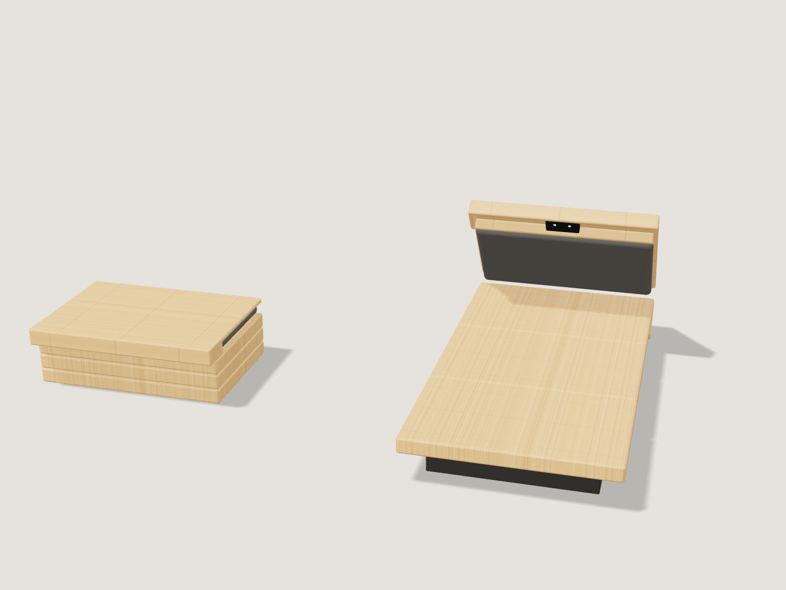

- **名称**: C1-05 機能特化「NICHE」
- **デザインコンセプト**: 「起こすと、枕元の棚と灯りが現れる。」HBを起こすと、上端にたたまれていた天板が重力で水平に下り、奥行き8cm の薄型ニッチになる。スマホ・メガネ・本を置け、左右の読書灯と中央の USB-C が枕元に揃う。全長は9cm しか伸びない。
- **ターゲット**: 寝る前にスマホ・本・動画を見る共働き夫婦。宮棚付きの便利さは欲しいが、全長が伸びて部屋に置けない・安っぽくなるのは嫌な人。
- **解決する課題**: 宮棚の「全長が十数cm伸びる」[S44]、「ホコリがたまる」（research 結論2-4）を、奥行き8cm のニッチで解決。EC の当たり前（宮棚・コンセント・USB）[S46][S62] を、10万円の質感で持たせる。
- **形状**: 外寸 W1010×L2060×H950mm。デッキ天面 230mm、縁 80mm。HBは背板（30mm）＋下部のチャコールの布クッション（厚み60mm、くさび形で背当て面を7度に傾ける）＋上端の竹のニッチ（内寸 高さ100×奥行き66mm、両側の側板）。ニッチ中央に黒の電源モジュール（幅180mm）、天板下に読書灯2灯（電球色・調光）。
- **ヘッドボード仕様**: 型=薄型ニッチ＋布クッション／高さ=床から950mm（ニッチの分だけ標準より10cm 高い）／素材=竹＋撥水・防汚ファブリック チャコール／機能=ニッチ（奥行き8cm）、USB-C×2、調光読書灯×2、クッション背当て7度／取り付け方式=ヒンジ一体＋床着地（R1〜R4）。電源モジュールは P4 の差し込み口に**差すだけ**（同梱。数年ごとに家電部分だけ交換できる）
- **素材**: 本体・HB骨格・ニッチ=竹集成材、クッション=ウレタン＋撥水ファブリック（ジッパーで外せる）、モジュール=難燃 PC/ABS 筐体（マットブラック）、読書灯=LED＋乳白拡散板
- **CMF**: Color=竹ナチュラル #C89C66 ×チャコール #55524E（標準）／炭化竹×オフホワイト。Finish=竹マットクリア、モジュールはシボ加工のマット黒 #232323
- **機能**: ニッチ・読書灯・USB-C・クッション背当て。**入れなかった機能**: AC コンセント（発熱・PSE の管理が重く、USB-C PD 65W で十分な機器が多い【推測】）、ワイヤレス充電（将来のモジュール交換で対応）
- **競合優位性**: シモンズ キャビネット（102,500円）[S7]・ニトリ 棚ライト（49,990円）[S15] の宮棚に対し、全長+9cm・工具0・家電部分だけ交換できる
- **製造方法**: ニッチの天板は自重で下りるヒンジ（ストッパー付き）で、たたむと天板がHBと平らに重なる（梱包の厚み45mm）。電装は外部調達のモジュール1種＋HB内の配線（工場で組立済み）。部品点数 約75点。新規金型はモジュール筐体（小型射出1型）。量産の注意点: 電装の安全規格（PSE・UL 相当）、ヒンジを回る配線の耐久（1,000回開閉）
- **開梱〜就寝**: 5動作（基本の4動作＋⑤モジュールを差してACアダプタをつなぐ）、約5分【推測】。工具0・ネジ0・部品2点（本体＋モジュール）・1人
- **梱包**: 1箱（モジュールは箱内の小仕切りに同梱）、約104×68×28cm（200cm）、約29kg【推測】
- **想定価格**: S 109,800円（モジュール込み）。モジュールなしの設定は作らず、交換用モジュール 14,800円【推測】。原価率 約42%【推測】
- **デザイン意図**: 根拠: research 結論5「薄型ニッチ棚：奥行き8〜10cm、スマホ・メガネ置き」「電源と照明は差し替えできるモジュール」、§11「LED の多用・深い宮棚は過剰になりやすい」[S54][S44]、結論6 切り口5。企画 4-1 の 05。**犠牲にしたもの**: HBのシンプルさ（Design）と原価

## 案C1-06 素材特化「AJIRO（あじろ）」

正面 `C1-06-front.png` ／ 側面 `C1-06-side.png` ／ フレーム単体 `C1-06-frame.png` ／ 構造 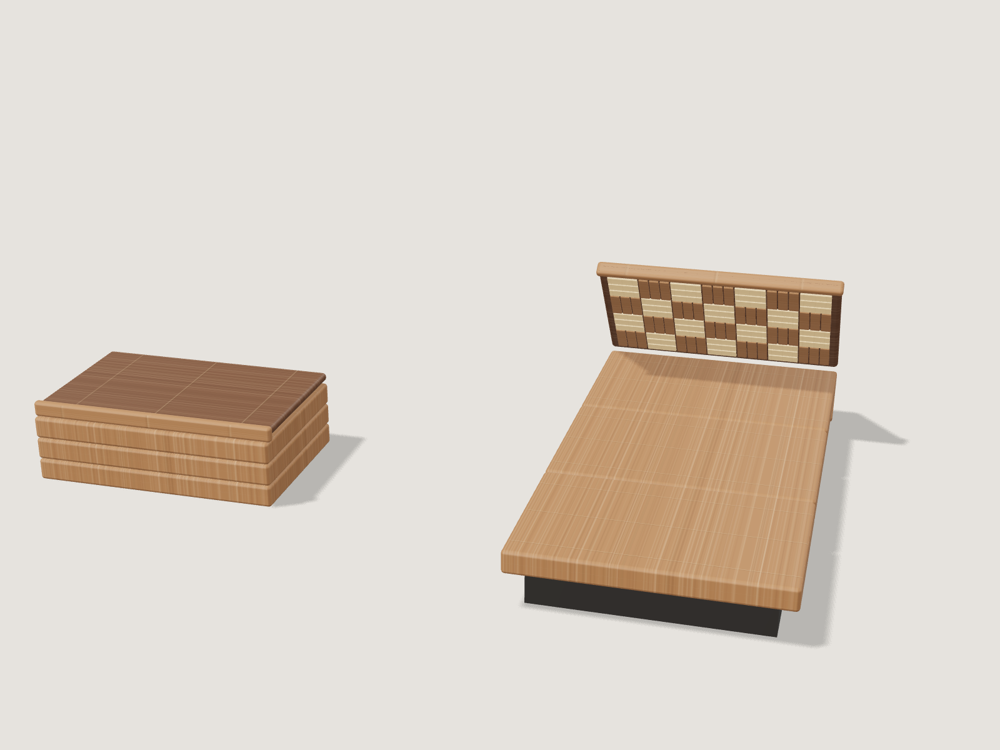

- **名称**: C1-06 素材特化「AJIRO」
- **デザインコンセプト**: 「竹を編んだ面を、寝室の顔に。」日本の竹工芸の網代（あじろ）編みを、燻した竹と淡い竹の2色でHBの面に。竹を“安い素材”ではなく“編む・燻す”手仕事の高級素材として見せる。
- **ターゲット**: 旅館・和モダン・民藝が好きな30代の夫婦。インバウンド・海外（竹×日本の木組みが評価される米国市場 [S25]）も将来の視野。
- **解決する課題**: 「無垢・天然素材の質感」35.7%（§7）への答えを、竹で最も強く出す。竹が「アジアン・安い」に見えるリスク（research §8 推測）を、日本の工芸の文脈で逆転させる。
- **形状**: 外寸 W1010×L2095×H860mm。デッキ天面 230mm、縁 90mm（燻し竹）、影の台座（外周から70mm 奥）。HBは燻し竹の額（厚み36mm）の中に、網代パネル（7×4 マスの市松、1マス約134×150mm、ひご幅約40mm）。上端に燻し竹の笠木。
- **ヘッドボード仕様**: 型=網代パネル／高さ=床から860mm／素材=燻し竹 #8A6240 ×淡竹 #D6B584 の網代（竹単板の編みシートを合板に貼る）／機能=もたれ角7度、編み目のやわらかい凹凸／取り付け方式=ヒンジ一体＋床着地（R1〜R4）
- **素材**: 本体=燻し竹集成材、網代=竹単板の網代シート（機械編み）＋合板芯、芯=中空スチール、台座=スチール黒
- **CMF**: Color=燻し竹 #8A6240 ×淡竹 #D6B584（標準）、寝具の合わせ色はセージ #A4AD96・オート #CDBC9F。Finish=網代はオイル仕上げ（ひごの艶を残す）、本体はマットウレタン
- **機能**: 起こすだけHB、三つ折り。**入れなかった機能**: 布クッション（素材の純度を優先。もたれる時用に別売の布ピロー 6,800円【推測】）
- **競合優位性**: Nectar Bamboo（約9〜10.5万円換算、竹×日本式木組み）[S25] に対し、日本製の網代で「本家の竹」を名乗れ、HB込み・4分。飛騨 月光の「無垢の格」[S9] に、別の天然素材で並ぶ
- **製造方法**: 網代シートは竹工芸の産地メーカーから機械編みのシートを調達し、プレスで合板に貼る【推測】。部品点数 約50点。量産の注意点: 網代の柄合わせ（パネルごとの目のずれ）、燻し色のロット差、ひごのささくれ（表面処理）
- **開梱〜就寝**: 4動作、約4分【推測】。工具0・ネジ0・部品1点・1人
- **梱包**: 1箱、約104×68×27cm（199cm）、約28kg【推測】
- **想定価格**: S 109,800円。原価率 約43%【推測】
- **デザイン意図**: 根拠: research §8「2026年のHBでは、ラタン・竹など触感のある天然素材が注目」[S28]、結論6 切り口7「竹を和モダンの高級素材に」、§12「竹×日本式木組みが米国で評価」[S25]。GOKUMIN の国産竹の資産 [S4]。**犠牲にしたもの**: 網代の調達コストと、布の柔らかさ（もたれ心地）

## 案C1-07 UX改善「ICHIDO（いちど）」

正面 `C1-07-front.png` ／ 側面 `C1-07-side.png` ／ フレーム単体 `C1-07-frame.png` ／ 構造 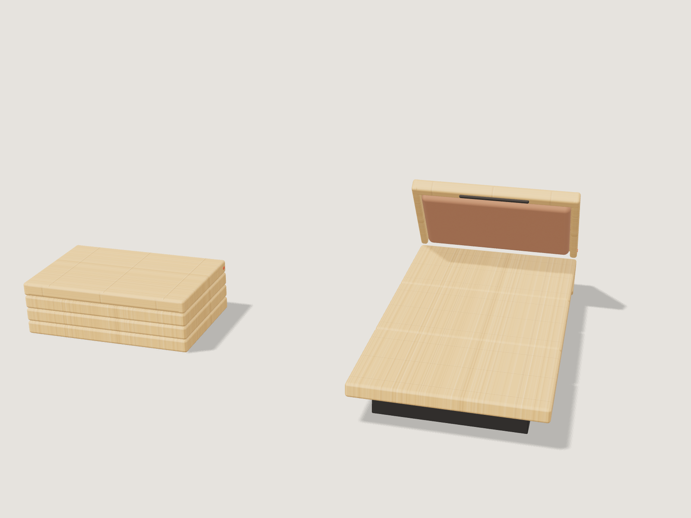

- **名称**: C1-07 UX改善「ICHIDO」
- **デザインコンセプト**: 「一度起こせば、全部ロック。」HB上端の握り溝を持って起こすと、HBの脚フラップ・デッキの2か所の折り目・連動脚が**一挙動でロック**する。箱から引き出す・開く・起こすの**3動作・約3分**。HBは竹の額縁に、ジッパーで外して洗えるクレイ色の布クッション。
- **ターゲット**: メインペルソナ（共働き夫婦）の中でも、特に「女性1人で受け取って、その日のうちに完成させたい」人。説明書を読まない人。
- **解決する課題**: 不満1位「重い・2人必要・時間がかかる」28.6%（§6）を、動作数そのものを減らして解決。布HBの「汚れ・洗えない」[S43] を洗えるカバーで。ロックが分かりにくい・ちゃんと留まったか不安（R4）を、音と色の目印で。
- **形状**: 外寸 W1010×L2125×H880mm。デッキ天面 230mm、縁 80mm・角R16。足元の縁の中央に引き出し用のくぼみ（幅300mm、指が4本入る）。HBは竹の額縁（枠幅44mm、厚み80mm、上框70mm）に、クレイの布クッション（厚み70mm、R34）。上框に長さ420mm の握り溝。側面に朱の目印（φ20、ロック前は見え、ロック後はカバーで隠れる）。
- **ヘッドボード仕様**: 型=額縁クッション／高さ=床から880mm／素材=竹枠ナチュラル＋撥水・防汚ファブリック クレイ #A8765A（替え色 オフホワイト・モカ・チャコール）／機能=一挙動ロック、握り溝、洗えるカバー、もたれ角7度／取り付け方式=ヒンジ一体＋床着地。HBのヒンジ軸に通したリンクロッドがデッキの折り目のロックピンも同時に押し込む（R1〜R4）。クッションは P2 規格で着せ替え可能
- **素材**: 本体・額縁=竹集成材、クッション=ウレタン＋撥水ファブリック、リンクロッド=スチール（樹脂ブッシュ）、目印=朱のアルマイトのアルミ
- **CMF**: Color=竹ナチュラル #C89C66 ×クレイ #A8765A（標準）、布は4色（企画 0-4）、本体は竹ナチュラル／炭化竹の2色。Finish=竹マットクリア、握り溝の内側だけ黒の拭き漆調塗装（手垢が目立たない）
- **機能**: 一挙動ロック、引き出しのくぼみ＋持ち手ベルト、洗えるカバー、着せ替え（替えカバー 9,800円【推測】）、目印。**入れなかった機能**: 電動・ガス圧のアシスト（重量と故障点が増える）
- **競合優位性**: Thuma（平均6分42秒）[S18] より速い約3分。Floyd の「クランプが緩むとHBが外れる」[S23] に対し、HBは床着地＋ロックで外れない。コアラ ファブリック [S40] の「2人推奨」に対し1人
- **製造方法**: C1-01 の工程に、リンクロッド（丸棒の曲げ1部品×2）とロックピンの連動を追加。クッションは縫製の外部委託。部品点数 約58点。新規金型はロックピンのカム（小型ダイカスト1型）。量産の注意点: リンクの遊び（ロックの確実性）、1,000回の開閉試験
- **開梱〜就寝**: **3動作**（① 引き出す → ② 開く → ③ HBを起こす＝全部ロック）＋マットレスを載せる、約3分【推測】。工具0・ネジ0・部品1点・1人
- **梱包**: 1箱、約104×68×28cm（200cm）、約28.5kg【推測】。箱は横に倒すと手前の面が大きく開き、持ち手ベルトで本体を床に引き出せる（持ち上げない）
- **想定価格**: S 99,800円。原価率 約40%【推測】。research 結論4 の中心
- **デザイン意図**: 根拠: research §7「工具不要・短時間」57.1%（1位）、§6「組立が重い・2人必要」28.6%（1位）、結論5「ロックが見て分かる」→ 企画 R4、結論6 切り口4「洗えるホテルHB」、§8「撥水・防汚、ジッパーで外して洗える」[S24][S21]。SNS の「箱→起こす→完成」が最も短い動画になる

## 案C1-08 構造革新「SEBONE（せぼね）」

正面 `C1-08-front.png` ／ 側面 `C1-08-side.png` ／ フレーム単体 `C1-08-frame.png` ／ 構造 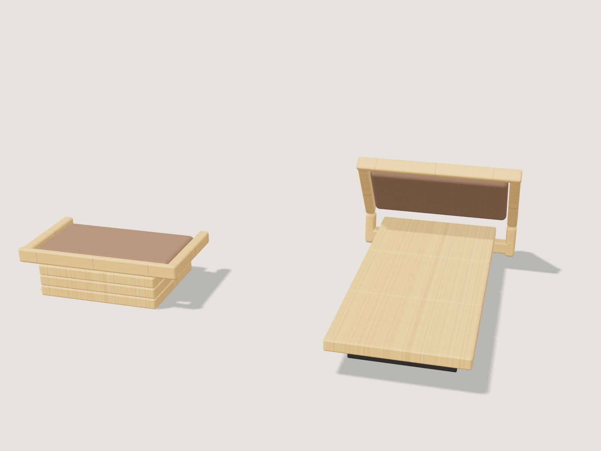

- **名称**: C1-08 構造革新「SEBONE」
- **デザインコンセプト**: 「ヘッドボードが、ベッドの背骨になる。」床に立つ2本の竹の柱と、足元の梁でできた門型のHBが、頭側の脚を兼ねる。デッキの脚は中央と足元の2本のソリだけ。**HBがあるほど強く、HBを外すと立たない**構造で、ヘッドレスという選択肢そのものをなくした。
- **ターゲット**: 建築・デザインが好きな30代の夫婦。構造が見える家具（門型・鳥居型ではなく、柱と梁の“軸組”）に価値を感じる。
- **解決する課題**: HBの「ぐらつき・もたれる強度への不安」（§6、[S23][S25]）を、HBを構造の主役にして根本から解く。脚の本数・部品を減らしてコストも下げる（研究 リスク①「ヒンジ部のたわみ」を柱で受ける）。
- **形状**: 外寸 W1120×L2060×H870mm。デッキは幅830mm に絞り、マットレス（970mm）が左右に70mm ずつ張り出して**浮いて見える**。柱は70×90mm・角R20 の竹集成材で、マットレスの外側に立つ。下の梁（90mm）が2本の柱を床近くでつなぐ。上端は柱の外まで張り出す笠木（40mm）。柱のあいだにモカの布クッション（厚み76mm、背当ては6度のくさび形）。柱はデッキ上面の高さで上下に分かれ、上部（柱＋笠木＋クッション）がヒンジで起きる。
- **ヘッドボード仕様**: 型=柱で立つ門型／高さ=床から870mm／素材=竹の柱・梁ナチュラル＋撥水ファブリック モカ #806350／機能=頭側の脚を兼ねる背骨構造、クッション背当て6度／取り付け方式=柱の根元と梁は頭側区画に固定（床着地、R1）、上部はヒンジで起こし、柱の継ぎ目の**ほぞ（くさび）が自重で締まる**（R3）。ロックは柱の側面の目印（R4）
- **素材**: 柱・梁・デッキ=竹集成材（柱の芯にスチール角パイプ）、クッション=ウレタン＋撥水ファブリック、ソリ脚=スチール黒
- **CMF**: Color=竹ナチュラル #C89C66 ×モカ #806350（標準）／炭化竹×オート #CDBC9F。Finish=柱は角Rを大きく研ぎ出したマットクリア、継ぎ目にだけ黒の細い目地
- **機能**: 背骨構造、浮くマットレス、ソリ脚2本。**入れなかった機能**: 棚・電源（柱の上端に P4 の差し込み口だけ用意）
- **競合優位性**: Floyd の「後付けHBがクランプの緩みで外れる」[S23] に対し、HBが構造そのもの。Nectar の「背の高い人がもたれた時の安定性」[S25] に対し、柱が床に立つ。脚の本数が少なく、ロボット掃除機が頭側からも入れる
- **製造方法**: 柱・梁は竹集成材の CNC＋スチール芯の挿入。デッキの脚は6〜8本からソリ2本に減る（部品 −8点、組立工程 −1）。部品点数 約42点。新規金型は柱の継ぎ目のくさび金物（小型ダイカスト1型）。量産の注意点: 柱の継ぎ目の精度（ガタ0）、デッキを柱から持ち出すための芯材の剛性（試作でたわみ確認）
- **開梱〜就寝**: 4動作、約4分【推測】。工具0・ネジ0・部品1点・1人
- **梱包**: 1箱、約112×66×22cm（200cm）、約26kg【推測】（デッキ幅を830mm に絞った分、脚とデッキが軽い）
- **想定価格**: S 104,800円。原価率 約37%【推測】（脚・部品の削減で C1-01 並み）
- **デザイン意図**: 根拠: research 結論5-4「HBの脚を必ず床に着地させ、クランプ1点で持たせない」、企画 4-1 の 08「HBの脚が本体の頭側を下から抱える背骨構造（HBがないと立たない）」、企画 1-3「HBがあるほど剛性が上がる構造」。§10「フラット（素材を見せる）」の型を、面ではなく“軸組”で見せる新しい答え。**犠牲にしたもの**: 全幅（W1120 で他案より11cm 広い）。6畳の寝室で壁際に置く場合の余白を STEP 5 で確認したい

## 案C1-09 少し挑戦的「TAKA（たか）」

正面 `C1-09-front.png` ／ 側面 `C1-09-side.png` ／ フレーム単体 `C1-09-frame.png` ／ 構造 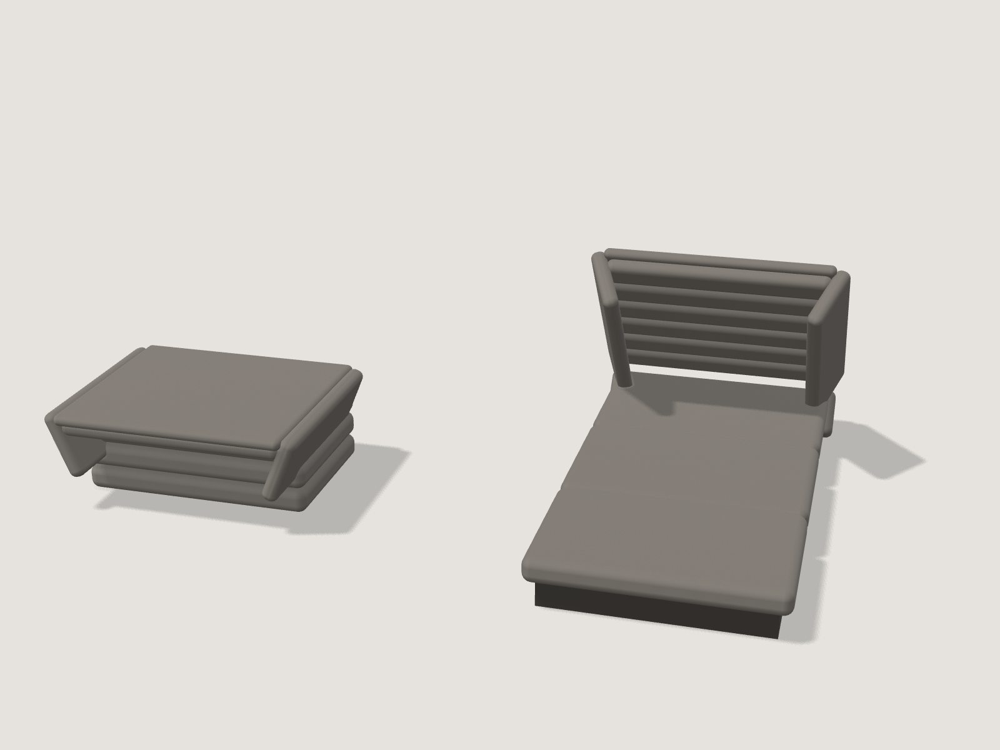
（構造図の左は本体とHBを重ねた状態を示す。出荷時はHBを二つ折りにして別箱）

- **名称**: C1-09 少し挑戦的「TAKA」
- **デザインコンセプト**: 「110cm の背もたれに、包まれて眠る。」市場の常識「国内のHBは床から80〜87cm」を一つだけ崩し、床から110cm のハイバックと、前に22度回り込む両袖のウィングで、ホテルスイートの存在感を10万円台前半に持ち込む。フレームもチャコールの布張りにして、家具というより“寝るためのソファ”に見せる。
- **ターゲット**: 賃貸の1LDK でも、寝室だけはホテルのスイートのようにしたい30代。ベッドで長時間、動画・読書をする人。
- **解決する課題**: 「もたれられるHB（読書・動画）」21.4%（§7）を、最も強く満たす。ウィングで頭まわりが包まれ、壁の冷たさ・照明のまぶしさを遮る【推測】。
- **形状**: 外寸 W1150×L2170×H1100mm。デッキ天面 220mm、布張りの縁 110mm・角R40（ウレタンを巻いたやわらかい縁）、影の台座。HBは横のチャネルキルト6段（1段 約140mm）、厚み110mm。ウィングは幅300×厚み70mm で、HBの両端から前へ22度。
- **ヘッドボード仕様**: 型=ハイバック＋ウィング（上位モジュールの考え方を本体に取り込んだ）／高さ=床から1100mm（企画 0-2 のハイバック 100〜110cm の上限）／素材=撥水・防汚ファブリック チャコール #55524E（竹集成材の芯）／機能=包み込み、もたれ角6度、ウィングは折りたためる／取り付け方式=HBは二つ折りで別箱。本体の頭側にある**ヒンジ受けに上から差し込み**（くさびで自重締まり）、起こすと床着地の脚フラップが下りてロック（R1〜R4）。ウィングはHBに蝶番で付いていて開くだけ
- **素材**: HB・縁=竹集成材の芯＋ウレタン＋撥水ファブリック（カバーは面ファスナーで外して洗える）、デッキ=竹集成材、台座=スチール黒
- **CMF**: Color=チャコール #55524E（標準）／モカ #806350／オフホワイト #ECE6DB。寝具の合わせ色はテラコッタ #8F5440。Finish=チャネルは縫い目で段を付け、ウィングの小口は丸く巻く
- **機能**: ハイバック、ウィング、洗えるカバー。**入れなかった機能**: 照明（ウィングに付けたくなるが、LED の多用は避ける。research 結論2-6）
- **競合優位性**: テンピュール レア（D 26.4万円〜、ウィングバック）[notes/v2-headboard-types.md] に対し、S 129,800円・自分で8分。海外のウィングバック・wall-to-wall [S28] を、国内の部屋幅に収まる W1150 で
- **製造方法**: HBは竹芯のパネル＋ウレタン＋張り（家具の張り工程、外部委託）。二つ折りのヒンジを布の中に隠す。部品点数 約65点、ユーザーが扱うのは本体＋HBの2点。量産の注意点: 張りの品質のばらつき、ウィング付きで重心が高くなる HB の転倒防止（床着地脚の奥行きを150mm 確保）
- **開梱〜就寝**: 6動作（① 本体を引き出す → ② 開く → ③ HBを箱から出して二つ折りを開く → ④ ヒンジ受けに差し込む → ⑤ 起こしてウィングを開く → ⑥ マットレスを載せる）、約8分【推測】。工具0・ネジ0・部品2点・1人（企画 0-1 の①の目標5分は超えるが、②③の10分以内には収まる）
- **梱包**: 2箱。本体箱 約104×67×29cm（200cm）・約24kg、HB箱 約106×78×16cm（200cm）・約14kg【推測】
- **想定価格**: S 129,800円。原価率 約45%【推測】。帯を超える上位。research 結論4 の「D 109,800〜129,800円」の上限をシングルで取る挑戦
- **デザイン意図**: 根拠: research §10「ウィングバック（包み込み）」「wall-to-wall」[S28][S29]、§12「米国プレミアム帯で布張りシェアが約20%→30〜35%」[S30]、企画 4-1 の 09（ハイバック105cm を二つ折り）。research 結論5 は「ウィングは上位モジュールにとどめる」としているが、**あえて本体に取り込んだ**。理由: 10案の中に「HBの存在感で選ぶ層」の受け皿がないと、10万円帯の上位（13〜15万円）を取れないため。実現への道筋: まず②のHBモジュール規格（P2）でハイバックを出し、反応を見てから①の本体に統合する

## 案C1-10 コンセプトモデル「HAKO（はこ）」

正面 `C1-10-front.png` ／ 側面 `C1-10-side.png` ／ フレーム単体 `C1-10-frame.png` ／ 構造（左: たたんだ“箱”の状態、右: 開いて壁を起こす途中）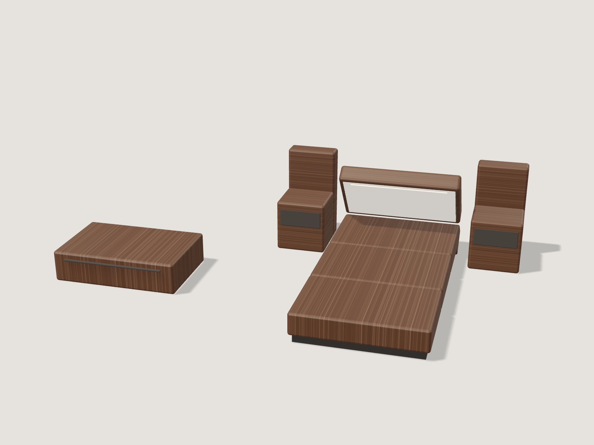

- **名称**: C1-10 コンセプトモデル「HAKO」
- **デザインコンセプト**: 「たたむとベッドが、箱になる。」段ボールで届くのではなく、炭化竹の箱そのものが届く。開くと箱の蓋と側板が、幅1850mm のワイドなHBの壁と両脇のナイトボックスになり、底がデッキになる。引越しの日は、また箱に戻して運ぶ。「分解して同じ箱に戻せる10万円家具」（切り口6）の究極形。
- **ターゲット**: 2〜3年ごとに住み替える都市部の夫婦・転勤族。家具を“持ち物”ではなく“持ち運べる部屋”として考える人。ブランドの方向性を示すための展示・ポップアップ用のモデル。
- **解決する課題**: 購入理由「分解・引越し・長く使える」28.6%（§7）、梱包材のごみ、引越し時の再梱包。ワイドHB（wall-to-wall）[S28] とナイトテーブルを、組立なしで。
- **形状**: 使用時 W1850（HBの壁）×L2340（ナイトボックス込み奥行き）×H800mm、ベッド部 W1010×L1970、デッキ天面 240mm、縁 180mm（箱の側板の厚み）。HB中央はクリームの内面に細い間接光。両脇のナイトボックスは W420×H440×D380mm、前面に開口。たたんだ状態は約105×70×45cm の炭化竹の箱。
- **ヘッドボード仕様**: 型=ワイドの壁＋ナイトボックス一体／高さ=床から800mm（幅1850mm）／素材=炭化竹（外面）＋クリーム塗装（内面）／機能=間接光（1本の細い線だけ。色は変えない）、両脇収納、もたれ角0度（クッションはオプション）／取り付け方式=箱の蓋がヒンジで起きてHB、側板が回転して袖とナイトボックスになる。すべて床着地（R1）
- **素材**: 箱（本体・壁・ナイトボックス）=炭化竹集成材、内面=クリームの塗装面（#EFE9DF）、芯=アルミ押出材（軽量化）、光=LED（調光のみ）
- **CMF**: Color=炭化竹 #4F3524 ×クリーム #EFE9DF（1色展開）。Finish=外面はオイル調マット、内面は半艶の塗装、ナイトボックスの開口は黒 #3A3531
- **機能**: 箱に戻る、ワイドHB、両脇収納、間接光。**入れなかった機能**: 引出し（可動部が増え、箱に戻すときの手順が増える）
- **競合優位性**: 市場に「家具そのものが梱包になる10万円帯のベッド」は確認できない（research §16 の空白 A・B の延長）。カリモク・飛騨の「分解・再組立しても緩まない」[S64] を、分解すら不要に
- **製造方法**: 大型の竹パネルの CNC、アルミ芯、多数のヒンジ（約12か所）。部品点数 約120点。すぐの量産は難しい（重量約45kg・3辺220cm で宅急便に乗らない＝企画の NG）。**実現への道筋**: ① 軽量芯（ハニカム竹パネル）で30kg 以下にする研究 ② SD・D はハーフ×2 の箱に分ける ③ まずポップアップ・展示用に10台限定で作り、ブランドの“起こす体験”の象徴にする
- **開梱〜就寝**: 4動作（① 箱を倒す → ② 開く → ③ 壁を起こす → ④ 両脇を回す）＋マットレス、約5分【推測】。ただし2人（重量のため）
- **梱包**: 段ボールなし（外装はカバーのみ）、約105×70×45cm（220cm）、約45kg【推測】。大型家具便
- **想定価格**: S 149,800円【コンセプト】。原価率 約55%【推測】（量産前のため）
- **デザイン意図**: 根拠: research 結論6 切り口6「分解して同じ箱に戻せる10万円家具」、企画 4-1 の 10「HBが本体をたたむと箱の蓋・側面になる“箱ごと家具”」、§10「ワイド（ナイトテーブル一体の横長）」。ブランドの方向性（ごみを出さない・住み替えに強い・竹の格）を1台で語る。**犠牲にしたもの**: 量産性・コスト・1人での設置（コンセプトモデルのため許容）

---

## 自己レビュー
評価軸の重み（企画 1-7）: Market Fit 16% ／ Design 16% ／ Originality 8% ／ Usability 22% ／ Manufacturability 18% ／ Cost 8% ／ Brand Fit 12%

### 採点表（レビューで修正した後の点）
| No | Market Fit | Design | Originality | Usability | Manufacturability | Cost | Brand Fit | 加重平均 |
|---|---|---|---|---|---|---|---|---|
| C1-01 OKOSU | 5 | 4 | 3 | 5 | 4 | 4 | 4 | **4.30** |
| C1-02 HIRA | 3 | 4 | 3 | 5 | 5 | 5 | 4 | **4.24** |
| C1-03 SUMI | 4 | 5 | 4 | 4 | 3 | 3 | 5 | **4.02** |
| C1-04 MARU | 4 | 4 | 4 | 4 | 3 | 3 | 3 | **3.62** |
| C1-05 NICHE | 4 | 3 | 4 | 4 | 3 | 3 | 4 | **3.58** |
| C1-06 AJIRO | 3 | 5 | 5 | 4 | 3 | 3 | 5 | **3.94** |
| C1-07 ICHIDO | 5 | 4 | 4 | 5 | 4 | 4 | 4 | **4.38** |
| C1-08 SEBONE | 3 | 4 | 5 | 4 | 4 | 4 | 4 | **3.92** |
| C1-09 TAKA | 3 | 4 | 4 | 3 | 2 | 2 | 3 | **2.98** |
| C1-10 HAKO | 2 | 4 | 5 | 3 | 1 | 1 | 5 | **2.88** |

採点の理由（1行ずつ）
- **C1-01**: MF5 価格・型・高さが市場の中心そのもの／D4 厚い縁と笠木で10万円に見えるが新しさは控えめ／O3 形は王道、新しさは“起こす”体験のみ／U5 4動作・部品1点／Mf4 既存機構の流用で作れる、27.5kg は上限内／C4 原価率38%／B4 竹の資産の素直な延長
- **C1-02**: MF3 最安で入口になるが、10万円帯では「簡素すぎる」と見られるおそれ／D4 線が少なく整っている／O3 薄板は既存にもある／U5 最軽量23.5kg／Mf5 部品最少／C5 原価率36%／B4 竹の素地がよく見える
- **C1-03**: MF4 上位の需要は確か（飛騨・カリモク）だが価格が帯を超える／D5 畝・厚い縁・影で最も家具らしい／O4 炭化竹の畝は国内10万円帯にない／U4 29.5kg で引き出しがやや重い／Mf3 畝17本・エプロン・色ロット管理／C3 原価率42%／B5 切り口7 の正面
- **C1-04**: MF4 SNS・若い層に強い／D4 曲線がやわらかい／O4 竹のアーチ×ブークレ／U4 洗えるが部品2点／Mf3 曲げ積層の型と精度／C3 原価率41%／B3 竹が主役から一歩下がる
- **C1-05**: MF4 宮棚の需要は大きい／D3 要素が多く、HBのまとまりが他案より弱い／O4 起こすと現れるニッチは新しい／U4 便利だが部品2点・配線／Mf3 電装・安全規格／C3 原価率42%／B4 家電を差し替える考え方は企画の P4 と一致
- **C1-06**: MF3 和・民藝が好きな層に限られる／D5 素材の表情が最も豊か／O5 網代のHBは市場にない／U4 布の柔らかさがない分もたれ心地は硬め／Mf3 網代シートの調達・柄合わせ／C3 原価率43%／B5 国産竹の格を最も強く語る
- **C1-07**: MF5 中心価格＋洗える布＋最短の組立／D4 額縁とクッションの整ったバランス／O4 一挙動ロックは新しい体験／U5 3動作・3分・目印／Mf4 リンク1部品の追加で作れる／C4 原価率40%／B4 起こす体験をブランドの核にできる
- **C1-08**: MF3 構造が好きな層に刺さるが、全幅1120 は部屋を選ぶ／D4 柱と梁の軸組が美しい／O5 HBが背骨になる構造は市場にない／U4 4動作、浮くマットレスで頭側も掃除しやすい／Mf4 脚の部品が減る／C4 原価率37%／B4 竹×木組みの文脈
- **C1-09**: MF3 上位の層は小さい／D4 存在感は最も強い／O4 ハイバック＋ウィングの一体は国内10万円帯にない／U3 6動作・8分・部品2点で①の目標（5分）を超える／Mf2 張り・二つ折り・2箱／C2 原価率45%／B3 布が主役で竹が見えない
- **C1-10**: MF2 すぐには売らない前提／D4 箱という強い形／O5 家具が梱包になる／U3 2人・45kg／Mf1 宅急便に乗らない／C1 原価率55%／B5 ブランドの将来像を最も強く示す

### やり直しの基準の確認
- 01〜08 で Market Fit・Manufacturability・Cost が2点以下の案: **なし**（修正後）
- Usability 2点以下: なし ／ Originality 2点以下: なし
- C1-09（Mf2・C2）・C1-10（Mf1・C1）は基準の対象外（09・10 は許容）。理由と実現への道筋は各案のデザイン意図・製造方法に記載

### 各案の講評（1〜2行）
- **C1-01**: 最も外さない案。C1-07 の一挙動ロックと洗えるカバーを載せれば、そのまま主力になる。
- **C1-02**: 入口価格として有効だが、フラッグシップの「格」は弱い。SKU の下位（エントリー）として残す価値。
- **C1-03**: ブランドの格を最も上げる。重量29.5kg を試作で確かめたい。
- **C1-04**: SNS の拡散力は最も高い。竹の存在感が弱まる点をどう評価するかが分かれ目。
- **C1-05**: 機能の需要は確かだが、見た目の要素が多い。モジュールを外した状態も美しく見せる改良が必要。
- **C1-06**: 素材の物語は最強。網代の供給元の確保が前提。
- **C1-07**: 体験（3動作）と日常（洗える）の両方で、不満の上位を最も多く解決する。
- **C1-08**: 「HBがないと立たない」構造で、ヘッドレスの否定を形にした。全幅と、頭側の持ち出し剛性の検証が鍵。
- **C1-09**: 挑戦としての価値は高いが、①の「起こすだけ」の純度は下がる。②のモジュールで先に試すのが現実的。
- **C1-10**: 量産の案ではなく、ブランドの旗。展示・ポップアップの目玉として。

### レビューで修正した点
| 案 | 軸 | 修正前→後 | 何を変えたか |
|---|---|---|---|
| 全案 | Design | 3→4（01 ほか） | 最初のレンダーでは枕が大きくHBの大半を隠し、縁も薄く見えた。枕を 760×470→580×320mm に縮め、C1-01 はマットレスの下端を隠す立ち上がり40mm を追加。メインビジュアルを14度振ってHBが正面寄りに見える構図にした |
| C1-03 SUMI | Manufacturability | 2→3 | 当初は縁110mm を無垢の厚板にしており、三つ折りの厚みが約44cm（3辺220cm）で宅急便に乗らなかった。60mm のデッキ＋ヒンジで下りる50mm のエプロンに変え、3辺200cm・29.5kg に収めた |
| C1-04 MARU | Manufacturability／Usability | Mf 2→3、U 5→4 | 当初はブークレをアーチ枠に張り込んでいて、本体箱が約31kg（30kg 超）になった。クッションを落とし込み式の別パーツ（洗えるカバー）にして本体箱26kg＋小箱3kg に分けた。部品が2点になった分 Usability は1点下げた |
| C1-05 NICHE | Manufacturability／Usability | Mf 2→3、U 3→4 | 当初はニッチを固定の箱（奥行き90mm）にしていて、たたんだ厚みが増え200サイズを超えた。天板が自重で下りるフラップ式に変え、たたむと45mm に。HBが垂直で「もたれられない」点は、クッションをくさび形にして背当て7度を確保した |
| C1-08 SEBONE | Manufacturability／Design | Mf 2→4、D 3→4 | 当初は柱をデッキ（幅1010）の外に立てて全幅1200・柱が一体で折れず、3辺216cm を超えた。さらに初回レンダーで柱がマットレスにめり込んでいた。デッキを幅830 に絞ってマットレスを張り出させ、柱（70×90）をマットレスの外に、柱をデッキ上面で上下に分けて上部だけヒンジで起こす構造にした（3辺200cm） |
| C1-09 TAKA | Design | 3→4 | 初回レンダーでウィングが外に開いていた（回転の向きの誤り）。内側へ22度回り込むように直し、包み込む形にした |
| C1-10 HAKO | Design | 3→4 | 初回は袖の壁とナイトボックスの高さが違い、ひじ掛け椅子のように見えた。袖を中央と同じ高さの一続きの壁にし、竹の節の柄が格子状に見える素材表現を、木目の素材に替えた |
| C1-02 HIRA | Market Fit | 2→3 | 当初はHB 24mm・縁45mm で、簡易ベッドに見えた。HB 36mm・縁60mm を下限にして、台座を150mm 奥に引っ込めて“浮かせる”ことで、線の少なさを上質に見せた |

### 推奨上位3案とその理由
1. **売れる確率が最も高い: C1-07 ICHIDO（4.38）** — 中心価格 99,800円で、購入理由1位（工具不要・短時間）と不満1位（重い・2人必要）に「3動作・3分・1人」で答え、布HBの弱点（洗えない）も解決する。C1-01 の王道の形を土台にしているので、売り場での分かりやすさも高い。
2. **差別化が最も強い: C1-08 SEBONE（3.92、Originality 5）** — HBを「付ける部品」から「立たせる構造」に変えた案。「HBがないと立たない」「HBがあるほど強い」は、競合の後付けHB（Floyd のクランプ）への最も強い反論で、脚の部品が減ってコストも下がる。全幅1120 と持ち出しの剛性を試作で確かめる条件付き。
3. **ブランド価値を最も高める: C1-03 SUMI（4.02、Brand Fit 5・Design 5）** — 炭化竹の畝と厚い縁で、GOKUMIN の竹を「和モダンの高級素材」に格上げする（切り口7）。飛騨・カリモクと並ぶ格を、自分で5分・即納で出せる。原価と重量が課題。
- 次点: C1-01 OKOSU（4.30。C1-07 と一本化してよい）、C1-06 AJIRO（素材の物語。C1-03 の替え“顔”として P2 で展開も可）

## ユーザーに判断してほしいこと
1. **①の主力の方向**: 「C1-07 ICHIDO（竹枠＋洗える布、99,800円）」を主力にするか、「C1-01 OKOSU（竹の一枚板）」を主力にして布を P2 の着せ替えにするか
2. **上位モデルの方向**: 炭化竹の畝（C1-03）／網代（C1-06）／ハイバック布張り（C1-09）のどれを上位（12〜13万円）に置くか
3. **構造革新（C1-08）の扱い**: 全幅1120mm（マットレスより15cm 広い）を許容できるか。許容できれば、主力の構造そのものを SEBONE に置き換える選択肢もある
4. **部品点数の考え方**: C1-04・05・09 は「本体＋布クッション／モジュール／HB」の2点。①の「部品1点」を厳格に守るか、2点までを許容するか
5. **重量**: C1-03（29.5kg）・C1-05（29kg）は上限30kg に近い。「持ち上げずに引き出す」手順で許容するか
6. **C1-10 HAKO**: 量産ではなく、展示・ポップアップ用のコンセプトモデルとして進めてよいか

## 前提・仮説・未確認事項
- 【推測】寸法・重量・所要時間・原価率・梱包3辺は、3D モデル上の寸法と既存の折りたたみバンブーベッド（約20.5kg [S1]）からの推定。試作で実測して確定する（research 検証方法1）
- 【推測】「一挙動ロック」（C1-07）、エプロン連動（C1-03）、自重で下りるニッチ（C1-05）、柱の継ぎ目のくさび（C1-08）は、機構として成立する見込みだが未検証
- 【推測】網代シート（C1-06）の国内調達先・価格、炭化竹の色ロットの幅は未確認
- 【未確認】既存の折りたたみバンブーベッド（t-fdbb）のヒンジ・ロック構造の詳細と、流用できる範囲（社内データ）
- 【未確認】もたれ耐久（体重80kg・5,000回、R6）を、ヒンジ一体のHBで満たせるか。C1-09 のハイバックは特に厳しい
- 3D レンダーは形・構造・CMF を伝えるためのもので、布のしわ・竹の積層の細部は表現していない。質感は画像生成AI用プロンプト（`prompts/03-design-image-prompts-c1-v2.md`）で補う

## 次工程（A3プレゼンボード）への申し送り
- メインビジュアルは各案の `C1-XX-three-quarter.png`（寝具あり、HBが正面寄りに見える構図）。一覧ボードには `contact-sheet.png`（フレーム＋HB単体）を使う
- 構造の説明は `C1-XX-structure.png`（左: たたんだ状態＝梱包時。HBはデッキの上に伏せて収まる／右: 開いてHBを起こす途中）。側面 `C1-XX-side.png` でもたれ角が分かる
- 各ボードで必ず見せたいこと: ①「箱→開く→起こす」の手順（動作数・分・部品点数・梱包）②HBの型・高さ・素材・機能・取り付け方式 ③すのこに見えない理由（厚い縁・小口・影の台座）
- 画像に日本語の文字は入っていない。寸法・注記はボードの HTML 側で組む
- 画像の再描画: `bash product/designs/v2/c1/render-one.sh C1-XX`（`gen-scenes.mjs` の寸法を変えてから）
