# STEP 3 プロダクトデザイン10案 v2 — コンセプト② 自分仕様に育つベッド「着せ替えヘッドボード規格（HEAD DOCK）」
- 作成: product-designer ／ 2026-09-30 ／ 入力: `prompts/03-design-product-designer-c2-v3.md`, `research/research.md`（v2）, `research/notes/v2-premium-beds.md`, `research/notes/v2-headboard-types.md`, `product/02-planning-v2.md`（0章・2章・4章）, `brief.md`（v2 の条件）, `handoff.md`, `decisions.md`（承認済みの決定なし）, `research/01-research-feedback.md`, `research/00-input.md`, `projects/_studio/preferences.md`, `projects/_studio/brand.md`, `scripts/render3d/README.md`、参考 `product/03-design-v2-c1.md`（画像の粒度・寝具の表現をそろえた）
- 凡例: 【推測】=調査の裏付けがない見積もり・仮定（寸法・重量・原価率・所要時間・梱包はすべて試作前の推定）
- **v1 からの変更点**: v1 の10案（`product/03-design-v1-c2.md`）は全案ヘッドレスで、安価なすのこに見えたため不採用。v2 は **全10案ヘッドボード込み**、**10万円帯の質感（厚い縁・布張りの大きな角R・小口）**、**「床に立つ2本の支柱＝HEAD DOCK に顔を上から落とし込む」規格そのものを切り口**にして作り直した。v1 から引き継いだものはない（名称もすべて新規）
- 画像: `product/designs/v2/c2/`（scene JSON は `gen-scenes.mjs` で生成、`bash render-one.sh C2-XX` で再描画できる）

## サマリー
- 10案すべてが「本体を開く → HEAD DOCK（支柱2本＋床梁の1ユニット）をデッキのソケットに差す → 顔を上から落とし込む → マットレス」の4動作で完成する。**工具0・ネジ0・女性1人・約8分・ユーザーが扱う部品3点**（C2-05・08・10 は4点以上）。顔の付け替えは **持ち上げる→落とし込むの2動作・約1分**【推測】。
- HEAD DOCK は **1規格**（支柱の芯々 940mm・高さ 700mm・床着地・くさび2点）。顔は「インセット（支柱の間）」と「オーバーレイ（支柱の前）」の2つの掛け位置を持ち、**どの案の顔も他の案の支柱に付く**（構造図で別の顔に差し替えて見せた）。
- HBの型は **縦チャネル布／竹フラット／2層（竹の壁＋ブークレ）／雲形／電源の柱＋ポッド／簾（丸竹）／バーに吊るクッション／ワイド＋トレー／タイル6枚／床から2m の柱と棚** の10通り。高さは床から **800〜1050mm（C2-10 は柱2000mm）**。
- 推奨上位3案: **C2-07 KAKERU**（売れる確率が最も高い）、**C2-09 TILE**（差別化が最も強い）、**C2-03 KASANE**（ブランド価値を最も高める）。
- 勝ち筋「国産竹の剛性とホテルのようなHBを、1人・工具なしで“差す”だけで完成させ、S 99,800円で売る」（research 結論6）に対し、②は **HBを“育てる”ことで買い替えを買い足しに変える**（research 小まとめ②、空白C）。

## デザインの前提（research.md から引き継いだこと）
- **ターゲット**: 28〜39歳の共働き夫婦・同棲カップル、特にベッドで読書・動画の時間が長く、寝室の雰囲気を変えるのが好きな2人（research 結論3、企画 2-2）
- **価格**: 本体＋ベーシックHBで S 99,800円（SD 109,800／D 119,800円）。HBモジュール 9,800〜29,800円で上に伸ばす（research 結論4、企画 2-5）
- **デザイン方向**: 竹の本体＋布または竹のHB。もたれられる低めのパネル（床から80〜90cm、もたれ角5〜10度）、竹パネル／洗える布クッション／薄型ニッチの3系統＋上位にウィング・ワイド（research 結論5）
- **避けるべきデザイン**: ヘッドレス、クランプ1点の後付けHB（Floyd の脱落・きしみ [S23]）、ボルト留めの重いHB、深い宮棚、洗えない布、LED の色変え、本体色を増やすこと（research 結論2）。加えて「宮棚付きパイプベッドのようにモジュールがごちゃごちゃ付いた見た目」（企画 2-6）
- **勝ち筋**: 空白C（洗える・着せ替えられるHBの10万円帯の国内品）と空白B（HBの組立をなくす）（research §16）
- **設計ルール**: 企画 0-3 の R1〜R7（支柱は床着地、クランプ1点なし、自重で締まる、ロックが見える、金属どうしを当てない、もたれ耐久、HBは届いた日から付いている）

### HEAD DOCK 規格と10案に共通する仕様【推測】
| 項目 | 共通仕様 |
|---|---|
| 本体 | P1 竹デッキ（三つ折り、HBなし）。見える面は国産竹集成材、荷重部は中空スチール芯。デッキ天面は竹の無垢板張りで、外からすのこの隙間を見せない。縁の見付け 70〜146mm、マットレスの下端を隠す立ち上がり 30〜36mm（案ごとに記載） |
| HEAD DOCK（支柱ユニット） | 支柱2本＋床梁の **1ユニット**。芯々 **940mm（S）**、高さ **700mm**、断面 60〜84×44〜110mm（案ごと）。支柱は床に着地（R1）、床梁から伸びる2本の舌をデッキ頭側のソケットに上から差すと、くさびが **2点**で噛み合い、マットレスの荷重で締まる（R2・R3）。支柱の上端に **延長キャップ（100〜230mm）** を差して高さを変えられる（C2-02・05・06・07・09） |
| 顔（P2 HBフェイス） | 支柱の溝・フックに上から落として自重でロック。**インセット顔**（支柱の間、幅 約870mm）と**オーバーレイ顔**（支柱の前、幅 約1030mm）の2つの掛け位置。外すときは下端のレバーを引いて持ち上げる。ロックすると支柱の目印が緑になる（R4） |
| もたれ角 | 顔の掛け金具の角度で3〜8度（顔が変わっても支柱側の角度は同じ） |
| 開梱〜就寝（基本の4動作） | ① 本体箱から本体を引き出して床の上で開く（脚は連動）→ ② HEAD DOCK をソケットに差す（くさびがカチッ）→ ③ 顔を上から落とし込む → ④ マットレスを載せる。**約8分**、工具0・ネジ0・1人 |
| 梱包（基本） | 本体箱 約68×103×24cm（195cm）・約22kg ／ HB箱（HEAD DOCK＋顔）約106×76×16cm（198cm）・約12〜15kg。顔の追加・替えは顔だけの薄箱（約104×70×12cm）で届く |
| 保証・耐荷重 | 保証耐荷重 S 250kg。フレーム構造10年、布・電装2年（企画 0-4）。顔の付け外し耐久1,000回、もたれ80kg×5,000回（R6） |
| 共通プラットフォーム | P1・P2・P3・P5・P6 は全案で使用。P4（電源差し込み口）は支柱の上端・前面に全案で“口だけ”を用意し、モジュールは C2-05・10 で標準、他はオプション |

## 10案の一覧
| No | タイプ | 名称 | 一言コンセプト | 想定価格（S・税込） | 主素材 | ビジュアル |
|---|---|---|---|---|---|---|
| C2-01 | 王道・市場適合型 | KIGAE（きがえ） | まずはホテルの顔。飽きたら着替える | 99,800円 | 竹＋撥水布（オート） | 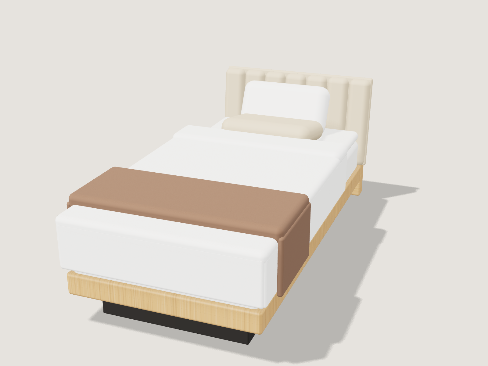 |
| C2-02 | ミニマル | MONO（もの） | 支柱も顔も、一枚の面に | 94,800円 | 竹（淡色） | 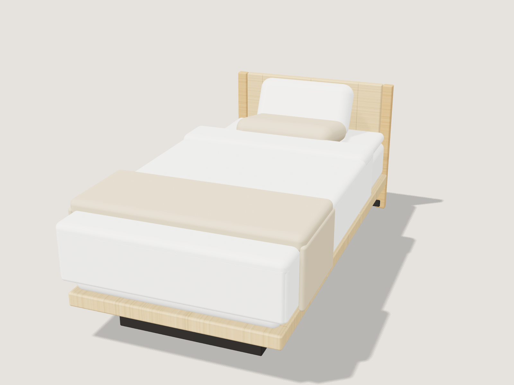 |
| C2-03 | プレミアム | KASANE（かさね） | 顔を重ねて、スイートに育てる | 129,800円（2層セット） | 炭化竹＋ブークレ | 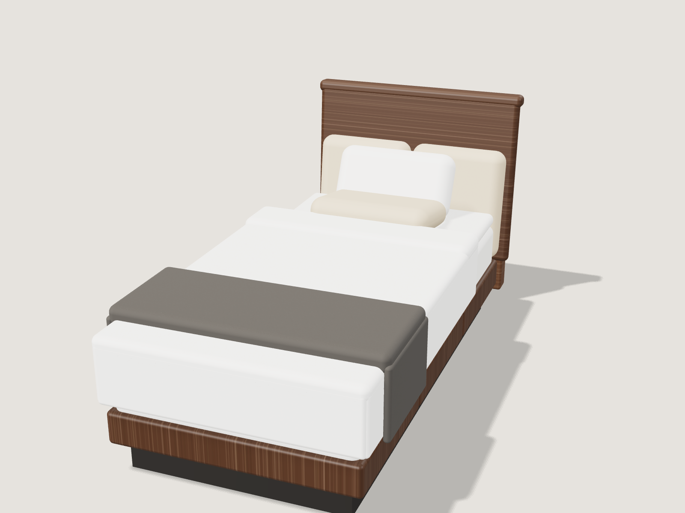 |
| C2-04 | トレンド | KUMO（くも） | 雲のかたちに、もたれる | 104,800円 | 竹＋布（クレイ） | 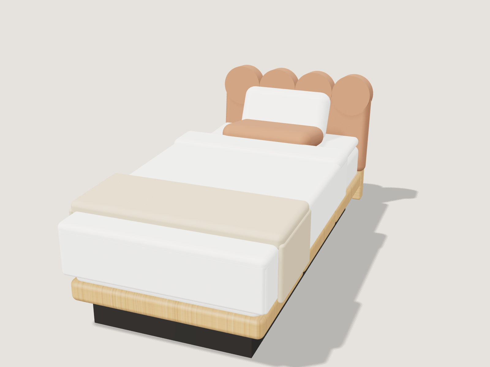 |
| C2-05 | 機能特化 | HUB（ハブ） | 支柱が、寝室の電源になる | 114,800円（モジュール込み） | 竹＋布（チャコール）＋電装 | 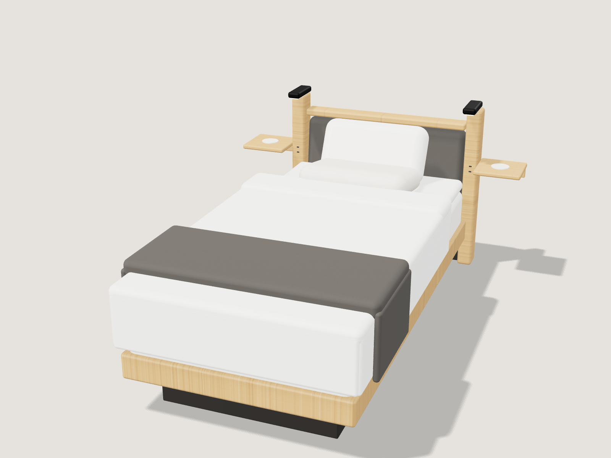 |
| C2-06 | 素材特化 | SUDARE（すだれ） | 丸竹と簾。裏返せば洗えるリネン | 109,800円 | 燻し竹（丸竹・ひご） | 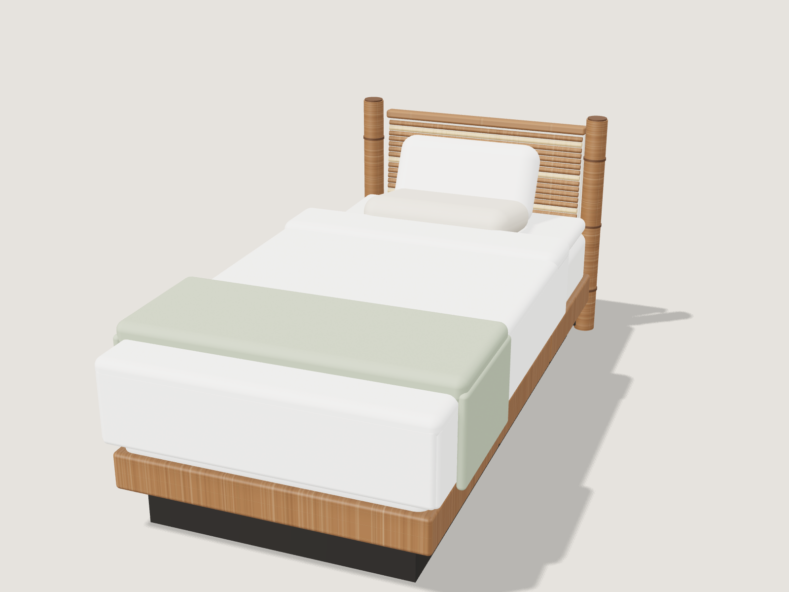 |
| C2-07 | UX改善 | KAKERU（かける） | バーを掛けるだけ。1動作で着替える | 99,800円 | 竹（丸バー）＋洗える布（モカ） | 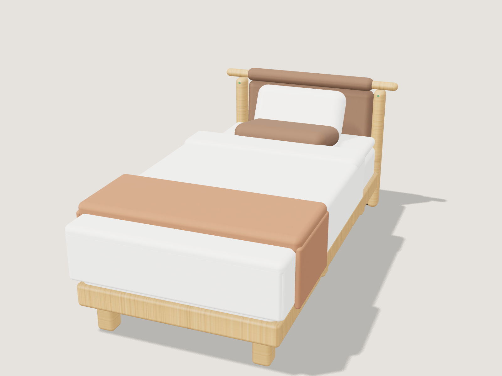 |
| C2-08 | 構造革新 | NOBIRU（のびる） | 床梁が伸びて、ワイドのホテルヘッドに | 129,800円（ワイドセット） | 竹＋布（リネン） | 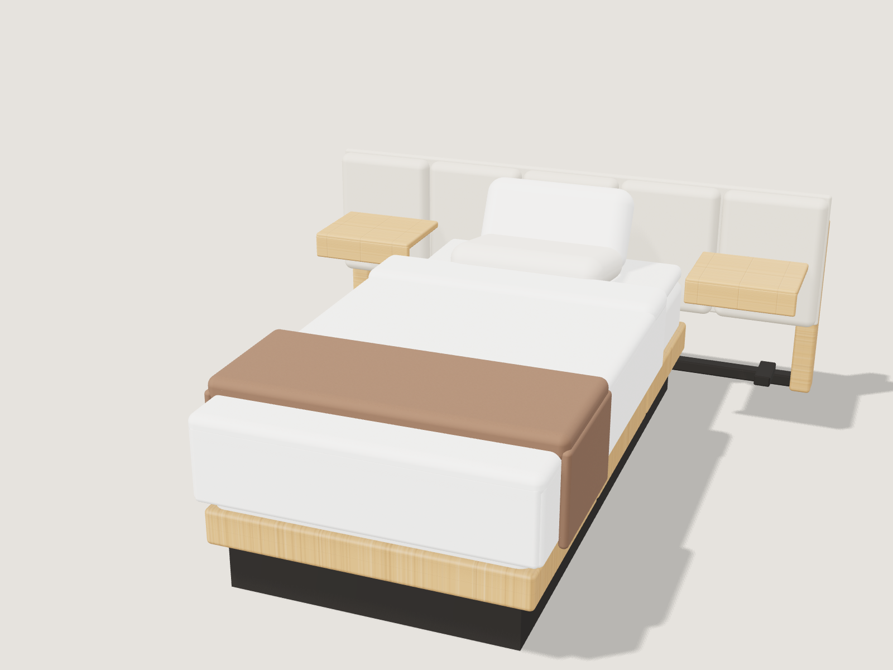 |
| C2-09 | 少し挑戦的 | TILE（タイル） | 6枚のクッションを、好きな色で並べる | 109,800円 | 炭化竹＋布タイル6色 | 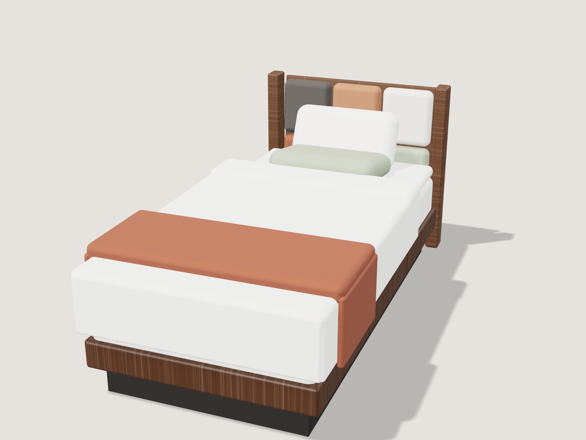 |
| C2-10 | コンセプトモデル | HASHIRA（はしら） | ベッドの柱が、寝室の背骨になる | 199,800円【コンセプト】 | 竹（柱・梁・棚）＋布（モカ） | 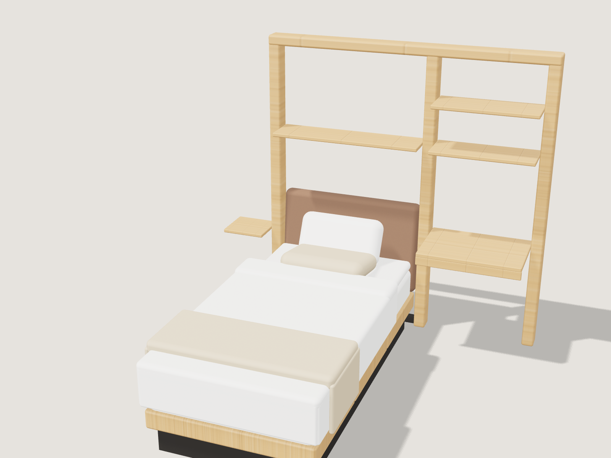 |

一覧画像（フレーム＋HB単体）: 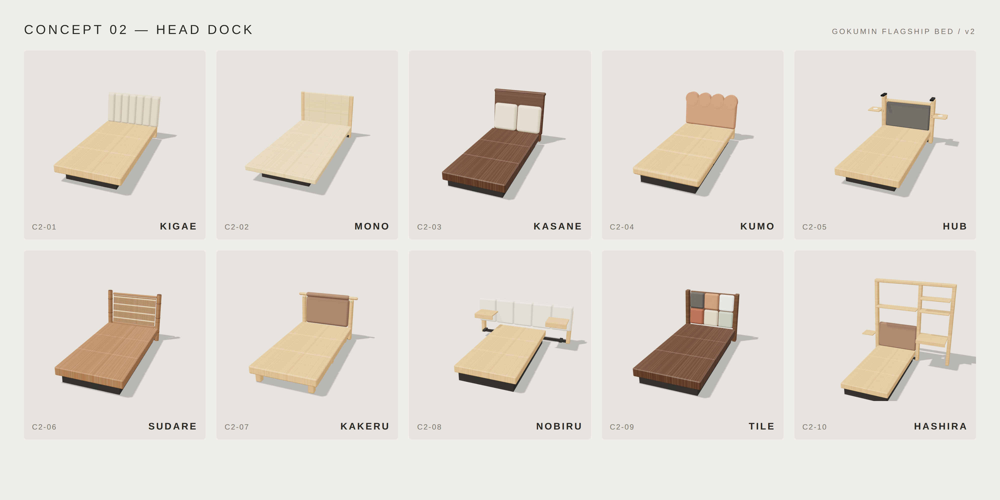

## 10案の差分表（似せないためのチェック）
| No | 形のモチーフ | HBの型 | HB高さ（床から） | HB素材・色 | HBの機能 | 支柱の見せ方 | 主素材（本体） | 価格帯 | 主な訴求点 | マップ上の位置 |
|---|---|---|---|---|---|---|---|---|---|---|
| C2-01 | 縦の畝（チャネル） | オーバーレイ布クッション | 850mm | 撥水布オート | 洗えるカバー、もたれ6度 | 隠す | 竹ナチュラル（縁120） | 中心 | ホテルの定番＋後で着替えられる | 差す×9.9万（空白C の中心） |
| C2-02 | 一枚の面＋目地 | インセット竹フラット | 800mm | 竹淡色（支柱ナチュラル） | もたれ4度 | 面一で見せる | 竹淡色（縁70） | 下 | 最軽量・最安、規格の静けさ | 差す×9.5万 |
| C2-03 | 2層の重ね | 背の高い竹の壁＋ブークレのスラブ | 1050mm（前層790） | 炭化竹＋ブークレ（ラテ） | 2層で育つ、もたれ8度 | 隠す | 炭化竹（縁140） | 上 | スイートの格、段階的に買い足す | 差す×13万 |
| C2-04 | 雲（4つの丸い山） | オーバーレイ雲形クッション | 900mm（頂部） | 布クレイ | 洗えるカバー、もたれ6度 | 隠す | 竹ナチュラル（縁120・R34） | 中上 | 曲線トレンド・SNS映え | 差す×10.5万 |
| C2-05 | 柱＋灯り＋ポッド | インセットクッション＋支柱モジュール | 820mm（支柱900） | 布チャコール＋竹 | 読書灯・USB-C・ワイヤレス充電 | 主役として見せる | 竹ナチュラル | 中上 | 寝室の電源ハブ、全長+12cm以内 | 差す×11.5万 |
| C2-06 | 丸竹の節＋簾 | インセット簾（リバーシブル） | 860mm（支柱900） | 燻し竹ひご×淡竹／裏リネン | 裏返すと洗える布 | 丸竹で見せる | 燻し竹 | 中上 | 竹そのものの素材価値 | 差す×11万 |
| C2-07 | 物干しのバー | バーに吊るクッション | 850mm（バー上端） | 竹の丸バー＋布モカ | 1動作で付け外し、ロックの緑の目印 | 丸い支柱で見せる | 竹ナチュラル（ブロック脚） | 中心 | 最も簡単な着せ替え・洗える | 差す×9.9万（空白B＋C） |
| C2-08 | 横長の壁＋トレー | ワイドパネル（5面）＋片持ちトレー | 820mm（幅1990） | 布リネン | 支柱間隔を940→1900に伸縮 | 端に見せる | 竹ナチュラル | 上 | 住み替えでワイドに育つ | 差す×13万 |
| C2-09 | 格子（2×3） | タイル6枚 | 910mm（支柱930） | 炭化竹＋布6色 | 1枚ずつ付け替え・色の組み合わせ | 額縁として見せる | 炭化竹 | 中上 | 顔を“ファッション”として編集 | 差す×11万（空白の外側） |
| C2-10 | 柱と梁（軸組） | 柱2000＋棚・デスク＋クッション | 900mm（柱2000） | 竹＋布モカ | 棚・灯り・デスク | 構造として見せる | 竹ナチュラル | 最上 | 寝室全体を編集する | 将来×20万 |

- 重なりの確認: 本体「竹ナチュラル」は C2-01・04・05・07・08・10 の6案あるが、企画の本体2色方針（0-4、research 結論2-7）のため。**HBの型・支柱の見せ方・訴求点はすべて異なる**。本体の脚も台座（影）／ブロック脚／プリンスで分けた。価格帯「中心」は C2-01・07 の2案、「中上」は C2-04・05・06・09 の4案だが訴求点（曲線／電源／素材／編集）が異なる
- 支柱の見せ方で振れ幅を作った: 隠す（01・03・04）→ 面一（02）→ 丸竹・丸柱（06・07）→ 額縁（09）→ 主役（05）→ 構造（10）
- コンセプト①（`03-design-v2-c1.md`）との違い: ①はHBがデッキのヒンジで起きる一体構造（部品1点）で、HBの型も竹フラット・畝・アーチ・網代・門型・ハイバック・箱。②は **支柱が床に立ち顔が上から落ちる** 構造で、①と同じ型（アーチ・縦の畝・網代・ハイバック＋ウィング・箱）は使っていない

---

## 案C2-01 王道・市場適合型「KIGAE（きがえ）」

正面 `C2-01-front.png` ／ 側面 `C2-01-side.png` ／ フレーム単体 `C2-01-frame.png` ／ 構造（左: 支柱だけ＋顔を持ち上げた状態／中: 竹フラットの顔／右: ニッチ棚の顔）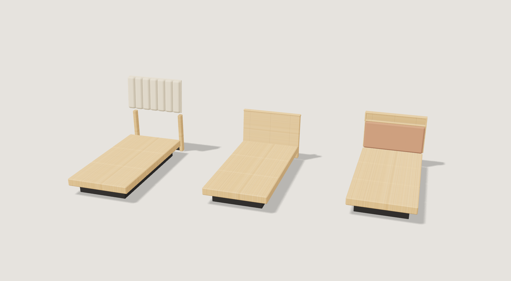

- **名称**: C2-01 王道・市場適合型「KIGAE」
- **デザインコンセプト**: 「まずはホテルの顔。飽きたら着替える。」10万円帯で最も売れている“布張りのもたれられるHB”（コアラ ファブリック、エマ）を標準の顔にし、その裏に HEAD DOCK を隠した。買った日は王道のホテルベッド、後から竹・ニッチ・季節の布に着替えられる。
- **ターゲット**: THE GOKUMIN を買った31歳の同棲カップル（在宅勤務あり）。ベッドで動画・読書をする時間が長い（企画 2-2）。
- **解決する課題**: 購入理由「もたれられるHB」21.4%・「デザイン（ホテル）」35.7%（research §7）、不満「布の汚れ・洗えない」[S43]、「HBのぐらつき」14.3%（§6）。
- **形状**: 外寸 W1030×L2115×H850mm。デッキ天面 244mm、縁の見付け 84mm＋立ち上がり36mm、脚は外周から110mm 奥の影の台座。顔は幅1030×厚み104mm、縦のチャネル7本（1本あたり幅141mm・R40）、下端はマットレスの上端より下まで下ろして隙間を見せない。
- **ヘッドボード仕様**: 型=オーバーレイの布クッション（縦チャネル）／高さ=床から850mm（企画 0-2 の標準）／素材=撥水・防汚ファブリック（オート）、中身はウレタン＋竹合板の芯／機能=ジッパーで外して洗えるカバー、もたれ角6度／取り付け方式=HEAD DOCK（支柱 64×90、芯々900）の前面フックに上から掛ける。支柱は顔の裏に隠れる
- **素材**: デッキ・縁=国産竹集成材、芯=中空スチール、HEAD DOCK=竹集成材＋スチール芯、床梁=スチール（黒）、顔=撥水布＋ウレタン＋竹合板
- **CMF**: 本体=ナチュラル竹 #C89C66／炭化竹 #5B3D28。顔の布=オート #CDBC9F（標準）、オフホワイト #ECE6DB、クレイ #A8765A、チャコール #55524E の4色。Finish=竹はマットのオイル調ウレタン（3分艶）、布は微起毛の平織り
- **機能**: 洗える布HB、もたれ6度、P4 の差し込み口（オプション）。**入れなかった機能**: 宮棚・コンセントの作り込み（低価格帯の当たり前、research 結論2）
- **競合優位性**: コアラ ファブリック（99,900円）の「パーツが重く2人推奨・寝返りで音」[S40]・布が洗えない点に対し、同価格で1人・工具0・洗える、しかも後で顔を替えられる。Floyd の「クランプが緩む」[S23] に対し、床着地の支柱＋くさび2点
- **製造方法**: デッキは P1 の既存工程（CNC＋ウレタン塗装、スチール芯の曲げ・溶接）。HEAD DOCK は竹集成材の支柱をCNC、床梁は角パイプ。顔は竹合板の芯にウレタンを貼り、カバーは縫製（チャネルのステッチ7本）。工場での部品点数 約52点（本体40＋DOCK 6＋顔6）、ユーザーが扱うのは3点。新規金型はくさび・フックの樹脂成形2型【推測】。量産の注意点: 顔とフックの位置公差（±1mm）、布ロットの色差
- **開梱〜就寝**: 基本の4動作、**約8分**【推測】。工具0・ネジ0・部品3点・1人
- **梱包**: 2箱。本体箱 約68×103×24cm（195cm）・約22kg／HB箱 約106×76×16cm（198cm）・約13kg【推測】
- **想定価格**: S 99,800円。原価率 約38%【推測】。research 結論4 の狙う価格そのもの。替えカバー 9,800円、別の顔 14,800円〜
- **デザイン意図**: 根拠: research 結論5「ファブリック（角を丸め、チャネルキルト。カバーを外して洗える）」、§10「チャネル（縦の畝）キルトが2026年の流れ」[S28][S29]、§14 コアラの「もたれやすい布張りHB」。支柱を隠すことで、規格を知らない人にも“普通に美しいホテルベッド”に見える（売り場での分かりやすさ）。SNS の「着せ替えの前後」は同じ構図で撮れる（企画 2-6）

## 案C2-02 ミニマル「MONO（もの）」

正面 `C2-02-front.png` ／ 側面 `C2-02-side.png` ／ フレーム単体 `C2-02-frame.png` ／ 構造（支柱だけ／布クッションの顔／簾の顔）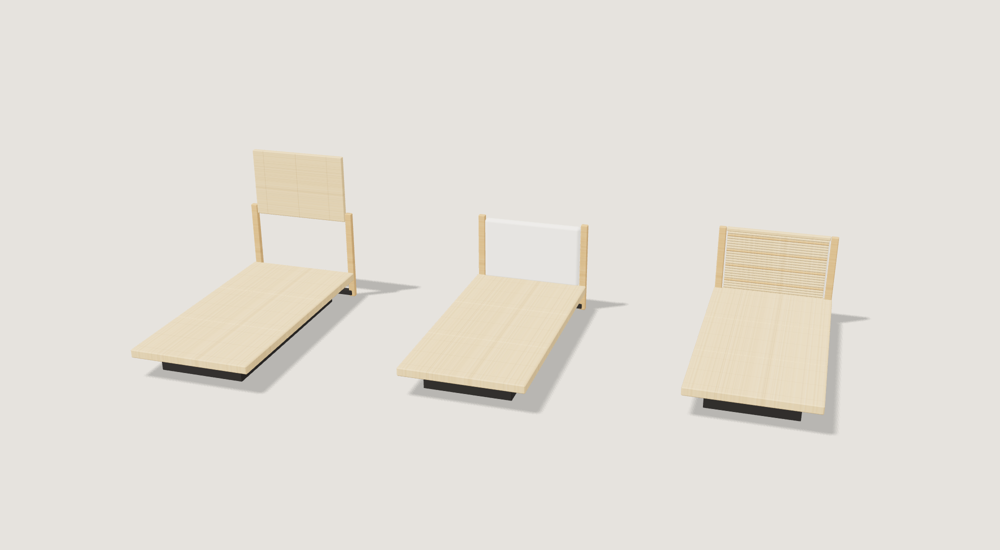

- **名称**: C2-02 ミニマル「MONO」
- **デザインコンセプト**: 「支柱も顔も、一枚の面に。」支柱と竹の顔を同じ厚み44mm・同じ面にそろえ、4mm の目地2本だけで規格を表す。部品を最小にし、規格があることを感じさせない静かな本体。
- **ターゲット**: 1LDK に住む30代の単身者（research 結論3 の第2ターゲット）。線の少ない和〜北欧の部屋が好き。
- **解決する課題**: 宮付きで「全長が十数cm伸びる」不満 [S44]。HB込みの全長を 2050mm（HBの奥行き 5cm）に抑える。重さの不満（§6）に対し最軽量。
- **形状**: 外寸 W1000×L2050×H800mm。デッキ天面 240mm、縁の見付け 70mm（立ち上がりなし）、目地3mm、台座は外周から150mm 奥。支柱 60×44mm（延長キャップ100mm込みで800mm）、顔は幅872×厚み44mm の竹一枚板、角R8。
- **ヘッドボード仕様**: 型=インセットの竹フラット／高さ=床から800mm（標準より5cm低く圧迫感を減らす）／素材=竹集成材 淡色、支柱はナチュラル竹で目地を強調／機能=もたれ角4度（顔の裏に当て木）／取り付け方式=支柱の内側の溝に上から落とす（くさび2点）
- **素材**: デッキ・縁・顔=竹集成材（淡色の選別材）、支柱=竹集成材ナチュラル＋スチール芯、床梁=スチール黒
- **CMF**: 淡色竹 #D6B584（顔・デッキ）×ナチュラル竹 #C89C66（支柱）の2トーン。Finish=1分艶のマットクリア。金物は外から見せない
- **機能**: 着せ替え規格、もたれ4度。**入れなかった機能**: 布・棚・電源（すべて後から顔・モジュールで足せる）
- **競合優位性**: 無印 オーク＋HB（46,900円）の「脚を付けないとHBを付けられない」[S41] に対し最初から付いていて、後から布や簾に替えられる。シモンズ フラット（92,600円）の業者設置【推測】に対し自分で8分
- **製造方法**: 顔は竹集成材の一枚板をCNC＋塗装（部品1点）。支柱は C2-01 と共通、延長キャップ（竹の短材）を追加。工場での部品点数 約46点。量産の注意点: 面一に見せるため支柱と顔の厚み公差±0.5mm、淡色材の選別（歩留まり）
- **開梱〜就寝**: 4動作、約7分【推測】。工具0・ネジ0・部品3点（キャップは工場で差し込み済み）・1人
- **梱包**: 本体箱 約68×102×23cm（193cm）・約21kg／HB箱 約104×82×12cm（198cm）・約11kg【推測】
- **想定価格**: S 94,800円。原価率 約36%【推測】。research 結論4 の帯（89,800〜109,800円）の中
- **デザイン意図**: 根拠: research §10「フラット（素材を見せる板状）が国内で11商品と最多の型」（notes/v2-headboard-types.md）、結論2-4「全長が伸びる」を避ける。**犠牲にしたもの**: 存在感と布のもたれ心地（Market Fit）。簡易ベッドに見えないよう、縁を70mm より細くせず、台座を150mm 奥に引っ込めて浮かせた

## 案C2-03 プレミアム「KASANE（かさね）」

正面 `C2-03-front.png` ／ 側面 `C2-03-side.png` ／ フレーム単体 `C2-03-frame.png` ／ 構造（支柱だけ＋2層の顔を持ち上げた状態／後ろの竹の壁だけ／前層をモカのチャネルに替えた状態）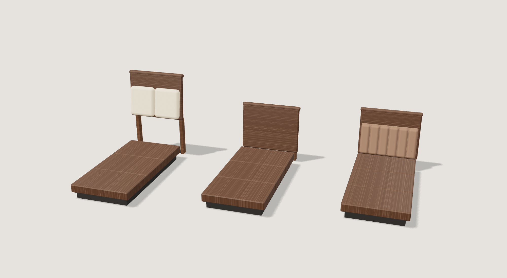

- **名称**: C2-03 プレミアム「KASANE」
- **デザインコンセプト**: 「顔を重ねて、スイートに育てる。」HEAD DOCK の前後2つの掛け位置を両方使い、後ろに炭化竹の背の高い壁（1050mm）、前にブークレのスラブ2枚を重ねる。最初は竹の壁だけ、次にクッションを重ねる、と“育つ”過程そのものが上位モデルになる。
- **ターゲット**: 世帯年収の高い30代後半の夫婦。旅館やホテルのスイートの設えが好き。THE GOKUMIN ユーロトップ購入者。
- **解決する課題**: 10万円帯の価値「素材・張り地・HBの存在感」[S42]（§7）。家具メーカー品は「重く業者頼み」、D2C は「格が一段足りない」（research 結論3）の間を取る。
- **形状**: 外寸 W1070×L2190×H1050mm。デッキ天面 230mm、縁の見付け 110mm＋立ち上がり30mm、影のプリンス（外周から60mm 奥）。後層は炭化竹の壁 1050×厚み56mm＋張り出した笠木（60×84mm）、前層はブークレのスラブ2枚（各 481×540×118mm、R60）。
- **ヘッドボード仕様**: 型=2層（後層＝竹のハイパネル／前層＝布スラブ2枚）／高さ=床から1050mm（前層の上端790mm）。企画 0-2 のハイバック（100〜110cm）／素材=炭化竹集成材、ブークレ（ラテ）／機能=後層もたれ4度、前層もたれ8度、スラブは1枚ずつ外して洗える／取り付け方式=後層は支柱の後ろ溝（ハイ位置の掛け金）、前層は支柱の前フック
- **素材**: 本体・後層=炭化竹集成材、スラブ=ブークレ＋高密度ウレタン、支柱=炭化竹＋スチール芯
- **CMF**: 炭化竹 #5B3D28（本体・支柱・後層同色）、ブークレ ラテ #D3C2A6（標準）／アイボリー #E4DCCD／チャコール。Finish=オイル仕上げ風マット（2分艶）、笠木の小口を研ぎ出し
- **機能**: 2層で育つHB、洗えるスラブ。**入れなかった機能**: 照明の作り込み（格を下げないため P4 で後付け）
- **競合優位性**: カリモク・飛騨（13〜14万円、業者設置・受注40〜60日 [S9]）に対し、同等の格を即納・自分で8分。コアラ ファブリックに対し、竹の壁と2層の厚みで一段上の格
- **製造方法**: 後層は炭化竹集成材パネルのCNC＋笠木の接着、スラブは縫製（ブークレは上位の張り地を外注）。工場での部品点数 約58点。量産の注意点: 炭化竹の色ロット、1050mm の後層は宅急便の3辺のため **後層を床梁と同じ箱に入れず別の薄箱** にする
- **開梱〜就寝**: 5動作（後層→前層の順に掛ける）、約10分【推測】。工具0・ネジ0・部品4点・1人
- **梱包**: 3箱。本体箱 約68×104×26cm（198cm）・約24kg／HB箱（DOCK＋スラブ）約106×76×16cm（198cm）・約12kg／後層箱 約108×82×8cm（198cm）・約9kg【推測】
- **想定価格**: S 129,800円（本体＋竹の壁 99,800円＋スラブ2枚 29,800円のセット）。原価率 約42%【推測】。research 結論4 の帯の上（D 帯 109,800〜129,800円の考え方をSに適用）
- **デザイン意図**: 根拠: research 切り口7「竹を和モダンの高級素材に格上げ」、§8「プレミアム帯の布はブークレ」[S29]、企画 2-4「支柱の差し込み位置で2段（85／100〜110cm）」。“買い足すほど格が上がる”を1台の中で見せる、②の格の意味（所有体験の格）に最も直接に答える案

## 案C2-04 トレンド「KUMO（くも）」

正面 `C2-04-front.png` ／ 側面 `C2-04-side.png` ／ フレーム単体 `C2-04-frame.png` ／ 構造（支柱だけ／2つ山のセージ／オフホワイトのチャネル）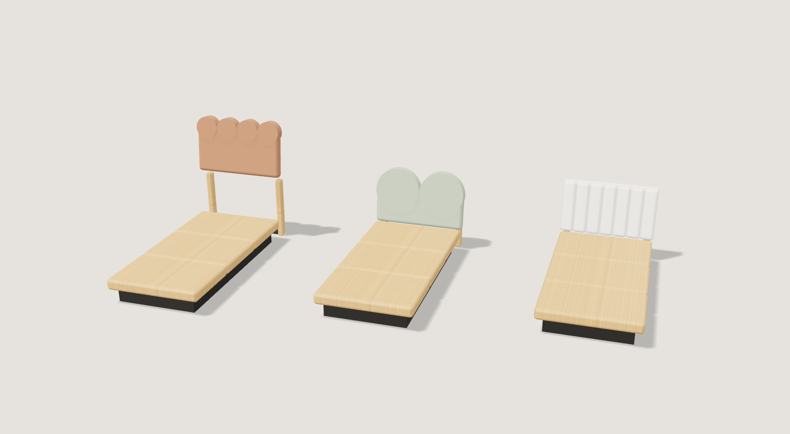

- **名称**: C2-04 トレンド「KUMO」
- **デザインコンセプト**: 「雲のかたちに、もたれる。」上端が4つの丸い山になった雲形のクッション。2026年の曲線・丸み・くすみ色（クレイ）を、顔だけで取り入れる。流行が変われば顔だけ替えればよい、が②の強み。
- **ターゲット**: 20代後半〜30代前半の同棲カップル。Instagram・RoomClip でホテルライクな寝室を保存している（research §13）。
- **解決する課題**: 購入理由「デザイン」35.7%（§7）。「流行の形は飽きる・買い替えが高い」という心理的な不安【推測】を、顔だけの交換（14,800円）で解く。
- **形状**: 外寸 W1030×L2120×H900mm（山の頂部）。デッキ天面 240mm、縁 90mm＋立ち上がり30mm、角R34 のやわらかい縁、影のプリンス。顔は幅1030×厚み110mm、山の半径129mm×4。
- **ヘッドボード仕様**: 型=オーバーレイの雲形クッション／高さ=床から900mm（頂部）、谷の部分は771mm／素材=撥水布クレイ（標準）、中身はウレタン＋竹合板の芯／機能=洗えるカバー、もたれ角6度／取り付け方式=HEAD DOCK の前フックに掛ける（支柱は隠れる）
- **素材**: デッキ=竹集成材、顔=撥水布＋ウレタン＋竹合板（曲線はCNCで切り出し）
- **CMF**: 本体=ナチュラル竹 #C89C66。顔=クレイ #A8765A（標準）／セージ #A4AD96／オフホワイト #ECE6DB。Finish=布は微起毛、竹は3分艶
- **機能**: 雲形の顔、洗えるカバー、2つ山のバリエーション（構造図）。**入れなかった機能**: LED 間接照明（古びやすい [S54]）
- **競合優位性**: 曲線HBは海外（Castlery 約18万円 [S27]）か国内の布張り品で、どちらも顔を替えられない。KUMO は同じ支柱で直線の顔に戻せる
- **製造方法**: 芯は竹合板の2D切り出し（CNC）、ウレタンはスラブの切削、カバーは縫製（曲線部は立体裁断）。工場での部品点数 約52点。量産の注意点: 曲線部のカバーのしわ、山の数ごとの型紙管理
- **開梱〜就寝**: 4動作、約8分【推測】。工具0・ネジ0・部品3点・1人
- **梱包**: 本体箱 約68×103×24cm（195cm）・約22kg／HB箱 約106×76×16cm（198cm）・約13kg【推測】
- **想定価格**: S 104,800円。原価率 約40%【推測】
- **デザイン意図**: 根拠: research §10「曲線・アーチ・角丸が2026年の流れ」[S28][S29]、§9「クレイ・テラコッタなど自然に近い色」[S51]。①の C1-04（アーチ＋竹枠）と違い、**竹枠を持たない布だけの雲形**にして、本体の竹と顔の布の役割をはっきり分けた

## 案C2-05 機能特化「HUB（ハブ）」

正面 `C2-05-front.png` ／ 側面 `C2-05-side.png` ／ フレーム単体 `C2-05-frame.png` ／ 構造（支柱とモジュールだけ／ニッチ棚の顔／クレイのチャネル）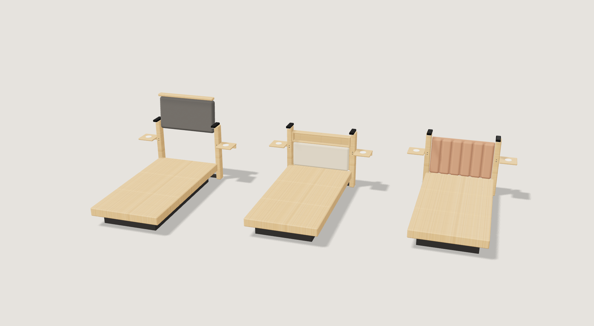

- **名称**: C2-05 機能特化「HUB」
- **デザインコンセプト**: 「支柱が、寝室の電源になる。」配線を通した支柱を主役として見せ、上端に読書灯ヘッド、外側にワイヤレス充電のサイドポッド、前面にUSB-C を“差し込む”。家電は支柱のモジュールに集め、顔は布のまま静かに保つ。
- **ターゲット**: 在宅勤務のある同棲カップル。ベッドでスマホ・タブレット・読書をし、枕元の電源と置き場が足りない（企画 2-2）。
- **解決する課題**: 宮棚・コンセントの需要（EC の標準装備 [S46]）と、「深い宮棚で全長が伸びる・ホコリ」[S44] の矛盾。サイドポッドは横に張り出すので全長は伸びない。
- **形状**: 外寸 W1510（ポッド込み）×L2115×H934mm。支柱 80×110mm（延長の電源ヘッド200mm込みで900mm）、芯々1010。顔はインセットのクッション 920×（770−254）×96mm＋上端の竹の笠木。サイドポッドは竹トレー 250×250mm、床から600mm。
- **ヘッドボード仕様**: 型=インセットの布クッション＋支柱モジュール／高さ=顔の上端820mm、読書灯ヘッドの上端934mm／素材=撥水布チャコール、竹集成材／機能=調光読書灯（電球色）×2、USB-C×2（各支柱）、ワイヤレス充電パッド×2、もたれ5度／取り付け方式=顔は支柱の溝に落とし込み、モジュールは支柱の上端・外側の差し込み口（P4、給電ピン付き）に差す
- **素材**: 支柱=竹集成材（中空・配線内蔵）、モジュール=アルミダイカスト（マットブラック）＋竹、顔=撥水布
- **CMF**: 竹ナチュラル #C89C66、モジュール マットブラック #232323、顔チャコール #55524E。読書灯は2700K
- **機能**: 電源ハブ（電源は床梁の端から1本だけ壁へ）、配線を見せない。**入れなかった機能**: LED の色変え、スピーカー（家電の陳腐化が早い）
- **競合優位性**: ニトリ・EC の宮棚コンセント（1〜5万円）の「全長が伸びる・安っぽい」[S44] に対し、全長+0で10万円の質感。家電部分だけ数年ごとに交換（切り口5）
- **製造方法**: 支柱は竹集成材を2つ割りで溝を掘り配線を通して接着（CNC）。モジュールはダイカスト2型＋基板。PSE 取得が必要。工場での部品点数 約70点。量産の注意点: 給電ピンの接点寿命（付け外し1,000回）、電装の安全試験
- **開梱〜就寝**: 6動作（モジュールを差す2動作を追加）、約10分【推測】。工具0・ネジ0・部品5点・1人
- **梱包**: 本体箱 約68×103×24cm・約22kg／HB箱 約106×76×16cm・約13kg／モジュール箱 約40×30×15cm・約2.5kg【推測】
- **想定価格**: S 114,800円（本体＋顔 99,800円＋電源モジュール 14,800円）。原価率 約44%【推測】
- **デザイン意図**: 根拠: research §11「電源と照明は家電として古くなる。HBに差し替えられるモジュールに」、切り口5、結論2「付けるなら薄いニッチ・モジュールに」。**犠牲にしたもの**: 見た目の静けさ（Design）。黒いモジュールを支柱の上端と外側だけに限定し、顔の面には何も付けないことで“ごちゃごちゃ”を避けた

## 案C2-06 素材特化「SUDARE（すだれ）」

正面 `C2-06-front.png` ／ 側面 `C2-06-side.png` ／ フレーム単体 `C2-06-frame.png` ／ 構造（丸竹の支柱だけ＋簾を持ち上げた状態／裏返したセージのリネン面／燻し竹のフラット）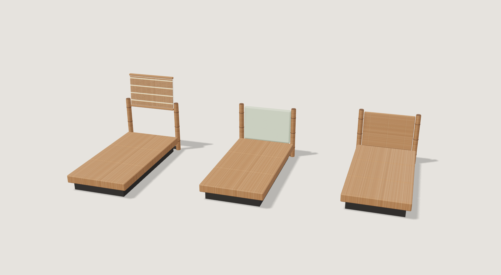

- **名称**: C2-06 素材特化「SUDARE」
- **デザインコンセプト**: 「丸竹と簾。裏返せば、洗えるリネン。」支柱は節のある丸竹、顔は燻し竹のひごを横に並べた簾。顔はリバーシブルで、裏は洗えるリネン。竹そのものを寝室の顔にする。
- **ターゲット**: 和・民藝・旅館の設えが好きな30代夫婦。国産素材にお金を払う層。
- **解決する課題**: 購入理由「無垢・天然素材の質感」35.7%（§7）、「布は汚れる」[S43] と「竹は冷たい・硬い」【推測】の両立（季節で表裏を替える）。
- **形状**: 外寸 W1044×L2106×H900mm。丸竹の支柱 直径84mm、節3か所（延長キャップ200mm で900mm）。顔はインセット 860×606×50mm、ひご直径20mm を23mm ピッチで約24本、上下に燻し竹の框。デッキ天面 236mm、縁96mm＋立ち上がり30mm。
- **ヘッドボード仕様**: 型=インセットの簾（リバーシブル）／高さ=床から860mm（支柱900mm）／素材=燻し竹のひご（6本に1本淡竹を混ぜる）、裏=リネン混の撥水布（セージ／リネン）／機能=裏返すと布のもたれ面、布面は外して洗える、もたれ4度／取り付け方式=丸竹の支柱の内側スリットに上から落とし込む
- **素材**: 支柱=国産の丸竹（真竹）の中にスチール芯、または竹集成材の丸削り【推測】、顔=燻し竹ひご＋框、デッキ=燻し竹集成材
- **CMF**: 燻し竹 #8A6240、節 #5E412B、淡竹 #D6B584、裏布セージ #A4AD96。Finish=竹は拭き漆風のマット、ひごは無塗装に近いオイル
- **機能**: リバーシブルの顔（夏は簾、冬はリネン）。**入れなかった機能**: 電源（P4 の口のみ）
- **競合優位性**: Nectar Bamboo（竹×木組み、日本未展開 [S25]）に対し、丸竹・簾という日本の竹文化の表現で先に取る。飛騨 月光（無垢の格、14万円〜）より安く、素材の物語が強い
- **製造方法**: 簾は国内の簾・ひご加工の協力工場に外注【推測】、框に差し込む。丸竹は太さの選別が必要で歩留まりが低いため、量産は竹集成材の丸削り＋節を刻む方式を本命にする。工場での部品点数 約60点。量産の注意点: ひごの割れ・色の揃い、丸竹の直径公差
- **開梱〜就寝**: 4動作、約8分【推測】。工具0・ネジ0・部品3点・1人
- **梱包**: 本体箱 約68×103×25cm・約23kg／HB箱 約106×76×16cm・約12kg【推測】
- **想定価格**: S 109,800円。原価率 約43%【推測】
- **デザイン意図**: 根拠: research §8「竹など触感のある天然素材が注目」[S28]、切り口7、GOKUMIN の国産竹の資産 [S4]。①の C1-06 AJIRO（網代の平面）とは違い、**丸竹の立体と横のひごの陰影**で見せ、裏の布で“洗える”も満たした

## 案C2-07 UX改善「KAKERU（かける）」

正面 `C2-07-front.png` ／ 側面 `C2-07-side.png` ／ フレーム単体 `C2-07-frame.png` ／ 構造（支柱だけ＋バーごと持ち上げた顔／オフホワイトのクッション／セージのチャネル）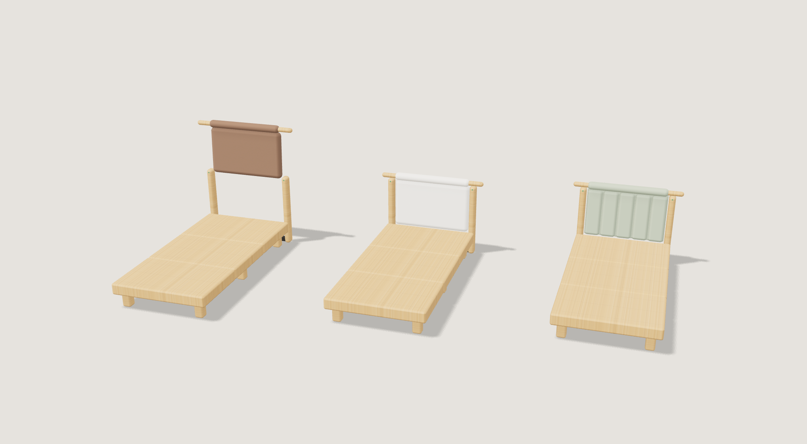

- **名称**: C2-07 UX改善「KAKERU」
- **デザインコンセプト**: 「バーを掛けるだけ。1動作で着替える。」顔は竹の丸バーに吊られたクッション。バーを支柱の上端の受けに掛ければ完成、持ち上げれば外れる。付け替えの“2動作”をさらに1動作に減らし、誰でも説明なしで分かる形にした。
- **ターゲット**: 共働きの夫婦。季節ごと・来客ごとに寝室を整えたいが、手間は最小にしたい（企画 2-2）。
- **解決する課題**: 企画 2-3「顔の付け替え1回2分以内・工具0」、不満「HBのぐらつき」14.3%・「組立が重い」28.6%（§6）、「布が洗えない」[S43]。
- **形状**: 外寸 W1110（バー）×L2100×H852mm。支柱は角R30 の丸みのある竹 70×96mm（延長キャップ100mm込みで800mm）、上端に半円の受け。バーは直径52mm×1110mm の竹、両端は球。クッションは幅884×厚み92mm、上端の袖でバーを包む。本体はブロック脚6本（90角・R20）で、床下を見せる軽快な構え。
- **ヘッドボード仕様**: 型=バーに吊るクッション／高さ=床から852mm（バー上端）／素材=竹の丸バー、洗える布モカ（標準）／機能=1動作で付け外し、カバーはバーから抜いて洗濯機へ、ロックの緑の目印（支柱の上端）、もたれ3度（クッション下端を支柱の溝で受ける）／取り付け方式=バーを支柱上端の受けに落とし、クッション下端を支柱の溝に差す（自重で2点ロック）
- **素材**: 支柱・バー=竹集成材（バーはスチール芯入り）、クッション=撥水布＋ウレタン、脚=竹集成材ブロック
- **CMF**: 竹ナチュラル #C89C66、クッション モカ #806350（標準）／オフホワイト／セージ／クレイ。目印 グリーン #4F8A5B。Finish=竹3分艶、布は洗いざらしの風合い
- **機能**: 1動作の着せ替え、洗えるカバー、ロックの目印。**入れなかった機能**: 棚（バーに小物を掛けるフックは将来オプション）
- **競合優位性**: Thuma の着せ替えカバー（交換部品の値上げ不満 [S20]）に対し、顔ごと替えられて価格を公開。Floyd のクランプ [S23] に対し、自重で締まる受け＋溝の2点
- **製造方法**: 支柱・バーは竹集成材の旋盤・CNC、受けは樹脂ライナー（成形1型）。クッションは筒状の袖を持つ縫製でシンプル。工場での部品点数 約50点。量産の注意点: バーのたわみ（スチール芯）、もたれ荷重がバーではなく支柱の溝で受かるように下端の差し込み深さを確保
- **開梱〜就寝**: 4動作、**約6分**【推測】（顔は1動作）。工具0・ネジ0・部品3点・1人
- **梱包**: 本体箱 約68×103×24cm・約22kg／HB箱 約114×72×14cm（200cm）・約11kg【推測】（バーの長さで箱が長くなる）
- **想定価格**: S 99,800円。原価率 約39%【推測】。替えクッション 9,800円
- **デザイン意図**: 根拠: research 結論5「差し込み式…自重とマットレス荷重で締まる向きにする」、§7 購入理由1位「工具不要・短時間」57.1%、切り口4「洗えるホテルヘッドボード」。バーという“掛ける”の記号で、説明書なしに着せ替え方が伝わる（EC のサムネイル1枚で分かる）

## 案C2-08 構造革新「NOBIRU（のびる）」

正面 `C2-08-front.png` ／ 側面 `C2-08-side.png` ／ フレーム単体 `C2-08-frame.png` ／ 構造（左: 伸ばした支柱だけ＋ワイドの顔を持ち上げた状態／中: 床梁を縮めたS幅＋標準のチャネルの顔／右: ワイドのクレイ）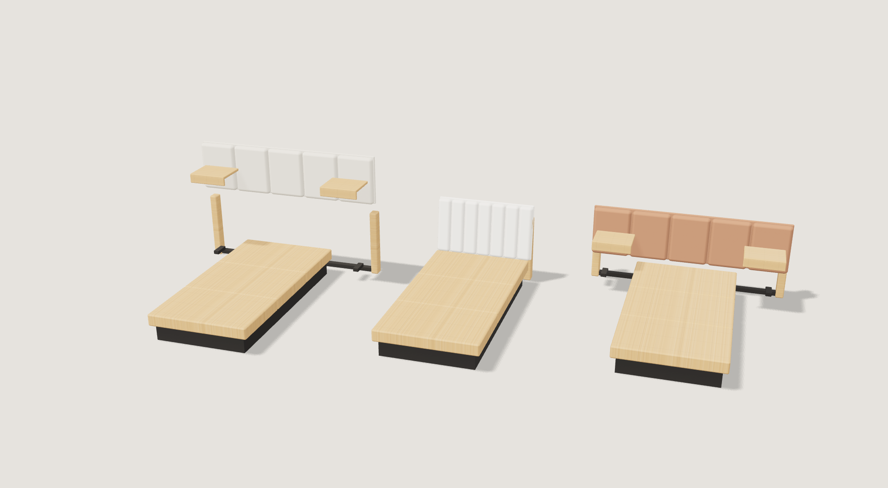

- **名称**: C2-08 構造革新「NOBIRU」
- **デザインコンセプト**: 「床梁が伸びて、ワイドのホテルヘッドに。」HEAD DOCK の床梁を伸縮式にし、支柱の間隔を 940mm（S）から 1900mm まで広げる。同じ本体のまま、ナイトトレー一体のワイドな顔に育てられる。
- **ターゲット**: 住み替えで寝室が広くなる予定のカップル（企画 2-2 サブターゲット）。ホテルの wall-to-wall HB に憧れる人。
- **解決する課題**: 「サイドテーブルを別に買うと寸法・色が合わない」【推測】、宮棚の全長問題 [S44]。住み替えでベッドを買い替えずに寝室の格を上げる（購入理由「長く使える」28.6%）。
- **形状**: 外寸（ワイド時）W2070×L2100×H820mm。支柱 80×100mm、芯々 940〜1900mm。顔はワイド 1990×520×94mm（5面のパネル）、床から300〜820mm。両脇に片持ちの竹トレー 400×330mm（床から560mm）。S時は標準の顔（幅1030）。
- **ヘッドボード仕様**: 型=ワイドパネル＋片持ちトレー（S時は標準の顔）／高さ=床から820mm／素材=撥水布リネン（標準）／クレイ、竹集成材トレー／機能=支柱間隔の伸縮、トレー一体、もたれ0度（ワイドはパネルが垂直、クッション性で受ける）／取り付け方式=床梁のロックピンを抜いて伸ばす→顔を支柱の前フックに掛ける
- **素材**: 床梁=スチール角パイプの二重管（伸縮）、支柱=竹集成材、顔=布＋竹合板の芯、トレー=竹集成材（スチールブラケットで顔の芯に固定）
- **CMF**: 竹ナチュラル、布リネン #D9D0C0（標準）／クレイ／チャコール。床梁は黒で影に沈める
- **機能**: 伸縮する規格、ナイトトレー一体。**入れなかった機能**: 引き出し（重量・梱包の制約）
- **競合優位性**: カリモクの wall-to-wall 系・ホテル家具（20万円〜、業者設置）【推測】に対し、ワイドの顔を後から29,800円で追加。一般のベッドは幅を変えられない
- **製造方法**: 伸縮床梁は二重管＋ロックピン（既製品の応用）、ワイド顔は長さ1990mm のため **中央で2分割して目地で連結**（梱包3辺200cm のため）。工場での部品点数 約66点。量産の注意点: 伸ばしたときの床梁のねじれ剛性、ワイド顔の2分割の目地の見え方
- **開梱〜就寝**: ワイド時6動作（床梁を伸ばす・顔を2枚掛ける）、約12分【推測】。工具0・ネジ0・部品5点・1人
- **梱包**: 本体箱 約68×103×24cm・約22kg／HB箱 約106×76×16cm・約13kg／ワイド顔箱 約102×56×40cm（198cm）・約14kg【推測】
- **想定価格**: S 129,800円（本体＋標準の顔 99,800円＋ワイドの顔 29,800円）。原価率 約43%【推測】
- **デザイン意図**: 根拠: research §10「wall-to-wall HB が2026年の流れ」[S28]・「ワイドは上位モジュールにとどめる」（§10 推測）、企画 4-2 #08。**犠牲にしたもの**: 組立の簡単さ（10分を少し超える）と重量。標準はS幅で売り、ワイドは“育つ先”として位置づけた

## 案C2-09 少し挑戦的「TILE（タイル）」

正面 `C2-09-front.png` ／ 側面 `C2-09-side.png` ／ フレーム単体 `C2-09-frame.png` ／ 構造（支柱だけ＋タイルの顔を持ち上げた状態／モカ×クレイの市松／オフホワイト×チャコールの市松）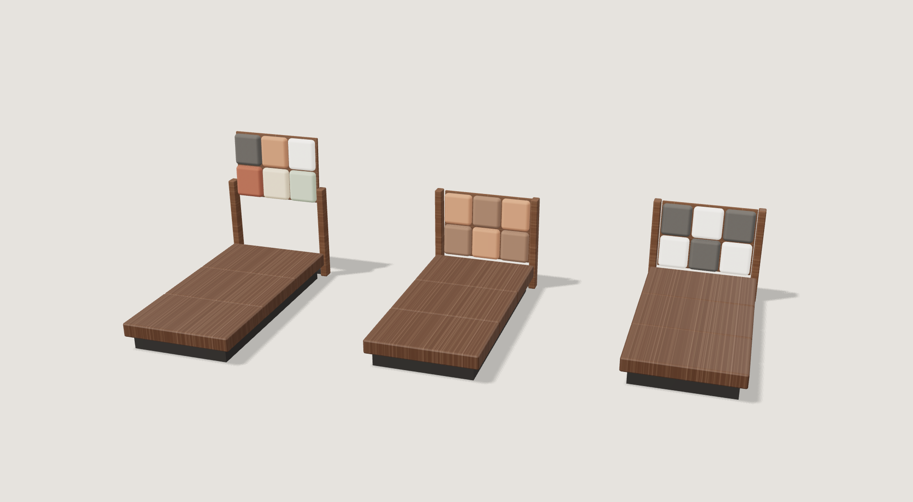

- **名称**: C2-09 少し挑戦的「TILE」
- **デザインコンセプト**: 「6枚のクッションを、好きな色で並べる。」炭化竹の支柱と格子の額縁に、四角いクッションタイル6枚を1枚ずつ付ける。**市場の常識「HBは1枚の面」を崩し**、顔を“ファッション”として編集させる。季節の限定色・コラボ柄のタイルは1枚単位で売る。
- **ターゲット**: 20代後半〜30代の、インテリアを SNS で発信するカップル。服のように寝室の色を変えたい人。
- **解決する課題**: 「HBを変えたい」需要（RoomClip の DIY 実例、楽天「ヘッドボード 後付け」2,924件 [S53][S70]）を、DIY なしで満たす。顔を全部買い替えるより安く、少しずつ変えられる。
- **形状**: 外寸 W1040×L2106×H930mm。支柱 70×100mm（延長キャップ230mm込みで930mm）、芯々970。額縁の背板（炭化竹、20mm）にタイル 3列×2段、各 約283×303×74mm・R58、目地12mm。デッキ天面 230mm、縁100mm＋立ち上がり30mm。
- **ヘッドボード仕様**: 型=インセットのタイル6枚／高さ=床から910mm（支柱930mm）／素材=炭化竹の背板＋撥水布タイル（テラコッタ・オート・セージ・チャコール・クレイ・オフホワイト）／機能=タイル1枚ずつ付け替え（背板の穴に差すスナップ2点）、カバーは洗える、もたれ3度／取り付け方式=背板ごと支柱の溝に落とし込み、タイルは背板に差す
- **素材**: 支柱・背板・デッキ=炭化竹集成材、タイル=撥水布＋ウレタン＋樹脂板（スナップ付き）
- **CMF**: 炭化竹 #5B3D28、タイルの色は6色から自由に（推奨セット3種: ミックス／モカ×クレイ／オフホワイト×チャコール）。Finish=竹2分艶
- **機能**: 色の編集、1枚単位の交換・洗濯。**入れなかった機能**: 柄物の本体（本体は炭化竹で締める）
- **競合優位性**: 国内外に“タイルを組み替えるHB”は見当たらない（research §16 の調査範囲）。Thuma の着せ替えカバー [S21] は色替えのみ、TILE は配置まで編集できる
- **製造方法**: タイルは同一形状の量産品（縫製＋スナップの成形1型）。色のSKU は増えるが形は1種で在庫が軽い。工場での部品点数 約60点。量産の注意点: 6枚の色ロットの揃い、スナップの保持力（もたれで外れない）
- **開梱〜就寝**: 4動作＋タイル6枚（工場で装着済みで出荷）、約8分【推測】。工具0・ネジ0・部品3点・1人
- **梱包**: 本体箱 約68×103×24cm・約23kg／HB箱 約106×76×16cm・約12kg【推測】
- **想定価格**: S 109,800円（タイル6枚込み）。替えタイル 1枚 2,980円・6枚セット 14,800円【推測】。原価率 約45%【推測】（タイル分が重い）
- **デザイン意図**: 根拠: research 切り口2「着せ替えヘッドボード」、§13「“HBの着せ替え前後”は短尺動画になる型」、企画 4-2 #09「顔を“ファッション”として扱う」。**あえて外した結論**: research 結論5 の「低めのパネル型・落ち着いた色」から外れ、色の多いHBにした。ホテルライクから遠ざかるリスクは、推奨セットで落ち着いた2色の市松も選べることで抑える

## 案C2-10 コンセプトモデル「HASHIRA（はしら）」

正面 `C2-10-front.png` ／ 側面 `C2-10-side.png` ／ フレーム単体 `C2-10-frame.png` ／ 構造（支柱と棚だけ＋顔を持ち上げた状態／クレイのチャネル／ニッチ棚の顔）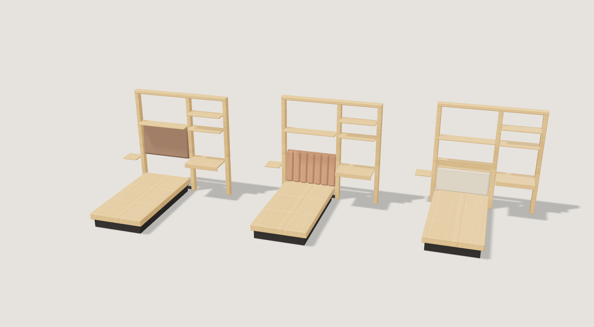

- **名称**: C2-10 コンセプトモデル「HASHIRA」
- **デザインコンセプト**: 「ベッドの柱が、寝室の背骨になる。」HEAD DOCK の支柱を床から2000mm まで伸ばし、上梁・棚・灯り・デスクを抱える軸組にする。ベッドを中心に、寝室全体を“編集”する数年先の姿。
- **ターゲット**: 1LDK〜ワンルームで寝室と仕事場を兼ねる30代。展示・ポップアップでブランドの世界観を見せる場。
- **解決する課題**: 狭い部屋でベッド・棚・デスクを別々に買うと寸法と色が揃わない【推測】。HEAD DOCK という1つの規格で家具を増やす（ブランドの LTV）。
- **形状**: 外寸 W2250×L2115×H2000mm。支柱 80×110mm×3本（ベッドの両脇＋デスクの外側）、上梁 70×120mm。ベッドの上に棚（床から1350mm、奥行250mm）と間接の読書灯、右にデスク（床から720mm、680×480mm）と棚2段、左に小さなトレー。顔はインセットのクッション（モカ）床から900mm。
- **ヘッドボード仕様**: 型=柱と梁の軸組＋インセットのクッション／高さ=顔の上端900mm、柱2000mm／素材=竹集成材、撥水布モカ／機能=棚・読書灯・デスク・トレー、もたれ5度／取り付け方式=標準の HEAD DOCK（700mm）の上に延長柱を差し継ぎ、上梁で連結。顔は標準の規格のまま
- **素材**: 竹集成材（柱・梁・棚・デスク）、スチール芯（柱の継ぎ手）
- **CMF**: 竹ナチュラル #C89C66、布モカ #806350。Finish=3分艶
- **機能**: 寝室の背骨、灯り、デスク。**入れなかった機能**: 扉付きの収納（重量・梱包）
- **競合優位性**: 壁面収納一体のベッドは国内にあるが据え付け・業者施工【推測】。HASHIRA は工具なしで差し継ぎ、引越しで分解できる
- **製造方法**: 柱の差し継ぎ（くさび）と上梁のほぞ（工具なしの木組み）。2m の柱は2分割。部品点数 約90点、梱包4〜5箱、重量 合計約70kg【推測】で宅急便に乗るが1人では厳しい。**実現への道筋**: まず延長柱＋棚1枚の「ベッド上の棚キット」（1箱・15kg）を②の上位モジュールとして出し、デスク側は壁面家具シリーズとして別に展開する
- **開梱〜就寝**: 12動作以上、約40分・2人推奨【推測】。工具0・ネジ0
- **梱包**: 5箱（本体・DOCK＋顔・柱×2・棚とデスク）、各30kg以下・200サイズ以内【推測】
- **想定価格**: 199,800円【コンセプト】。原価率 約50%【推測】
- **デザイン意図**: 根拠: 企画 4-2 #10「HEAD DOCK が壁面収納・ワークデスクにまで伸びる寝室の背骨」、research 切り口6「分解して同じ箱に戻せる10万円家具」、購入理由「後付け・拡張」28.6%。すぐには量産しないが、「HEAD DOCK は家具の規格である」というブランドの方向を示す

---

## 自己レビュー
評価軸の重み（企画 2-7）: Market Fit 16% ／ Design 16% ／ Originality 16% ／ Usability 18% ／ Manufacturability 14% ／ Cost 10% ／ Brand Fit 10%

### 採点表（レビューで修正した後の点）
| No | Market Fit | Design | Originality | Usability | Manufacturability | Cost | Brand Fit | 加重平均 |
|---|---|---|---|---|---|---|---|---|
| C2-01 KIGAE | 5 | 4 | 3 | 5 | 4 | 4 | 4 | **4.18** |
| C2-02 MONO | 3 | 4 | 3 | 5 | 5 | 5 | 4 | **4.10** |
| C2-03 KASANE | 4 | 5 | 4 | 4 | 3 | 3 | 5 | **4.02** |
| C2-04 KUMO | 4 | 4 | 4 | 4 | 3 | 3 | 3 | **3.66** |
| C2-05 HUB | 4 | 3 | 4 | 4 | 3 | 3 | 4 | **3.60** |
| C2-06 SUDARE | 3 | 5 | 5 | 4 | 3 | 3 | 5 | **4.02** |
| C2-07 KAKERU | 5 | 4 | 5 | 5 | 4 | 4 | 4 | **4.50** |
| C2-08 NOBIRU | 3 | 4 | 5 | 4 | 3 | 3 | 4 | **3.76** |
| C2-09 TILE | 3 | 3 | 5 | 4 | 3 | 2 | 3 | **3.40** |
| C2-10 HASHIRA | 2 | 4 | 5 | 3 | 2 | 1 | 5 | **3.18** |

採点の理由（1行ずつ）
- **C2-01**: MF5 布張りの王道＋99,800円／D4 整っているが新しさは控えめ／O3 見た目は既存の布HBに近い（新しさは規格）／U5 4動作・洗える／Mf4 既存工程＋縫製／C4 原価率38%／B4 規格の入口として最適
- **C2-02**: MF3 静かすぎて10万円の理由が伝わりにくい／D4 目地2本の潔さ／O3 竹フラットは既存にもある／U5 最軽量／Mf5 部品最少／C5 原価率36%／B4 竹の素地
- **C2-03**: MF4 上位の需要は確か、価格は帯の上／D5 2層の厚みと竹の壁で最も家具らしい／O4 2層の着せ替えは市場にない／U4 5動作・3箱／Mf3 1050mm の後層と色ロット／C3 原価率42%／B5 切り口7＋“育つ”の体現
- **C2-04**: MF4 SNS に強い／D4 やわらかい／O4 雲形は国内10万円帯に少ない／U4 標準どおり／Mf3 曲線の縫製／C3 原価率40%／B3 竹が脇役
- **C2-05**: MF4 電源の需要は大きい／D3 要素が多い／O4 支柱に家電を集める考え方は新しい／U4 便利だが6動作／Mf3 電装・PSE／C3 原価率44%／B4 切り口5 と一致
- **C2-06**: MF3 和の好みに限られる／D5 丸竹と簾の陰影／O5 リバーシブルの簾HBは市場にない／U4 表裏の入れ替えは2動作／Mf3 ひごの外注・丸竹の選別／C3 原価率43%／B5 国産竹を最も強く語る
- **C2-07**: MF5 中心価格＋洗える＋最短／D4 バーと吊りクッションの軽やかさ／O5 “掛けるだけ”のHBは市場にない／U5 顔は1動作・全体6分／Mf4 部品が単純／C4 原価率39%／B4 着せ替えを一目で伝える記号になる
- **C2-08**: MF3 ワイドが置ける寝室は限られる／D4 ホテルらしい横長／O5 伸縮する規格は新しい／U4 12分でやや長い／Mf3 伸縮梁の剛性・2分割の顔／C3 原価率43%／B4 “育つ”の延長
- **C2-09**: MF3 好みが分かれる／D3 色が多くホテルライクから離れる／O5 タイルで編集するHBは市場にない／U4 タイルの付け替えは簡単／Mf3 スナップ保持・色ロット／C2 原価率45%（09 は許容）／B3 ブランドの落ち着きとずれる
- **C2-10**: MF2 すぐには売らない／D4 軸組の美しさ／O5 家具の規格への拡張／U3 2人・40分／Mf2 2m の柱・5箱／C1 原価率50%／B5 ブランドの将来像

### やり直しの基準の確認
- 01〜08 で Market Fit・Manufacturability・Cost が2点以下の案: **なし**（修正後）
- Usability 2点以下: なし ／ Originality 2点以下: なし
- C2-09（Cost 2）・C2-10（Mf2・C1）は 09・10 の許容範囲。理由と実現への道筋は各案の製造方法・デザイン意図に記載（C2-10 は「ベッド上の棚キット」から段階的に出す）

### 各案の講評（1〜2行）
- **C2-01**: 最も外さない入口。KAKERU と並べて、主力を「布の面」か「吊るクッション」かで選ぶことになる。
- **C2-02**: エントリー価格として有効。規格の“顔を替えられる”良さが最も伝わりにくいので、売り場では替え顔とセットで見せる。
- **C2-03**: 格は最上。3箱になる点と後層の梱包は試作で詰める。
- **C2-04**: 流行に乗る顔を“替えられる”ことが②の説得力を上げる。単体より替え顔の定番として強い。
- **C2-05**: 機能の需要は確か。モジュールは全案共通の P4 オプションとして出すのが現実的。
- **C2-06**: 素材の物語は最強。簾・丸竹の供給元の確保が前提。
- **C2-07**: 体験（1動作）と日常（洗える）で不満の上位を最も多く解く。売り場で“掛ける”が一目で分かる。
- **C2-08**: 住み替えで育つ、は②らしい。伸縮梁の剛性の検証が鍵。
- **C2-09**: 話題性とLTV（タイルの買い足し）は最大。落ち着いた推奨配色を必ず用意する。
- **C2-10**: 量産案ではなく、展示と将来の家具シリーズの旗。

### レビューで修正した点
| 案 | 軸 | 修正前→後 | 何を変えたか |
|---|---|---|---|
| 全案 | Manufacturability | 2→3〜5 | 当初は支柱を床から850mm の1本物にしており、HB箱（支柱ユニット＋顔）が約104×90×16cm（210cm）で宅急便200サイズを超えた。HEAD DOCK の標準を **高さ700mm** に下げ、高い案は **延長キャップ（100〜230mm）** を顔と同じ箱に入れる方式に変えて198cm に収めた（C2-02・05・06・07・09） |
| C2-04 KUMO | Design | 3→4 | 初回レンダーで、雲形の下の四角い部分の上端が山の前に棚のように見えた。四角の上端を山の中心線に下げ、山を前に5mm 出して一続きの雲に見せた |
| C2-08 NOBIRU | Design | 3→4 | 初回は伸縮する床梁が金属色で目立ち、組立式の家具に見えた。床梁を黒の影色にして床に沈め、ワイドの顔をオフホワイトから生成りのリネンに替えて枕と区別した |
| C2-03 KASANE | Design | 4→5 | 初回はスラブがアイボリーで枕と同化し、2層の重なりが読めなかった。ラテのブークレに替えた |
| C2-10 HASHIRA | Design | 3→4 | 初回は顔がオフホワイトで、柱と棚の中でHBの存在が消えていた（ヘッドレスに見えるおそれ）。顔をモカにして、HBが主役に見えるようにした |
| C2-02 MONO | Originality／Design | 2→3、3→4 | 初回は支柱と顔を同じ淡色にしていて、①の C1-02 HIRA とほぼ同じ一枚板に見えた。支柱をナチュラル竹の2トーンにして、目地で HEAD DOCK の規格が読めるようにした |
| C2-07 KAKERU | Usability | 4→5 | 当初は顔をバーに掛けるだけで、もたれるとバーが回る懸念があった。クッション下端を支柱の溝に差す2点ロックにし、ロックの緑の目印を支柱の上端に付けた |
| 構造図（全案） | — | — | 3台を横一列に並べると右端が切れた。奥行き方向にずらして並べ、全台が収まる構図に直した |

### 推奨上位3案とその理由
1. **売れる確率が最も高い: C2-07 KAKERU（4.50）** — 中心価格 99,800円で、購入理由1位（工具不要・短時間）と不満1位（重い・2人必要）に「6分・1人」で答え、布HBの弱点（洗えない）も解決する。“バーに掛ける”という形そのものが着せ替えの説明になり、EC のサムネイル1枚で②の価値が伝わる。王道の C2-01 KIGAE を「布の面」の顔として同じ支柱で併売できる。
2. **差別化が最も強い: C2-09 TILE（3.40、Originality 5）** — HBを1枚の面から「編集できる6枚」に変えた案。タイル1枚単位の買い足しで客単価と再購入が伸び（企画 KPI の買い足し率）、SNS の着せ替え前後が最も映える。落ち着いた推奨配色で“ホテルライク”も両立させる条件付き。
3. **ブランド価値を最も高める: C2-03 KASANE（4.02、Design 5・Brand Fit 5）** — 竹の壁に布を重ねて“育つ”過程を1台で見せる。炭化竹の格で、飛騨・カリモクと並ぶ上位モデルを即納・自分で組める形で出せる。
- 次点: C2-01 KIGAE（4.18。主力の顔として KAKERU と並べる）、C2-06 SUDARE（4.02。素材の物語。KASANE の後層や替え顔として P2 で展開も可）

## ユーザーに判断してほしいこと
1. **②の主力の顔**: 「C2-07 KAKERU（バーに吊るクッション）」と「C2-01 KIGAE（縦チャネルの布の面）」のどちらを本体の標準の顔にするか（もう一方は替え顔として併売できる）
2. **支柱を見せるか隠すか**: 規格を“見せる”（05・06・07・09）か、“隠して普通に美しく”（01・03・04）か。ブランドの伝え方の方針
3. **上位モデルの方向**: 2層（C2-03 KASANE）／ワイド（C2-08 NOBIRU）／電源（C2-05 HUB）のどれを最初の上位モジュールにするか
4. **HEAD DOCK の標準高さ 700mm＋延長キャップ**: 宅急便200サイズに収めるための変更。高い顔（900mm 超）はキャップ方式でよいか
5. **TILE の扱い**: 色の多いHBを②のラインナップに入れるか、限定企画（季節・コラボ）に留めるか
6. **C2-10 HASHIRA**: 展示・ポップアップ用のコンセプトモデルとして進め、まず「ベッド上の棚キット」を上位モジュールにする進め方でよいか

## 前提・仮説・未確認事項
- 【推測】寸法・重量・所要時間・原価率・梱包3辺は、3D モデル上の寸法と既存の折りたたみバンブーベッド（約20.5kg [S1]）からの推定。試作で実測して確定する（research 検証方法1）
- 【推測】HEAD DOCK のくさび2点が、付け外し1,000回・もたれ80kg×5,000回（R6）でガタ・異音なく持つかは未検証。特に C2-07 のバー受け、C2-08 の伸縮床梁、C2-03 の1050mm の後層
- 【推測】ワイヤレス充電・読書灯（C2-05）は PSE・電安法の対応が必要。簾・丸竹（C2-06）の国内調達先と価格は未確認
- 【推測】HBモジュールの価格（9,800〜29,800円、タイル1枚 2,980円）と、10万円帯での「着せ替え」需要の量は未検証（research §16 空白C は推測）
- 【未確認】既存の折りたたみバンブーベッド（t-fdbb）の頭側にソケットを追加できるか（社内データ）
- 3D レンダーは形・構造・CMF を伝えるためのもので、布のしわ・竹の積層の細部は表現していない。質感は画像生成AI用プロンプト（`prompts/03-design-image-prompts-c2-v2.md`）で補う

## 次工程（A3プレゼンボード）への申し送り
- メインビジュアルは各案の `C2-XX-three-quarter.png`（寝具あり、HBが見える構図）。一覧ボードには `contact-sheet.png`（フレーム＋HB単体）
- 構造の説明は `C2-XX-structure.png`（左: 支柱だけ＋メインの顔を真上に持ち上げた＝落とし込む前／中・右: 同じ支柱に別の顔を付けた状態）。**②の核心「同じ支柱で顔が替わる」は、この3台の並びで見せてほしい**。側面 `C2-XX-side.png` でもたれ角と全長が分かる
- 各ボードで必ず見せたいこと: ①開梱〜就寝の4動作（分・部品点数・梱包）と顔の付け替え（動作数・分）②HBの型・高さ・素材・機能・取り付け方式 ③すのこに見えない理由（厚い縁・立ち上がり・影の台座・布の大きなR）
- 画像に日本語の文字は入っていない。寸法・注記はボードの HTML 側で組む
- 画像の再描画: `bash product/designs/v2/c2/render-one.sh C2-XX`（`gen-scenes.mjs` の寸法を変えてから）
