# STEP 3 プロダクトデザイン10案 v2 — コンセプト③ 掃除が楽になるベッド「ヘッドボードが脚になるフローティング（HEAD STAND FLOAT）」
- 作成: product-designer ／ 2026-09-30 ／ 入力: `prompts/03-design-product-designer-c3-v3.md`, `research/research.md`（v2）, `research/notes/v2-premium-beds.md`, `research/notes/v2-headboard-types.md`, `product/02-planning-v2.md`（0章・3章・4章）, `brief.md`（v2 の条件）, `handoff.md`, `decisions.md`（承認済みの決定なし）, `research/01-research-feedback.md`, `research/00-input.md`, `projects/_studio/preferences.md`, `projects/_studio/brand.md`, `scripts/render3d/README.md`、参考 `product/03-design-v2-c1.md`・`-c2.md`（画像の粒度・寝具の表現をそろえ、HBの型の重複を避けた）
- 凡例: 【推測】=調査の裏付けがない見積もり・仮定（寸法・重量・原価率・所要時間・梱包はすべて試作前の推定）
- **v1 からの変更点**: v1 の10案（`product/03-design-v1-c3.md`）は全案ヘッドレスで、安価なすのこ・LEDフローティングに見えたため不採用。v2 は **全10案ヘッドボード込み**、しかも **HBの左右の脚が頭側の荷重を受ける＝HBがなければ立たない構造**にした。厚い縁（見付け 94〜150mm）・大きな角R・布張りの丸みで10万円帯の質感に合わせた。名称はすべて新規
- 画像: `product/designs/v2/c3/`（scene JSON は `gen-scenes.mjs` で生成、`bash render-one.sh C3-XX` で再描画できる）。各案 `-three-quarter`（メイン・寝具あり）／`-front`／`-side`／`-frame`（フレーム＋HB単体）／`-structure`（分解: HBユニット・持ち上げた本体・足元台座）／`-underfloor`（低い視点・床下にロボット掃除機）

## サマリー
- 10案すべてが「HBユニットの脚を起こして壁際に立てる → 本体を**横倒しのまま**開いて足元台座を差す（裏返さない）→ 本体を倒して頭側をHBの受けに落とし込む → マットレス」の**4動作・約9分・工具0・ネジ0・1人・部品3点**で完成する【推測】（C3-08・09 は部品4点、C3-10 は2人）。
- 床下有効 **130〜180mm をほぼ全面で確保**（台座は外周から250mm 以上内側の1つだけ、HBの脚は壁際）。低い視点のカットで、厚み約92mm のロボット掃除機がベッド下に入る様子を全案で確認した。
- HBの型は **ペデスタル布パネル／反り竹の一枚板／俵ロール3段／カプセル／くさび形（平らな天端なし）／畳パネル／イーゼル自立＋左右2枚／A字脚＋積み角材／幅1500の帯／庇（ひさし）** の10通りで、①②の型（竹フラット・畝・アーチ・網代・門型・ハイバック・箱／チャネル・2層・雲・簾・タイル・柱）と重ねていない。高さは床から **790〜1100mm**。
- 推奨上位3案: **C3-01 TAYUTA**（売れる確率が最も高い）、**C3-05 KIYORA**（差別化が最も強い＝清掃性の核）、**C3-03 TAWARA**（ブランド価値を最も高める）。
- 勝ち筋「国産竹の剛性とホテルのようなHBを、1人・工具なしで完成させ S 99,800円で売る」（research 結論6）に対し、③は **空白D「床下を掃除しやすく、HBで格も出すフローティング」**（research §16）を、HBそのものを構造にすることで取りに行く。

## デザインの前提（research.md から引き継いだこと）
- **ターゲット**: 28〜39歳の共働き夫婦・同棲カップル（都市部マンション）、中でもロボット掃除機を毎日動かし「部屋をホテルのように保ちたい」2人（research 結論3、企画 3-2）
- **価格**: S 99,800円（SD 109,800／D 119,800円、HB込み）。剛性で原価が上がる場合は S 104,800円まで（research 結論4、企画 3-5）
- **デザイン方向**: 竹の本体＋布または竹のHB、もたれられる低めのパネル（床から80〜90cm、もたれ角5〜10度）。角R・やわらかい曲線（research 結論5）
- **避けるべきデザイン**: ヘッドレス、LED を多用した“光るだけ”のフローティング（1〜2万円台に見える）、ボルト留めの重いHB、クランプ1点の後付け、深い宮棚、洗えない布、本体色を増やすこと（research 結論2、企画 3-6）
- **勝ち筋**: 空白D（research §16）＋切り口 #3「HBが脚を兼ねるフローティング」＋ #4「洗えるホテルHB」（research 結論6）
- **設計ルール**: 企画 0-3 の R1〜R7。特に R1「HBの荷重は必ず床に落とす」を、③では「HBの脚＝ベッドの頭側の脚」として構造の中心にした

### 10案に共通する仕様【推測】
| 項目 | 共通仕様 |
|---|---|
| 本体（P1 竹デッキ） | 三つ折りの竹デッキ。見える面は国産竹集成材、荷重部は中空スチール芯。外寸 W1010×L1990mm。縁の見付け 94〜150mm（案ごと）、角R 12〜40mm。下面は黒の塗装で影に沈め、浮遊感を出す。デッキ天面は床から 220〜264mm（寝面は THE GOKUMIN 280mm と合わせて 50〜54cm） |
| 床下 | 有効 **130mm（標準）**、C3-02・08 は140、C3-09・10 は150、C3-05 は180。入口はテーパーなしの垂直。床下側に溝・凹凸を作らない |
| 足元台座 | スチール（マットブラック）の箱型1つ。W420〜500×D600〜700mm、**外周から 250mm 以上内側**。本体下面のソケットに差し込むワンタッチ式（【指定】脚ユニットのワンタッチ装着） |
| HBユニット（P3） | HBの左右の脚（または柱）が床に立ち、脚の前面の**受けブラケット2点**（スチール、黒）に本体の頭側を上から落とし込む。くさびがマットレスの荷重で締まる（R1〜R3）。脚の下には薄い床足（厚み10mm、デッキの下に隠れる）があり、HBユニット単体で自立する。**床足と下半分の脚は折りたたみ式**で、開くとロック（緑の目印、R4） |
| 開梱〜就寝（基本の4動作） | ① HB箱からHBユニットを出し、脚を起こしてロック → 壁際に立てる ② 本体箱から本体を**横倒しのまま**引き出して開き、下面のソケットに足元台座を差す（カチッ） ③ 本体を倒し、頭側をHBの受けに落とし込む（くさび2点、緑の目印） ④ マットレスを載せる。**約9分**、工具0・ネジ0・1人・部品3点 |
| 梱包（基本） | 2箱。本体箱（本体＋台座）約66×102×24cm（192cm）・約23kg／HB箱 約106×62×18cm（186cm）・約10〜14kg。3辺200cm を超える案は各案に記載 |
| 端座り・転倒 | 頭側2点（HBの脚）＋足元の台座（幅420〜500mm）の支持。足元の角に座った人の重心は台座の端と頭側の脚を結ぶ線の内側に入る【推測】（寝具＋本体 約70kg を含めた重心で計算）。仕様値として「足元の角に100kg 載せても傾かない」を試作で確認する（企画 3-4）。C3-08 は台座を幅500にして三角形の支持を最大化 |
| 保証・耐荷重 | 保証耐荷重 S 250kg。フレーム構造10年、布・電装2年（企画 0-4）。もたれ80kg×5,000回（R6） |
| 共通プラットフォーム | P1・P3・P5・P6 は全案。P2（HBフェイス規格）は C3-01・05・06・07 でパネルを上から落とし込む方式にして対応、P4（電源口）は C3-10 のみ標準、他はオプション |

## 10案の一覧
| No | タイプ | 名称 | 一言コンセプト | 想定価格（S・税込） | 主素材 | ビジュアル |
|---|---|---|---|---|---|---|
| C3-01 | 王道・市場適合型 | TAYUTA（たゆた） | 竹の台に、ホテルの布パネル | 99,800円 | 竹＋撥水布（グレージュ） | 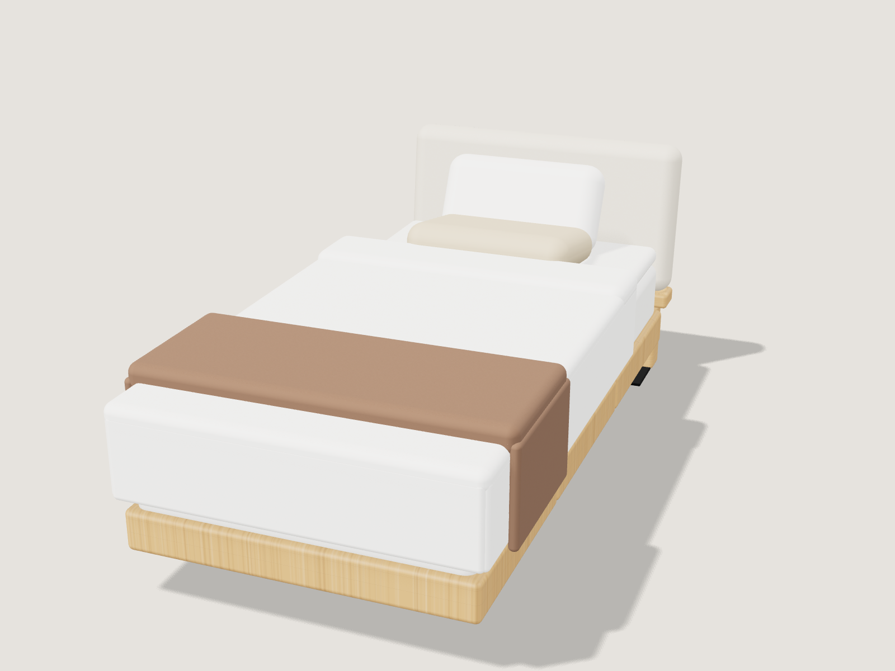 |
| C3-02 | ミニマル | SORI（反り） | 一枚の竹が、浮いて反る | 94,800円 | 竹（淡色の曲げ積層） | 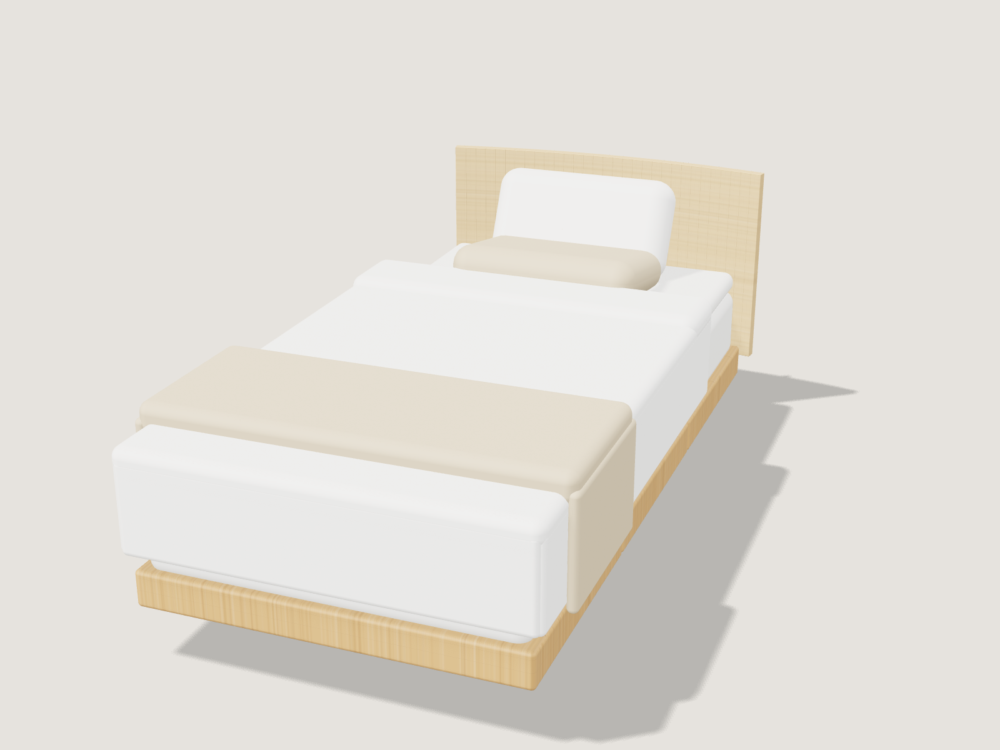 |
| C3-03 | プレミアム | TAWARA（俵） | 俵のロールに、深くもたれる | 129,800円 | 炭化竹＋ブークレ | 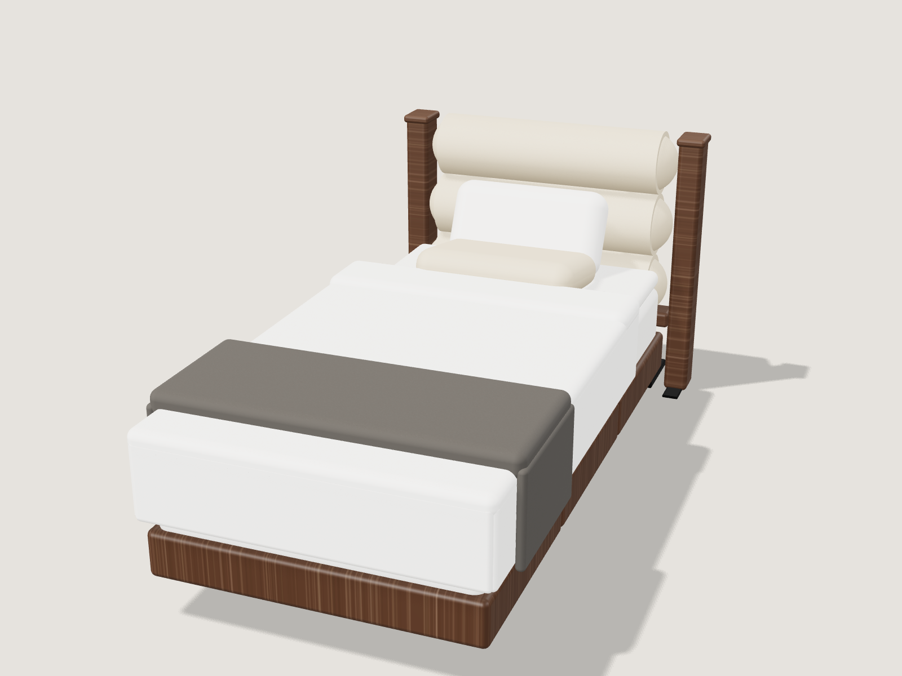 |
| C3-04 | トレンド | MAYU（繭） | 繭のかたちが、宙に浮く | 104,800円 | 竹＋布（クレイ） | 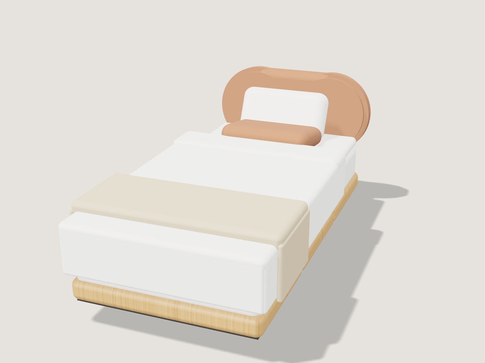 |
| C3-05 | 機能特化 | KIYORA（清ら） | ホコリが積もらない形 | 104,800円 | 竹＋撥水布（チャコール） | 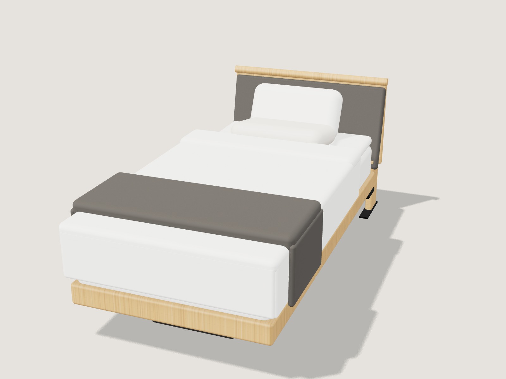 |
| C3-06 | 素材特化 | TATAMI（畳） | 畳を、枕元に立てる | 109,800円 | 炭化竹＋和紙畳表 | 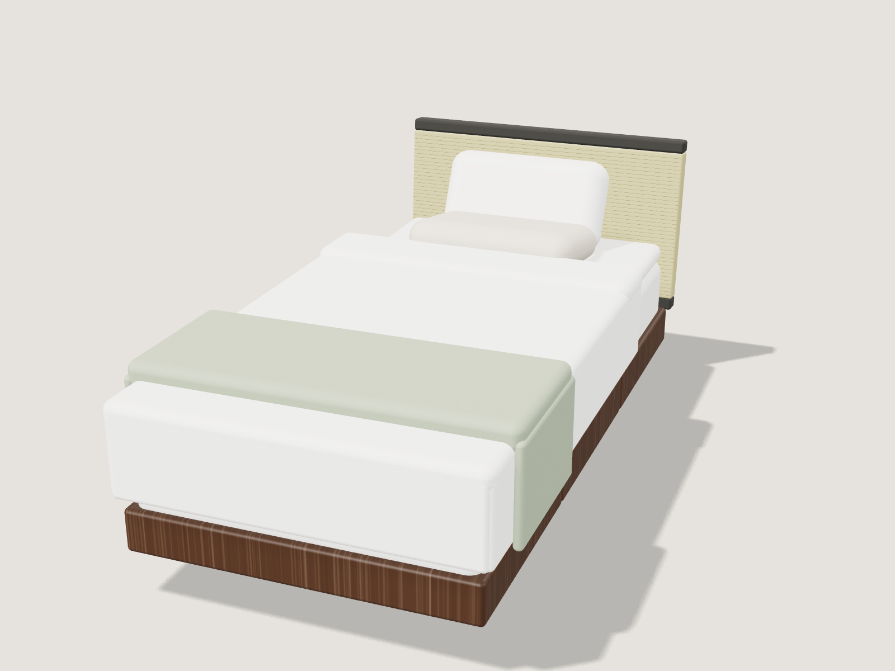 |
| C3-07 | UX改善 | SUTTO（すっと） | 立てる、掛ける、それだけ | 99,800円 | 竹＋洗える布（モカ） | 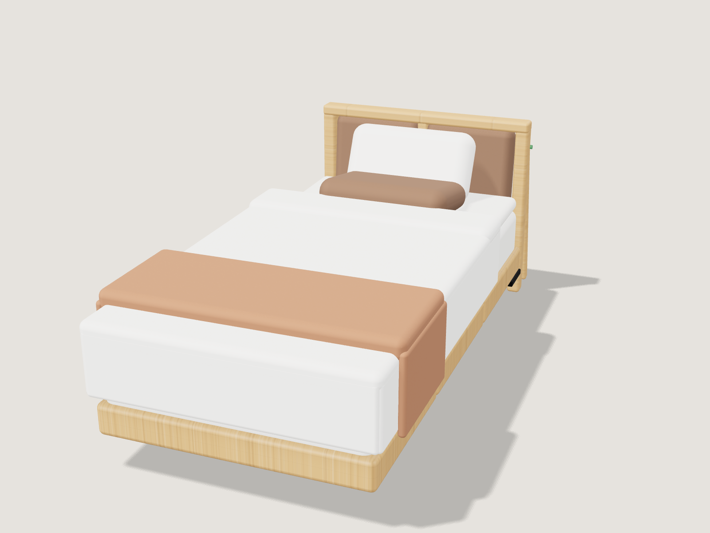 |
| C3-08 | 構造革新 | MITSU（三つ） | 三つの足で、浮かせる | 104,800円 | 竹（積み角材） | 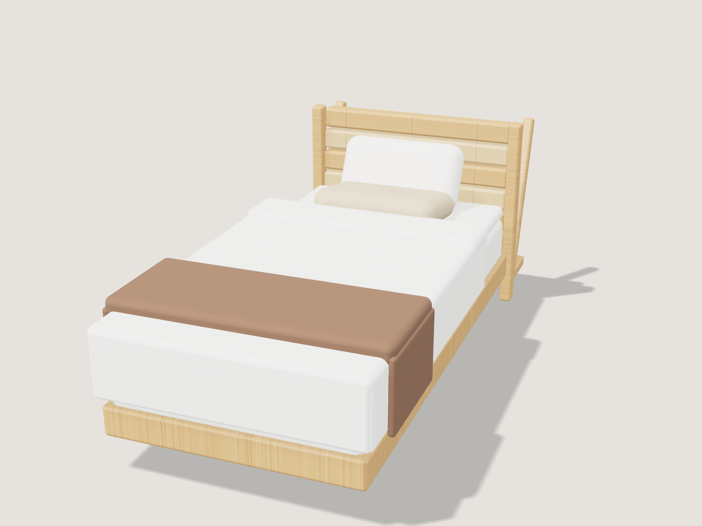 |
| C3-09 | 少し挑戦的 | OBI（帯） | 壁に帯を一本、ベッドを浮かべる | 114,800円 | 炭化竹＋布（オート）＋細いスチール | 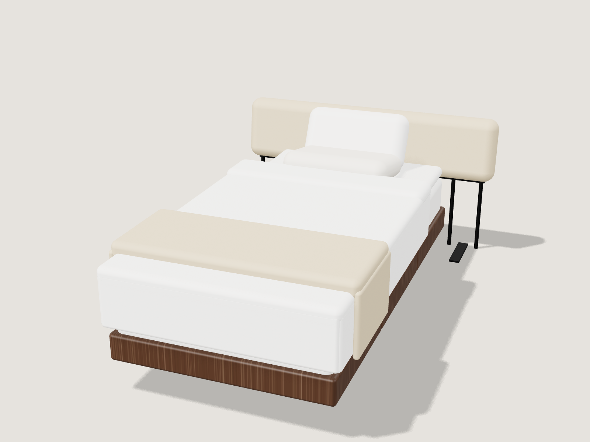 |
| C3-10 | コンセプトモデル | HISASHI（庇） | ヘッドボードだけで、ベッドを支える | 179,800円【コンセプト】 | 竹＋布（オート）＋ガラス | 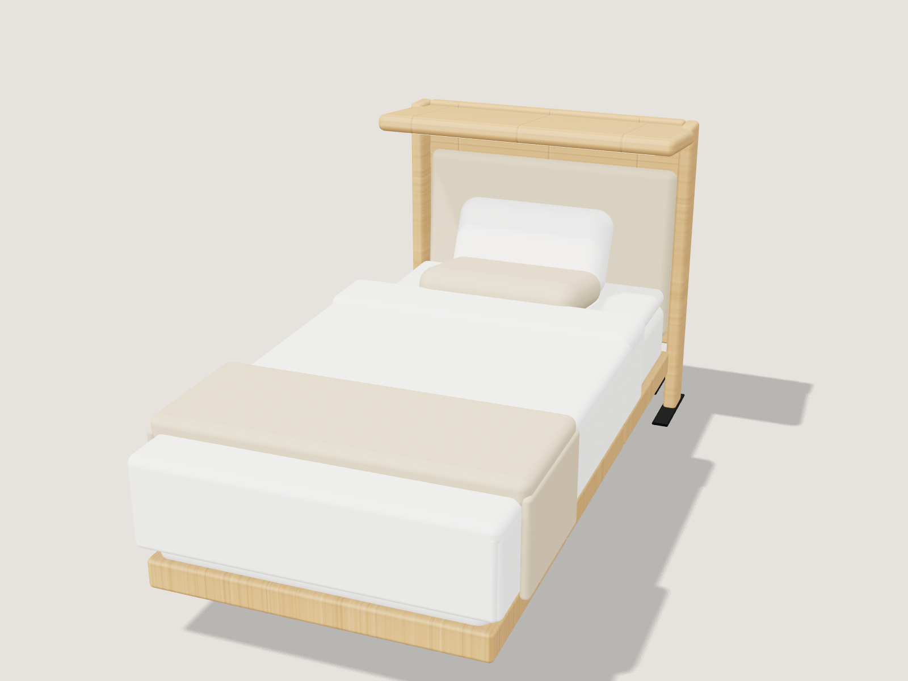 |

一覧画像（フレーム＋HB単体）: 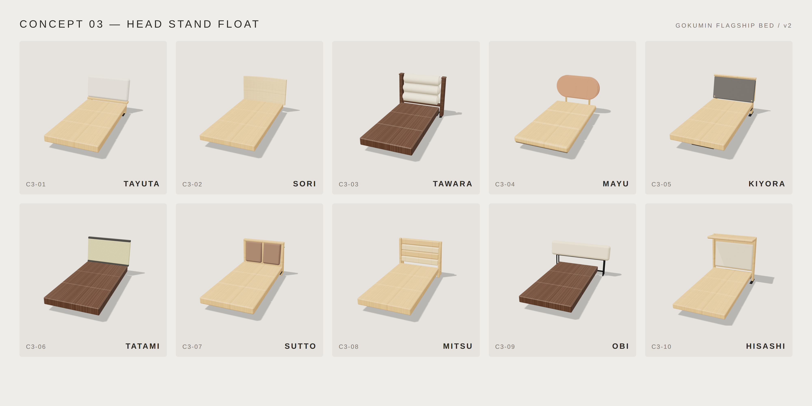

## 10案の差分表（似せないためのチェック）
| No | 形のモチーフ | HBの型 | HB高さ（床から） | HB素材・色 | HBの機能 | HBの脚の見せ方 | 主素材（本体） | 床下 | 価格帯 | 主な訴求点 | マップ上の位置 |
|---|---|---|---|---|---|---|---|---|---|---|---|
| C3-01 | 台＋クッション | ペデスタル布パネル | 850mm | 撥水布グレージュ | 洗えるカバー、もたれ7度 | 短い竹の脚2本が台の下に見える | 竹ナチュラル（縁126） | 130 | 中心 | ホテルの定番のまま床下が空く | 1人10分×9.9万（空白D の中心） |
| C3-02 | 反った一枚板 | 曲げ竹の一枚板 | 800mm | 淡色竹 | もたれ4度 | 隠す（裏の黒いブレード） | 竹ナチュラル（縁100） | 140 | 下 | 最軽量・最小部品・浮遊感 | 9.5万 |
| C3-03 | 俵（横ロール） | 柱＋ロール3段 | 1000mm | 炭化竹＋ブークレ（ラテ） | 段ごとに後退してもたれ8度 | 太い柱として見せる | 炭化竹（縁150） | 130 | 上 | スイートの格 | 13万 |
| C3-04 | 繭（カプセル） | 横長カプセルクッション | 880mm | 布クレイ | もたれ6度、洗えるカバー | 細い丸脚2本で浮かせる | 竹ナチュラル（縁120・R40） | 130 | 中上 | 曲線トレンド・SNS | 10.5万 |
| C3-05 | くさび（斜めの天端） | くさび形パネル＋丸い鼻 | 880mm | 布チャコール＋竹 | 平らな天端なし・背板と布のすき間なし | 竹のブレード脚 | 竹ナチュラル | **180** | 中上 | 清掃性の数値を最大化 | 10.5万（空白D の上） |
| C3-06 | 畳一枚 | 畳表パネル（上下に畳縁） | 860mm | 和紙畳表＋黒の縁 | 拭ける・カビにくい【推測】 | 隠す | 炭化竹（縁130） | 130 | 中上 | 和の素材価値（切り口7） | 11万 |
| C3-07 | イーゼル | 自立フレーム＋左右2枚の布 | 830mm | 竹＋布モカ | 片側ずつ外して洗う、ロックの緑 | 前脚＝枠、後ろのスタンド | 竹ナチュラル（縁124・R22） | 130 | 中心 | 最短・迷わない組立 | 9.9万（空白B＋D） |
| C3-08 | A字＋積み木 | 積み角材4段＋A字脚 | 900mm | 竹2トーン | 最下段が受け梁 | 構造として見せる | 竹ナチュラル | 140 | 中上 | 三角形で支える剛性 | 10.5万 |
| C3-09 | 横一本の帯 | ワイドの帯（幅1500） | 790mm | 布オート＋黒い細脚 | 足元灯（電球色） | 細い脚を主役に | 炭化竹 | 150 | 上 | 強い浮遊感・壁一面の顔 | 11.5万（空白の外側） |
| C3-10 | 庇 | 庇つきハイパネル | 1100mm | 竹＋布オート | 読書灯、電源口 | 袖が床まで | 竹ナチュラル（縁94） | 150 | 最上 | HBだけが支えて見える | 将来×18万 |

- 重なりの確認: 本体「竹ナチュラル」は6案、「炭化竹」は4案だが、企画の本体2色方針（0-4、research 結論2-7）による。**HBの型・脚の見せ方・訴求点はすべて異なる**。価格帯「中心」は C3-01・07 の2案（訴求は“定番の格”と“組立の体験”で別）、「中上」は4案（曲線／清掃性／素材／構造で別）
- HBの脚の見せ方で振れ幅を作った: 隠す（02・06）→ 短い脚（01）→ 細い丸脚（04）→ ブレード（05）→ 枠（07）→ 柱（03）→ A字（08）→ 細い金属脚（09）→ 袖が床まで（10）
- **①②との違い**: ①（`03-design-v2-c1.md`）はHBがデッキのヒンジで起きる一体構造、②（`-c2.md`）は床に立つ支柱に顔を掛ける規格。③は **HBの脚が本体の頭側の荷重を受け、足元は台座1つ** で、どのHBも「パネルの下端が床から浮き、脚が壁際にだけ立つ」。型の名前も①②と重ねていない（アーチ・縦の畝・チャネル・雲・簾・タイル・網代・門型・箱・2層・柱と棚は不使用）

---

## 案C3-01 王道・市場適合型「TAYUTA（たゆた）」

正面 `C3-01-front.png` ／ 側面 `C3-01-side.png` ／ フレーム単体 `C3-01-frame.png` ／ 床下 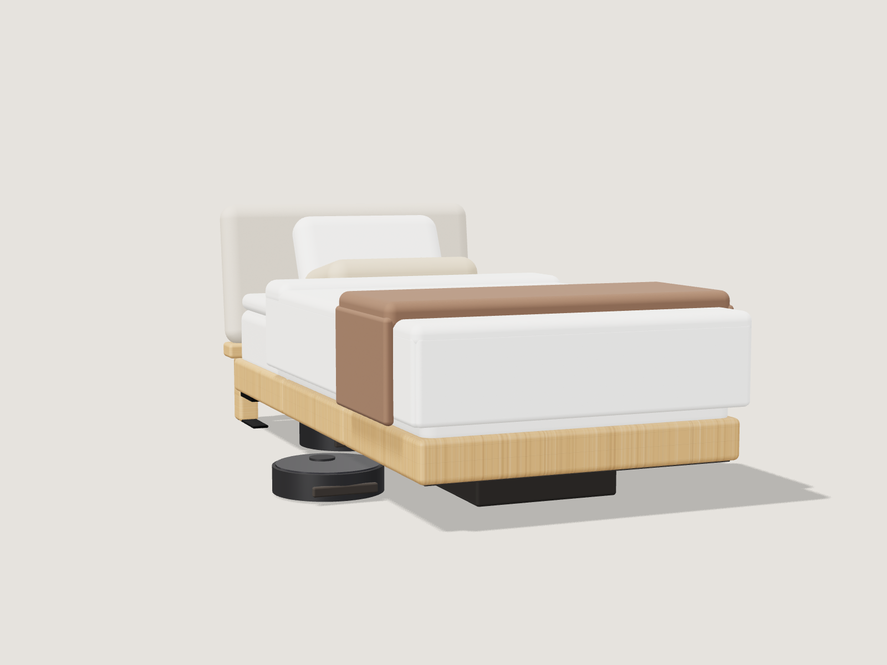 ／ 構造（左: HBユニット／右: 持ち上げた本体と足元台座）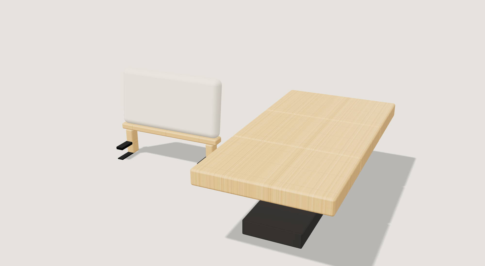

- **名称**: C3-01 王道・市場適合型「TAYUTA」
- **デザインコンセプト**: 「竹の台に、ホテルの布パネル。」10万円帯で最も売れている“もたれられる布張りHB”（コアラ ファブリック、エマ）をそのまま標準にし、その布パネルを竹の台（2本脚＋敷居）に載せた。台の脚がベッドの頭側の脚を兼ねるので、床には壁際の2本と足元の台座しかない。
- **ターゲット**: THE GOKUMIN を買った34歳の共働き夫婦。ロボット掃除機を毎日使い、ベッド下のホコリが気になっている（企画 3-2）。
- **解決する課題**: 購入理由「デザイン（ホテル）」35.7%・「もたれられるHB」21.4%（research §7）、不満「布の汚れ・洗えない」[S43]、「脚が長い／重く2人推奨」（コアラ [S40]）。床下12cm 以上でほぼ全機種のロボット掃除機が通る [S57]。
- **形状**: 外寸 W1030×L2180×H850mm。デッキ天面 226mm、縁の見付け 126mm（96＋立ち上がり30）、角R18。床下130mm。HBは竹の脚 76×250×96mm ×2、敷居 1030×56×110mm、布パネル 1030×544×116mm・R56、もたれ7度。
- **ヘッドボード仕様**: 型=ペデスタル（竹の台に布パネルが載る）／高さ=床から850mm（企画 0-2 の標準）／素材=撥水・防汚ファブリック（グレージュ）、中身はウレタン＋竹合板の芯、台は竹集成材／機能=ジッパーで外して洗えるカバー、もたれ角7度、布パネルは敷居の溝に上から落とし込む（P2 のフェイス規格に合わせ、後から別の顔にも替えられる）／取り付け方式=HBユニットの脚前面の受けブラケット2点に本体頭側を落とし込む（くさび、R1〜R3）
- **素材**: デッキ・縁・HBの台=国産竹集成材、芯=中空スチール、台座・ブラケット・床足=スチール（黒）、パネル=撥水布＋ウレタン＋竹合板
- **CMF**: 本体=ナチュラル竹 #C89C66／炭化竹 #5B3D28。布=グレージュ #CFC5B5（標準）、オフホワイト #ECE6DB、クレイ #A8765A、チャコール #55524E の4色。Finish=竹は3分艶のオイル調ウレタン、布は微起毛の平織り、金物はマットブラック
- **機能**: 床下130mm・脚は壁際と台座だけ、洗える布HB、もたれ7度。**入れなかった機能**: 宮棚・コンセント（低価格帯の当たり前、ホコリがたまる。research 結論2）、LED
- **競合優位性**: コアラ ファブリック（99,900円）の「脚が長い・重く2人推奨・寝返りで音」[S40] に対し、同価格で1人・工具0・床下全面が空く。LED フローティング（安価品）[S54] に対し、HBと厚い竹の縁で格を出す
- **製造方法**: デッキは P1 の既存工程（竹集成材のCNC＋ウレタン塗装、スチール芯の曲げ・溶接）。HBの台は竹集成材のCNC、脚の折りたたみヒンジは既存の折りたたみベッドの金具を流用【推測】。台座はスチール板の曲げ・溶接＋粉体塗装。パネルは縫製。工場での部品点数 約48点、ユーザーが扱うのは3点。新規金型はくさび・ソケットの樹脂2型【推測】。量産の注意点: 受けブラケットの高さ公差±1mm（デッキの水平）、布ロットの色差
- **開梱〜就寝**: 基本の4動作、**約9分**【推測】。工具0・ネジ0・部品3点・1人
- **梱包**: 2箱。本体箱 約66×102×24cm（192cm）・約23kg／HB箱 約106×62×20cm（188cm）・約12kg【推測】
- **想定価格**: S 99,800円。原価率 約38%【推測】。research 結論4 の狙う価格そのもの。替えカバー 9,800円
- **デザイン意図**: 根拠: research 結論5「ファブリック（角を丸め…カバーを外して洗える）」「もたれ角5〜10度」、§14 コアラの「もたれやすい布張りHB」、企画 4-3 の 01「布パネル・85cm、左右の竹の脚で床に立つ」。台を竹にしたのは、布だけのHBより“家具の仕立て”が見えるため（[S42]）。SNS の「ロボット掃除機が床下を抜ける」は `-underfloor` と同じ構図で撮れる（企画 申し送り）

## 案C3-02 ミニマル「SORI（反り）」

正面 `C3-02-front.png` ／ 側面 `C3-02-side.png` ／ フレーム単体 `C3-02-frame.png` ／ 床下 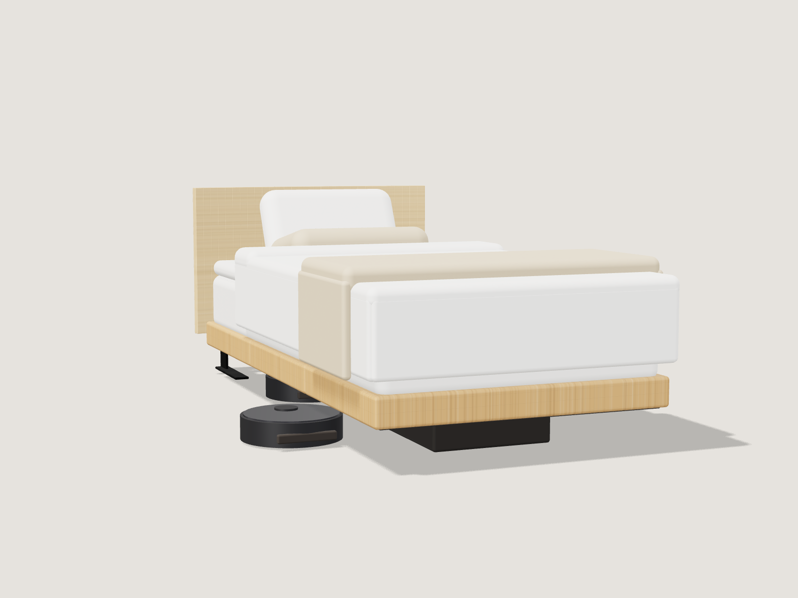 ／ 構造 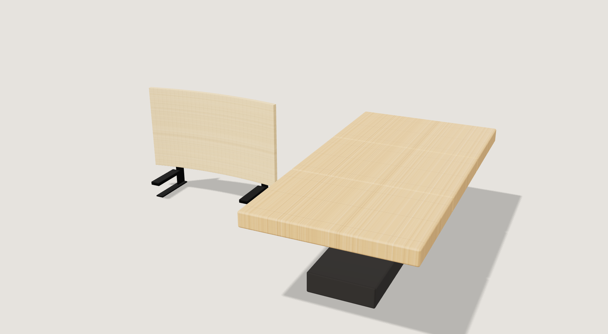

- **名称**: C3-02 ミニマル「SORI」
- **デザインコンセプト**: 「一枚の竹が、浮いて反る。」HBは曲げ積層の竹の一枚板だけ。ベッド側へ半径2600mm で緩く反らせ、脚はパネル裏の薄いスチールのブレードに隠す。前から見ると板だけが宙に浮き、ベッドも浮いている、要素の最も少ない案。
- **ターゲット**: 1LDK に住む30代の単身者（research 結論3 の第2ターゲット）。線の少ない和〜北欧の部屋が好き。
- **解決する課題**: 宮付きの「全長が伸びる」[S44]・重さ（§6 不満1位 28.6%）に対し最軽量・最小部品。反りで一枚板の単調さを消し、「安い板のHB」に見せない。
- **形状**: 外寸 W1063×L2208×H800mm。デッキ天面 220mm、縁の見付け 100mm、角R12、床下140mm。HB板 幅1060×高さ620×厚み40mm（下端は床から180mm）、平面の反り R2600。脚は 12×560×90mm のスチールブレード2枚（板の裏）。台座 W420。
- **ヘッドボード仕様**: 型=曲げ竹の一枚板（反り）／高さ=床から800mm（標準より5cm低く、圧迫感を減らす）／素材=竹の曲げ積層（淡色）／機能=もたれ角4度（反りが背中を受ける）、拭くだけの手入れ／取り付け方式=ブレード下端の受けブラケットに本体を落とし込む
- **素材**: デッキ=竹集成材、HB=竹単板の曲げ積層（プレス成形）、ブレード・台座=スチール（黒）
- **CMF**: 淡色竹 #D6B584（HB）×ナチュラル竹 #C89C66（本体）。炭化竹の本体も可。Finish=1分艶のマットクリア。金物は前から見えない
- **機能**: 浮いて見えるHB、床下140mm。**入れなかった機能**: 布・棚・電源（布の顔は P2 で後から足せない形のため、ミニマルに割り切る）
- **競合優位性**: 無印 オーク＋HB（46,900円）の「脚を付けないとHBを付けられない」[S41] に対し、HBが脚そのもの。フラット型（国内で11商品と最多、notes/v2-headboard-types.md）の中で、反りと浮きで差をつける
- **製造方法**: HBは竹単板の曲げプレス（成形型1面、竹の曲げ積層は既存の家具工場で可能【推測】）。ブレードはレーザー切断＋曲げ。工場での部品点数 約40点。量産の注意点: 曲げ積層の戻り（スプリングバック）と反りの左右差、淡色材の選別
- **開梱〜就寝**: 4動作、約8分【推測】。部品3点・1人
- **梱包**: 本体箱 約66×102×22cm（190cm）・約21kg／HB箱 約108×66×12cm（186cm）・約8kg【推測】
- **想定価格**: S 94,800円。原価率 約36%【推測】。帯（89,800〜109,800円）の中
- **デザイン意図**: 根拠: 企画 4-3 の 02「竹パネル、影だけが浮いて見える最小構成」、research §10 のフラット型が最多、2026年の曲線（[S28][S29]）。①の C1-02 HIRA（平らな竹パネル）と同じにならないよう、**平面の反り**と**脚を見せない浮き**で型を変えた。**犠牲にしたもの**: 布のもたれ心地（Market Fit）

## 案C3-03 プレミアム「TAWARA（俵）」

正面 `C3-03-front.png` ／ 側面 `C3-03-side.png` ／ フレーム単体 `C3-03-frame.png` ／ 床下 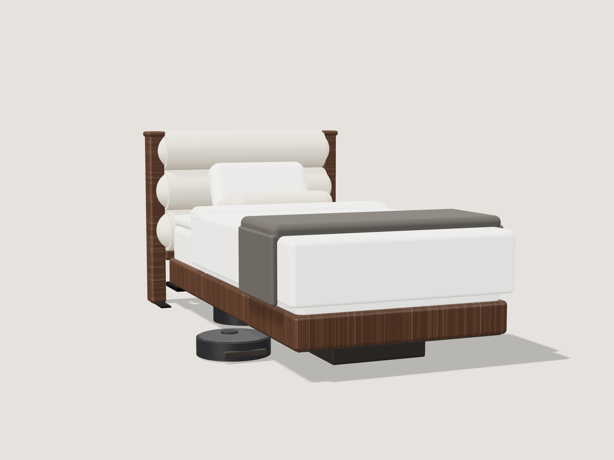 ／ 構造 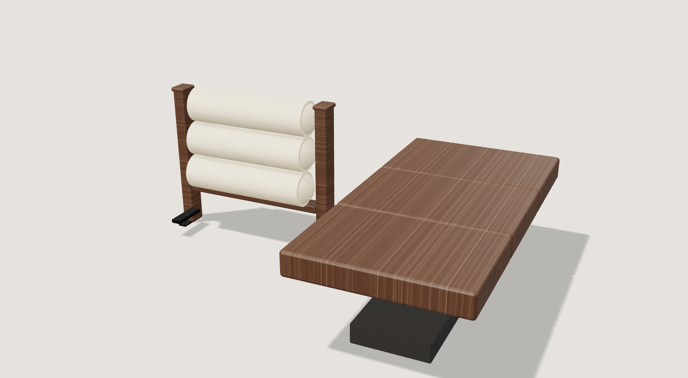

- **名称**: C3-03 プレミアム「TAWARA」
- **デザインコンセプト**: 「俵のロールに、深くもたれる。」炭化竹の太い2本の柱の間に、ラテ色ブークレの俵形ロールを3段重ね、段ごとに34mm ずつ後退させてもたれ角8度をつくる。柱がそのままベッドの頭側の脚になり、ホテルのスイートの存在感と床下の清潔を両立する。
- **ターゲット**: 世帯年収の高い30代後半の夫婦。旅館・ホテルのスイートが好きで、THE GOKUMIN ユーロトップを選んだ（企画 3-2 の上位）。
- **解決する課題**: 10万円帯の価値「素材・張り地・HBの存在感」[S42]。家具メーカー品は「重く業者頼み」、D2C は「格が一段足りない」（research 結論3）。
- **形状**: 外寸 W1184×L2254×H1006mm。デッキ天面 250mm、縁の見付け 150mm（120＋30）、角R20、床下130mm。柱 90×1000×120mm（上に笠木 104×30）、下の横木 990×60×100mm、ロール 直径236×長さ860mm＋丸い端部 ×3。
- **ヘッドボード仕様**: 型=柱＋横ロール3段（俵）／高さ=床から1000mm（企画 0-2 のハイバック 100〜110cm）／素材=炭化竹集成材、ブークレ（ラテ）＋高密度ウレタン／機能=段ごとの後退でもたれ角8度、ロールは1本ずつ持ち上げて外し、カバーを洗える／取り付け方式=柱の前面のブラケット2点に本体を落とし込む。ロールは柱の内側の溝に上から落とす
- **素材**: 本体・柱=炭化竹集成材、ロール=ブークレ＋ウレタン、台座・金物=スチール黒
- **CMF**: 炭化竹 #5B3D28／#4F3524（柱）、ブークレ ラテ #D6C6AB（標準）、アイボリー・モカ。Finish=5分艶の塗装で炭化竹の深みを出す
- **機能**: 深くもたれるHB、洗えるロール、床下130mm。**入れなかった機能**: 電源・棚（格を優先）
- **競合優位性**: 飛騨 月光（14万円〜、受注生産40〜60日 [S9]）・カリモク（業者設置）に対し、即納・自分で10分。コアラ ファブリックより一段上の格
- **製造方法**: 柱は炭化竹集成材の太物（接着積層→CNC）。ロールは筒状の縫製＋ウレタン巻き。工場での部品点数 約52点。量産の注意点: 太い柱の反り・割れ、ブークレの色ロット。**梱包が課題**: 柱が床から1000mm のため、HB骨格（柱＋横木）は約118×101×14cm（233cm）で200サイズを超える【推測】
- **開梱〜就寝**: 5動作（基本4＋ロール3本を落とし込む）、約11分【推測】。部品3点＋ロール3本・1人
- **梱包**: 3箱。本体箱 約66×102×26cm（194cm）・約25kg／HB骨格箱 約118×101×14cm（233cm、大型の宅配便）・約16kg／ロール箱 約90×50×26cm（166cm）・約6kg【推測】
- **想定価格**: S 129,800円。原価率 約42%【推測】。帯の上（research 結論4 は S 89,800〜109,800円）で、飛騨・カリモクより安い位置
- **デザイン意図**: 根拠: 企画 4-3 の 03「炭化竹の脚＋ブークレのパネル、ハイバック100cm」、research §8「プレミアム帯の布はベルベットとブークレ」[S29]、切り口7「炭化竹×和モダン」。②の C2-03 KASANE（竹の壁＋スラブ2枚）と重ならないよう、**横ロール（俵）**という型にした。**犠牲にしたもの**: 梱包（Manufacturability）と価格

## 案C3-04 トレンド「MAYU（繭）」

正面 `C3-04-front.png` ／ 側面 `C3-04-side.png` ／ フレーム単体 `C3-04-frame.png` ／ 床下 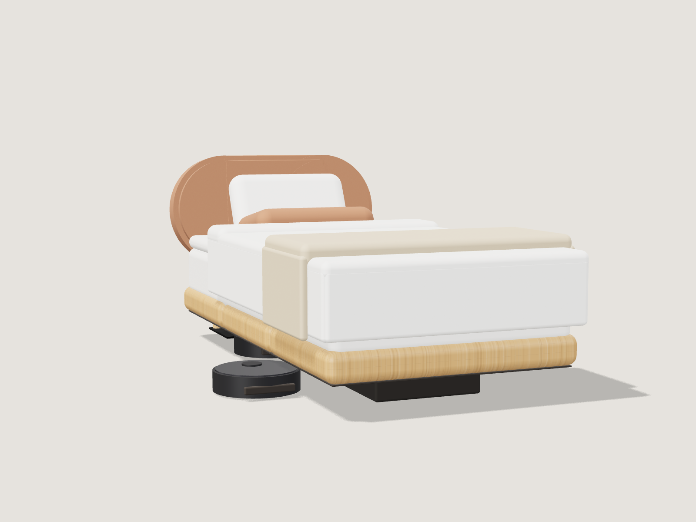 ／ 構造 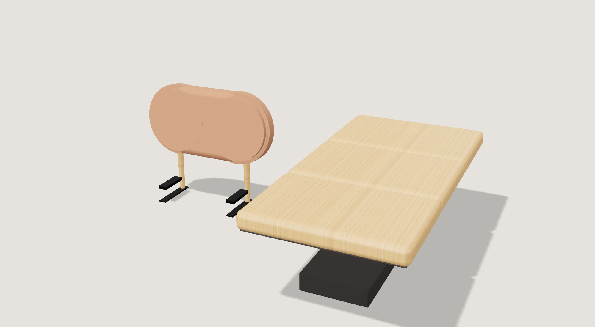

- **名称**: C3-04 トレンド「MAYU」
- **デザインコンセプト**: 「繭のかたちが、宙に浮く。」両端がまるいカプセル形の横長クッション（クレイ）を、竹の細い丸脚2本で持ち上げる。本体も角R40 のやわらかい縁で、ベッド全体が床から浮いた“丸いもの”に見える。
- **ターゲット**: 28〜32歳の同棲カップル。Instagram・RoomClip でインテリアを探す（research §13）。
- **解決する課題**: 2026年の「曲線・角丸」「clay・mushroom」[S28][S51]、SNSで映える寝室全景（research §13 の推測）。LED で浮かせる安価品との差 [S54]。
- **形状**: 外寸 W1060×L2173×H883mm。デッキ天面 220mm、縁の見付け 120mm、角R40、床下130mm。カプセル 幅1060×高さ540×厚み130mm（端部 R270、外周を一段面取り）、下端は床から340mm。脚は竹の丸棒 φ52〜38（下すぼまり）×2。
- **ヘッドボード仕様**: 型=横長カプセル（繭）クッション／高さ=床から880mm（頂部）／素材=撥水・防汚ファブリック（クレイ）、中身はウレタン＋竹合板の芯、脚は竹の丸棒（芯にスチール）／機能=もたれ6度、ジッパーで外して洗えるカバー／取り付け方式=脚の下部のブラケット2点に本体を落とし込む
- **素材**: デッキ=竹集成材、カプセル=布＋ウレタン＋竹合板、脚=竹丸棒＋スチール芯、台座=スチール黒
- **CMF**: 竹ナチュラル #C89C66。布=クレイ #A8765A（標準）、モカ #806350、オフホワイト #ECE6DB、セージ #A4AD96（限定色）。Finish=布は微起毛
- **機能**: 洗えるHB、床下130mm。**入れなかった機能**: 棚・電源（曲線を崩さない）
- **競合優位性**: TikTok の LED フローティング [S54] に対し、光ではなく形で浮遊感を出す。国内10万円帯に曲線HBのフローティングは確認できない（research §16 空白D【推測】）
- **製造方法**: カプセルの芯は竹合板のCNC、ウレタンはモールド成形（金型1面、中規模）【推測】、カバーは3D縫製。脚は竹丸棒の旋盤加工＋スチール芯。工場での部品点数 約44点。量産の注意点: 曲面カバーのしわ、細い脚の曲げ剛性（もたれ時）
- **開梱〜就寝**: 基本の4動作、約9分【推測】
- **梱包**: 本体箱 約66×102×24cm（192cm）・約23kg／HB箱 約108×58×16cm（182cm）・約10kg【推測】
- **想定価格**: S 104,800円。原価率 約40%【推測】
- **デザイン意図**: 根拠: 企画 4-3 の 04「角Rの大きいパネル、クレイ／モカ」、research §10 の曲線トレンド、§9 のカラー。①の C1-04 MARU（アーチ）・②の C2-04 KUMO（雲形）と重ならないよう、**上下とも丸い横長カプセル**にし、下にも空間を見せて“浮き”を強調した。**犠牲にしたもの**: 竹の見せ場（Brand Fit）

## 案C3-05 機能特化「KIYORA（清ら）」

正面 `C3-05-front.png` ／ 側面 `C3-05-side.png`（くさびの断面が分かる）／ フレーム単体 `C3-05-frame.png` ／ 床下 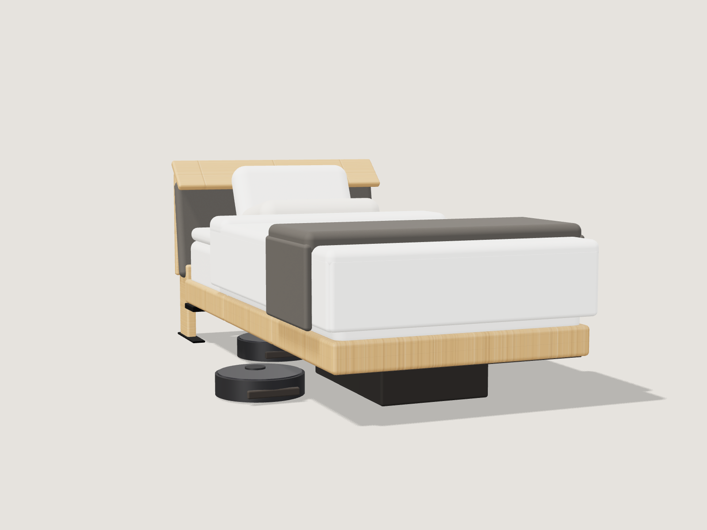 ／ 構造 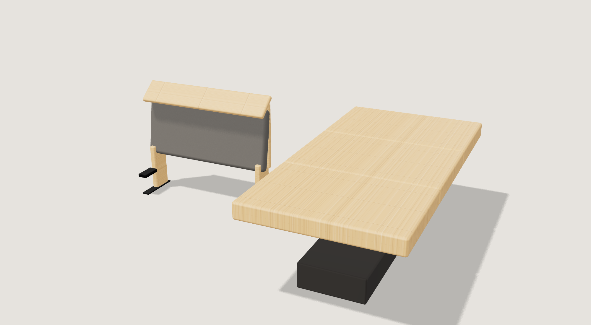

- **名称**: C3-05 機能特化「KIYORA」
- **デザインコンセプト**: 「ホコリが積もらない形。」清掃性を数値と形で突き抜けさせた案。床下は180mm（ロボット掃除機だけでなく、スティック掃除機のヘッドも床下の奥まで入る）。HBは布パネルが背板に向かって傾いて上端で背板に接する“くさび形”で、天端に平らな面がない（丸い竹の鼻だけ）。背板と布の間にも、ホコリがたまる溝がない。
- **ターゲット**: ロボット掃除機とスティック掃除機を併用する、ハウスダストが気になる家庭（企画 3-2 サブターゲット）。子ども・ペットあり。
- **解決する課題**: 企画 3-3「床下12cm 以上をほぼ全面」の上をいく 18cm、research 結論2-4「深い宮棚はホコリがたまる」[S44]、布の汚れ [S43]。
- **形状**: 外寸 W1040×L2168×H880mm。デッキ天面 264mm（寝面 約54cm）、縁の見付け 114mm、床下180mm。背板 竹 1030×560×36mm、布パネル 1030×540×48mm（下端で背板から118mm 前、上端で背板に接する＝傾き約12度）、天端の竹の鼻 φ48。脚は竹のブレード 44×360×150mm ×2（パネル下端 床から300mm）。台座 W440×H174。
- **ヘッドボード仕様**: 型=くさび形（平らな天端なし）／高さ=床から880mm／素材=撥水・防汚ファブリック（チャコール）＋竹の背板・鼻／機能=天端にホコリが積もらない、HB下端が床から300mm で壁際まで掃除機が入る、布はマジックテープで外して洗える、もたれ角約12度（くさびの傾き）【推測】／取り付け方式=ブレード脚のブラケット2点に本体を落とし込む
- **素材**: デッキ=竹集成材、背板・鼻・脚=竹集成材、布パネル=撥水布＋ウレタン、台座=スチール黒
- **CMF**: 竹ナチュラル。布=チャコール #55524E（標準：汚れが目立たない）、オフホワイト、モカ、クレイ。Finish=竹は拭き取りやすい3分艶ウレタン
- **機能**: 床下180mm、くさび形のHB、台座の角も R10 でコードや髪が絡まない。**入れなかった機能**: 棚・照明（ホコリの面を作らない）
- **競合優位性**: Nectar Bamboo（床下約10インチ、HBは別売・日本未展開 [S25]）に対し、HB込みで国内で買える。一般的なフローティング（中央台座）[S55] に対し、壁際（HBの下）まで掃除できる
- **製造方法**: デッキは標準品の台座を高くするだけ（台座のみ別型）。背板・脚は竹集成材のCNC、鼻は竹丸棒。工場での部品点数 約46点。量産の注意点: 寝面が54cm と高くなる（下記）
- **開梱〜就寝**: 基本の4動作、約9分【推測】
- **梱包**: 本体箱 約66×102×28cm（196cm、高い台座のため）・約24kg／HB箱 約106×62×18cm（186cm）・約11kg【推測】
- **想定価格**: S 104,800円。原価率 約39%【推測】。台座の高さ 130mm 版（S 99,800円）も選べる
- **デザイン意図**: 根拠: 企画 4-3 の 05「床下18cm も選べる台座、HB下を通る壁際の掃除動線を最大化」、research §11「床下のロボット掃除機対応。12cm 以上ならほぼ全機種」[S57]、結論2-4。**犠牲にしたもの**: 寝面高 約54cm（標準の45〜50cm より高い。企画 0-4）。腰掛けやすさとして訴える一方、小柄な人には高い
- SNS の3カット（企画 申し送り）のうち「ロボット掃除機が床下を抜ける」を最も強く撮れる案

## 案C3-06 素材特化「TATAMI（畳）」

正面 `C3-06-front.png` ／ 側面 `C3-06-side.png` ／ フレーム単体 `C3-06-frame.png` ／ 床下 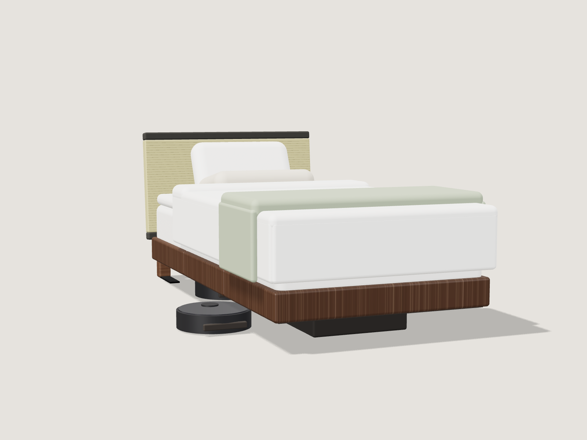 ／ 構造 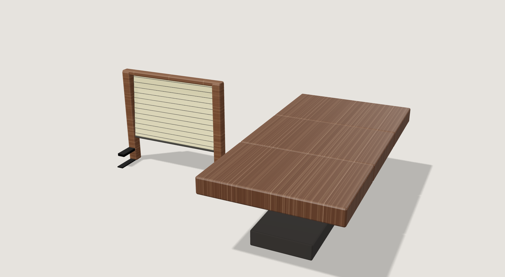

- **名称**: C3-06 素材特化「TATAMI」
- **デザインコンセプト**: 「畳を、枕元に立てる。」厚み60mm の“畳一枚”を立てたHB。表は樹脂でコーティングした和紙の畳表で、拭けて、カビ・ダニが発生しにくい【推測】。長手（上下）にだけ黒い畳縁を通し、炭化竹の本体と合わせて旅館の設えにする。脚は畳の裏に隠れ、畳が宙に立っているように見える。
- **ターゲット**: 和モダンが好きな30代夫婦。畳のない賃貸マンションに住み、「畳の手触り」を寝室に取り入れたい。訪日客・海外（竹の評価 [S25]）も視野。
- **解決する課題**: 布張りHBの「汚れ・湿気」[S43]、「洗えない布張り」（結論2-5）に、拭ける天然調素材で答える。素材の格（無垢・天然素材 35.7%、§7）。
- **形状**: 外寸 W1030×L2148×H858mm。デッキ天面 230mm、縁の見付け 130mm、床下130mm。畳パネル 1030×620×60mm、畳縁 幅44mm（上下）、もたれ5度。脚 炭化竹 70×700×70mm ×2（パネルの裏）。
- **ヘッドボード仕様**: 型=畳表パネル（長手に畳縁）／高さ=床から860mm／素材=和紙畳表（樹脂コート）＋畳縁（ポリエステル）、芯は軽量の発泡ボード＋竹合板／機能=拭ける、カビ・ダニが発生しにくい【推測】、畳表は張り替え可能（P2 規格のパネルとして交換）／取り付け方式=脚のブラケット2点に本体を落とし込む。畳パネルは脚の上端のフックに上から掛ける
- **素材**: 本体・脚=炭化竹集成材、パネル=和紙畳表＋畳縁＋発泡芯、台座=スチール黒
- **CMF**: 炭化竹 #5B3D28。畳表=若草 #BDB383（標準）、白茶・墨（限定）。畳縁=墨 #3B3A36。Finish=竹は5分艶
- **機能**: 拭ける和素材のHB、張り替え。**入れなかった機能**: 布クッション（素材の純度を優先。もたれ心地は薄い）
- **競合優位性**: 国内10万円帯のHBの素材は無垢材・布が中心（research §8）で、畳表のHBは確認できない。飛騨・カリモクの無垢に対し、竹＋畳で日本発の素材の物語を持てる
- **製造方法**: 畳パネルは畳店・畳床メーカーの既存工程（畳表の張り・縁の縫い付け）を外注【推測】。工場での部品点数 約42点。量産の注意点: 畳表の供給ロット、端部の縫製品質
- **開梱〜就寝**: 基本の4動作、約9分【推測】
- **梱包**: 本体箱 約66×102×24cm（192cm）・約23kg／HB箱 約105×66×12cm（183cm）・約9kg【推測】
- **想定価格**: S 109,800円。原価率 約42%【推測】
- **デザイン意図**: 根拠: 企画 4-3 の 06「洗える布＋拭ける竹。手入れ性を素材で表現」を、洗うのではなく**拭く**素材に置き換えた。research 切り口7「竹を和モダンの高級素材に格上げ」。②の C2-06 SUDARE（簾）・①の C1-06 AJIRO（網代）と重ならない和素材として畳を選んだ。**竹以外の主素材を足した理由**: 清掃性（拭ける）とブランドの和の物語を同時に満たすため

## 案C3-07 UX改善「SUTTO（すっと）」

正面 `C3-07-front.png` ／ 側面 `C3-07-side.png`（後ろのスタンドが分かる）／ フレーム単体 `C3-07-frame.png` ／ 床下 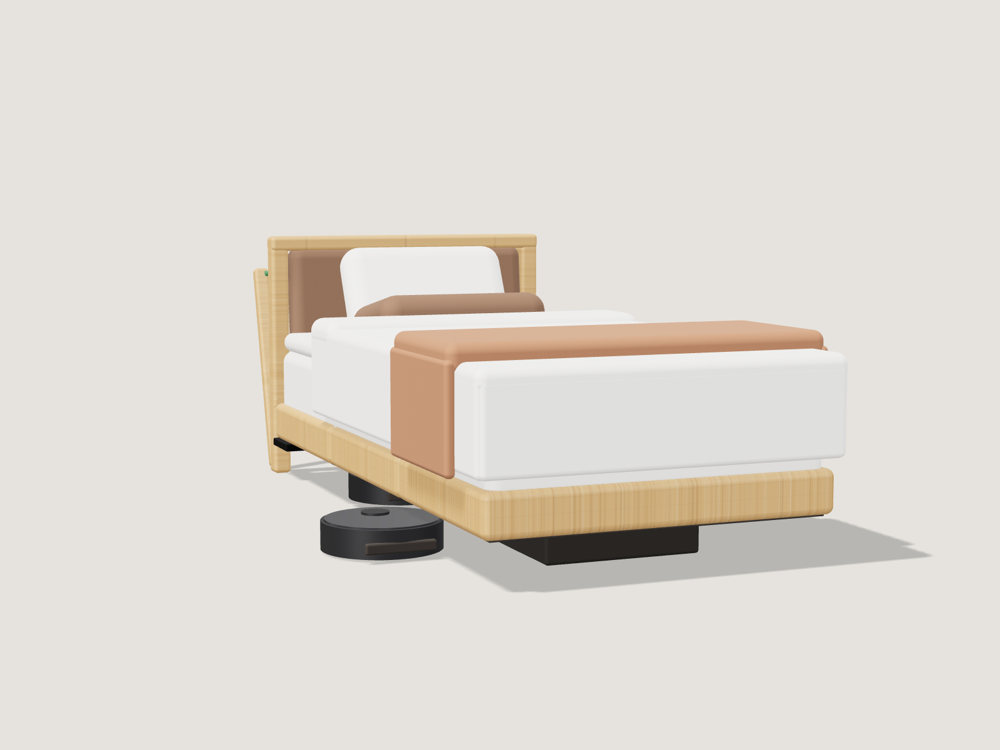 ／ 構造 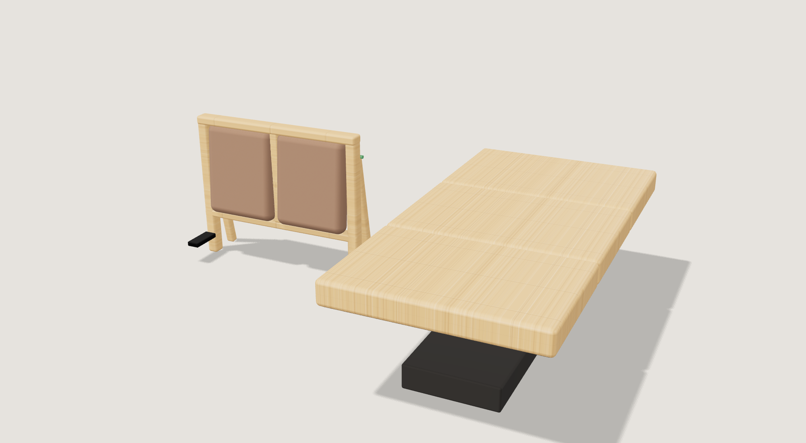

- **名称**: C3-07 UX改善「SUTTO」
- **デザインコンセプト**: 「立てる、掛ける、それだけ。」HBユニットは後ろのスタンド（キックスタンド）を開くとイーゼルのように**単体で自立**する。立てたHBに本体を掛ける、という手順が形そのものから分かる。布は左右2枚に分け、片側ずつ持ち上げて外し、洗濯機で洗える。
- **ターゲット**: 初めて自分でベッドを組む女性の一人暮らし〜同棲カップル。説明書を読まずに組みたい。
- **解決する課題**: 不満1位「組立が重い・2人必要・時間がかかる」28.6%、購入理由1位「工具不要・短時間」57.1%（research §6・§7）。企画 3-4「重い本体を1人で裏返さずに済む手順を具体化」。
- **形状**: 外寸 W1012×L2235×H830mm。デッキ天面 220mm、縁の見付け 124mm、角R22、床下130mm。HB枠 1000×830mm（前脚 60×830×70、笠木 50、下の横木 44）、中央の背骨 50×530、布パネル 420×520×96mm ×2（もたれ5度）。後ろのスタンドは奥行き130mm（ピボットは床から700mm、緑の目印）。
- **ヘッドボード仕様**: 型=イーゼル自立フレーム＋左右2枚の布パネル／高さ=床から830mm／素材=竹集成材の枠、撥水・防汚ファブリック（モカ）／機能=スタンドで自立（組立中に倒れない）、パネルは1枚ずつ外して洗える、ロックの緑の目印（R4）／取り付け方式=枠の前脚のブラケット2点に本体を落とし込む
- **素材**: 枠・デッキ=竹集成材、パネル=布＋ウレタン＋竹合板、台座・ブラケット=スチール黒、スタンドのピボット=樹脂ブッシュ（R5）
- **CMF**: 竹ナチュラル。布=モカ #806350（標準）、オフホワイト、クレイ、チャコール。左右で色を変える組み合わせも可
- **機能**: 自立するHB、片側ずつ洗える布、組立の各段階で緑の目印。**入れなかった機能**: 電源・棚
- **組立の体験（UX の中身）**: ① 箱の中でスタンドが畳まれている → 開くとカチッと緑 → そのまま壁際に置く（倒れない）② 本体は箱から横倒しで引き出し、開くと自動でロック、台座を差す ③ 本体を倒して、頭側をHBの前脚の受けへ“すっと”落とす（くさびの緑が見える）④ マットレス。**約7分**【推測】。本体を持ち上げる高さは最大25cm
- **競合優位性**: コアラ・エマ（付属工具で組む、2人推奨の声 [S40][S13]）に対し工具0・1人・7分。Thuma（約6分42秒 [S18]）と同等の速さを、HB込み・国内で
- **製造方法**: 枠は竹集成材のCNC＋ほぞ組み（工場で接着）。スタンドのヒンジは既存の折りたたみ金具。工場での部品点数 約46点。量産の注意点: スタンドのピボットの耐久（開閉1,000回）
- **開梱〜就寝**: 4動作、**約7分**【推測】。部品3点・1人
- **梱包**: 本体箱 約66×102×24cm（192cm）・約23kg／HB箱 約102×85×12cm（199cm）・約11kg【推測】
- **想定価格**: S 99,800円。原価率 約39%【推測】
- **デザイン意図**: 根拠: 企画 4-3 の 07「HBユニットを立てる→本体を倒して落とし込む、の手順を最短化。裏返さない」、research 結論5-3「HBを床に自立させる」、空白B（HBの組立をなくす）。**犠牲にしたもの**: 全長（スタンドで +13cm、L2235）。壁から少し離れる分、壁際の掃除はしやすい

## 案C3-08 構造革新「MITSU（三つ）」

正面 `C3-08-front.png` ／ 側面 `C3-08-side.png`（A字の脚）／ フレーム単体 `C3-08-frame.png` ／ 床下 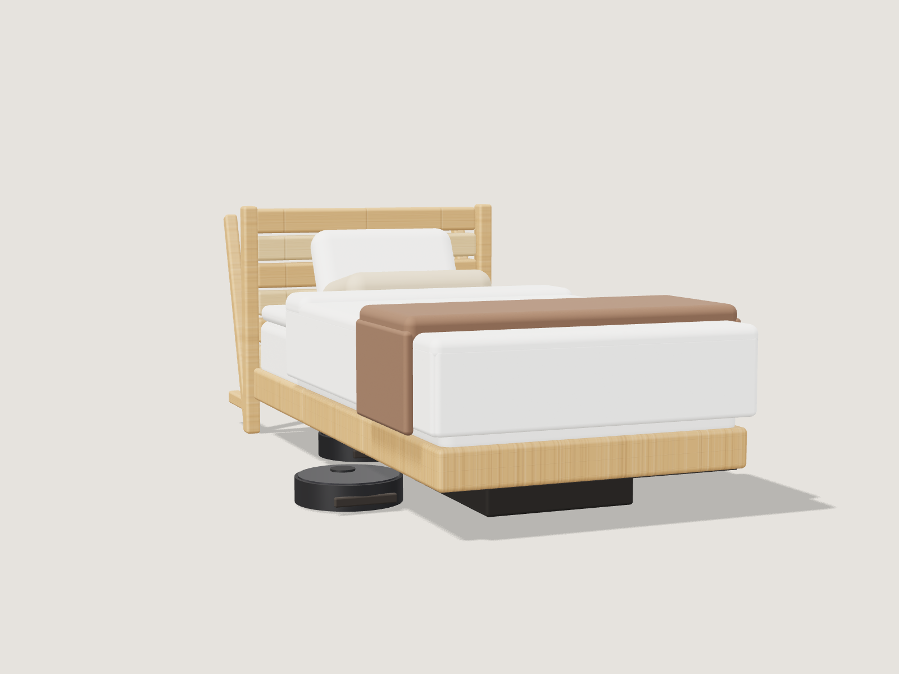 ／ 構造 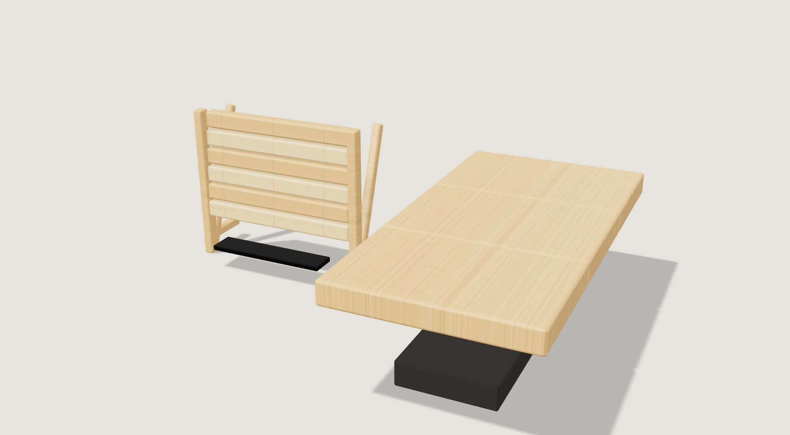

- **名称**: C3-08 構造革新「MITSU」
- **デザインコンセプト**: 「三つの足で、浮かせる。」HBの左右の脚は横から見るとA字（垂直の前脚＋斜めの後ろ脚）で、HBユニットそのものが前後にも倒れない三脚構造になる。本体は「A字のHB2点＋幅500mm の台座1つ」の三角形で支える。HBの面は竹の厚い角材を4段積んだ形で、**最下段の角材が本体の受け梁**を兼ね、ブラケット部品をなくした。
- **ターゲット**: 構造・つくりに納得して買いたい30代の夫婦（家具好き、DIY好き）。
- **解決する課題**: 企画 3-4「端座りで傾かない・転倒しない」、小まとめ③のリスク「中央台座の剛性・転倒」（research）、HBの「ぐらつき」14.3%（§6）。
- **形状**: 外寸 W1056×L2248×H900mm。デッキ天面 236mm、縁の見付け 126mm、床下140mm。角材 944×138×84mm ×4段（目地10mm、段ごとに10mm 後退）、前脚 56×900×70、後ろ脚 50×903×50（奥行き190mm）、下のつなぎ 50×44×200。台座 W500×D640。
- **ヘッドボード仕様**: 型=積み角材4段＋A字脚／高さ=床から900mm／素材=竹集成材（淡色とナチュラルの2トーン、小口の積層を見せる）／機能=もたれ角 約4度（段の後退）、最下段が受け梁／取り付け方式=最下段の角材から出る舌（スチール）の上に本体の頭側を落とし込む（面で受ける、R2）
- **素材**: HB・デッキ=竹集成材、受けの舌・台座=スチール黒
- **CMF**: 淡色竹 #D6B584×ナチュラル竹 #C89C66 の2トーン。炭化竹版も可。Finish=3分艶
- **機能**: 自立する三脚HB、三角形の支持、ブラケットレス。**入れなかった機能**: 布（竹の構造美に集中）
- **競合優位性**: Floyd の「クランプが緩むとHBが外れる」[S23] に対し、HB自体がA字で自立し面で受ける。一般的な中央台座のフローティング [S55] の転倒の不安に、三角形の支持で答える
- **製造方法**: 角材は竹集成材の太物、A字脚はほぞ組み（工場で接着）。工場での部品点数 約38点（ブラケットをなくした分少ない）。量産の注意点: A字の角度精度、角材の反り。**梱包**: 高さ900mm のHBは約106×92×12cm（210cm）で200サイズを超えるため、**上2段の角材を差し込み式にして別梱包**する（ユーザー部品 +1）【推測】
- **開梱〜就寝**: 5動作（基本4＋上段の角材を差す）、約10分【推測】。部品4点・1人
- **梱包**: 3箱。本体箱 約66×102×24cm（192cm）・約24kg（台座 幅500）／HB箱 約106×65×14cm（185cm）・約12kg／上段角材 約98×30×12cm（140cm）・約5kg【推測】
- **想定価格**: S 104,800円。原価率 約40%【推測】
- **デザイン意図**: 根拠: 企画 4-3 の 08「HBの脚と足元台座で三角形に支える配置（台座は1つだけ）」、research 結論5-4「HBの脚を床に着地させる」、切り口7「竹×日本式木組み」（Nectar [S25]）。①の C1-08 SEBONE（背骨）・②の C2-10 HASHIRA（柱と棚）と重ならないよう、**側面のA字**を構造の記号にした。**犠牲にしたもの**: 全長（L2248）と部品数（4点）

## 案C3-09 少し挑戦的「OBI（帯）」

正面 `C3-09-front.png` ／ 側面 `C3-09-side.png` ／ フレーム単体 `C3-09-frame.png` ／ 床下 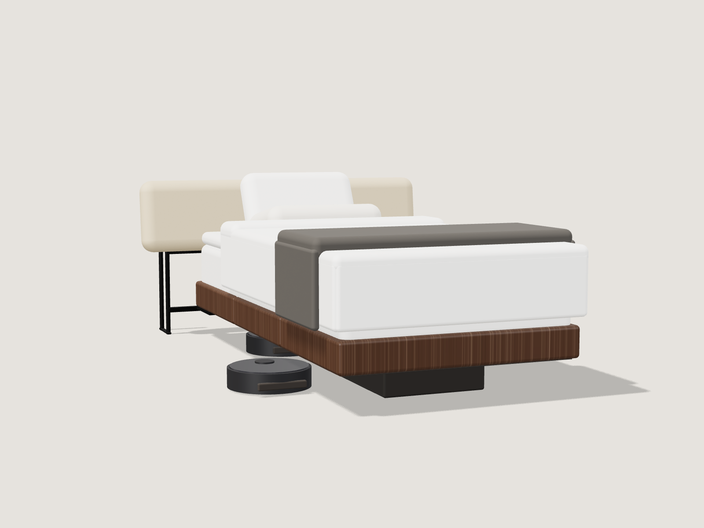 ／ 構造 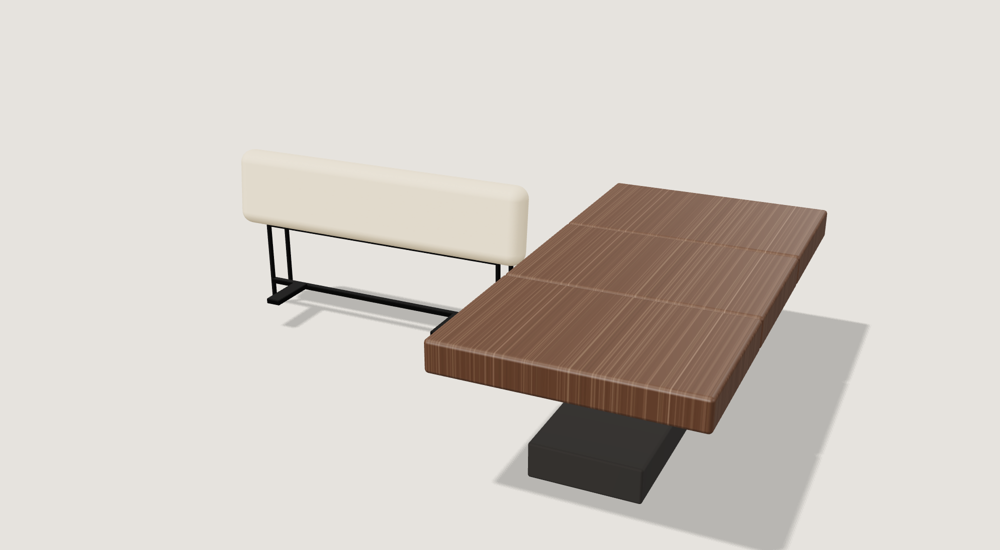

- **名称**: C3-09 少し挑戦的「OBI」
- **デザインコンセプト**: 「壁に帯を一本、ベッドを浮かべる。」崩す常識は「HBはベッドと同じ幅のパネル」。幅1500mm・高さ360mm の横長の布の帯を、黒い細い脚（φ22）で床から430mm の高さに浮かせる。ベッドも床から浮き、部屋の中に“浮いた水平線”が2本だけある。床下には電球色の足元灯を控えめに入れる（色は変えない）。
- **ターゲット**: ギャラリーのような部屋に住む30代の単身者・カップル。家具を“置く”より“線を引く”感覚で選ぶ。
- **解決する課題**: 海外の wall-to-wall HB の流れ [S28] を、国内の部屋に置ける幅（1500mm）に縮める。LED フローティングの「光るだけ」（結論2-6）ではない浮遊感。
- **形状**: 外寸 W1500×L2253×H790mm。デッキ天面 250mm、縁の見付け 130mm、床下150mm。帯 1500×360×130mm・R60、もたれ6度。脚 φ22 の黒いスチール丸棒 ×4（左右それぞれ前後2本、床で細いソリにつなぐ）、帯の下の横梁、本体の受け梁（床から112mm 以上＝ロボット掃除機の上を通る）。足元灯は電球色2700K・人感センサー【推測】。
- **ヘッドボード仕様**: 型=ワイドの帯（横長の浮いたクッション）／高さ=床から790mm（帯の下端430mm）／素材=撥水・防汚ファブリック（オート）、細い脚はスチール／機能=もたれ6度、帯の両端はナイトテーブル代わりのスマホ置き幅（各約25cm）、足元灯／取り付け方式=受け梁の上のブラケット2点に本体を落とし込む。帯は宅配サイズに収めるため **中央で2分割**、くさびで連結【推測】
- **素材**: 本体=炭化竹集成材、帯=布＋ウレタン＋竹合板、脚・梁=スチール黒、足元灯=LED（電球色）
- **CMF**: 炭化竹 #5B3D28×オート #CDBC9F×マットブラック。帯はチャコール・クレイも可
- **機能**: 浮いた帯のHB、足元灯（安全用）、床下150mm。**入れなかった機能**: 色の変わる LED、コンセント
- **競合優位性**: LED フローティング [S54] の「安っぽい・古びる」に対し、光を主役にせず線で浮かせる。国内10万円帯に wall-to-wall の浮いたHBは確認できない【推測】
- **製造方法**: 帯は2分割の竹合板芯＋ウレタン＋縫製。脚はスチール丸棒の溶接フレーム（粉体塗装）。足元灯は既製モジュール（PSE 対応品）。工場での部品点数 約50点。量産の注意点: 細い脚の剛性（もたれ時の揺れ）、帯の2分割の継ぎ目
- **開梱〜就寝**: 5動作（基本4＋帯を連結）、約11分【推測】。部品4点・1人
- **梱包**: 3箱。本体箱 約66×102×24cm（192cm）・約23kg／脚フレーム箱 約128×45×10cm（183cm）・約8kg／帯箱（半分×2）約80×40×30cm（150cm）・約7kg【推測】
- **想定価格**: S 114,800円。原価率 約45%【推測】（09 は許容）
- **デザイン意図**: 根拠: 企画 4-3 の 09「HBのパネルが床から大きく浮き、脚だけが細く見える強い浮遊。電球色の足元灯を床下に控えめに（色変えは NG）」、research §10 の wall-to-wall [S28]。research 結論5 の「ワイドは上位モジュールにとどめる」とは違う方向を取った理由: ③の価値「浮遊感」を最も強く見せる象徴として、1案だけ振り切る。**実現への道筋**: 細い脚の揺れを試作で確認し、揺れる場合は脚をφ28 にする。まずは限定色・直販のみで反応を見る

## 案C3-10 コンセプトモデル「HISASHI（庇）」

正面 `C3-10-front.png` ／ 側面 `C3-10-side.png` ／ フレーム単体 `C3-10-frame.png` ／ 床下 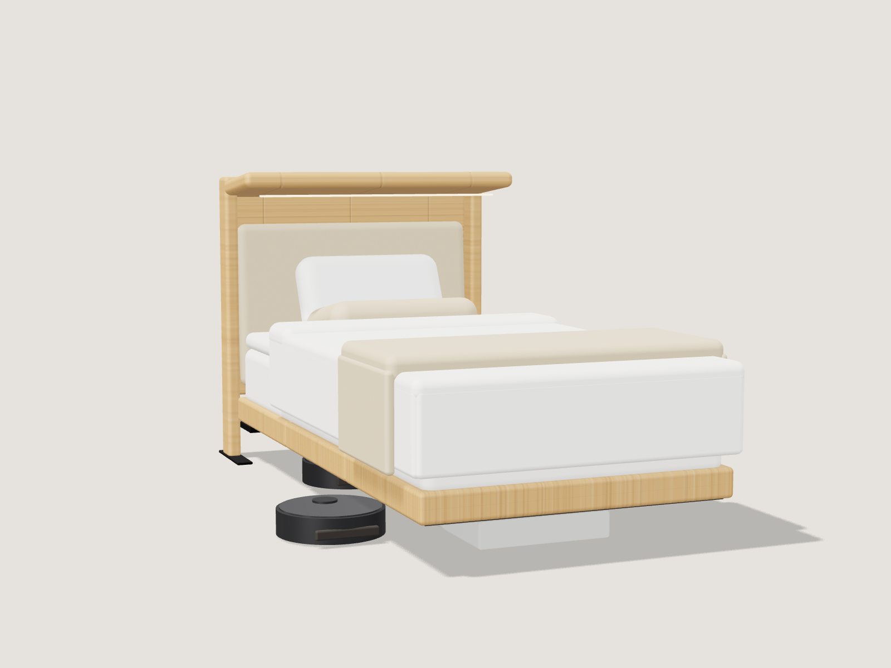 ／ 構造（台座はガラスで、ほぼ見えない）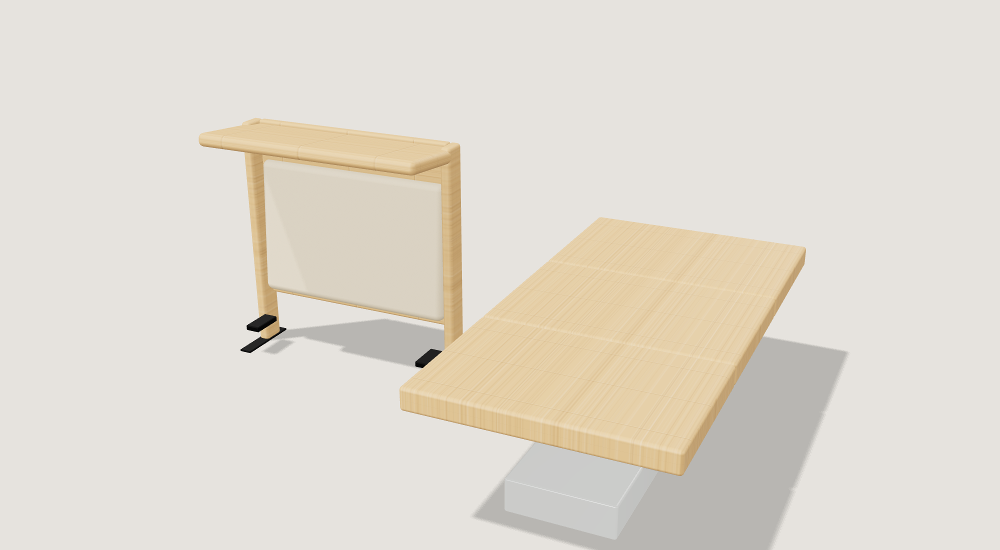

- **名称**: C3-10 コンセプトモデル「HISASHI」
- **デザインコンセプト**: 「ヘッドボードだけで、ベッドを支える。」床から1100mm のHBの上端が、日本家屋の庇（ひさし）のように枕元へ400mm せり出し、その下に読書灯を仕込む。左右の袖は床まで降りる竹のブレードで、頭側の荷重をすべて受ける。足元の台座は透明のガラスブロックで、ほとんど見えない。「HBだけがベッドを浮かせている」という、③の理想像。
- **ターゲット**: ブランドの発信（展示・ポップアップ・ホテルとの協業）。将来の上位ライン。
- **解決する課題**: 「浮くベッド」の象徴。電源・照明を本体に作り込まず、HBの庇に集約（切り口5、research §11）。
- **形状**: 外寸 W1090×L2138×H1122mm（庇の傾き込み）。デッキ天面 220mm、縁の見付け 94mm、床下150mm。袖 50×1100×110mm ×2、背板 980×860×40mm、庇 1080×60×420mm（前へ6度上がる）、内側の布 960×640×70mm（オート）、読書灯（電球色の帯）。台座 ガラス W440×D600。
- **ヘッドボード仕様**: 型=庇つきハイパネル／高さ=床から1100mm（上位のハイバック 100〜110cm）／素材=竹集成材（袖・背板・庇）、撥水・防汚ファブリック（オート）／機能=庇の下の読書灯（調光）、背板裏の電源口・USB-C（P4）、布は外して洗える、もたれ4度／取り付け方式=袖のブラケット2点に本体を落とし込む
- **素材**: 竹集成材、布、強化ガラス（台座）、LED・電装
- **CMF**: 竹ナチュラル×オート #CDBC9F×電球色の光。炭化竹版も可
- **機能**: 庇の読書灯、電源、見えない台座。**入れなかった機能**: 宮棚（庇は棚として使わせない。奥行き400mm の上面は物を置く面にせず、ホコリの面にもしないため、上面を 6度傾けた）
- **競合優位性**: 国内外の10万円帯に、HB一体で照明を持つフローティングは確認できない【推測】。ブランドの“浮き”の象徴として、①②③すべての広告に使える
- **製造方法**: 袖・背板・庇は竹集成材の大判（CNC）、ガラス台座は強化ガラスの接着ブロック（外注）、電装は PSE・電安法の対応が必要。工場での部品点数 約60点。**量産の課題**: HBが1100mm で宅配200サイズに収まらない（大型便・2人配送）、ガラス台座の重量と破損リスク
- **開梱〜就寝**: 6動作、2人・約20分【推測】（コンセプトとして許容）
- **梱包**: 大型便。HB箱 約115×118×20cm（253cm）・約28kg／本体箱 約66×102×24cm・約22kg／ガラス台座箱 約50×66×20cm・約25kg【推測】
- **想定価格**: S 179,800円【コンセプト】。原価率 約50%【推測】
- **デザイン意図**: 根拠: 企画 4-3 の 10「足元台座も見えず、HBだけがベッドを支えているように見える極端な構成」、research 切り口5（電源・照明はHBのモジュール）。①の C1-09 TAKA（ハイバック）・C1-05 NICHE（ニッチ）と重ならないよう、**上端が前へせり出す庇**を型にした。**実現への道筋**: ①庇と読書灯だけを C3-01 の上位モジュールとして先に出す ②ガラス台座は樹脂（アクリル）で軽量化を検討 ③HBを2分割して宅配便に収める

---

## 自己レビュー
評価軸の重み（企画 3-7）: Design 20% ／ Usability 18% ／ Manufacturability 18% ／ Market Fit 16% ／ Originality 10% ／ Brand Fit 10% ／ Cost 8%

### 採点表（レビューで修正した後の点）
| No | Market Fit | Design | Originality | Usability | Manufacturability | Cost | Brand Fit | 加重平均 |
|---|---|---|---|---|---|---|---|---|
| C3-01 TAYUTA | 5 | 4 | 3 | 5 | 4 | 4 | 4 | **4.24** |
| C3-02 SORI | 3 | 4 | 4 | 4 | 5 | 5 | 4 | **4.10** |
| C3-03 TAWARA | 4 | 5 | 4 | 3 | 3 | 3 | 5 | **3.86** |
| C3-04 MAYU | 4 | 4 | 4 | 4 | 3 | 3 | 3 | **3.64** |
| C3-05 KIYORA | 4 | 4 | 4 | 5 | 4 | 4 | 4 | **4.18** |
| C3-06 TATAMI | 3 | 4 | 5 | 4 | 3 | 3 | 5 | **3.78** |
| C3-07 SUTTO | 4 | 3 | 4 | 5 | 4 | 4 | 4 | **3.98** |
| C3-08 MITSU | 3 | 4 | 4 | 4 | 3 | 3 | 4 | **3.58** |
| C3-09 OBI | 3 | 4 | 5 | 3 | 3 | 2 | 3 | **3.32** |
| C3-10 HISASHI | 2 | 5 | 5 | 3 | 2 | 1 | 5 | **3.30** |

採点の理由（1行ずつ）
- **C3-01**: MF5 布張りの王道＋99,800円＋床下全面／D4 整っているが新しさは控えめ／O3 見た目は既存の布HBに近い（新しさは構造）／U5 4動作・洗える・床下130／Mf4 既存工程＋縫製／C4 原価率38%／B4 竹の台で仕立てが見える
- **C3-02**: MF3 静かすぎて10万円の理由が伝わりにくい／D4 反りと浮きの潔さ／O4 反った一枚板の浮くHBは国内にない／U4 布がなくもたれ心地は硬い／Mf5 部品最少（曲げ型1面）／C5 原価率36%／B4 竹の素地
- **C3-03**: MF4 上位の需要は確か、価格は帯の上／D5 俵ロールと炭化竹の柱で最も家具らしい／O4 俵形HBのフローティングは市場にない／U3 3箱・大型の宅配・5動作／Mf3 太い柱と梱包233cm／C3 原価率42%／B5 切り口7を体現
- **C3-04**: MF4 SNS に強い／D4 やわらかく浮く／O4 カプセル形は国内10万円帯に少ない／U4 標準どおり／Mf3 モールドと曲面縫製／C3 原価率40%／B3 竹が脇役
- **C3-05**: MF4 ロボット掃除機の需要（§11）に最も直結／D4 くさびの断面が美しいが正面は控えめ／O4 “ホコリが積もらないHB”は市場にない／U5 床下180・壁際まで掃除・4動作／Mf4 台座の高さ違いだけ／C4 原価率39%／B4 「美しい状態を保つ」の体現
- **C3-06**: MF3 和の好みに限られる／D4 畳縁の2本線が凛とする／O5 畳表のHBは市場にない／U4 拭ける・標準手順／Mf3 畳表の外注・供給ロット／C3 原価率42%／B5 日本発の素材の物語
- **C3-07**: MF4 中心価格＋最短組立／D3 枠とスタンドがやや道具的／O4 自立するイーゼルHBは市場にない／U5 7分・迷わない・片側ずつ洗える／Mf4 既存金具／C4 原価率39%／B4 “手軽さ×格”
- **C3-08**: MF3 構造好きに限られる／D4 積み角材の小口が美しい／O4 A字の三脚HBは新しい／U4 自立・剛性は高いが部品4点／Mf3 A字の精度・梱包で分割／C3 原価率40%／B4 竹の木組み
- **C3-09**: MF3 置ける部屋が限られる／D4 水平線の強い印象／O5 浮いた帯のHBは市場にない／U3 3箱・連結あり・細い脚の揺れ／Mf3 細い脚の剛性・電装／C2 原価率45%（09 は許容）／B3 竹が脇役
- **C3-10**: MF2 すぐには売らない／D5 庇の造形と見えない台座／O5 HBだけで浮く構成／U3 2人・20分／Mf2 大型便・ガラス／C1 原価率50%／B5 ブランドの将来像

### やり直しの基準の確認
- 01〜08 で Market Fit・Manufacturability・Cost が2点以下の案: **なし**（修正後）
- Usability 2点以下: なし ／ Originality 2点以下: なし
- C3-09（Cost 2）・C3-10（Mf2・C1・MF2）は 09・10 の許容範囲。理由と実現への道筋は各案の製造方法・デザイン意図に記載

### 各案の講評（1〜2行）
- **C3-01**: 最も外さない入口。布の顔を P2 規格にしたので、②の顔とも共有できる。
- **C3-02**: エントリー価格として有効。反りの精度が商品の質を決めるので、試作で最初に確認する。
- **C3-03**: 格は最上。梱包（柱1000mm）の解決が前提。柱を2分割する継手の検討を STEP 5 以降に。
- **C3-04**: 流行の形でSNSに強い。C3-01 の替えの顔（カプセルの布パネル）として出す手もある。
- **C3-05**: ③のコンセプト「掃除が楽」を最も正直に形にした。寝面の高さ（54cm）を130mm 台座の選択で逃がす。
- **C3-06**: 素材の物語は最強。畳表の調達先と耐久（擦れ）の確認が前提。
- **C3-07**: 組立の体験は最良。見た目の道具感は、枠の見付けを細くして仕上げで詰める。
- **C3-08**: 剛性と構造の説得力。部品4点・全長2248mm が弱点。
- **C3-09**: 話題性は最大。まず限定色・直販で反応を見る。
- **C3-10**: 量産案ではなく、展示と将来の上位ラインの旗。

### レビューで修正した点
| 案 | 軸 | 修正前→後 | 何を変えたか |
|---|---|---|---|
| 全案 | Manufacturability | 2→3〜5 | 当初はHBユニットを脚ごと1本物にしており、HB箱（例: 106×88×18cm＝212cm）が宅急便200サイズを超えた。**脚の下半分と床足を折りたたみ式**にし（開くとロック・緑の目印）、HB箱を約182〜199cm に収めた。収まらない C3-03・08・09・10 は各案に分割・大型便を明記し減点 |
| C3-01 TAYUTA | Design | 3→4 | 初回はHBがオフホワイトで枕と同化し、HBが読めなかった。グレージュ #CFC5B5 に替えた |
| C3-02 SORI | Design | 3→4 | 初回は細い短冊31枚で反りを作り、竹の木目が格子状に見えた（タイル・すのこ風）。13枚・厚み40mm にして一枚板らしく見せた |
| C3-03 TAWARA | Design | 3→5 | 初回はロールの丸い端部が柱にめり込んでいた。ロール長を990→860mm にして柱の内側に収め、ブークレをアイボリーからラテに替えて枕と区別、柱の外に出る床足を280→200mm に短くした |
| C3-04 MAYU | Design | 3→4 | 初回はカプセルの中央の箱と両端の円の継ぎ目が段差になり、形が崩れていた。「全厚の芯＋一回り大きい薄い外周」の2層にして、面取りのような丸みにした |
| C3-05 KIYORA | Design／Originality | 3→4、3→4 | 初回は斜めの笠木が枕の上に浮いた庇のように見え、C3-10 と似ていた。布パネルが上端で背板に接する**くさび形**＋丸い竹の鼻に作り直し、平らな天端のない形をはっきりさせた |
| C3-06 TATAMI | Originality | 3→5 | 初回は炭化竹の四角い枠の中に畳を入れた形で、①の C1-08 SEBONE（竹の枠＋クッション）に似ていた。枠をなくし、厚み60mm の“畳一枚”を立て、長手にだけ畳縁を通した。脚は裏に隠した |
| C3-07 SUTTO | Manufacturability／Usability | 3→4、4→5 | 初回は後ろのスタンドの回転方向が逆で、上端が前脚から離れて浮いていた（ピボットがない）。ピボットを前脚の床から700mm に置き直し、奥行きも250→130mm に縮めて全長を抑えた |
| C3-08 MITSU | Design | 3→4 | 初回は後ろ脚が前脚から離れて浮き、6段の薄い角材がすのこのように見えた。A字をピボットでつなぎ、角材を4段・厚み84・R22 の太物にした |
| C3-09 OBI | Manufacturability | 2→3 | 初回は自立用の床足がベッドの外に黒い板として見え、本体の受けと脚がつながっていなかった。脚を前後2本×左右にして細いソリでつなぎ、床から112mm 以上の受け梁を追加した |
| C3-10 HISASHI | Design | 4→5 | 初回は読書灯の帯が庇の前に浮いていた。庇の下面に収めた |
| 床下・構造カット（全案） | — | — | 初回はロボット掃除機がベッドの陰に隠れて見えなかった。1台を床下、1台を側面から半分入る位置に置き直した。分解図は本体がHBを隠していたため、HBユニットを左手前、本体と台座を右に並べ直した |

### 推奨上位3案とその理由
1. **売れる確率が最も高い: C3-01 TAYUTA（4.24）** — 中心価格 99,800円で、10万円帯の売れ筋（もたれられる布張りHB）の成功要因をそのまま押さえ、「床下が全面空く」「1人・工具0・9分」「洗える」を足した。EC のサムネイル1枚でホテルのベッドに見え、床下カットで③の価値が伝わる。
2. **差別化が最も強い: C3-05 KIYORA（4.18）** — 床下180mm と“ホコリが積もらない”くさび形のHBで、③の格「美しい状態を保つ」を数値と形の両方で語れる唯一の案。ロボット掃除機メーカーとの共同企画（企画 3-5）とも最も相性がよい。
3. **ブランド価値を最も高める: C3-03 TAWARA（3.86、Design 5・Brand Fit 5）** — 炭化竹の柱とブークレの俵ロールで、飛騨・カリモクと並ぶ格を「浮いて、床下まで清潔」な形で出せる。梱包の解決が条件。
- 次点: C3-02 SORI（4.10。エントリー価格として）、C3-07 SUTTO（3.98。組立体験の要素は C3-01 に移植できる）、C3-06 TATAMI（3.78。素材の物語として限定展開）

## ユーザーに判断してほしいこと
1. **③の主力**: 「C3-01 TAYUTA（王道の布パネル）」と「C3-05 KIYORA（清掃性の数値を最大化）」のどちらを主力にするか（もう一方は色・台座の選択肢として併売可能）
2. **床下の標準**: 130mm（寝面 約50cm）を標準にし 180mm を選択式にするか、KIYORA のように 180mm を標準にするか（寝面が54cm に上がる）
3. **上位モデルの方向**: 俵ロールの格（C3-03）／畳の素材（C3-06）／庇の照明（C3-10）のどれを上位の軸にするか
4. **梱包の許容**: 床から1000mm 以上のHB（C3-03・10）は宅急便200サイズに収まらない。上位だけ大型便（2人配送）を許容するか、柱を2分割する設計を優先するか
5. **全長**: HBの脚・スタンドの分、全長が 2140〜2250mm になる（企画 0-6 の目安 205〜210cm より 4〜15cm 長い）。この範囲を許容するか、HBの奥行きを詰める設計を優先するか
6. **C3-09 OBI**: 幅1500mm の帯を③のラインナップに入れるか、限定企画に留めるか

## 前提・仮説・未確認事項
- 【推測】寸法は3D モデル上の値、重量・所要時間・原価率・梱包3辺は既存の折りたたみバンブーベッド（約20.5kg [S1]）からの推定。試作で実測して確定する（research 検証方法1）
- 【推測】端座りの安定（足元の角100kg で傾かない）は、頭側2点＋台座の支持と寝具・本体の重量（約70kg）を含めた重心の概算。**試作での転倒試験が必須**。特に台座幅420mm の C3-02
- 【推測】HBの脚の折りたたみヒンジ・くさび2点が、もたれ80kg×5,000回（R6）でガタ・異音なく持つかは未検証。特に C3-04 の細い丸脚、C3-09 の細いスチール脚、C3-07 のスタンドのピボット
- 【推測】和紙畳表（C3-06）の「カビ・ダニが発生しにくい」は一般的な製品特性として書いた。採用する畳表の試験データで確認が必要。調達先も未確認
- 【推測】足元灯・読書灯（C3-09・10）は PSE・電安法の対応が必要
- 【未確認】既存の折りたたみバンブーベッド（t-fdbb）の本体下面に台座ソケットを追加できるか（社内データ）
- 全長 2140〜2250mm は企画 0-6 の目安を超える。HBの奥行き（脚＋もたれ角）を詰める余地は試作で確認する
- 3D レンダーは形・構造・CMF を伝えるためのもので、布のしわ・竹の積層・畳の目の細部は簡略化している。質感は画像生成AI用プロンプト（`prompts/03-design-image-prompts-c3-v2.md`）で補う

## 次工程（A3プレゼンボード）への申し送り
- メインは `C3-XX-three-quarter.png`（HBが見える寝具ありの構図）。③の価値は **`-underfloor.png`（床下のロボット掃除機）** と **`-structure.png`（HBユニット・本体・台座の3部品）** で伝える。各ボードにこの2枚を必ず入れてほしい
- 形の比較は `contact-sheet.png`（フレーム＋HB単体）。KIYORA はくさび形が `-side.png` で最もよく分かる
- 組立の4動作（HBを立てる→本体を横倒しで開いて台座を差す→倒して落とし込む→マットレス）は全案共通なので、図解は1種類で10案に使える。C3-07 はスタンドを開く動作を加える
- 数値（床下・全長・梱包・価格）は本文の各案の値を使う。【推測】の表記を残すこと
- 画像に日本語は入れていない（案番号と欧文の仮称だけ contact-sheet に記載）
