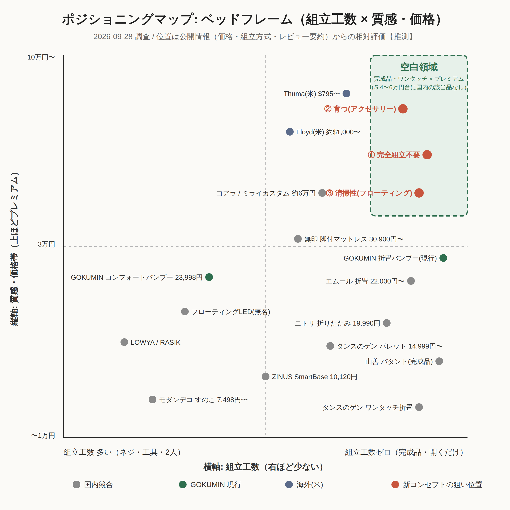

# 市場リサーチ: GOKUMIN フラッグシップベッド（3コンセプト横断）
- プロジェクト: gokumin-flagship-bed ／ 作成: market-researcher ／ 調査日: 2026-09-28
- 凡例: 【調査】=出典で確認した事実 ／ 【推測】=調査からの解釈 ／ 【未確認】=確認できなかったこと
- 入力: `research/00-input.md`、`brief.md`、`_studio/brand.md`、`_studio/preferences.md`、依頼文 `prompts/01-research-market-researcher-v2.md`
- 生データ: `research/notes/`（access-log / gokumin-own / ranking / reviews / competitors / cleaning-floating / logistics / overseas / sns-trends）

> **調査方法の制約（最初に読んでください）**
> この環境では gokumin.co.jp・楽天・Amazon・Yahoo!・価格.com・マイベスト等のページを **直接開けなかった**（WebFetch は EGRESS_BLOCKED、curl は接続不可。`notes/access-log.md`）。
> そのため、情報はすべて **WebSearch の検索結果スニペット**（検索エンジンがページ本文から抜き出した要約）から集めた。出典の URL は、スニペットのもとになったページ。
> レビュー集計は、個々のレビューを数えたものではなく、「商品ごとのレビュー要約（13単位）のうち、何単位でその論点が出たか」を数えたもの。割合は傾向をつかむ目安として扱うこと。

---

## エグゼクティブサマリー
1. 【調査】売れ筋の中心は 1万円未満のすのこ・折りたたみベッド。楽天ベッドフレーム1位は 7,498円〜で、レビューは6,000件超・平均4.29 [S7]。完成品のワンタッチ折りたたみベッドも累計19万台・レビュー6,740件ある [S9][S10]。
2. 【調査】購入理由で最も多いのは「組立が簡単・不要」（13単位中8）。不満で最も多いのは「きしみ・ぐらつき」（13単位中6）で、その半数はネジや金具の緩みが原因 [notes/reviews.md]。
3. 【推測】国内には「完成品・ワンタッチ × プレミアム（シングル 4〜6万円台）」の商品が見当たらない。米国では工具不要の高価格ベッド（Thuma $795〜、Floyd 約$1,000〜）が確立したジャンルになっている [S45][S46]。
4. 【推測】勝ち筋は「**開くだけ・ネジゼロ・きしまない**」を共通の土台にすること。そのうえで ①重い THE GOKUMIN（約26kg）を支える剛性、②工具なしで足せる共通レール、③脚をワンタッチで付け替えて床下12cm以上を確保、でフラッグシップの格をつくる。
5. 【推測】価格はシングル本体 39,800〜54,800円（税込）が目安。現行の竹ベッド（23,998円）[S6] とコアラ（約6万円）[S18] の間に入る。

## 調査の前提と仮説
- 調査範囲: 【調査】国内 EC（楽天・Amazon.co.jp・Yahoo!・価格.com・メーカー直販）のベッドフレーム、折りたたみベッド、脚付きマットレス、フローティングベッド。海外は米国 DTC と Amazon.com、TikTok。取得日はすべて 2026-09-28。
- 前提となる自社商品: 【調査】折りたたみバンブーベッド（2026-07-09 発売）。シングル 展開時 W195×D97×H28cm、折りたたみ時 97.5×97×16cm、約20.5kg、耐荷重約200kg（実測値で保証値ではない）、工具不要の完成品 [S1]。
  - 【未確認】価格、レビュー、品番 t-fdbb-s-na-01 と同じ商品かどうか（公式ページを開けなかった。名称・発売時期から同じ商品と【推測】）。
- 最初に立てた仮説
  - **H1**: この市場で売れているのは「安さ」よりも「組立の手間が少ないこと」が決め手になっているからではないか
  - **H2**: 高価格帯（3万円以上）で「組立不要」を強みにした商品が少なく、空白になっているのではないか
  - **H3**: ベッド下の掃除（ロボット掃除機が入るか）は購入時の判断材料として広がっているが、脚の高さをワンタッチで変えられる商品は少ないのではないか

---

## 1. 市場の主要ブランド
| 区分 | ブランド | 立ち位置 | 根拠 |
|---|---|---|---|
| EC 低価格すのこ | モダンデコ | 楽天ベッドフレーム デイリー1位（2026-09-24） | 【調査】[S7] |
| EC 総合家具 | タンスのゲン | ワンタッチ折りたたみ（累計19万台）、パレットベッド、宮棚ベッドが上位 | 【調査】[S7][S8][S9][S10] |
| 量販 | ニトリ、アイリスオーヤマ、山善 | 折りたたみベッドの定番。ニトリは工具不要の「Nクリック」を持つ | 【調査】[S15][S16][S57][S58] |
| 生活雑貨 | 無印良品 | 脚付マットレス（脚高12/20/26cm、脚は M8 ねじ規格で交換できる） | 【調査】[S14] |
| DTC 寝具 | コアラ、ZINUS、エムール、GOKUMIN | マットレス発のブランドがフレームも売る | 【調査】[S17][S18][S20][S3] |
| EC インテリア | LOWYA、RASIK | デザイン性の高い組立式 | 【調査】[S21][S22] |

- 【調査】GOKUMIN は Amazon.co.jp Seller Award 2023 で最高賞を受け、累計販売数は160万個 [S3]。
- 【推測】ベッドフレームはブランドへの指名買いより「価格×レビュー件数」で選ばれている。上位はレビュー数千件の EC 専業ブランドが占める（S7, S9 より）。

## 2. 売れ筋商品
- 【調査】楽天ベッドフレーム1位: モダンデコ すのこベッド、7,498円〜、レビュー6,000件超・4.29 [S7]
- 【調査】楽天折りたたみベッド: 極厚桐すのこ（4,980円〜）、ロール式桐すのこ（5,999円〜・2,588件）、リクライニング マット付き（13,780円・572件）、タンスのゲン ワンタッチ（耐荷重300kg・6,740件）が上位 [S9]
- 【調査】タンスのゲン ワンタッチ折りたたみ: 外寸 W98×D208×H45cm、折りたたみ時 W98×D45×H110cm、18.2kg、キャスター付き、4色 [S10]
- 【調査】楽天ローベッド上位: タンスのゲン パレットベッド「お掃除ロボ対応」14,999円〜・535件 [S8]。ベッド下は11cm [S65]
- 【調査】Amazon.co.jp ベッドフレーム売れ筋には、宮棚＋2口コンセント＋引出し、ZINUS SmartBase 折りたたみ、山善 折りたたみ（完成品・耐荷重200kg）が並ぶ [S12]
- 【推測】売れ筋の共通点は「すのこ（通気）」「折りたたみ・完成品」「宮棚・コンセント」「ロボット掃除機対応」の4つ。

## 3. 価格帯
【調査】国内の主要19商品のシングル（または最低価格サイズ）の価格。出典は各行（詳細は notes/competitors.md、ranking.md）。

| 価格帯（税込） | 件数 | 割合 | 該当例 |
|---|---|---|---|
| 〜9,999円 | 7 | 36.8% | 桐すのこ 4,980 [S9]、二つ折りすのこ 5,999 [S9]、ロール桐 5,999 [S9]、タンスのゲン ワンタッチ 約7,000 [S28]、モダンデコ 7,498 [S7]、宮付きすのこ 8,900 [S7]、RENEW 9,999 [S7] |
| 10,000〜19,999円 | 6 | 31.6% | ZINUS 10,120 [S20]、宮棚パイプ 12,499 [S8]、リクライニング 13,780 [S9]、パレット 14,999 [S8]、ニトリ 折りたたみ 19,990×2 [S57] |
| 20,000〜39,999円 | 4 | 21.1% | エムール 22,000〜 [S17]、GOKUMIN コンフォートバンブー 23,998 [S6]、無印 脚付 30,900〜 [S14]、GOKUMIN 収納タイプ 35,880 [S6] |
| 40,000円〜 | 2 | 10.5% | コアラ ミライカスタム SD 59,900 [S19]、コアラ S 約60,000 [S18] |

| 指標 | 値 |
|---|---|
| 最安 | 4,980円 |
| 中央値 | 13,780円 |
| 最高 | 約60,000円 |

- 【推測】ランキング上位の約7割は2万円未満。4〜6万円台の「組立不要・完成品」は、国内の標本に1件もない（S7, S9, S18, S19 より）。
- 【調査】参考として、THE GOKUMIN 系のマットレスはデュアルコイル 25cm が 72,698円（Yahoo!）[S5]。AirZERO はシングル 26,800円 [S2]。
- 【推測】7万円クラスのマットレスを買う人にとって、フレームが1万円前後だと見劣りする。マットレスの5〜7割程度（4〜5万円）がセット購入の許容範囲と考えられる。

## 4. ECランキング
| チャネル（取得日） | 順位 | 商品 | 価格 | レビュー | 出典 |
|---|---|---|---|---|---|
| 楽天 ベッドフレーム デイリー（2026-09-24 更新、2026-09-28 取得） | 1位 | モダンデコ すのこベッド | 7,498円〜 | 6,000件超・4.29 | 【調査】[S7] |
| 同上 | 上位 | タンスのゲン RENEW 宮棚・高さ3段・コンセント | 9,999円〜 | 356件 | 【調査】[S7] |
| 楽天 ローベッドタグ | 上位 | タンスのゲン パレットベッド お掃除ロボ対応 | 14,999円〜 | 535件 | 【調査】[S8] |
| 楽天 金属フレームタグ | 上位 | USB＋2口コンセント 2段宮棚パイプベッド | 12,499円〜 | 1,427件 | 【調査】[S8] |
| 楽天 折りたたみベッド（2026-09-28 取得） | 1位付近 | 極厚4cm 桐すのこ／ロール式桐すのこ | 4,980円〜／5,999円〜 | 204件／2,588件 | 【調査】[S9] |
| 同上 | 3位 | 折りたたみ 14段リクライニング マット付き | 13,780円 | 572件 | 【調査】[S9] |
| 同上 | 4位 | タンスのゲン ワンタッチ 耐荷重300kg | 【未確認】 | 6,740件 | 【調査】[S9] |
| Yahoo! 折りたたみベッド（2026-09-08 更新） | 上位 | 耐荷重300kg キャスター付きすのこ、コンパクトローベッド、リクライニング マット付き | 【未確認】 | 【未確認】 | 【調査】[S11] |
| Amazon.co.jp ベッドフレーム売れ筋 | 掲載 | 宮棚＋コンセント＋引出し、ZINUS SmartBase、山善 折りたたみ 200kg | 【未確認】 | 【未確認】 | 【調査】[S12] |
| 価格.com ベッド 折りたたみ（2026年9月） | — | — | — | — | 【未確認】ページは存在するが中身を取得できず [S13] |

- 【未確認】Amazon と Yahoo! の正確な順位・価格（ページを直接開けず、スニペットにも出なかった）。

## 5. Amazon等のレビュー
- 【調査】取得できた平均評価: モダンデコ 4.29（6,000件超）[S7]、ZINUS 日本の全商品計 4.27（2万件超）[S20]、米 Amazon Basics 折りたたみ 4.7 [S43]
- 【未確認】★1〜★5 の分布はどの商品も取得できなかった（Amazon・楽天のレビューページを開けず、スニペットにも出なかった）
- 代表的なレビューの要約
  - 【調査】高評価: 「女性1人で1時間かからず完成」「体重のある夫が寝返りしてもきしまない」（モダンデコ）[S24]。「値段の割に頑丈」（タンスのゲン）[S10]。「耐荷重500kgは伊達じゃない」（エムール）[S17]。「7〜30分で工具なしで組める」（コアラ）[S18]
  - 【調査】低評価: 「ネジや脚が緩む・穴が合わない・説明書が分かりにくい」（モダンデコ）[S24]。「中央が沈む・安っぽい」（ZINUS）[S20]。「ギシギシ鳴る・重い」（コアラ）[S18]。「金具が緩い・たわむ・ささくれ」（パレット）[S25]

## 6. ユーザーの不満
【調査】13商品のレビュー要約を集計（延べ35言及）。出典は notes/reviews.md（S17, S18, S20, S21, S22, S24, S25, S26, S27, S28, S55, S59 ほか）。

| 分類 | 言及単位 | 単位比（/13） | 言及比（/35） | 代表例 |
|---|---|---|---|---|
| きしみ・ぐらつき（ネジ緩み含む） | 6 | 46% | 17.1% | 半年で鳴る、ボルト緩み、ゆらゆら |
| 組立の手間・精度 | 5 | 38% | 14.3% | 穴が合わない、説明書、パーツ多い、フェルト貼り |
| 重い | 5 | 38% | 14.3% | 女性1人で困難、折りたたみが重い |
| 寝心地 | 5 | 38% | 14.3% | すのこ硬い、マット薄い、中央沈み、たわみ |
| 質感・仕上げ | 5 | 38% | 14.3% | 安っぽい、ささくれ、ムラ、高級感なし |
| 耐久性の不安 | 4 | 31% | 11.4% | ネジ山が脆い、消耗 |
| 匂い | 2 | 15% | 5.7% | ウレタン臭 |
| 冷え／価格／床下に入らない | 各1 | 各8% | 各2.9% | — |

- 【調査】きしみ・ぐらつき6単位のうち3単位は、原因がネジ・金具の緩みと明記されている [S24][S25][S55]
- 【推測】ネジを減らすと、組立の手間（14.3%）ときしみ（17.1%）の両方を同時に減らせる可能性がある。「ネジゼロ」は利便性だけでなく品質の約束にもなる。
- 【調査】参考: ベッドフレームを通販で買った人のうち不満があるのは約12%。通販購入の経験者は約21% [S29]。
- 【調査】家具の組立設置サービスは1点2,000〜10,000円が相場で、ベッドは5,500円〜が中心 [S54]
- 【推測】組立の負担は、有料サービス代として5,000円前後の価値がある。

## 7. ユーザーの購入理由
【調査】13単位を集計（延べ34言及）。出典は notes/reviews.md。

| 分類 | 言及単位 | 単位比（/13） | 言及比（/34） |
|---|---|---|---|
| 組立が簡単／不要 | 8 | 62% | 23.5% |
| 頑丈・静か（きしまない・耐荷重） | 7 | 54% | 20.6% |
| デザイン・部屋になじむ | 4 | 31% | 11.8% |
| 価格・コスパ | 3 | 23% | 8.8% |
| 通気性・掃除しやすさ | 3 | 23% | 8.8% |
| 省スペース・移動・折りたたみ | 3 | 23% | 8.8% |
| 機能（リクライニング・立ち上がり） | 3 | 23% | 8.8% |
| 拡張・連結 | 2 | 15% | 5.9% |
| 寝心地 | 1 | 8% | 2.9% |

- 【調査】別の裏付けとして、ベッド選びで最も重視する点は「デザイン」50.8%、「収納機能」12.3%、「色」「素材」各約7.4%（RASIK、20〜50代100名、2024年8月）[S23]
- 【推測】「組立が簡単」と「頑丈・静か」の2つで購入理由の約44%（23.5%＋20.6%）を占める。アンケートの第1位はデザイン。つまり、組立不要と頑丈さを満たしたうえで、デザインで選ばれる構図になっている。

## 8. 素材トレンド
- 【調査】上位商品の素材は、桐すのこ（タンスのゲン等）、パイン（パレット、コアラ ミライカスタム）、スチール＋木（ZINUS、GOKUMIN コンフォートバンブー）、ひのき（エムール） [S10][S19][S20][S6][S17]
- 【調査】竹: 世界の竹製家具市場は 2025〜2032年に年平均9.4%成長の予測 [S51]。GOKUMIN は竹について「一般の木材の約2〜3倍の強度」「抗菌」と訴求している [S6]
- 【調査】海外の高価格帯は無垢材＋日本式の継手（Thuma）、合板＋スチール（Floyd）[S45][S46]
- 【推測】GOKUMIN の竹はすでに持っている素材資産。フラッグシップでは「竹集成材＋スチール芯」で、見た目の温かさと剛性の両方を取るのが妥当。
- 【推測】デザイン上は、桐・パインの「安いすのこ」と見分けがつくよう、竹の縁（小口）の積層を見せる・面取りを大きくする、などで質感の差をはっきり出すべき。

## 9. カラートレンド
- 【調査】Pantone Color of the Year 2026 は「Cloud Dancer（11-4201）」。1999年以降で初めて白が選ばれた [S49]
- 【調査】2026年の国内の内装は、オフホワイトやグレージュの壁、グレー×ブラウン、曲線的な家具が注目されている [S50]
- 【調査】上位商品の色展開: タンスのゲンはブラウン／ナチュラル／ブラック／グレー [S10]、GOKUMIN コンフォートはウォールナット [S6]、ZINUS はブラック／ホワイト [S20]、Burrow は Oak／Walnut＋布3色 [S47]
- 【推測】定番は「ナチュラル竹」と「ウォールナット調」の2色。フラッグシップの差別化色には、Cloud Dancer に合う「オフホワイト脚＋ナチュラル竹」や「チャコール」を加える。
- 【推測】LED で光る演出は流行りの要素で古びやすい、という論評がある（S41）。照明は色を変える演出ではなく、電球色の足元灯程度に抑えるのが安全。

## 10. 形状トレンド
- 【調査】ヘッドボードのない（ヘッドレス）すのこ、ローベッド、連結できるパレットベッドが SNS で話題になっている [S22]
- 【調査】海外では、脚が見えず中央の台座で支える「フローティングベッド」が再流行している [S40][S41]
- 【調査】国内でも「浮いてるベッド／空中ベッド」の商品がある（脚10本、人感センサーライト付き）[S42]
- 【調査】全高: 現行の GOKUMIN 折りたたみ 28cm [S1]、無印 脚付き 脚12〜26cm [S14]、コアラ ミライ 15.8〜35.3cm の3段階 [S19]、LOWYA 31/36/41cm の3段階 [S21]
- 【推測】「低く・薄く・浮いて見える」が主流。高さを変えられることが当たり前になりつつある。
- 【推測】THE GOKUMIN（25〜28cm）を載せると寝面が高くなりやすい。フレームの天面は 20〜25cm に抑えるのが望ましい（notes/gokumin-own.md）。

## 11. 機能トレンド
- 当たり前になった機能: 【調査】宮棚・コンセント・USB（楽天上位に多数）[S7][S8]、高さ調節（3段階）[S7][S19][S21]、ロボット掃除機対応 [S8][S19]
- 増えている機能: 【調査】工具不要の組立（コアラ・ニトリ Nクリック・Thuma・Burrow）[S18][S58][S45][S47]、後付けアクセサリー（Floyd: ヘッドボードは3段の高さ、サイドテーブルは最大20lb、ベッド下収納）[S46]、連結・拡張 [S22]
- 過剰な機能: 【推測】LED の色変え演出（S41）、耐荷重1000kg のような過剰な数字（S42）。数字の大きさより「きしまない」という体験が評価されている（S17, S24 より）。
- 【調査】楽天で「ベッド 棚 後付け」は6,006件、「ベッドサイド 棚」は65,241件 [S61]
- 【推測】後付けの需要は大きい。一方で「すのこベッドには付けられない」という相性問題がある（S61 のスニペットより）。**フレーム側が共通規格を持っていないことが、後付け市場の不満の根になっている**。

## 12. 海外市場
- 【調査】Amazon Basics 折りたたみ金属フレーム: 工具不要で開いてロックするだけ、Queen $94.49、★4.7、「10分未満で設置」というレビューが多い [S43]
- 【調査】米 Amazon の折りたたみフレーム上位品は推定で月1万台（推定値）[S44]
- 【調査】Thuma: 日本式継手で工具不要、5〜20分で組立、Twin $795〜、Queen $1,195。組立体験が最大の競争優位とされる [S45]
- 【調査】Floyd: 工具不要。パネルを足して Twin→Queen→King に拡張できる。ヘッドボード、サイドテーブル、ベッド下収納のアドオンがある。「最も売れたモジュラーベッド」（自社の表記）[S46]
- 【調査】Burrow Chorus: 工具不要で20分未満。ヘッドボードを付ける・替える・外すを選べる [S47]
- 【調査】IKEA のくさび形ダボ（wedge dowel）: 工具不要で組み直しができ、組立時間を50〜80%短縮（テーブルが24分→3分）[S48]
- 【調査】Kickstarter: MOTTRESS（モジュラー式で持ち運べるベッド）がある [S63]
- 【未確認】2025年に大型の支援を集めた工具不要ベッドフレームの案件は見つからなかった
- 【推測】日本にまだ来ていない流れは2つ。「日本式継手」が米国で高価格 DTC の象徴になっていること（本家の日本にはこの訴求の商品が少ない）と、Floyd 型の「フレームにアドオンを足していく」システム。

## 13. SNSトレンド
- 【調査】SNS で話題になったベッドは、脚付きすのこ（通気・掃除しやすい）、耐荷重が大きい（家族で寝られる）、連結できるローベッド [S22]
- 【調査】TikTok（国内）では、圧縮マットレスの開封、開封の失敗、「タンスのゲン ベッド 組み立て方」、ネジなしで3分組立の動画が見られる [S52]
- 【調査】TikTok（海外）では、LED 付きフローティングベッドと、その長所・短所を語る投稿がジャンルになっている [S41]
- 【調査】RoomClip には「すのこベッド×ロボット掃除機」専用のタグページがある [S53]
- 【未確認】Instagram・TikTok のハッシュタグ投稿数（instagram.com を開けず、スニペットにも件数が出なかった）
- 【推測】投稿の型は3つ。①「箱から出して◯秒で完成」の時短動画、②「ベッド下をロボット掃除機が抜ける」動画、③「浮いて見える寝室」の写真。デザインは、この3つが自然に撮れる形にするべき。

## 14. 競合商品のメリット
| 競合 | 支持されている点 | 出典 |
|---|---|---|
| モダンデコ すのこ | 7,498円〜の安さ、女性1人で1時間未満、きしみにくい | 【調査】[S7][S24] |
| タンスのゲン ワンタッチ折りたたみ | 完成品、耐荷重300kg、キャスター付き、値段の割に頑丈、18.2kg | 【調査】[S9][S10] |
| タンスのゲン パレット | 軽い、デザイン、ロボット掃除機対応（床下11cm）、拡張できる | 【調査】[S8][S25][S65] |
| エムール 折りたたみ | 耐荷重500kg、きしまない、寝心地、組立不要 | 【調査】[S17] |
| 無印 脚付マットレス | 脚高を3種から選べる、脚は後から交換できる（M8）、カバーを洗える | 【調査】[S14] |
| コアラ ベッドフレーム／ミライカスタム | 工具不要で7〜30分、120日返品・5年保証、高さ3段階、ロボット掃除機対応 | 【調査】[S18][S19] |
| ZINUS SmartBase | 10,120円、9.6kg、折りたたみ | 【調査】[S20] |
| Floyd（米） | 工具不要、サイズ拡張、アドオンのシステム | 【調査】[S46] |

## 15. 競合商品のデメリット
| 競合 | 不満・弱点 | 出典 |
|---|---|---|
| モダンデコ すのこ | ネジ・脚が緩む、穴が合わない、説明書が分かりにくい、仕上げのムラ | 【調査】[S24] |
| タンスのゲン ワンタッチ | きしみ、すのこが硬い | 【調査】[S28] |
| タンスのゲン パレット | 金具の緩み、たわみ、ささくれ、フェルト貼りが面倒 | 【調査】[S25] |
| エムール 折りたたみ | 重い | 【調査】[S17] |
| 無印 脚付マットレス | 重くて女性1人では困難、ボルトの締め不足できしむ | 【調査】[S55] |
| コアラ | ギシギシ音、重い、約6万円と高い | 【調査】[S18] |
| ZINUS SmartBase | 中央が沈む、安っぽい、耐荷重約120kg、大人2人での組立を推奨 | 【調査】[S20] |
| アイリス OTB-BR | 最大荷重90kg | 【調査】[S16] |
| 山善 パタント | マットが薄い、匂い | 【調査】[S15][S27] |
| GOKUMIN 折りたたみバンブー（現行） | 耐荷重は約200kg（実測値・保証値ではない）、折りたたみ時の3辺合計が約210cmで宅急便の上限（200サイズ）を超える | 【調査】[S1][S31]、判定は【推測】 |

## 16. 市場の空白領域

- 軸: 横軸＝組立工数（右ほど少ない）、縦軸＝質感・価格帯。【推測】購入理由の1位（組立）とアンケートの1位（デザイン）に対応する2軸として選んだ（S23 と notes/reviews.md より）。
- 【推測】**空白領域 A（主）: 完成品・ワンタッチ × プレミアム（S 4〜6万円台）**。右下（完成品×安価）はタンスのゲン・山善・ニトリで飽和している。左上（組立式×高価）はコアラや米 DTC。右上の国内品は見つからない（S7, S9, S18, S19 より）。
- 【推測】**空白領域 B: 「フレーム共通規格」のあるアクセサリー追加**。国内の後付け棚は多い（6,006件）が相性問題がある（S61）。Floyd 型のシステムは国内で見当たらない（S46）。
- 【推測】**空白領域 C: 床下の高さをワンタッチで変えられる×浮いて見える**。無印は脚をねじ込む方式（S14）、コアラは継脚（S19）、フローティング品は組立式の金属で安価（S42）。「工具なしで脚を差し替えて、床下12cm以上を確保」を両立した商品は見つからない。

---

## 追加A. 組立工数の実態
| 商品 | 組立時間 | 工具 | 人数 | 部品・方式 | 出典 |
|---|---|---|---|---|---|
| GOKUMIN 折りたたみバンブー | 開くだけ | 不要 | 1人（20.5kg） | 完成品・二つ折り | 【調査】[S1] |
| タンスのゲン ワンタッチ | 開くだけ | 不要 | 1人（18.2kg） | 完成品・キャスター | 【調査】[S10] |
| 山善 パタント | 完成品（別の機種では約30分の声） | 不要 | 1人 | 完成品 | 【調査】[S15][S27] |
| コアラ | 7〜30分 | 不要 | 1人でも可（重い） | はめ込み | 【調査】[S18] |
| ZINUS SmartBase | 10〜20分 | — | 大人2人推奨 | 折りたたみパイプ | 【調査】[S20] |
| 脚付きマットレス | 約10分 | 脚をねじ込む | 1人でも可（重い） | 脚4〜6本 | 【調査】[S55][S14] |
| モダンデコ すのこ | 1時間未満（女性1人） | 必要 | 1人 | ネジ止め | 【調査】[S24] |
| 一般的な組立式ベッド | 約1時間。大型家具は2〜3時間 | 必要 | 2人推奨（ダブル以上は1人を避ける） | ネジ・床板 | 【調査】[S60][S54] |
| Thuma（米） | 5〜20分 | 不要 | 1人 | 継手 | 【調査】[S45] |
| Amazon Basics（米） | 10分未満 | 不要 | 1人 | 開いてロック | 【調査】[S43] |

- 【調査】組立への不満はレビュー要約13単位中5単位（38%）。部品の多さ、穴のずれ、説明書、フェルト貼りが挙がる（§6）。
- 【推測】ベンチマークは「開梱から寝られるまで5分以内・工具0・1人」。完成品はこれを満たすが、完成品の弱点は「重さ・梱包サイズ・きしみ」。フラッグシップはここを解くべき。

## 追加B. EC物流の条件
- 【調査】ヤマト宅急便は3辺合計200cm以内・30kgまで（180・200サイズは2021年に新設）[S31]。佐川は飛脚宅配便が160cm・30kgまで、ラージサイズ宅配便が260cm・50kgまで [S32]。
- 【調査】人力で運ぶ目安: 女性の継続作業は20kgが上限、一般に一人で安全に持てるのは20kg前後 [S33]
- 【推測】現行の折りたたみバンブー（97.5×97×16cm、20.5kg）は梱包前で3辺合計210.5cm。宅急便の上限を超えるため、佐川ラージ等になる（S1, S31, S32 より）。
- 【推測】THE GOKUMIN に耐えるよう補強すると、25kg 前後まで重くなるおそれがある。「一人で運べる」の目安（20kg）を超えるリスクがある。
- 【推測】設計目標は **1梱包 25kg 以下（できれば20kg台前半）、3辺合計200cm以内**。例えば三つ折りにすると約65×97×20cm＝182cm。
- 【調査】返品: 自己都合の返品は「未使用・未開封」に限り、往復送料は客負担。組立後の不具合でも解体・再梱包は客が行う、という規定が一般的 [S34]。コアラは120日返品を提供している [S18]
- 【調査】マットレスの通販購入者の80.7%が「また通販を使う」と回答（703名、2022年）[S30]
- 【推測】完成品なら「開いて閉じれば元の箱に戻る」ため返品しやすい。これはフラッグシップの安心材料として訴求できる（試用期間の返品保証と組み合わせる）。

## 追加C. 3コンセプト別の小まとめ

### ① 完全組立不要ベッド（折りたたみバンブーの進化）
- 設計条件（仮置き）:
  - 【調査】想定する最重量のマットレスは THE GOKUMIN ユーロトップマスターズ 28cm で、シングル約26.1kg [S4]。デュアルコイル 25cm はシングル約25.6kg [S5]。
  - 【推測】静荷重は「マットレス26kg＋就寝者」で考え、目標はシングル 250kg 以上・セミダブル以上 300kg 以上（保証値で表示）とする。
  - 【推測】ヒンジ（折り目）がマットレス中央の腰の位置にくるため、ヒンジ部の局所的なたわみを抑えることが最重要。
  - 【推測】天面高は 20〜25cm に抑え、寝面高が 50cm 前後に収まるようにする。
- 機会:
  - 【推測】完成品の上位には高価格品がない（§16 A）。「THE GOKUMIN 対応」をマットレス購入者に売れる（S5, S7, S9 より）。
- リスク:
  - 【推測】重量が増えて一人で運べなくなる。梱包が宅急便の上限を超える（追加B）。ヒンジ部のきしみ（§6 の1位の不満）。
- 検証: 【推測】26kg マットレス＋100kg の荷重でヒンジ部のたわみと異音を試験する。梱包の3辺と重量を試作で実測する。

### ② 自分仕様に育つベッド（パーソナライズ）
- 機会:
  - 【調査】後付け棚の需要は大きい（楽天 6,006件）[S61]。米国では Floyd 型のアドオン・拡張システムが成立している [S46]。
  - 【推測】国内に「フレーム側の共通規格」がない（§16 B）。規格を持てば、アクセサリーの継続購入で客単価（LTV）が伸びる。
- 候補アクセサリー:
  - 【調査】宮棚、コンセント・USB、ヘッドボード、サイドテーブル、ベッド下収納、連結 [S7][S46][S22]
  - 【推測】読書灯、スマホスタンド、ファブリックパネルも候補。
- リスク:
  - 【推測】アクセサリーの接合部がきしみの原因になる（S24, S25 の緩みの不満より）。規格を増やしすぎると本体の価格が上がる。アクセサリーの在庫リスク。
- 検証: 【推測】ワンタッチの抜き差しを1,000回繰り返す耐久試験。発売時は3〜4種に絞り、購入時にアクセサリーを同時に選ぶ比率（アタッチ率）を計測する。

### ③ 掃除が楽になるベッド（清掃性）
- 機会:
  - 【調査】ロボット掃除機の世帯普及率は約10〜15% [S35]。国内市場は年16.9%で成長予測 [S36]。
  - 【調査】床下が約10cm以上ならルンバが通り、12cm以上ならほとんどの機種が余裕で通る [S37][S38]。7.98cm の超薄型機も登場している [S39]。
  - 【推測】「ロボ対応」はランキング上位の訴求になっている（S8, S53 より）。フローティングは海外で再流行している（S40, S41）。
- 設計条件（仮置き）:
  - 【推測】床下の有効高さ 12cm 以上。入口にテーパーを付けない（テーパーでエラー停止する例がある [S59]）。脚は奥に引っ込め、外周から10cm以上内側に置く。
  - 【推測】脚ユニットは差し込んでロックする方式で、2〜3種類の高さに換えられるようにする。
- リスク:
  - 【推測】脚を内側に置くと、ベッドの縁に座ったときに傾く・転倒するおそれ（安定性）。中央の台座構造では THE GOKUMIN の重量を支える剛性が必要。フローティングは床下の収納量が減る（S42 より）。
- 検証: 【推測】ベッドの端に座ったときの荷重試験。主要なロボット掃除機（高さ 7.98〜10cm）3機種で実際に走らせる試験。

---

## 仮説の検証結果
- **H1（組立の手間が決め手）: 一部支持**
  - 【調査】購入理由の1位は「組立が簡単・不要」（62%の単位で言及）。完成品のワンタッチは累計19万台 [S10]。
  - 【調査】一方で、楽天1位は組立式の 7,498円すのこ [S7]。アンケートの1位はデザイン 50.8% [S23]。
  - 【推測】低価格帯では安さが最優先で、組立の手間は「レビュー評価を左右する条件」として効いている。
- **H2（高価格帯×組立不要が空白）: 支持**
  - 【調査】国内の4万円以上の標本は、組立式のコアラだけ [S18][S19]。完成品は2万円前後が上限だった [S17][S57]。米国には工具不要の高価格品がある [S45][S46]。
  - 【注意】裏付けは19商品の標本とスニペットに基づく。国内の網羅的な確認は【未確認】。
- **H3（掃除×高さのワンタッチ変更が手薄）: 支持（裏付けは中程度）**
  - 【調査】ロボ対応はランキング上位の訴求になっている [S8]。RoomClip に専用タグがある [S53]。高さ調節はねじ込み式（無印）[S14] や継脚（コアラ）[S19] が中心。
  - 【未確認】「掃除のしやすさ」を購入理由として数えたアンケート（件数ベース）は見つからなかった。

## 結論

### 1. 市場で現在売れている理由
- 結論: ①組立が簡単・不要、②頑丈で静か（きしまない）、③すのこの通気と掃除のしやすさ、④1万円前後の価格とレビュー数千件という安心感、⑤宮棚・コンセントなど枕元の便利さ。
- 根拠:
  - 【調査】購入理由の集計で、組立 23.5%、頑丈・静か 20.6%（notes/reviews.md）
  - 【調査】楽天1位 7,498円・6,000件 [S7]、ワンタッチ 6,740件 [S9]
  - 【調査】宮棚・コンセント・ロボ対応の商品が上位 [S7][S8]
- 【推測】価格以外の「組立」「きしまない」が、低価格品どうしの勝敗を分けている。

### 2. 市場で避けるべきデザイン
- 結論:
  - ネジ・金具で締める接合部（緩み→きしみの原因）
  - 部品点数の多い構造
  - 桐・パインの安いすのこと区別がつかない見た目
  - 過剰な LED 演出
  - 床下の入口がテーパー状になった形状
  - 一人で運べない重さ（25kg超）と宅急便に乗らない梱包
- 根拠:
  - 【調査】きしみ 17.1%・組立 14.3%・重い 14.3%・質感 14.3%（§6）
  - 【調査】宅急便の上限は200cm・30kg [S31]
  - 【調査】テーパーでエラー停止する例 [S59]
- 【推測】LED は古びやすいという論評がある（S41）。耐荷重1000kg のような数字競争も、価格に見合わない仕様になる。

### 3. 狙うべきターゲット
- 結論: 【推測】**28〜42歳の共働き・一人暮らしの上質志向層**。
  - 生活: 賃貸の1LDK〜2LDKに住み、転勤や引越しの可能性がある。ロボット掃除機を持っている、または検討中。
  - 価値観: 高品質マットレス（THE GOKUMIN 等、5〜7万円）を買う、または検討している。「週末を組立に使いたくない」「部屋をホテルのように保ちたい」と考える。
  - 購入シーン: 新生活、マットレスの買い替え、引越し。
- なぜこの層か:
  - 【調査】通販でのベッドフレーム購入はまだ約21%と少ないが、経験者の9割近くが肯定的 [S29]
  - 【調査】デザインを重視する人が50.8% [S23]
  - 【調査】ロボット掃除機市場は成長中 [S36]
  - 【推測】競合が手薄な4〜6万円の完成品帯（§16）と、GOKUMIN の既存マットレス顧客が重なる。

### 4. 狙うべき価格
- 結論（税込）:
  - ① 完全組立不要: シングル 39,800〜44,800円／セミダブル 49,800〜54,800円
  - ② 育つベッド: 本体シングル 44,800〜49,800円＋アクセサリー 1点 3,980〜12,800円（はじめの一式で5.5〜6.5万円）
  - ③ 清掃性: シングル 44,800〜54,800円（脚ユニットの交換品 4,980円〜）
- 根拠:
  - 【調査】価格分布の中央値は13,780円。4万円以上は組立式のコアラ（約6万円）だけ [S18][S19]
  - 【調査】現行の GOKUMIN 竹ベッドは 23,998〜35,880円 [S6]。デュアルコイルマットレスは 72,698円 [S5]
  - 【調査】組立サービス代の相場は 5,500円〜 [S54]
- 【推測】既存の竹ベッドより一段上、コアラより下の価格で、「組立の手間がない分と保証」を上乗せする位置づけ。

### 5. 狙うべきデザイン方向
- 形状: 【推測】
  - ヘッドレスの低いプラットフォームで、天面高 20〜25cm
  - 脚は外周から10cm以上内側に引っ込めて、浮いて見せる
  - 床下の有効高さは12cm以上（③は脚の交換で 12cm／18cm／25cm）
  - 角は大きめの R で丸める
  - 折りたたみは三つ折り、またはヒンジを隠した二つ折り
- 素材: 【推測】
  - 竹集成材の天板・すのこ＋スチールの芯材（竹で温かさ、スチールで剛性）
  - 接合部は継手・カムロック・マグネットで「ネジゼロ」
  - ヒンジ部には補強フレームとロック機構
- カラー: 【推測】
  - 定番はナチュラル竹とウォールナット調の2色
  - 差別化色はオフホワイト（Cloud Dancer 系、S49）×ナチュラル、またはチャコール
  - 金物はマットブラックか同色で目立たせない
- 機能: 【推測】
  - 共通の機能: 耐荷重を保証値で表示（S 250kg／SD 以上 300kg 以上）、ヒンジ部の静音パッド、フェルトは最初から取り付け済み
  - ①: 開いたら自動でロックがかかる
  - ②: フレームの側面と頭側に「差し込むだけの共通レール」を設け、宮棚・サイドテーブル・USB 照明・ヘッドボードを足せる
  - ③: 脚は差し込んでロックするワンタッチ式で高さを変えられる。床下は「ロボ対応」を実走で確認して表示する
- 根拠: §8〜§11、§16、追加A〜C。

### 6. 新商品の勝ち筋
- **一文**: 【推測】「**開くだけ・ネジゼロ・きしまない竹フレーム**」を共通の土台にし、シングル 4〜5万円台で、THE GOKUMIN の購入者に「重いマットレスを支える剛性（①）」「工具なしで育つ共通レール（②）」「脚ワンタッチで床下12cm以上（③）」のどれかを選ばせる。これで国内の空白（完成品×プレミアム）を先に押さえる。
- なぜ勝てるか:
  - 【調査】購入理由の上位2つ（組立・頑丈）を同時に満たす [notes/reviews.md]
  - 【推測】4〜6万円の完成品帯に国内の競合が見当たらない（§16）
  - 【調査】自社で重いマットレスを持っている（S4, S5）
  - 【調査】竹と完成品の技術がすでにある（S1, S6）
  - 【推測】米国では同じ方向（工具不要×高価格）が成功している（S45, S46）
- リスク:
  - 【推測】剛性を上げると重量が増えて、一人で運べない・宅急便に乗らない
  - 【推測】4万円台に上げたとき、1万円の完成品との差が伝わるか（質感・保証・きしまないことの見える化が必要）
  - 【推測】②のアクセサリーの在庫と規格の維持にかかるコスト
  - 【推測】③の脚を内側に置いたときの安定性
- 検証方法:
  - 【推測】試作で「26kg マットレス＋100kg 荷重時のたわみ・異音」「梱包の3辺と重量」「開梱から就寝までの時間（目標5分）」を実測する
  - 【推測】既存の GOKUMIN 購入者に3コンセプトの価格つきアンケート（価格感度を測る PSM 分析）を取る
  - 【推測】楽天・Amazon で先行予約か、少量のテスト販売を行い、転換率とレビュー初期の不満を確認する

## 次工程（商品企画）への申し送り
1. 【推測】3コンセプトの共通土台として「ネジゼロ・開くだけ・保証耐荷重・25kg 以下／200サイズ以内の梱包」を必須要件にすることを推奨する。これを満たせない案は減点する。
2. 【未確認】現行の折りたたみバンブーベッドの価格・レビュー・床下の高さ・ヒンジ構造（公式ページを開けなかった）。企画時に社内資料で確認してほしい。
3. 【推測】「THE GOKUMIN」がどのマットレスを指すかが未確定。本調査ではユーロトップマスターズ 28cm（シングル約26.1kg）[S4] を最重量の設計条件として仮置きした。セミダブル・ダブルの重量は【未確認】。
4. 【推測】②はアクセサリー3〜4種（宮棚＋USB、サイドテーブル、ヘッドボード、読書灯）で発売し、規格図を公開して「育つ」物語をつくる案がある。
5. 【推測】③の「浮いて見える」と「端に座ったときの安定性」は相反する。脚の配置案を STEP 3 で複数出すこと。
6. 【推測】SNS 向けに「箱→5分→就寝」「ロボット掃除機が床下を抜ける」「浮遊感のある寝室」の3つのカットが撮れる形状にすること。
7. 【未確認】Amazon の★分布、Instagram のハッシュタグ件数、価格.com の順位（取得できなかった）。必要なら人手で補うこと。

## 出典一覧
取得日はすべて 2026-09-28。取得方法はすべて WebSearch の検索結果スニペット（ページを直接閲覧していない）。

| No | サイト名 | URL | 取得日 | 確認した内容 |
|---|---|---|---|---|
| S1 | PR TIMES（株式会社KURUKURU） | https://prtimes.jp/main/html/rd/p/000000408.000036491.html | 2026-09-28 | 折りたたみバンブーベッド 発売日・寸法・重量・耐荷重・開発背景 |
| S2 | PR TIMES（KURUKURU）THE GOKUMIN 第一弾 | https://prtimes.jp/main/html/rd/p/000000111.000036491.html | 2026-09-28 | 2024-04-30 に11商品。AirZERO・ファイバーマットレスの価格 |
| S3 | PR TIMES（KURUKURU）THE GOKUMIN 3商品 | https://prtimes.jp/main/html/rd/p/000000126.000036491.html | 2026-09-28 | カスタムステーションベッド、Seller Award 2023、累計160万個 |
| S4 | Yahoo!ショッピング GOKUMINブランドYahoo!店 | https://store.shopping.yahoo.co.jp/shuterlife/t-b03s.html | 2026-09-28 | THE GOKUMIN ユーロトップマスターズ 28cm シングル約26.1kg |
| S5 | Yahoo!ショッピング GOKUMINブランドYahoo!店 | https://store.shopping.yahoo.co.jp/shuterlife/b01s.html | 2026-09-28 | デュアルコイル 25cm 97×195×25、約25.6kg、72,698円 |
| S6 | PR TIMES（KURUKURU）竹すのこベッド | https://prtimes.jp/main/html/rd/p/000000196.000036491.html | 2026-09-28 | コンフォートバンブーベッドの価格・耐荷重200kg・竹＋スチール |
| S7 | 楽天市場ランキング ベッドフレーム | https://ranking.rakuten.co.jp/daily/400482/ | 2026-09-28 | 1位 モダンデコ 7,498円・6,000件超・4.29、RENEW 9,999円 ほか |
| S8 | 楽天市場ランキング ローベッド／金属タグ | https://ranking.rakuten.co.jp/daily/400482/tags=1003408/ ／ https://ranking.rakuten.co.jp/daily/400482/tags=1003392/ | 2026-09-28 | パレットベッド 14,999円・535件、宮棚パイプ 12,499円・1,427件 |
| S9 | 楽天市場ランキング 折りたたみベッド | https://ranking.rakuten.co.jp/daily/400470/ | 2026-09-28 | 桐すのこ 4,980円〜、ロール 2,588件、リクライニング 13,780円、ワンタッチ 6,740件 |
| S10 | タンスのゲン公式 | https://www.tansu-gen.jp/products/17610050 | 2026-09-28 | ワンタッチ折りたたみ 寸法・18.2kg・300kg・19万台・色 |
| S11 | Yahoo!ショッピング 折りたたみベッドランキング | https://shopping.yahoo.co.jp/categoryranking/47995/list | 2026-09-28 | 2026-09-08 更新。上位の商品タイプ |
| S12 | Amazon.co.jp 売れ筋 ベッドフレーム | https://www.amazon.co.jp/gp/bestsellers/kitchen/2491375051 | 2026-09-28 | 掲載商品（宮棚コンセント、ZINUS、山善 200kg） |
| S13 | 価格.com ベッド 折りたたみ ランキング | https://kakaku.com/ranking/interior/0017_0066/0007/177060008/ | 2026-09-28 | ページの存在のみ（中身は【未確認】） |
| S14 | 無印良品 | https://www.muji.com/jp/ja/store/cmdty/detail/4550512851660 | 2026-09-28 | 脚付マットレス 脚高・2分割フレーム・30,900〜57,900円・M8 |
| S15 | 山善ビズコム | https://yamazenbizcom.jp/item/1475570.html | 2026-09-28 | パタントベッド 完成品・寸法・重量・静止耐荷重200kg |
| S16 | アイリスオーヤマ／価格.com レビュー | https://www.irisohyama.co.jp/products/bedding-interior/bed/folding-bed/folding-bed-high-density-foam-type ／ https://review.kakaku.com/review/S0000890381/ReviewCD=1523367/ | 2026-09-28 | OTB-BR 21kg・最大荷重90kg、リクライニング、静か |
| S17 | ミニマリストのび太ブログ（エムール） | https://www.muji-nobita.com/entry/emoor-folding-bed-review | 2026-09-28 | エムール 耐荷重500kg・S 約22,000〜37,990円・重い |
| S18 | みんかつ（コアラ） | https://min-katsu.com/bed/17959/ | 2026-09-28 | 工具不要 7〜30分、約6万円、120日返品、ギシギシ・重い |
| S19 | 価格.com／コアラ公式 | https://kakaku.com/item/S0000978861/ ／ https://jp.koala.com/products/miraikustom-bedframe | 2026-09-28 | ミライカスタム 高さ15.8〜35.3cm・SD 59,900／D 69,900円 |
| S20 | ZINUS公式／PR TIMES | https://zinus.jp/products/zj-sbws36 ／ https://prtimes.jp/main/html/rd/p/000000080.000057361.html | 2026-09-28 | SmartBase 10,120円・9.6kg・120kg・2人推奨・不満。レビュー2万件・4.27 |
| S21 | みんかつ（LOWYA） | https://min-katsu.com/bed/17772/ | 2026-09-28 | 高さ3段階、D 最大180kg、組立が大変という声 |
| S22 | RASIK | https://rasik.style/blogs/bed/580 | 2026-09-28 | SNSで話題になったベッドの特徴、RASIK の良い・悪い口コミ |
| S23 | RASIK アンケート | https://rasik.style/blogs/bed/640 | 2026-09-28 | 最重視はデザイン 50.8%、収納 12.3%、色・素材 各約7.4%（n=100） |
| S24 | 椚大輔のベッド選び（モダンデコ） | https://bed205.com/bedtype/modern-deco-sunoko-bed-cuenca | 2026-09-28 | 良い口コミ（組立1時間未満）、悪い口コミ（緩み・穴ずれ・説明書） |
| S25 | ameblo（タンスのゲン パレット） | https://ameblo.jp/warattesiawase/entry-12922995129.html | 2026-09-28 | 軽さ・拡張性の評価、金具の緩み・たわみ・ささくれ |
| S26 | ニトリネット（すのこベッド レビュー） | https://www.nitori-net.jp/ec/keyword/%E3%81%99%E3%81%AE%E3%81%93%E3%83%99%E3%83%83%E3%83%89%E3%80%80%E3%83%AC%E3%83%93%E3%83%A5%E3%83%BC/ | 2026-09-28 | 低評価の内容（ささくれ、穴ずれ、ネジ山） |
| S27 | ランク王／マットレス研究所 | https://rank-king.jp/article/12442 ／ https://kami-mattress.com/yamazen-oritatamibed-review/ | 2026-09-28 | 折りたたみベッドの不満（寝心地・きしみ・重さ・冷え）、山善の口コミ |
| S28 | 口コミ検証ラボ（タンスのゲン） | https://kabukabunsekitarou.com/review-research/ | 2026-09-28 | 折りたたみすのこ 約7,000円、通気・組立簡単、きしみ・硬さ |
| S29 | PR TIMES（ライフアカデミア） | https://prtimes.jp/main/html/rd/p/000000012.000071404.html | 2026-09-28 | 750名調査。フレーム通販経験 約21%、不満 約12% |
| S30 | @Press（Actlever） | https://www.atpress.ne.jp/news/337201 | 2026-09-28 | 703名。通販マットレスを再度利用意向 80.7% |
| S31 | ヤマトHD／ヤマトFAQ | https://www.yamato-hd.co.jp/news/2021/newsrelease_20210720_1.html | 2026-09-28 | 宅急便は200サイズ・30kgまで |
| S32 | 佐川急便 | https://www.sagawa-exp.co.jp/service/h-largesize/ | 2026-09-28 | 飛脚宅配便 160cm・30kg、ラージ 260cm・50kg |
| S33 | 安全衛生ラボ | https://osh-lab.com/4492/ | 2026-09-28 | 腰痛予防指針に基づく重量の目安（女性の継続作業20kg 等） |
| S34 | ビーナスベッド／neruco | https://www.bedroom.co.jp/c/guide/exchange ／ https://www.i-office1.net/guide/c-return/ | 2026-09-28 | 返品規定（未開封限定・往復送料は客負担・解体は客） |
| S35 | ASCII | https://ascii.jp/elem/000/004/194/4194523/ | 2026-09-28 | アイロボットの世帯普及率10%（2024年4月） |
| S36 | IMARC | https://www.imarcgroup.com/japan-robotic-vacuum-cleaner-market | 2026-09-28 | 国内ロボット掃除機市場 CAGR 16.87% |
| S37 | serapis-bed | https://serapis-bed.com/blog/bed-irobot/ | 2026-09-28 | ルンバ高さ約9cm＋1cm＝10cm以上が目安 |
| S38 | 20代からの家作り | https://20dai-iezukuri.com/entry/20260321/1774101163 | 2026-09-28 | 10cm でほぼ可、12cm 以上なら全機種余裕 |
| S39 | 家電 Watch | https://kaden.watch.impress.co.jp/docs/news/2017632.html | 2026-09-28 | Roborock Saros 7.98cm |
| S40 | House Digest | https://www.housedigest.com/2051055/floating-bed-trend-comeback/ | 2026-09-28 | フローティングベッドの再流行・中央の台座構造 |
| S41 | TalkBeds | https://talkbeds.com/beds/tik-tok/ | 2026-09-28 | TikTok の LED フローティングがカテゴリ化、LED は古びやすいという論評 |
| S42 | Amazon.co.jp（浮いてるベッド） | https://www.amazon.co.jp/dp/B0DNMBJ52S | 2026-09-28 | 国内フローティング品（脚10本・センサーライト・1000kg 表記） |
| S43 | The Inventory | https://theinventory.com/amazon-basics-foldable-bed-frame-no-tools-deal | 2026-09-28 | Amazon Basics 折りたたみ $94.49・★4.7・10分未満 |
| S44 | asinsight | https://www.asinsight.com/report/US/folding-bed-frame | 2026-09-28 | 米 折りたたみフレーム上位品 推定月1万台 |
| S45 | The Furnished Review（Thuma） | https://thefurnishedreview.com/reviews/thuma-classic-bed-review | 2026-09-28 | 工具不要 5〜20分、$795〜$1,895 |
| S46 | Floyd | https://floydhome.com/collections/the-bed-add-ons-expansion-units | 2026-09-28 | アドオン・拡張システム、工具不要 |
| S47 | Living Cozy（Burrow Chorus） | https://www.livingcozy.com/reviews/burrow-chorus-bed | 2026-09-28 | 工具不要20分未満、モジュラーヘッドボード、色展開 |
| S48 | Dezeen | https://www.dezeen.com/2017/03/06/ikea-introduce-furniture-snaps-together-minutes-without-requiring-tools/ | 2026-09-28 | IKEA のくさび形ダボ、組立50〜80%短縮 |
| S49 | Pantone | https://www.pantone.com/articles/press-releases/pantone-announces-color-of-the-year-2026-cloud-dancer | 2026-09-28 | 2026年の色 Cloud Dancer 11-4201 |
| S50 | I&F Tokyo | https://iandf.tokyo/interior-trend-2026/ | 2026-09-28 | 2026年の内装トレンド（オフホワイト・グレージュ・曲線） |
| S51 | マーケットリサーチ.jp（PMR） | https://www.marketresearch.co.jp/insights/bamboo-furniture-market-pmr/ | 2026-09-28 | 竹製家具市場 CAGR 9.4% |
| S52 | TikTok discover | https://www.tiktok.com/discover/%E3%82%BF%E3%83%B3%E3%82%B9%E3%81%AE%E3%82%B2%E3%83%B3-%E3%83%99%E3%83%83%E3%83%89-%E7%B5%84%E3%81%BF%E7%AB%8B%E3%81%A6%E6%96%B9 | 2026-09-28 | ベッド組立・開封系の投稿ジャンル |
| S53 | RoomClip | https://roomclip.jp/tag/4181x130649 | 2026-09-28 | 「すのこベッド×ロボット掃除機」タグ |
| S54 | ミツモア | https://meetsmore.com/services/furniture-assembly | 2026-09-28 | 家具組立代行 2,000〜10,000円、ベッドは5,500円〜 |
| S55 | 経験ブログ／椚大輔のベッド選び | https://keiken-blog.blogspot.com/2026/01/8351.html ／ https://bed205.com/bedtype/mattressbed | 2026-09-28 | 脚付きマットレス 約10分、重くて1人では困難、ボルト緩みできしむ |
| S56 | マイベスト 脚付きマットレス | https://my-best.com/305 | 2026-09-28 | 床下17cm でロボ対応の製品など |
| S57 | ニトリネット | https://www.nitori-net.jp/ec/keyword/%E6%8A%98%E3%82%8A%E3%81%9F%E3%81%9F%E3%81%BF%E3%81%99%E3%81%AE%E3%81%93%E3%83%99%E3%83%83%E3%83%89/ | 2026-09-28 | 折りたたみベッド ハングJY・LV003 各19,990円 |
| S58 | ニトリネット Nクリック | https://www.nitori-net.jp/ec/feature/nclick/ | 2026-09-28 | 工具不要の差し込み式組立 |
| S59 | Rentio PRESS | https://www.rentio.jp/matome/robotcleaner-review-demerit/ | 2026-09-28 | 家具下に入れない、テーパーでエラー停止 |
| S60 | VENUSBED LIBRARY | https://www.bedroom.co.jp/contents/20568 | 2026-09-28 | 組立は2人が理想、ダブル以上は1人を避ける、約1時間 |
| S61 | 楽天市場 検索（ベッド 棚 後付け ほか） | https://search.rakuten.co.jp/search/mall/%E3%83%99%E3%83%83%E3%83%89+%E6%A3%9A+%E5%BE%8C%E4%BB%98%E3%81%91/ | 2026-09-28 | 後付け棚 6,006件、ベッドサイド棚 65,241件、すのこへの取付不可の注意 |
| S62 | Domino（Floyd レビュー） | https://www.domino.com/style-shopping/floyd-bed-review/ | 2026-09-28 | Floyd Full/Queen 約$1,000超 |
| S63 | Kickstarter | https://www.kickstarter.com/projects/mogics/mottress-your-modular-and-mobile-bed | 2026-09-28 | MOTTRESS（モジュラー式で持ち運べるベッド） |
| S64 | エムール公式 | https://emoor.jp/collections/folding-beds_foldable-beds | 2026-09-28 | 折りたたみベッドのラインナップ（S17 の補足） |
| S65 | まるさんの冒険書 | https://marusannoboken.com/pallet-bed/ | 2026-09-28 | 分割式パレットベッドのベッド下11cm（ロボ対応） |
